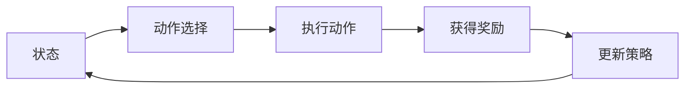
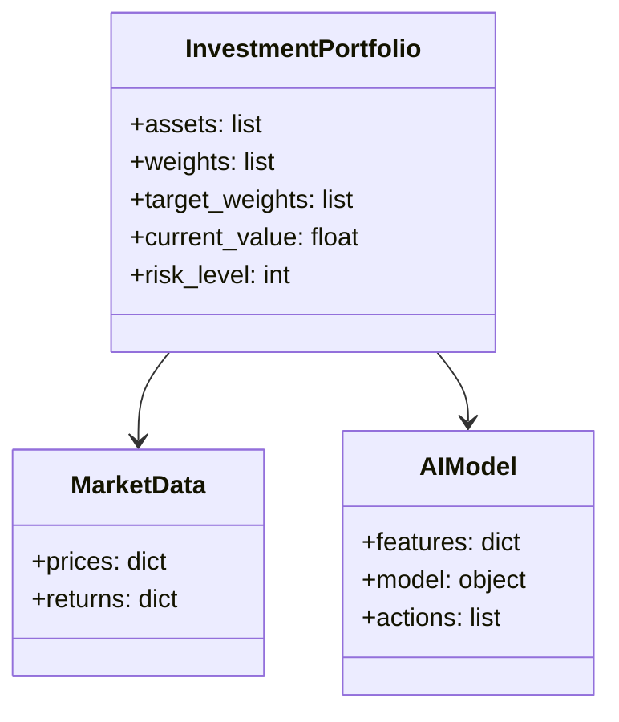
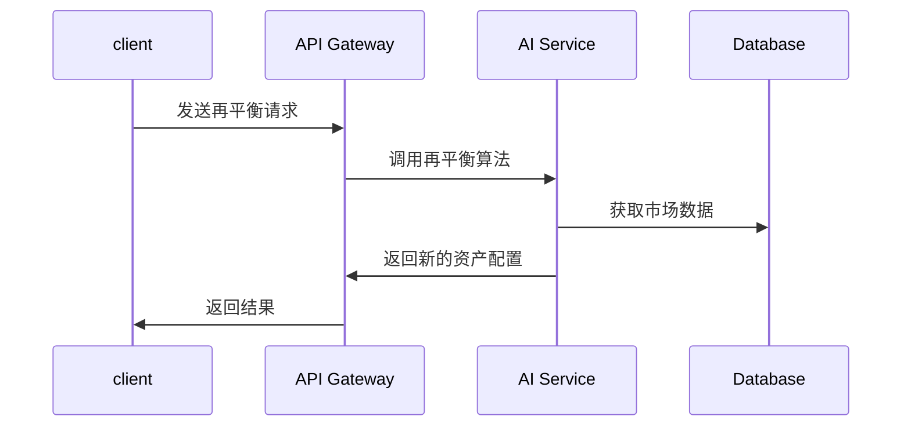

                 


# AI驱动的价值投资组合再平衡策略

> 关键词：人工智能、投资组合、再平衡策略、强化学习、机器学习、金融风险管理

> 摘要：本文详细探讨了如何利用人工智能技术，特别是强化学习和机器学习，来优化投资组合的再平衡策略。通过分析传统再平衡方法的局限性，结合AI驱动的新方法，提出了一种基于数据特征分析和智能模型构建的再平衡策略，以实现更高的收益和更低的风险。

---

## 第一部分: AI驱动的价值投资组合再平衡策略概述

### 第1章: 价值投资与投资组合管理基础

#### 1.1 价值投资的基本概念

##### 1.1.1 价值投资的定义与核心理念
价值投资是一种投资策略，强调以低于内在价值的价格购买优质资产。其核心理念是通过深入分析企业的基本面，寻找被市场低估的投资标的。这种方法要求投资者具备对企业财务状况、行业地位和未来前景的深刻理解。

##### 1.1.2 投资组合管理的重要性
投资组合管理是将资金分配到不同的资产类别中，以实现收益最大化和风险最小化的过程。通过科学的资产配置，投资者可以在不同市场条件下保持稳定的收益。

##### 1.1.3 再平衡策略的意义与作用
再平衡策略是指定期调整投资组合的构成，以维持预设的资产配置比例。这种策略有助于应对市场波动，避免过度暴露在某种资产上，从而降低风险。

#### 1.2 价值投资中的风险与收益平衡

##### 1.2.1 投资组合的风险来源
投资组合的风险主要来自市场波动、资产相关性、经济周期变化等因素。不同类型资产的风险和收益特征不同，需要通过合理的配置来平衡。

##### 1.2.2 收益与风险的权衡
在投资中，高收益通常伴随着高风险。投资者需要在两者之间找到平衡点，以实现长期稳定的收益。

##### 1.2.3 再平衡策略在风险控制中的作用
再平衡策略通过定期调整资产配置，可以有效分散风险，避免单一资产的剧烈波动对整个投资组合造成过大影响。

#### 1.3 传统投资组合再平衡方法

##### 1.3.1 定期再平衡策略
定期（如每季度或每年）调整投资组合，使其符合预定的资产配置比例。这种方法简单易行，但可能在市场剧烈波动时不够灵活。

##### 1.3.2 动态再平衡策略
根据市场变化和投资者风险承受能力，动态调整再平衡的频率和幅度。这种方法更灵活，但需要频繁监控市场情况，成本较高。

##### 1.3.3 传统方法的优缺点分析
传统再平衡方法在稳定性上有一定优势，但缺乏对市场趋势的预测能力，无法充分利用数据驱动的优化。

### 第2章: AI在投资组合管理中的应用

#### 2.1 AI技术在金融领域的应用现状

##### 2.1.1 AI在金融数据处理中的应用
AI技术可以帮助处理和分析海量金融数据，提取有用的特征，为投资决策提供支持。

##### 2.1.2 AI在交易策略中的应用
通过机器学习和强化学习，AI可以构建复杂的交易模型，优化交易策略，提高收益。

##### 2.1.3 AI在风险控制中的应用
AI可以帮助识别和预测市场风险，构建风险管理系统，降低投资组合的波动性。

#### 2.2 AI驱动再平衡策略的核心原理

##### 2.2.1 数据特征分析
通过对历史数据的分析，提取资产收益、波动性、相关性等特征，为模型提供输入。

##### 2.2.2 机器学习模型的构建与应用
使用回归、分类等机器学习算法，预测资产的未来表现，优化资产配置。

##### 2.2.3 强化学习在策略优化中的应用
通过强化学习，构建智能体，模拟投资决策过程，优化再平衡策略。

#### 2.3 数据特征与模型选择

##### 2.3.1 数据特征的提取与分析
包括资产的历史收益率、波动率、相关系数等，使用统计方法和机器学习技术进行特征工程。

##### 2.3.2 不同模型的适用场景
根据数据特征和目标，选择合适的模型，如线性回归、随机森林、神经网络等。

##### 2.3.3 模型选择的策略与方法
通过交叉验证、回测等方法，评估模型的性能，选择最优模型。

---

## 第二部分: AI驱动再平衡策略的算法原理

### 第3章: 强化学习在再平衡策略中的应用

#### 3.1 强化学习的基本原理

##### 3.1.1 强化学习的定义与核心概念
强化学习是一种通过智能体与环境交互，学习最优策略的方法。核心概念包括状态、动作、奖励和策略。

##### 3.1.2 状态、动作、奖励的定义
- 状态：市场环境的描述，如当前资产价格、市场指数等。
- 动作：智能体采取的行动，如买入、卖出或持有某种资产。
- 奖励：智能体获得的反馈，通常表示其行动的好坏。

##### 3.1.3 策略网络与价值网络的构建
策略网络用于生成动作的概率分布，价值网络用于评估状态的价值。

#### 3.2 基于强化学习的再平衡策略算法

##### 3.2.1 算法流程图（使用mermaid）


##### 3.2.2 算法实现的数学模型
策略网络的损失函数：
$$ L = -\sum_{t} \log(\pi(a|s)) \cdot r $$

价值网络的损失函数：
$$ L = \frac{1}{2} (V(s) - r) ^ 2 $$

---

## 第三部分: 系统架构与项目实战

### 第4章: 系统架构设计

#### 4.1 问题场景介绍
构建一个基于AI的再平衡系统，实现对投资组合的动态调整。

#### 4.2 系统功能设计

##### 4.2.1 领域模型（mermaid类图）


#### 4.3 系统架构设计（mermaid架构图）


#### 4.4 接口设计与交互流程图（mermaid序列图）


### 第5章: 项目实战

#### 5.1 环境安装
安装Python、TensorFlow、Keras、Pandas等库。

#### 5.2 核心代码实现

##### 5.2.1 数据预处理
```python
import pandas as pd

# 加载数据
data = pd.read_csv('market_data.csv')
# 数据标准化
data = (data - data.mean()) / data.std()
```

##### 5.2.2 强化学习模型实现
```python
import tensorflow as tf
from tensorflow.keras import layers

# 构建策略网络
def build_policy_network():
    model = tf.keras.Sequential()
    model.add(layers.Dense(64, activation='relu'))
    model.add(layers.Dense(3, activation='softmax'))
    return model

# 构建价值网络
def build_value_network():
    model = tf.keras.Sequential()
    model.add(layers.Dense(64, activation='relu'))
    model.add(layers.Dense(1, activation='linear'))
    return model
```

##### 5.2.3 算法实现
```python
def train_rl_model():
    policy_model = build_policy_network()
    value_model = build_value_network()
    
    optimizer = tf.keras.optimizers.Adam(learning_rate=0.001)
    
    # 策略损失函数
    def policy_loss(y_true, y_pred):
        return -tf.reduce_mean(y_true * tf.log(y_pred))
    
    # 价值损失函数
    def value_loss(y_true, y_pred):
        return tf.reduce_mean(tf.square(y_true - y_pred))
    
    # 训练循环
    for epoch in range(num_epochs):
        for state in states:
            # 预测动作概率
            policy = policy_model.predict(state)
            # 采样动作
            action = np.random.choice(3, p=policy[0])
            # 执行动作并获得奖励
            reward = get_reward(state, action)
            # 更新价值网络
            value_model.fit(state, reward, epochs=1, verbose=0)
            # 更新策略网络
            policy_model.fit(state, target_policy, epochs=1, verbose=0)
```

#### 5.3 实际案例分析
通过回测历史数据，验证模型的性能，调整参数以优化收益和风险。

---

## 第四部分: 最佳实践与总结

### 第6章: 最佳实践

#### 6.1 小结
本文详细介绍了AI驱动的投资组合再平衡策略，通过强化学习和机器学习优化了传统方法的不足。

#### 6.2 注意事项
- 数据质量和实时性对模型性能影响重大。
- 模型需要定期更新以适应市场变化。
- 风险管理是投资组合管理的核心。

#### 6.3 拓展阅读
建议深入学习强化学习和金融工程的相关知识，结合实际市场数据进行模型优化。

---

## 作者

作者：AI天才研究院 & 禅与计算机程序设计艺术

