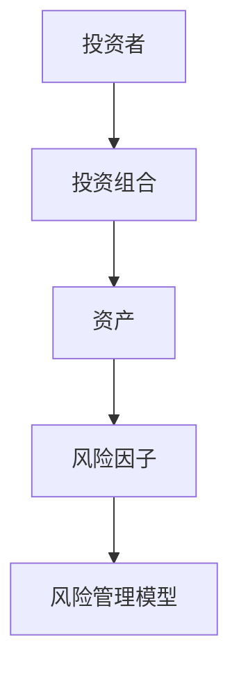
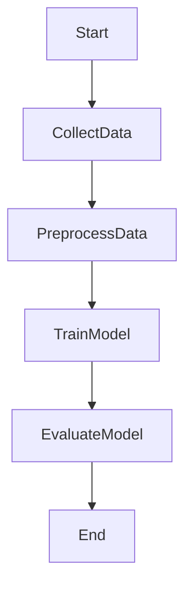

                 


# AI驱动的价值投资组合尾部风险管理

## 关键词：
AI, 风险管理, 投资组合, 尾部风险, 机器学习, 深度学习

## 摘要：
本文深入探讨了AI技术在投资组合尾部风险管理中的应用，通过分析传统方法的局限性，提出利用机器学习、深度学习等AI技术优化风险管理的解决方案。文章详细讲解了相关算法原理、系统架构设计和实际案例，为读者提供全面的技术指导和实践参考。

---

## 第1章: 问题背景与描述

### 1.1 传统投资组合管理的局限性
传统投资组合管理依赖于历史数据分析和统计模型，难以捕捉复杂市场环境中的非线性关系和极端事件。尾部风险尤其难以预测和管理，导致投资组合在极端市场条件下可能遭受重大损失。

### 1.2 价值投资与风险管理的结合
价值投资强调长期持有的理念，但忽视了短期波动和尾部风险的管理。通过引入AI技术，可以实时监控市场变化，识别潜在风险，优化投资组合的稳定性。

### 1.3 AI在金融风险管理中的应用前景
AI技术的引入为金融风险管理带来了革命性的变化，特别是在尾部风险预测、市场情绪分析和投资组合优化方面。通过机器学习模型，可以更准确地识别和应对潜在风险。

---

## 第2章: 核心概念与联系

### 2.1 AI与风险管理的原理
AI技术通过分析海量数据，利用机器学习算法识别潜在风险因素，预测市场波动，从而优化投资组合的风险管理策略。

### 2.2 核心概念对比表
| 概念         | 传统方法             | AI驱动方法           |
|--------------|----------------------|----------------------|
| 数据来源     | 历史数据             | 实时数据+非结构化数据 |
| 模型选择     | 线性回归             | 机器学习、深度学习    |
| 风险控制     | 静态调整             | 动态优化             |

### 2.3 ER实体关系图


---

## 第3章: 算法原理与实现

### 3.1 常见算法及其流程
#### 3.1.1 聚类算法


#### 3.1.2 回归算法
```mermaid
graph TD
    Start --> CollectData
    CollectData --> PreprocessData
    PreprocessData --> TrainModel
    TrainModel --> EvaluateModel
    EvaluateModel -->
```

---

## 第4章: 系统分析与架构设计

### 4.1 系统功能设计
- 数据采集模块：实时采集市场数据和新闻信息。
- 风险评估模块：利用机器学习模型识别潜在风险。
- 投资组合优化模块：根据风险评估结果调整投资组合。

### 4.2 系统架构设计


---

## 第5章: 项目实战

### 5.1 环境安装
- 安装Python、TensorFlow、Scikit-learn等工具。

### 5.2 核心实现
```python
import numpy as np
from sklearn.cluster import KMeans

# 示例代码：聚类分析
def cluster_analysis(data):
    model = KMeans(n_clusters=3)
    model.fit(data)
    return model.labels_
```

### 5.3 案例分析
通过实际案例分析，验证AI驱动的风险管理方法的有效性，并总结经验教训。

---

## 第6章: 总结与展望

### 6.1 全文总结
AI技术在投资组合尾部风险管理中的应用显著提升了风险管理的精度和效率，但仍需进一步优化模型和数据处理流程。

### 6.2 未来展望
未来的研究方向包括更复杂的深度学习模型和多模态数据的融合，以进一步提升风险管理的准确性。

---

## 作者：
AI天才研究院 & 禅与计算机程序设计艺术

