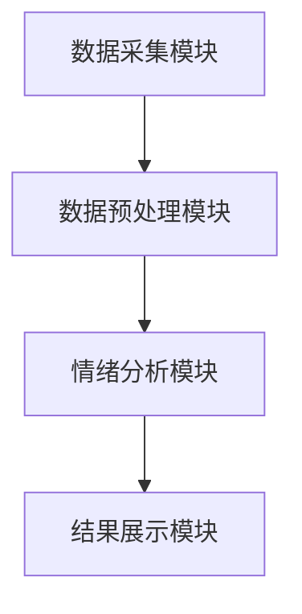

                 


# AI驱动的价值投资者情绪分析与控制

> 关键词：AI, 投资者情绪, 情绪分析, 情绪控制, 人工智能, 价值投资

> 摘要：本文深入探讨了如何利用人工智能技术进行投资者情绪分析与控制。通过分析投资者情绪的核心概念、算法原理、系统架构设计、项目实战以及最佳实践，展示了AI在价值投资中的独特优势和广泛应用。文章内容涵盖从理论到实践的全过程，帮助读者全面理解并掌握这一技术。

---

## 第1章: 投资者情绪分析与控制概述

### 1.1 投资者情绪的基本概念

#### 1.1.1 投资者情绪的定义
投资者情绪是指投资者在面对市场波动、经济环境变化时的心理反应，通常表现为乐观、悲观、贪婪或恐惧等情绪状态。这些情绪会影响投资者的决策行为，进而对市场产生影响。

#### 1.1.2 投资者情绪的影响因素
投资者情绪受多种因素影响，包括市场环境、个人性格、投资经验、外部信息等。例如，市场波动会引发投资者的焦虑或贪婪，而外部新闻事件（如经济政策变化）则可能加剧投资者的情绪波动。

#### 1.1.3 投资者情绪的分类与层次
投资者情绪可以分为短期情绪和长期情绪。短期情绪通常由市场波动引发，而长期情绪则与投资者的整体投资策略和心理预期相关。情绪的层次包括情绪识别、情绪强度分析和情绪预测。

---

### 1.2 传统投资者情绪分析的局限性

#### 1.2.1 传统情绪分析方法的不足
传统的情绪分析方法主要依赖于统计分析和专家经验，难以捕捉复杂的情绪变化。例如，基于成交量和价格的指标（如相对强弱指数RSI）只能反映市场的表面现象，无法深入分析投资者的内心情绪。

#### 1.2.2 传统情绪分析的局限性
传统方法难以处理非结构化数据（如社交媒体评论、新闻文章）中的情绪信息。此外，传统方法缺乏实时性和动态性，难以应对市场的快速变化。

#### 1.2.3 传统情绪分析的实际应用挑战
在实际应用中，传统情绪分析方法的准确性和实时性不足，难以满足现代投资管理的需求。

---

### 1.3 AI驱动的情绪分析的优势

#### 1.3.1 AI在情绪分析中的独特优势
AI技术可以通过自然语言处理（NLP）和机器学习算法，从非结构化数据中提取情绪信息。例如，AI可以分析社交媒体上的评论，识别出投资者的情绪倾向。

#### 1.3.2 AI驱动情绪分析的核心价值
AI情绪分析能够提供实时、动态的情绪数据，帮助投资者做出更科学的决策。例如，AI可以预测市场情绪的变化趋势，从而提前调整投资策略。

#### 1.3.3 AI驱动情绪分析的未来发展趋势
随着深度学习和大数据技术的发展，AI情绪分析将更加精准和智能化。未来，AI情绪分析将与量化投资、风险管理等领域深度融合。

---

### 1.4 投资者情绪数据的来源与处理

#### 1.4.1 数据来源渠道
投资者情绪数据可以从多种渠道获取，包括社交媒体（如Twitter、Reddit）、新闻媒体、市场报告、投资者访谈等。

#### 1.4.2 数据预处理方法
数据预处理包括数据清洗、分词、情感标注等步骤。例如，使用NLP技术对社交媒体评论进行分词和情感标注，以便后续分析。

#### 1.4.3 数据特征提取
特征提取是将文本数据转化为可量化的特征向量。例如，使用词袋模型（Bag-of-Words）或TF-IDF（Term Frequency-Inverse Document Frequency）提取文本特征。

---

### 1.5 本章小结
本章介绍了投资者情绪的基本概念、传统分析方法的局限性以及AI驱动情绪分析的优势。通过分析数据来源和处理方法，为后续的情绪分析奠定了基础。

---

## 第2章: 投资者情绪分析的核心概念

### 2.1 投资者情绪分析的原理

#### 2.1.1 情绪分析的基本原理
情绪分析的基本原理是通过文本挖掘和机器学习算法，识别文本中的情绪倾向。例如，使用支持向量机（SVM）或卷积神经网络（CNN）进行情感分类。

#### 2.1.2 情绪分析的数学模型
情绪分析的数学模型通常基于概率论和统计学习理论。例如，使用朴素贝叶斯（Naive Bayes）模型进行文本分类。

#### 2.1.3 情绪分析的核心算法
常用的核心算法包括情感词袋模型、情感TF-IDF模型、情感LSTM网络等。

---

### 2.2 情绪分析与投资者行为的关系

#### 2.2.1 情绪与投资决策的关联
投资者的情绪会影响其决策行为，例如贪婪情绪可能导致过度投资，而恐惧情绪可能导致错失投资机会。

#### 2.2.2 情绪波动对市场的影响
市场情绪的波动会引发市场的剧烈波动，例如恐慌性抛售或盲目跟风。

#### 2.2.3 情绪分析在风险管理中的作用
通过分析市场情绪，投资者可以更好地识别风险，制定风险管理策略。

---

### 2.3 投资者情绪分析的核心要素

#### 2.3.1 情绪强度分析
情绪强度分析是通过量化情绪的强弱程度，评估情绪对市场的影响程度。

#### 2.3.2 情绪类型分析
情绪类型分析是通过分类情绪类型（如乐观、悲观、贪婪、恐惧），帮助投资者制定针对性的投资策略。

---

### 2.4 本章小结
本章详细阐述了投资者情绪分析的核心概念、情绪与行为的关系以及情绪分析的核心要素。

---

## 第3章: 投资者情绪分析的算法原理

### 3.1 情绪分析的核心算法

#### 3.1.1 基于LSTM的情绪分析模型
LSTM（长短期记忆网络）是一种用于处理序列数据的深度学习模型，适合处理文本数据中的情感信息。

#### 3.1.2 注意力机制在情绪分析中的应用
注意力机制可以帮助模型聚焦于文本中的重要部分，提高情绪分析的准确性。

#### 3.1.3 情绪分析的数学模型
情绪分析的数学模型通常基于概率论和统计学习理论。例如，使用逻辑回归（Logistic Regression）进行二分类任务。

---

### 3.2 算法实现与代码示例

#### 3.2.1 使用Python实现LSTM情绪分析
```python
import keras
from keras.models import Sequential
from keras.layers import LSTM, Dense, Dropout

model = Sequential()
model.add(LSTM(128, return_sequences=True, input_shape=(max_len, 1)))
model.add(LSTM(64, return_sequences=False))
model.add(Dense(1, activation='sigmoid'))
model.compile(loss='binary_crossentropy', optimizer='adam', metrics=['accuracy'])
```

#### 3.2.2 情绪分析的数学公式
情绪分析的损失函数可以表示为：
$$ L = -\frac{1}{N}\sum_{i=1}^{N} (y_i \log p_i + (1 - y_i) \log (1 - p_i)) $$

其中，$y_i$是真实标签，$p_i$是模型预测的概率。

---

### 3.3 算法优化与改进

#### 3.3.1 参数调整
通过调整LSTM的隐藏层大小和学习率，可以优化模型的性能。

#### 3.3.2 模型融合
将多种情绪分析模型进行融合，可以提高情绪分析的准确性。

#### 3.3.3 实时更新
通过实时更新模型参数，可以确保情绪分析的动态性。

---

### 3.4 本章小结
本章详细讲解了投资者情绪分析的核心算法，包括LSTM和注意力机制，并通过代码示例和数学公式展示了算法的实现过程。

---

## 第4章: 投资者情绪分析的系统架构设计

### 4.1 系统功能设计

#### 4.1.1 数据采集模块
数据采集模块负责从多种渠道获取投资者情绪数据，例如社交媒体、新闻媒体等。

#### 4.1.2 数据预处理模块
数据预处理模块对采集到的数据进行清洗、分词和情感标注。

#### 4.1.3 情绪分析模块
情绪分析模块使用深度学习模型对预处理后的数据进行情绪分类和强度分析。

#### 4.1.4 结果展示模块
结果展示模块将分析结果以可视化的方式呈现给用户，例如生成情绪趋势图。

---

### 4.2 系统架构设计

#### 4.2.1 系统架构图


#### 4.2.2 模块交互流程
数据采集模块获取数据后，传递给数据预处理模块进行清洗和标注，然后传递给情绪分析模块进行分析，最后将结果传递给结果展示模块进行可视化。

---

### 4.3 系统接口设计

#### 4.3.1 数据接口
数据接口负责与外部数据源（如社交媒体API）进行交互。

#### 4.3.2 模型接口
模型接口负责与深度学习模型进行交互，传递数据并获取分析结果。

#### 4.3.3 用户接口
用户接口负责与用户交互，展示分析结果并接收用户的输入指令。

---

### 4.4 系统优化与扩展

#### 4.4.1 高可用性设计
通过负载均衡和分布式部署，确保系统的高可用性。

#### 4.4.2 可扩展性设计
通过模块化设计，确保系统的可扩展性，方便未来功能的扩展。

#### 4.4.3 安全性设计
通过数据加密和访问控制，确保系统的安全性。

---

### 4.5 本章小结
本章详细描述了投资者情绪分析系统的架构设计，包括功能模块划分、系统架构图和模块交互流程。

---

## 第5章: 投资者情绪分析的项目实战

### 5.1 项目环境搭建

#### 5.1.1 安装Python环境
使用Anaconda或虚拟环境搭建Python开发环境。

#### 5.1.2 安装必要的库
安装Keras、TensorFlow、NLTK等库。

#### 5.1.3 数据集准备
获取社交媒体评论数据集，进行清洗和标注。

---

### 5.2 数据处理与特征提取

#### 5.2.1 数据清洗
去除无效数据和噪声数据，例如重复数据和无效字符。

#### 5.2.2 数据分词
使用NLP工具对文本进行分词处理。

#### 5.2.3 情感标注
根据预设的标签（如积极、消极、中性）对文本进行情感标注。

---

### 5.3 情绪分析模型实现

#### 5.3.1 模型训练
使用训练数据对深度学习模型进行训练，调整模型参数以优化性能。

#### 5.3.2 模型评估
使用测试数据对模型进行评估，计算准确率、召回率和F1值。

#### 5.3.3 模型优化
通过调整超参数和模型结构，进一步优化模型性能。

---

### 5.4 实际案例分析

#### 5.4.1 数据采集与处理
从社交媒体获取真实投资者评论，进行数据清洗和特征提取。

#### 5.4.2 情绪分析与预测
使用训练好的模型对真实数据进行情绪分析，预测市场情绪变化趋势。

#### 5.4.3 结果解读与策略制定
根据分析结果，制定相应的投资策略，例如在市场情绪过于乐观时减少投资。

---

### 5.5 本章小结
本章通过实际案例展示了投资者情绪分析的项目实战过程，从环境搭建到模型实现，再到结果分析，帮助读者掌握实际操作方法。

---

## 第6章: 投资者情绪分析的最佳实践

### 6.1 小结与总结

#### 6.1.1 本章总结
总结投资者情绪分析的核心概念、算法原理和系统架构设计。

#### 6.1.2 项目经验总结
总结项目实施过程中的经验教训，提出改进建议。

---

### 6.2 注意事项与风险提示

#### 6.2.1 数据质量问题
数据质量和完整性直接影响情绪分析的准确性，需注意数据清洗和标注的准确性。

#### 6.2.2 模型泛化能力
模型的泛化能力不足可能导致情绪分析结果偏差，需通过交叉验证和数据增强进行优化。

#### 6.2.3 市场波动风险
市场波动可能引发情绪分析模型的误判，需结合其他指标进行综合分析。

---

### 6.3 拓展阅读与深入学习

#### 6.3.1 情绪分析的前沿技术
介绍深度学习领域的前沿技术，如 transformers（如BERT）在情绪分析中的应用。

#### 6.3.2 相关领域研究
探讨情绪分析在金融领域的其他应用，如市场预测、风险评估等。

#### 6.3.3 情绪分析工具与框架
介绍一些常用的情绪分析工具和框架，如NLTK、Textblob、Keras等。

---

### 6.4 本章小结
本章总结了投资者情绪分析的最佳实践，包括小结、注意事项和拓展阅读等内容。

---

## 附录: 投资者情绪分析数据集与工具

### 附录A: 数据集介绍

#### 1. 附录A.1 社交媒体评论数据集
介绍常用的社交媒体评论数据集，如Twitter情绪数据集。

#### 2. 附录A.2 金融新闻数据集
介绍金融新闻数据集，如财经新闻情感分类数据集。

#### 3. 附录A.3 股票价格数据集
介绍股票价格数据集，如Yahoo Finance数据集。

---

### 附录B: 工具与框架

#### 1. 附录B.1 NLP工具
介绍常用的NLP工具，如NLTK、Spacy。

#### 2. 附录B.2 深度学习框架
介绍常用的深度学习框架，如TensorFlow、Keras。

#### 3. 附录B.3 数据可视化工具
介绍常用的数据可视化工具，如Matplotlib、Seaborn。

---

## 作者：AI天才研究院/AI Genius Institute & 禅与计算机程序设计艺术 /Zen And The Art of Computer Programming

