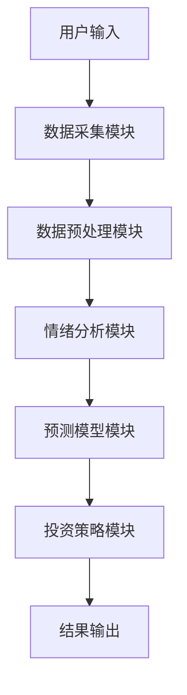
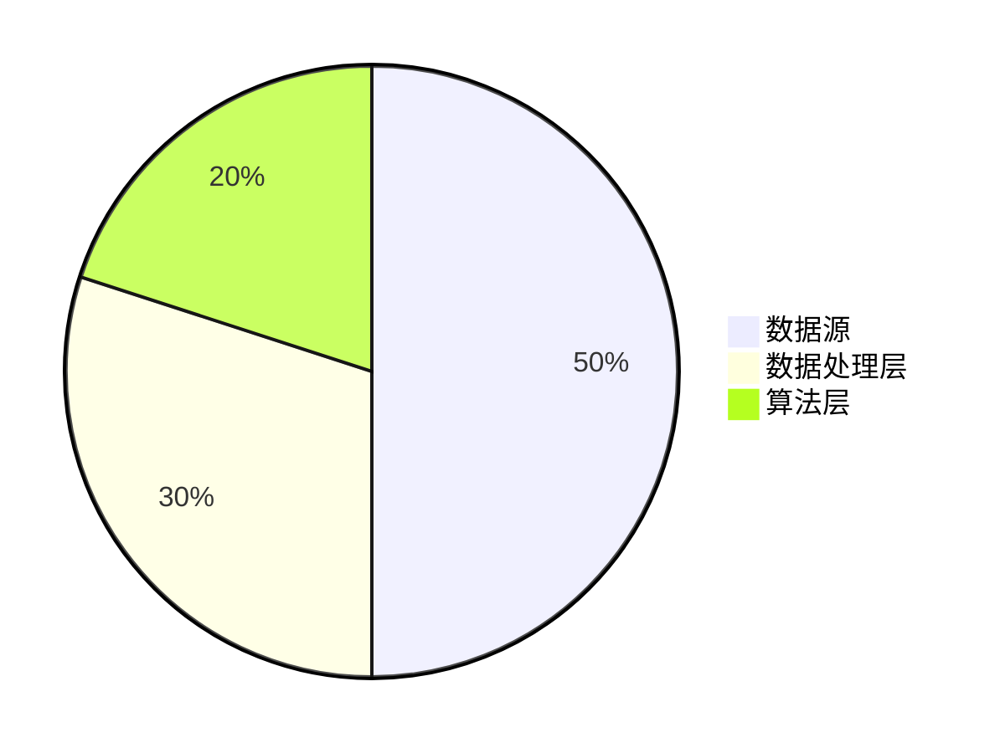
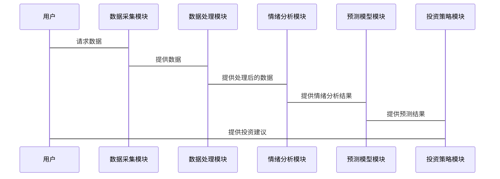

                 


# AI驱动的价值投资者行为模式分析

> 关键词：价值投资，投资者行为模式，人工智能，情绪分析，预测模型，强化学习，金融分析

> 摘要：本文深入探讨了人工智能技术在价值投资者行为模式分析中的应用，从背景介绍、核心概念、算法原理、系统架构设计、项目实战到最佳实践，全面分析了AI如何驱动投资者行为模式的优化与创新。

---

## 第一部分：价值投资与投资者行为模式的背景

### 第1章：价值投资与投资者行为模式概述

#### 1.1 价值投资的定义与核心理念

##### 1.1.1 价值投资的基本概念
- 价值投资是一种以内在价值为导向的投资策略，旨在通过分析企业的基本面（如盈利能力、财务状况、行业地位等）来寻找被市场低估的投资标的。
- 核心理念：长期持有优质资产，追求长期稳定的收益。

##### 1.1.2 价值投资的核心理念与原则
- 独特的估值方法：通过分析企业的财务数据、行业地位、竞争优势等，确定其内在价值。
- 长期视角：关注企业的长期增长潜力，而非短期市场波动。
- 风险控制：通过精选优质企业降低投资风险。

##### 1.1.3 价值投资在现代金融中的地位与作用
- 价值投资是金融市场的重要策略之一，尤其适用于长期投资者。
- 在市场波动中，价值投资能够帮助投资者避免短期决策的错误。

#### 1.2 投资者行为模式的分析框架

##### 1.2.1 投资者行为模式的定义
- 投资者行为模式：投资者在不同市场环境下做出的决策和行为特征的总和。
- 包括情绪化决策、理性决策、从众心理等。

##### 1.2.2 投资者行为模式的分类与特征
- 分类：情绪驱动型、理性驱动型、从众驱动型等。
- 特征：投资者在不同市场环境下的行为模式具有一定的规律性和可预测性。

##### 1.2.3 行为金融学的基本理论与应用
- 行为金融学：研究投资者心理和行为对金融市场的影响。
- 应用：帮助投资者识别和克服心理偏差，做出更理性的决策。

#### 1.3 AI技术在投资行为分析中的应用前景

##### 1.3.1 AI技术在金融分析中的优势
- 数据处理能力：AI能够快速处理海量数据，提取有用的特征。
- 模式识别：AI能够识别复杂市场环境中的模式和趋势。
- 实时分析：AI可以实时监控市场变化，提供及时的决策支持。

##### 1.3.2 AI驱动投资者行为模式分析的潜力
- 个性化投资建议：基于投资者的行为模式，提供个性化的投资策略。
- 风险管理：通过分析投资者行为模式，识别潜在风险，优化投资组合。

##### 1.3.3 当前AI在投资行为分析中的应用
- 情绪分析：通过社交媒体、新闻等数据，分析市场情绪。
- 预测模型：基于历史数据，预测市场趋势和投资者行为。

---

## 第二部分：价值投资与投资者行为模式的核心概念

### 第2章：价值投资与行为金融学的结合

#### 2.1 价值投资的理论基础

##### 2.1.1 基本面分析的核心要素
- 盈利能力：ROE、净利润增长率等。
- 财务状况：资产负债表、现金流等。
- 行业地位：市场占有率、竞争优势等。

##### 2.1.2 价值投资的量化指标
- 市盈率（P/E）：股价与每股收益的比率。
- 市净率（P/B）：股价与每股净资产的比率。
- 股息率：股息与股价的比率。

#### 2.2 行为金融学中的投资者心理分析

##### 2.2.1 投资者心理偏差
- 过度自信：投资者往往高估自己的判断能力。
- 沉没成本：投资者不愿割肉，导致更大的损失。
- 从众心理：盲目跟随市场趋势，忽视独立判断。

##### 2.2.2 情绪周期与市场波动
- 情绪周期：从乐观到悲观再到乐观的循环。
- 市场波动：情绪波动直接影响市场的短期走势。

#### 2.3 AI技术在行为金融学中的应用

##### 2.3.1 情绪分析模型
- 基于自然语言处理（NLP）的情感分析，识别市场情绪。
- 使用词袋模型或词嵌入模型（如GloVe）处理文本数据。

##### 2.3.2 预测模型
- 使用时间序列分析（如ARIMA）预测市场走势。
- 基于深度学习的LSTM模型，捕捉时间依赖性特征。

---

## 第三部分：AI驱动的投资者行为模式分析算法

### 第3章：AI算法在投资者行为分析中的应用

#### 3.1 情绪分析算法

##### 3.1.1 基于NLP的情绪分析
- 数据来源：社交媒体、新闻、评论等。
- 实现步骤：
  1. 数据预处理：清洗、分词、去停用词。
  2. 特征提取：使用词袋模型或词嵌入模型。
  3. 情感分类：使用SVM、随机森林或深度学习模型。

##### 3.1.2 情绪传播与市场影响
- 情绪传播：分析情绪在市场中的传播路径。
- 市场影响：情绪波动对股价的影响。

#### 3.2 预测模型算法

##### 3.2.1 时间序列预测模型
- 算法选择：ARIMA、Prophet、LSTM。
- 实现步骤：
  1. 数据预处理：平稳化、差分。
  2. 模型训练：基于历史数据训练模型。
  3. 预测与评估：使用MAE、MSE等指标评估模型性能。

##### 3.2.2 基于强化学习的投资策略
- 算法选择：Q-Learning、Deep Q-Learning。
- 实现步骤：
  1. 状态定义：市场状态、资产价格、投资者情绪等。
  2. 动作选择：买入、卖出、持有。
  3. 奖励机制：收益最大化。

#### 3.3 强化学习在投资者行为模式中的应用

##### 3.3.1 强化学习的基本原理
- 状态、动作、奖励：三者交互的核心机制。
- 策略优化：通过不断试错优化投资策略。

##### 3.3.2 基于强化学习的投资决策框架
- 输入：市场数据、投资者情绪、财务指标。
- 输出：投资决策（买入、卖出、持有）。

---

## 第四部分：系统架构与项目实战

### 第4章：AI驱动的投资者行为分析系统架构设计

#### 4.1 系统功能设计

##### 4.1.1 系统功能模块
- 数据采集：市场数据、新闻、社交媒体。
- 情绪分析：文本数据的情感分析。
- 预测模型：市场趋势预测。
- 投资策略：基于模型的投资建议。

##### 4.1.2 系统功能流程图


#### 4.2 系统架构设计

##### 4.2.1 系统架构图


##### 4.2.2 系统接口设计
- 数据接口：API接口实现数据的输入输出。
- 模型接口：算法模块的调用接口。

#### 4.3 系统交互流程图


---

## 第五部分：项目实战与案例分析

### 第5章：基于AI的投资者行为模式分析实战

#### 5.1 环境安装与配置

##### 5.1.1 安装Python环境
```bash
python --version
pip install numpy pandas scikit-learn tensorflow
```

##### 5.1.2 数据集准备
- 数据来源：股票价格、新闻、社交媒体评论。
- 数据格式：CSV或Excel格式。

#### 5.2 核心代码实现

##### 5.2.1 情绪分析代码
```python
from sklearn.feature_extraction.text import TfidfVectorizer
from sklearn.svm import SVC
from sklearn.metrics import accuracy_score

# 数据预处理
text = ["市场表现强劲，建议买入", "公司盈利下降，建议卖出"]
vectorizer = TfidfVectorizer()
X = vectorizer.fit_transform(text)
y = [1, 0]  # 1表示正面，0表示负面

# 模型训练
model = SVC()
model.fit(X, y)

# 模型预测
test_text = ["业绩增长显著，建议买入"]
test_X = vectorizer.transform(test_text)
predicted = model.predict(test_X)
print(predicted)
```

##### 5.2.2 预测模型代码
```python
from statsmodels.tsa.arima_model import ARIMA

# 数据准备
data = [100, 105, 110, 115, 120]

# 模型训练
model = ARIMA(data, order=(1, 1, 1))
model_fit = model.fit()

# 预测
forecast = model_fit.forecast(steps=5)
print(forecast)
```

#### 5.3 实际案例分析

##### 5.3.1 案例背景
- 投资标的：某科技股。
- 数据来源：过去一年的股价数据、新闻、社交媒体评论。

##### 5.3.2 分析过程
- 数据采集：获取过去一年的股价数据、新闻和社交媒体评论。
- 数据处理：清洗、分词、去停用词。
- 情绪分析：分析社交媒体评论的情绪，发现市场情绪逐渐乐观。
- 预测模型：使用ARIMA模型预测未来5天的股价趋势。
- 投资策略：基于模型预测，建议买入。

#### 5.4 案例分析小结
- 通过AI技术，投资者可以更准确地预测市场趋势，做出更科学的投资决策。

---

## 第六部分：最佳实践与小结

### 第6章：AI驱动投资者行为模式分析的总结与展望

#### 6.1 最佳实践

##### 6.1.1 数据质量的重要性
- 数据清洗：确保数据的准确性和完整性。
- 数据多样性：涵盖多方面的市场信息。

##### 6.1.2 模型选择的注意事项
- 根据具体场景选择合适的算法。
- 模型调优：通过网格搜索优化模型参数。

##### 6.1.3 人性化的投资策略
- 结合AI分析结果，制定人性化的投资策略。
- 风险控制：设置止损点，避免过度风险。

#### 6.2 小结

##### 6.2.1 全文总结
- AI技术能够显著提升投资者行为模式分析的效率和准确性。
- 通过AI技术，投资者可以更科学地制定投资策略，实现长期稳定的收益。

##### 6.2.2 未来展望
- 更多领域的应用：AI技术在金融领域的应用将更加广泛。
- 技术创新：深度学习、强化学习等技术将推动投资者行为分析的发展。

---

## 作者

作者：AI天才研究院/AI Genius Institute & 禅与计算机程序设计艺术 /Zen And The Art of Computer Programming

---

以上是《AI驱动的价值投资者行为模式分析》的完整目录大纲及文章内容，涵盖从背景介绍到项目实战的各个方面，结构清晰，内容详实，帮助读者全面理解AI在价值投资中的应用与实践。

