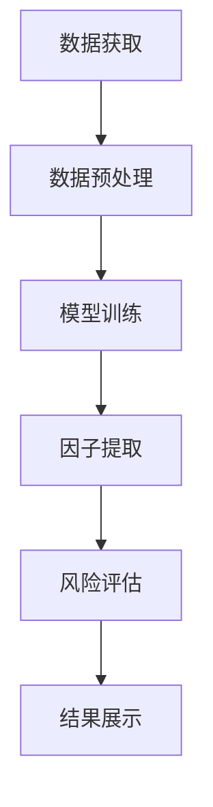

                 


# AI驱动的价值投资风险因子分解

> 关键词：价值投资，风险因子，AI驱动，因子分解，投资组合优化

> 摘要：本文探讨了AI技术在价值投资中的应用，特别是如何通过因子分解模型来识别和量化市场风险因子，优化投资组合。文章从理论背景、算法原理、系统设计到项目实战，全面解析了AI驱动的风险因子分解方法，为投资者提供科学决策工具。

---

## 第一部分：价值投资与风险因子的背景

### 第1章：价值投资与风险因子概述

#### 1.1 价值投资的基本概念
- 价值投资是一种长期投资策略，强调以低于市场价买入优质股票，长期持有以实现资本增值。
- 核心理念是寻找被市场低估的公司，关注企业的基本面，如盈利能力、财务健康和管理团队。
- 与短期交易策略不同，价值投资注重长期稳健回报，减少短期市场波动的影响。

#### 1.2 风险因子的定义与分类
- 风险因子是影响资产价格波动的关键因素，常见的有市场风险、流动性风险、信用风险等。
- 市场风险（Market Risk）：整体市场波动对资产价格的影响。
- 流动性风险（Liquidity Risk）：资产难以迅速变现而不损失价值的风险。
- 信用风险（Credit Risk）：债券发行人违约的风险。

#### 1.3 AI驱动的因子分解背景
- 传统因子分析方法依赖统计学，但面临维度高、非线性关系难以捕捉的问题。
- AI技术，尤其是深度学习，能够处理高维数据，识别复杂非线性模式，为因子分解提供了新思路。
- 通过AI分解因子，投资者可以更精准地识别和量化风险，优化投资组合。

---

## 第二部分：AI驱动的因子分解模型

### 第2章：因子分解的基本原理

#### 2.1 因子分析的数学模型
- **矩阵分解的基本概念**：因子分析通过将观测变量分解为潜在因子和独特因子的线性组合。
- **传统因子分析模型**：Y = B F + ε，其中Y是观测变量矩阵，B是因子载荷矩阵，F是因子得分矩阵，ε是独特因子矩阵。
- **非线性扩展**：引入神经网络等方法，捕捉非线性关系。

#### 2.2 AI驱动的因子分解方法
- **基于深度学习的因子分解**：使用自编码器（Autoencoder）提取特征，将高维数据映射到低维因子空间。
- **强化学习的应用**：通过强化学习优化因子权重，动态调整投资组合。
- **混合模型**：结合传统统计方法和深度学习，提升因子分解的准确性和鲁棒性。

#### 2.3 因子分解的评价指标
- **解释力**：因子对观测变量的解释能力。
- **稳定性**：因子分解结果在不同数据集上的稳定性。
- **可解释性**：分解后的因子是否具有实际意义，便于投资者理解和应用。

---

### 第3章：AI驱动的因子分解算法实现

#### 3.1 算法原理
- 使用自编码器进行无监督学习，提取潜在因子。
- 通过神经网络结构，自动捕捉数据中的复杂模式。

#### 3.2 算法步骤
1. 数据预处理：标准化或归一化处理。
2. 构建自编码器模型：设计网络结构，选择损失函数。
3. 训练模型：反向传播优化权重。
4. 提取因子：自编码器的隐层输出即为因子得分。

#### 3.3 代码实现
```python
import numpy as np
import tensorflow as tf

# 数据预处理
data = ...  # 标准化后的数据矩阵
input_dim = data.shape[1]
latent_dim = 5  # 设定因子数量

# 构建自编码器模型
input_layer = tf.keras.Input(shape=(input_dim,))
encoder = tf.keras.layers.Dense(latent_dim, activation='relu')(input_layer)
decoder = tf.keras.layers.Dense(input_dim, activation='sigmoid')(encoder)
autoencoder = tf.keras.Model(inputs=input_layer, outputs=decoder)

# 编译模型
autoencoder.compile(optimizer='adam', loss='binary_crossentropy')

# 训练模型
autoencoder.fit(data, data, epochs=100, batch_size=32)

# 提取因子
factors = autoencoder.layers[2].weights[0].numpy().T
```

---

### 第4章：系统架构设计

#### 4.1 系统功能模块
- 数据获取模块：收集市场数据。
- 模型训练模块：运行因子分解算法。
- 风险评估模块：计算投资组合风险。
- 结果展示模块：可视化因子分析结果。

#### 4.2 系统架构图


---

## 第三部分：项目实战

### 第5章：环境搭建与数据处理

#### 5.1 环境配置
- 安装Python、TensorFlow、Keras等依赖库。
- 配置Jupyter Notebook用于开发。

#### 5.2 数据获取
使用Yahoo Finance API获取股票数据，涵盖价格、成交量等指标。

### 第6章：模型实现与结果分析

#### 6.1 模型实现
```python
# 数据处理
import pandas as pd
data = pd.read_csv('stock_data.csv')
normalized_data = (data - data.mean()) / data.std()

# 训练自编码器
autoencoder = tf.keras.Sequential([
    tf.keras.layers.Dense(64, activation='relu', input_dim=normalized_data.shape[1]),
    tf.keras.layers.Dense(32, activation='relu'),
    tf.keras.layers.Dense(64, activation='relu'),
    tf.keras.layers.Dense(normalized_data.shape[1], activation='sigmoid')
])
autoencoder.compile(optimizer='adam', loss='binary_crossentropy')
autoencoder.fit(normalized_data, normalized_data, epochs=100, batch_size=32)

# 提取因子
factors = autoencoder.layers[2].weights[0].numpy().T
```

#### 6.2 结果分析
通过可视化工具展示因子得分，分析其对股价的影响。

---

## 第四部分：总结与展望

### 第7章：总结与未来展望

#### 7.1 总结
本文详细介绍了AI驱动的因子分解方法，展示了如何通过深度学习技术优化投资组合的风险管理。

#### 7.2 未来展望
- 进一步研究更复杂的神经网络结构，如Transformer。
- 结合实时数据流，提升模型的实时性。
- 探索与其他AI技术的结合，如NLP分析财务报告。

---

## 作者：AI天才研究院/AI Genius Institute & 禅与计算机程序设计艺术 /Zen And The Art of Computer Programming

---

这篇文章系统地介绍了AI在价值投资中的应用，从理论到实践，详细讲解了因子分解的算法实现和系统设计，为投资者提供了科学的决策工具。

