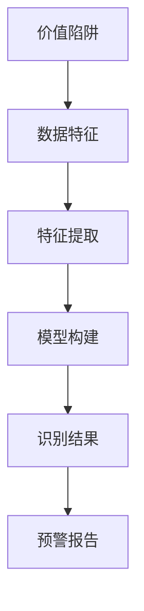
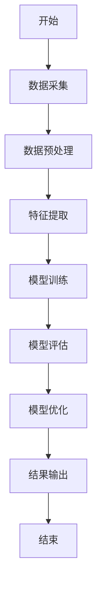
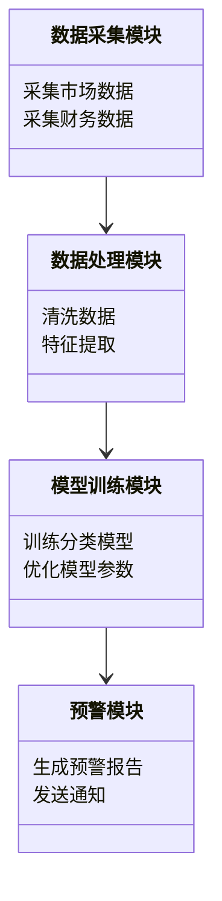

                 


# AI驱动的价值陷阱识别与规避

## 关键词：AI技术，价值陷阱，风险管理，机器学习，数据分析，模式识别

## 摘要：本文将深入探讨AI技术在识别和规避价值陷阱中的应用。通过分析数据特征、模型构建与优化，以及系统架构设计，本文提供了一套完整的解决方案。从背景介绍到项目实战，详细讲解了如何利用AI技术识别价值陷阱，并通过实际案例分析和代码实现，帮助读者掌握这一技术的核心要点。本文最后总结了最佳实践，为读者提供了实用的指导和建议。

---

# 第一部分: AI驱动的价值陷阱识别与规避背景介绍

## 第1章: 价值陷阱的定义与问题背景

### 1.1 价值陷阱的定义

#### 1.1.1 价值陷阱的定义与概念
价值陷阱是指在商业决策或投资过程中，由于信息不对称、市场波动或其他复杂因素，表面上看似有利可图的机会实际上隐藏着潜在风险或损失。这些陷阱往往难以察觉，容易误导决策者。

#### 1.1.2 价值陷阱的特征与表现形式
- **信息不对称**：卖方掌握更多信息，买方处于弱势地位。
- **短期收益与长期风险**：短期内看似收益，长期却可能亏损。
- **表面吸引力**：通过包装或伪装，吸引投资者注意。
- **隐藏成本**：看似低风险，实则成本高昂。

#### 1.1.3 价值陷阱的分类与场景分析
- **市场陷阱**：利用市场波动制造虚假需求。
- **财务陷阱**：通过财务造假或隐藏债务吸引投资。
- **竞争陷阱**：通过不公平竞争手段获取短期优势。
- **技术陷阱**：利用技术壁垒或不成熟的技术误导决策。

### 1.2 价值陷阱识别的必要性

#### 1.2.1 价值陷阱对企业的影响
- **财务损失**：投资失败导致资金浪费。
- **声誉受损**：决策失误影响企业信誉。
- **竞争优势丧失**：错失真实机会，落后于竞争对手。

#### 1.2.2 价值陷阱在投资中的风险
- **资金浪费**：将资源投入虚假项目。
- **投资失败**：错失真正有潜力的机会。
- **市场信任度下降**：多次失败影响投资者信心。

#### 1.2.3 价值陷阱的隐蔽性与欺骗性
- **隐蔽性**：陷阱往往隐藏在表面数据背后。
- **欺骗性**：通过伪装或误导信息吸引决策者。

## 第2章: AI驱动技术在价值陷阱识别中的应用

### 2.1 AI技术的核心优势

#### 2.1.1 数据分析能力
AI能够快速处理大量数据，识别其中的模式和趋势，帮助发现潜在的价值陷阱。

#### 2.1.2 智能识别能力
通过机器学习算法，AI可以自动识别复杂模式，发现隐藏在数据中的异常情况。

#### 2.1.3 自动化处理能力
AI系统可以实时监控数据，自动预警潜在风险，减少人为干预的延迟。

### 2.2 AI驱动的识别机制

#### 2.2.1 数据采集与处理
AI系统通过收集市场数据、财务报表、行业趋势等信息，进行清洗和预处理，确保数据质量。

#### 2.2.2 模型训练与优化
利用训练数据，构建机器学习模型，通过不断优化参数，提高识别准确率。

#### 2.2.3 结果输出与反馈
模型识别出潜在价值陷阱后，生成预警报告，并根据反馈不断调整模型。

## 第3章: 价值陷阱识别的边界与外延

### 3.1 价值陷阱识别的边界

#### 3.1.1 数据范围的限制
AI模型依赖于输入数据的质量和数量，数据不足或不准确可能导致识别失败。

#### 3.1.2 模型适用范围
不同模型适用于不同场景，选择不当可能导致识别错误。

#### 3.1.3 识别精度的限制
AI模型可能存在误报或漏报的情况，无法完全消除识别误差。

### 3.2 价值陷阱识别的外延

#### 3.2.1 技术延伸
结合自然语言处理、图像识别等技术，进一步提升识别能力。

#### 3.2.2 应用场景扩展
从金融投资扩展到供应链管理、市场营销等多个领域。

#### 3.2.3 理论创新
通过不断实践，推动AI技术在价值识别领域的理论进步。

---

# 第二部分: 价值陷阱识别的核心概念与联系

## 第4章: 核心概念原理

### 4.1 数据特征提取

#### 4.1.1 数据特征的选择
选择能够反映价值陷阱的关键特征，如财务指标、市场趋势等。

#### 4.1.2 数据特征的提取方法
- **统计方法**：均值、方差等统计指标。
- **特征工程**：构建复合特征，如财务比率。
- **降维技术**：主成分分析（PCA）。

#### 4.1.3 数据特征的评估指标
- **特征重要性**：通过模型系数或特征贡献度评估。
- **特征相关性**：计算特征之间的相关系数。

### 4.2 模型构建与优化

#### 4.2.1 模型选择与设计
- **分类模型**：如随机森林、支持向量机（SVM）。
- **回归模型**：如线性回归、逻辑回归。

#### 4.2.2 模型训练与调优
- **超参数优化**：使用网格搜索或随机搜索。
- **交叉验证**：通过K折交叉验证评估模型性能。

#### 4.2.3 模型评估与验证
- **准确率**：识别正确样本的比例。
- **召回率**：识别出所有正样本的比例。
- **F1分数**：综合准确率和召回率的调和平均数。

## 第5章: 核心概念属性特征对比表格

| 核心概念       | 数据特征提取 | 模型构建与优化 |
|----------------|--------------|----------------|
| 输入数据       | 原始数据     | 特征提取后的数据 |
| 输出结果       | 特征向量     | 模型权重或概率值 |
| 目标           | 提高模型可解释性 | 提高识别准确率 |
| 方法           | PCA、特征工程 | 网格搜索、交叉验证 |
| 评估指标       | 特征重要性   | 准确率、召回率 |

---

## 第6章: 核心概念的ER实体关系图



---

## 第7章: 价值陷阱识别的数学模型与公式

### 7.1 逻辑回归模型

$$ P(y=1|x) = \frac{e^{\beta x}}{1 + e^{\beta x}} $$

### 7.2 随机森林模型

$$ \text{预测概率} = \frac{\text{多数决策树的预测结果}}{\text{总决策树数量}} $$

---

## 第8章: 价值陷阱识别的算法流程图



---

## 第9章: 价值陷阱识别的系统架构设计

### 9.1 问题场景介绍

系统旨在通过AI技术实时监控市场数据，识别潜在的价值陷阱，提供预警报告。

### 9.2 系统功能设计



---

## 第10章: 价值陷阱识别的项目实战

### 10.1 环境安装

- **Python版本**：3.8+
- **依赖库安装**：`pip install numpy pandas scikit-learn`

### 10.2 核心代码实现

```python
import numpy as np
import pandas as pd
from sklearn.model_selection import train_test_split
from sklearn.ensemble import RandomForestClassifier
from sklearn.metrics import accuracy_score, recall_score

# 数据加载
data = pd.read_csv('value_traps.csv')

# 特征提取
features = data.drop('is_trap', axis=1)
target = data['is_trap']

# 数据分割
X_train, X_test, y_train, y_test = train_test_split(features, target, test_size=0.2, random_state=42)

# 模型训练
model = RandomForestClassifier(random_state=42)
model.fit(X_train, y_train)

# 模型预测
y_pred = model.predict(X_test)

# 模型评估
accuracy = accuracy_score(y_test, y_pred)
recall = recall_score(y_test, y_pred)
print(f'准确率: {accuracy}')
print(f'召回率: {recall}')
```

### 10.3 案例分析

假设我们有一个数据集，其中包含多个公司财务数据和市场表现。模型识别出某公司存在价值陷阱，生成预警报告。

### 10.4 项目小结

通过实际案例，展示了如何利用AI技术识别价值陷阱，帮助投资者避免潜在风险。

---

## 第11章: 最佳实践与总结

### 11.1 小结

AI技术为识别价值陷阱提供了强大的工具，通过数据特征提取、模型训练与优化，能够有效识别潜在风险。

### 11.2 注意事项

- **数据质量**：确保输入数据的准确性和完整性。
- **模型选择**：根据具体情况选择合适的算法。
- **持续优化**：定期更新模型，适应市场变化。

### 11.3 拓展阅读

- 《机器学习实战》
- 《Python机器学习》
- 《深入浅出数据分析》

---

# 作者：AI天才研究院/AI Genius Institute & 禅与计算机程序设计艺术 /Zen And The Art of Computer Programming

---

本文通过详细分析AI技术在识别价值陷阱中的应用，结合理论与实践，为读者提供了全面的解决方案。从背景介绍到项目实战，系统性地阐述了AI驱动的价值陷阱识别与规避的核心要点，帮助读者掌握这一技术的关键技能。

