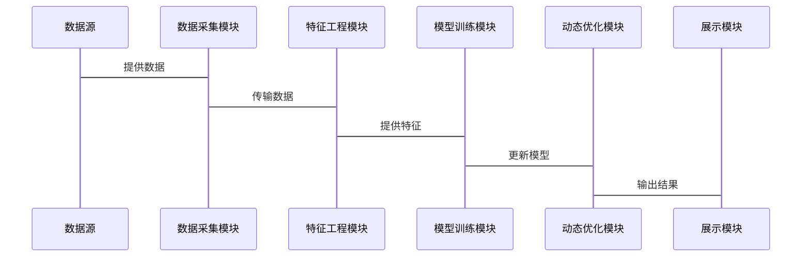

                 


```markdown
# AI驱动的企业信用评级模型可解释性动态优化与展示系统

> 关键词：AI驱动、企业信用评级、模型可解释性、动态优化、展示系统

> 摘要：本文系统地探讨了如何利用人工智能技术构建企业信用评级模型，并强调了模型的可解释性、动态优化能力以及结果展示的重要性。文章从背景介绍出发，详细阐述了相关核心概念与理论基础，深入分析了算法原理，设计了系统的架构，并通过项目实战展示了模型的实现过程。最后，本文总结了最佳实践，并展望了未来的发展方向。

---

## 第1章: 背景与概述

### 1.1 企业信用评级的重要性
#### 1.1.1 信用评级的定义与作用
信用评级是评估企业信用状况的重要工具，能够帮助金融机构评估风险，优化资源配置。

#### 1.1.2 传统信用评级方法的局限性
传统方法依赖专家经验，主观性强，效率低，难以应对海量数据。

#### 1.1.3 AI在信用评级中的应用潜力
人工智能技术能够高效处理海量数据，发现传统方法难以察觉的模式。

### 1.2 AI驱动模型的优势
#### 1.2.1 数据处理能力的提升
AI能够处理结构化和非结构化数据，提取更多特征。

#### 1.2.2 模型复杂度与准确性
通过深度学习等技术，模型能够捕捉复杂关系，提高准确性。

#### 1.2.3 动态优化的可行性
AI模型能够实时更新，适应市场变化。

### 1.3 可解释性的重要性
#### 1.3.1 可解释性在信用评级中的必要性
可解释性是确保模型决策透明性和合规性的关键。

#### 1.3.2 黑箱模型的挑战
黑箱模型难以被监管机构接受，可能导致信任缺失。

#### 1.3.3 解释性模型的解决方案
通过特征重要性分析等方法，提升模型的可解释性。

### 1.4 本书内容概述
#### 1.4.1 核心目标
构建一个AI驱动的、可解释的企业信用评级模型，并实现动态优化与展示。

#### 1.4.2 章节安排
从理论到实践，系统地介绍模型构建、优化和展示的全过程。

#### 1.4.3 预期读者
面向数据科学家、金融从业者以及AI技术爱好者。

---

## 第2章: 核心概念与理论基础

### 2.1 信用评级模型的核心要素
#### 2.1.1 数据来源与特征选择
企业财务数据、市场表现、信用历史等。

#### 2.1.2 模型选择与训练
分类模型（如逻辑回归、随机森林）和解释性模型（如线性回归）。

#### 2.1.3 模型评估与验证
ROC曲线、AUC值、F1分数等。

### 2.2 可解释性模型的关键因素
#### 2.2.1 特征重要性
通过SHAP值或特征系数分析。

#### 2.2.2 模型解释性
线性模型的系数解释，树模型的路径解释。

#### 2.2.3 优化过程的透明性
优化策略和迭代过程的记录与展示。

### 2.3 动态优化机制
#### 2.3.1 实时更新
根据市场变化和企业数据实时调整模型。

#### 2.3.2 增量学习
仅更新部分模型参数，节省计算资源。

#### 2.3.3 超参数调优
通过网格搜索或贝叶斯优化选择最优参数。

---

## 第3章: 算法原理

### 3.1 可解释性模型的选择
#### 3.1.1 线性回归
用于解释特征的线性关系。

#### 3.1.2 逻辑回归
用于二分类问题，输出概率解释。

#### 3.1.3 随机森林
通过特征重要性提供解释。

### 3.2 动态优化算法
#### 3.2.1 遗传算法
用于优化模型参数。

#### 3.2.2 梯度下降
用于优化模型权重。

#### 3.2.3 贝叶斯优化
用于超参数调优。

### 3.3 数学公式
#### 线性回归公式
$$ y = \beta_0 + \beta_1x_1 + \beta_2x_2 + \ldots + \beta_nx_n $$

#### 逻辑回归公式
$$ P(y=1|x) = \frac{e^{\beta_0 + \beta_1x_1 + \ldots + \beta_nx_n}}{1 + e^{\beta_0 + \beta_1x_1 + \ldots + \beta_nx_n}} $$

---

## 第4章: 系统分析与架构设计

### 4.1 系统功能设计
#### 4.1.1 数据采集模块
从数据库中获取企业数据。

#### 4.1.2 特征工程模块
数据清洗、特征提取、特征选择。

#### 4.1.3 模型训练模块
选择模型、训练、调优。

#### 4.1.4 动态优化模块
实时更新模型参数。

#### 4.1.5 结果展示模块
可视化模型输出、解释性分析。

### 4.2 系统架构设计


### 4.3 系统交互流程


---

## 第5章: 项目实战

### 5.1 环境搭建
#### 5.1.1 安装Python环境
使用Anaconda或虚拟环境。

#### 5.1.2 安装依赖库
如Pandas、Scikit-learn、XGBoost等。

### 5.2 核心代码实现
#### 5.2.1 数据处理
```python
import pandas as pd
data = pd.read_csv('企业数据.csv')
```

#### 5.2.2 特征工程
```python
from sklearn.preprocessing import StandardScaler
scaler = StandardScaler()
X = scaler.fit_transform(X)
```

#### 5.2.3 模型训练
```python
from sklearn.linear_model import LinearRegression
model = LinearRegression()
model.fit(X_train, y_train)
```

#### 5.2.4 解释性分析
```python
import shap
explainer = shap.Explainer(model)
shap_values = explainer.shap_values(X)
```

### 5.3 动态优化与展示
#### 5.3.1 动态优化
```python
from sklearn.model_selection import GridSearchCV
param_grid = {'n_estimators': [100, 200]}
grid_search = GridSearchCV(estimator=model, param_grid=param_grid)
grid_search.fit(X_train, y_train)
best_model = grid_search.best_estimator_
```

#### 5.3.2 结果展示
```python
import matplotlib.pyplot as plt
plt.bar(range(len(shap_values)), shap_values)
plt.show()
```

### 5.4 案例分析
#### 5.4.1 数据来源
使用公开的企业信用数据集。

#### 5.4.2 模型选择
比较不同模型的准确性和可解释性。

#### 5.4.3 优化结果
展示优化后的模型性能提升。

---

## 第6章: 最佳实践与总结

### 6.1 总结
#### 6.1.1 核心内容回顾
从理论到实践，系统地构建了一个可解释的动态优化模型。

#### 6.1.2 实践中的注意事项
数据质量和特征选择对模型性能影响重大。

### 6.2 最佳实践
#### 6.2.1 模型选择
根据业务需求选择合适的模型。

#### 6.2.2 数据处理
注重数据清洗和特征工程。

#### 6.2.3 解释性分析
通过SHAP值等方法提升透明度。

### 6.3 未来展望
#### 6.3.1 技术进步
深度学习在解释性上的突破。

#### 6.3.2 应用扩展
更多行业中的应用。

#### 6.3.3 法规要求
满足日益严格的监管要求。

---

## 作者：AI天才研究院 & 禅与计算机程序设计艺术
```

