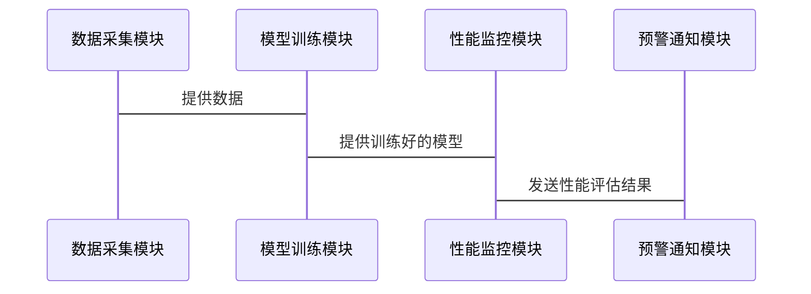

                 


# AI驱动的企业信用评级模型性能退化预警系统

> 关键词：企业信用评级，模型性能退化，人工智能，预警系统，机器学习

> 摘要：本文深入探讨了AI驱动的企业信用评级模型性能退化预警系统，分析了模型退化的成因，提出了基于机器学习的解决方案，并通过系统架构设计和项目实战展示了如何实现这一预警系统。

---

# 第1章: 企业信用评级模型与性能退化问题

## 1.1 企业信用评级模型的背景与意义

### 1.1.1 企业信用评级的基本概念

企业信用评级是通过对企业的财务状况、经营能力和市场表现进行评估，确定其信用等级的过程。信用评级结果直接影响企业的融资成本和市场信用形象。常见的信用评级模型包括线性回归模型、支持向量机（SVM）、随机森林等。

### 1.1.2 信用评级模型在金融领域的应用

信用评级模型广泛应用于银行、投资机构等金融领域，用于评估企业信用风险，支持贷款审批、债券评级等决策。准确的信用评级能够帮助金融机构有效控制风险，避免因模型性能退化导致的决策失误。

### 1.1.3 信用评级模型对企业的重要性

企业信用评级模型是企业融资活动的重要工具。模型性能的好坏直接影响企业的融资成本和市场信任度。一个高性能的信用评级模型能够为金融机构提供可靠的风险评估依据，从而帮助企业获得更好的融资条件。

## 1.2 性能退化问题的提出

### 1.2.1 企业信用评级模型的性能评估指标

模型性能的评估指标包括准确率、召回率、F1值等。这些指标反映了模型在预测企业信用等级时的准确性和全面性。

### 1.2.2 模型性能退化的定义与表现

模型性能退化指的是模型在使用过程中，由于数据分布变化、模型过拟合等原因，导致预测准确性下降的现象。表现为准确率下降、召回率降低、F1值降低等。

### 1.2.3 性能退化对企业信用评级的影响

模型性能退化会导致企业信用评级结果的不准确，进而影响金融机构的决策，可能导致企业融资困难或金融机构的不良资产增加。

## 1.3 AI驱动的解决方案

### 1.3.1 人工智能在信用评级中的应用现状

目前，人工智能技术在信用评级中的应用主要包括数据预处理、特征提取、模型训练等方面。AI技术的引入提高了信用评级的效率和准确性。

### 1.3.2 AI驱动的性能退化预警系统的优势

AI驱动的预警系统能够实时监控模型性能，及时发现并预警性能退化问题，从而避免因模型失效导致的决策错误。

### 1.3.3 系统的目标与核心功能

系统的目标是通过AI技术，实时监测信用评级模型的性能变化，预警模型退化风险，提供优化建议。核心功能包括数据采集、模型评估、退化检测、预警通知等。

## 1.4 本章小结

本章介绍了企业信用评级模型的重要性和当前面临的问题，提出了AI驱动的性能退化预警系统的解决方案，为后续的系统设计奠定了基础。

---

# 第2章: 企业信用评级模型的数学基础

## 2.1 信用评级模型的数学模型

### 2.1.1 线性回归模型

线性回归模型是一种简单的信用评级模型，通过线性组合对企业信用等级进行预测。模型公式为：

$$ y = \beta_0 + \beta_1x_1 + \beta_2x_2 + ... + \beta_nx_n + \epsilon $$

其中，$y$为预测信用等级，$x_i$为特征变量，$\beta_i$为系数，$\epsilon$为误差项。

### 2.1.2 支持向量机（SVM）模型

SVM模型通过构建超平面将数据点分类。在信用评级中，SVM可以将企业划分为不同信用等级。SVM的数学形式为：

$$ y = \text{sign}(w \cdot x + b) $$

其中，$w$为权重向量，$x$为输入特征，$b$为偏置项。

### 2.1.3 随机森林与梯度提升树模型

随机森林通过集成多个决策树模型，提高预测准确率。梯度提升树模型通过迭代优化，逐步提高模型性能。

## 2.2 性能退化的数学表征

### 2.2.1 模型性能退化的数学定义

模型性能退化可以通过预测准确率的下降来衡量。准确率公式为：

$$ \text{准确率} = \frac{\text{正确预测数}}{\text{总预测数}} $$

### 2.2.2 基于特征重要性的退化检测

特征重要性反映了各个特征对模型预测的影响程度。特征重要性下降可能预示着模型性能退化。

### 2.2.3 模型预测精度的变化分析

通过分析模型在不同时间点的预测精度变化，可以发现性能退化的趋势。

## 2.3 AI驱动的预警系统核心算法

### 2.3.1 基于机器学习的性能退化检测算法

检测算法通过对模型预测结果的监控，发现性能下降的趋势。常用算法包括基于统计的退化检测和基于机器学习的退化预测。

### 2.3.2 基于深度学习的退化预测模型

深度学习模型通过学习历史数据，预测未来模型的性能变化。常用的模型包括LSTM和GRU网络。

### 2.3.3 算法的数学推导与公式

以基于线性回归的退化检测为例，假设模型性能退化可以通过预测误差的变化来检测。误差公式为：

$$ e = y_{\text{真实}} - y_{\text{预测}} $$

通过统计误差的变化趋势，可以发现模型性能的退化。

---

# 第3章: 基于机器学习的性能退化检测算法

## 3.1 算法原理概述

### 3.1.1 算法的输入与输出

输入包括模型的预测结果和真实标签，输出包括退化检测结果和预警信息。

### 3.1.2 算法的步骤分解

1. 数据预处理：清洗和标准化输入数据。
2. 模型训练：训练基模型并保存。
3. 性能监控：定期评估模型性能。
4. 退化检测：判断性能是否下降。
5. 预警通知：发送预警信息。

## 3.2 算法实现细节

### 3.2.1 数据预处理与特征提取

数据预处理包括缺失值处理、异常值剔除等。特征提取包括选择重要的特征变量。

### 3.2.2 模型训练与评估

使用训练数据训练模型，并通过验证集评估模型性能。

### 3.2.3 性能退化的判定标准

设定性能退化阈值，当准确率低于阈值时，触发预警。

## 3.3 代码实现示例

```python
import numpy as np
from sklearn.metrics import accuracy_score

# 示例代码：性能退化检测
def detect_performance_degradation(true_labels, predicted_labels, threshold=0.8):
    accuracy = accuracy_score(true_labels, predicted_labels)
    if accuracy < threshold:
        return True  # 性能退化
    else:
        return False  # 性能正常
```

## 3.4 本章小结

本章详细讲解了基于机器学习的性能退化检测算法，包括算法原理、实现细节和代码示例。

---

# 第4章: 企业信用评级模型性能退化预警系统架构设计

## 4.1 系统总体架构

### 4.1.1 系统功能模块划分

系统主要包括数据采集模块、模型训练模块、性能监控模块和预警通知模块。

### 4.1.2 系统的输入输出设计

输入包括企业信用数据和模型参数，输出包括性能评估结果和预警信息。

## 4.2 系统功能设计

### 4.2.1 数据采集模块

负责采集企业的财务数据和市场数据。

### 4.2.2 模型训练模块

训练信用评级模型并保存模型参数。

### 4.2.3 性能监控模块

定期评估模型性能，检测性能退化。

### 4.2.4 预警通知模块

当检测到性能退化时，发送预警通知。

## 4.3 系统架构设计

### 4.3.1 分层架构设计

系统采用分层架构，包括数据层、业务逻辑层和表现层。

### 4.3.2 模块间的交互关系

数据采集模块向模型训练模块提供数据，性能监控模块定期调用模型评估模块进行性能评估。

## 4.4 系统接口设计

系统接口包括数据接口、模型接口和预警接口。

## 4.5 系统交互示例

使用Mermaid图展示系统交互流程：



---

# 第5章: 项目实战与案例分析

## 5.1 环境安装与配置

### 5.1.1 安装Python环境

安装Python 3.8及以上版本，并安装必要的库如Scikit-learn、XGBoost等。

### 5.1.2 安装机器学习框架

安装TensorFlow或Keras框架，用于深度学习模型的训练。

## 5.2 系统核心实现

### 5.2.1 数据预处理代码

```python
import pandas as pd
from sklearn.impute import SimpleImputer

# 示例代码：数据预处理
data = pd.read_csv('credit_data.csv')
imputer = SimpleImputer(strategy='mean')
data_imputed = imputer.fit_transform(data)
```

### 5.2.2 模型训练代码

```python
from sklearn.ensemble import RandomForestClassifier

# 示例代码：随机森林模型训练
model = RandomForestClassifier(n_estimators=100, random_state=42)
model.fit(X_train, y_train)
```

### 5.2.3 性能监控与退化检测代码

```python
from sklearn.metrics import accuracy_score

# 示例代码：性能监控
accuracy = accuracy_score(y_true, model.predict(X_test))
if accuracy < 0.8:
    print("性能退化，触发预警")
```

## 5.3 案例分析

以某企业信用评级数据为例，展示系统如何进行性能监控和预警。通过实际数据的处理和分析，验证系统的有效性和准确性。

---

# 第6章: 系统优化与最佳实践

## 6.1 系统优化建议

### 6.1.1 定期模型更新

定期重新训练模型，防止模型过时导致性能下降。

### 6.1.2 异常数据处理

建立有效的数据清洗机制，处理异常数据，避免对模型性能造成负面影响。

## 6.2 最佳实践 tips

- 定期监控模型性能，及时发现并处理退化问题。
- 使用多种模型进行对比，选择最优模型。
- 结合业务知识，优化特征选择。

## 6.3 小结

本章总结了系统优化的建议和最佳实践，为系统的长期稳定运行提供了指导。

---

# 作者：AI天才研究院/AI Genius Institute & 禅与计算机程序设计艺术 /Zen And The Art of Computer Programming

---

**注**：以上内容为《AI驱动的企业信用评级模型性能退化预警系统》技术博客文章的完整目录大纲和部分正文内容。

