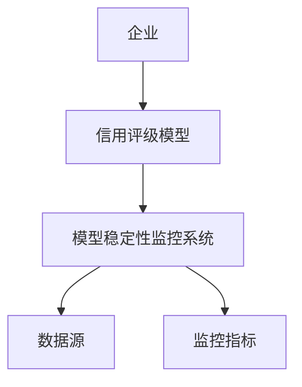
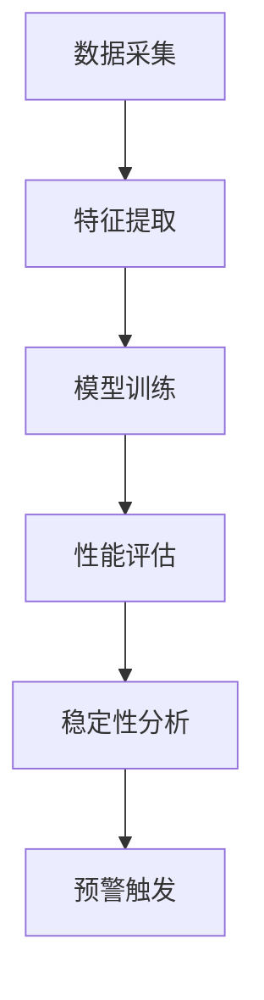
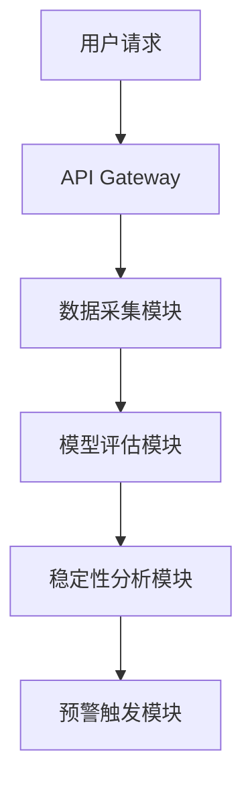
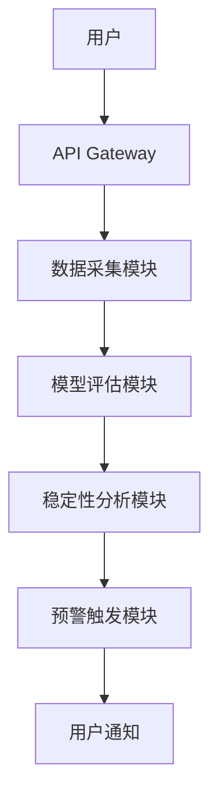

                 


# AI驱动的企业信用评级模型稳定性监控系统

> 关键词：企业信用评级，AI驱动，模型稳定性，监控系统，数据科学

> 摘要：本文深入探讨了AI在企业信用评级模型稳定性监控中的应用。通过分析模型稳定性监控的必要性、核心算法、系统架构及实际案例，本文为构建高效可靠的信用评级系统提供了理论支持和实践指导。文章从背景介绍、核心概念、算法原理、系统设计到项目实战，全面阐述了如何利用AI技术确保企业信用评级模型的稳定性和准确性。

---

# 第1章: 背景介绍与问题背景

## 1.1 企业信用评级的定义与重要性

### 1.1.1 企业信用评级的定义

企业信用评级是对企业在特定时间点的信用状况进行评估的过程，旨在量化企业的偿债能力和违约风险。评级结果通常以分数或等级（如AAA、BBB等）的形式呈现，帮助债权人、投资者等利益相关方做出决策。

### 1.1.2 信用评级在金融领域的核心作用

- **风险管理**：信用评级帮助金融机构识别高风险企业，降低违约风险。
- **投资决策**：投资者通过信用评级选择优质企业进行投资。
- **融资支持**：高信用评级的企业更容易获得低成本融资。

### 1.1.3 企业信用评级的常见指标与维度

- **财务指标**：资产负债率、利润率、流动比率等。
- **经营指标**：行业地位、市场竞争力、管理团队稳定性。
- **外部因素**：宏观经济环境、政策法规变化。

---

## 1.2 AI在信用评级中的应用背景

### 1.2.1 传统信用评级的局限性

- 数据维度有限，难以捕捉非结构化信息。
- 人工分析耗时且易受主观因素影响。
- 难以实时更新，无法应对快速变化的市场环境。

### 1.2.2 AI技术在信用评级中的优势

- **数据处理能力**：AI能够处理海量数据，包括文本、图像等非结构化数据。
- **实时性**：AI模型可以实时更新，捕捉数据分布的变化。
- **精准性**：通过机器学习算法，AI能够发现数据中的隐含规律，提高评级准确性。

### 1.2.3 企业信用评级模型的复杂性与挑战

- 模型可能因数据分布变化（如经济危机）而失效。
- 需要同时考虑多个维度的动态变化。
- 如何平衡模型的稳定性和可解释性。

---

## 1.3 模型稳定性监控的必要性

### 1.3.1 模型漂移与数据分布变化

- **模型漂移**：随着时间推移，数据分布发生变化，导致模型性能下降。
- **数据分布变化**：例如，某行业政策变化导致企业财务数据分布发生显著变化。

### 1.3.2 模型性能下降的潜在风险

- 评级结果可能偏离实际，导致决策失误。
- 影响金融机构的资产质量，造成经济损失。

### 1.3.3 监控系统在企业信用评级中的价值

- 及时发现模型性能下降，避免决策失误。
- 提供实时反馈，优化模型性能。
- 为金融机构提供可靠的风险评估依据。

---

## 1.4 本章小结

本章介绍了企业信用评级的定义、重要性及其在金融领域的作用，分析了传统信用评级的局限性和AI技术的应用优势。同时，强调了模型稳定性监控的必要性及其在企业信用评级中的价值。

---

# 第2章: 核心概念与系统架构

## 2.1 核心概念与定义

### 2.1.1 企业信用评级模型的组成要素

- **输入数据**：企业财务数据、经营数据、外部数据等。
- **模型结构**：机器学习模型（如逻辑回归、随机森林、神经网络等）。
- **输出结果**：信用评级分数或等级。

### 2.1.2 模型稳定性监控的定义与目标

- **定义**：通过持续监控模型性能和数据分布变化，确保模型输出的稳定性和准确性。
- **目标**：及时发现模型漂移，优化模型性能，降低决策风险。

### 2.1.3 监控系统的核心功能模块

- **数据采集模块**：实时采集企业相关数据。
- **模型评估模块**：评估模型性能和数据分布变化。
- **预警触发模块**：当模型性能下降或数据分布变化显著时，触发预警。

---

## 2.2 核心概念关系图

### 2.2.1 核心概念属性对比表

| 概念 | 属性 | 描述 |
|------|------|------|
| 企业信用评级 | 数据来源 | 财务数据、经营数据、行业数据等 |
| 模型稳定性 | 监控指标 | 模型性能、数据分布、预测准确性等 |
| 监控系统 | 功能模块 | 数据采集、模型评估、预警机制等 |

### 2.2.2 ER实体关系图



---

## 2.3 本章小结

本章详细阐述了企业信用评级模型的核心概念，包括模型组成要素、稳定性监控的定义与目标，并通过关系图展示了各核心概念之间的联系。

---

# 第3章: AI驱动的信用评级模型稳定性监控算法原理

## 3.1 模型稳定性监控的核心算法

### 3.1.1 基于时间序列的模型性能评估

- **准确率变化分析**：通过时间序列分析模型准确率的变化趋势，发现潜在问题。
- **召回率变化分析**：评估模型对高风险企业的识别能力。

### 3.1.2 模型权重变化分析

- **权重变化检测**：通过监控模型权重的变化，发现模型性能下降的早期信号。
- **特征重要性变化分析**：分析关键特征的重要性变化，判断模型是否受外部因素影响。

### 3.1.3 数据分布变化检测

- **分布变化检测**：通过统计测试（如Kolmogorov-Smirnov检验）或分布对比（如KL散度）方法，发现数据分布的变化。

---

## 3.2 算法流程图



---

## 3.3 数学模型与公式

### 3.3.1 模型性能评估公式

$$ \text{准确率} = \frac{\text{正确预测数}}{\text{总预测数}} $$

### 3.3.2 数据分布变化检测公式

$$ \text{KL散度} = \sum_{i} p_i \log \frac{p_i}{q_i} $$

---

## 3.4 本章小结

本章详细介绍了模型稳定性监控的核心算法，包括基于时间序列的性能评估、模型权重变化分析和数据分布变化检测。并通过流程图和数学公式，阐述了算法的实现步骤。

---

# 第4章: 系统分析与架构设计方案

## 4.1 系统功能设计

### 4.1.1 数据采集模块

- 实时采集企业财务数据、经营数据、行业数据等。
- 支持多种数据格式，如CSV、JSON等。

### 4.1.2 模型评估模块

- 评估模型的准确率、召回率等性能指标。
- 监控数据分布变化，计算KL散度等指标。

### 4.1.3 预警触发模块

- 设置预警阈值，当模型性能下降或数据分布变化显著时，触发预警。
- 支持多种预警方式，如邮件通知、短信通知等。

---

## 4.2 系统架构设计



---

## 4.3 系统交互设计



---

## 4.4 本章小结

本章详细设计了系统的功能模块和架构，展示了各模块之间的交互关系，并通过图表明确了系统的整体架构。

---

# 第5章: 项目实战

## 5.1 环境安装与配置

### 5.1.1 安装Python环境

```bash
pip install python3 python3-pip
pip install numpy pandas scikit-learn
```

### 5.1.2 安装AI框架

```bash
pip install tensorflow keras
```

---

## 5.2 核心代码实现

### 5.2.1 数据采集模块

```python
import pandas as pd

def load_data():
    # 加载企业数据
    data = pd.read_csv('enterprise_data.csv')
    return data
```

### 5.2.2 模型评估模块

```python
from sklearn.metrics import accuracy_score, recall_score

def evaluate_model(y_true, y_pred):
    accuracy = accuracy_score(y_true, y_pred)
    recall = recall_score(y_true, y_pred)
    return accuracy, recall
```

### 5.2.3 数据分布变化检测

```python
import numpy as np
from scipy.stats import ks_2samp

def calculate_kl_divergence(p, q):
    return np.sum(p * np.log(p / q))
```

---

## 5.3 实际案例分析

### 5.3.1 数据采集与预处理

```python
data = load_data()
data.dropna(inplace=True)
data['label'] = data['label'].astype(int)
```

### 5.3.2 模型训练与评估

```python
from sklearn.model_selection import train_test_split
from sklearn.linear_model import LogisticRegression

X_train, X_test, y_train, y_test = train_test_split(data.drop('label', axis=1), data['label'], test_size=0.2)
model = LogisticRegression().fit(X_train, y_train)
y_pred = model.predict(X_test)
accuracy, recall = evaluate_model(y_test, y_pred)
print(f'Accuracy: {accuracy}, Recall: {recall}')
```

### 5.3.3 数据分布变化检测

```python
p = data['feature1'].values
q = new_data['feature1'].values
kl_divergence = calculate_kl_divergence(p, q)
print(f'KL Divergence: {kl_divergence}')
```

---

## 5.4 本章小结

本章通过实际案例，展示了如何使用Python和机器学习库实现企业信用评级模型的稳定性监控。包括数据采集、模型评估和数据分布变化检测的具体实现。

---

# 第6章: 总结与展望

## 6.1 本章总结

本文详细探讨了AI在企业信用评级模型稳定性监控中的应用，从背景介绍、核心概念、算法原理到系统设计和项目实战，全面阐述了如何构建高效的监控系统。通过实际案例，展示了系统的实现过程和监控效果。

---

## 6.2 未来展望

- **实时监控优化**：进一步优化模型性能监控的实时性，减少延迟。
- **多模型融合**：探索多模型融合的方法，提高评级结果的准确性。
- **动态调整机制**：研究动态调整模型参数的方法，适应快速变化的市场环境。

---

# 作者：AI天才研究院/AI Genius Institute & 禅与计算机程序设计艺术 /Zen And The Art of Computer Programming

---

感谢您的阅读！如需进一步了解相关内容，欢迎随时联系。

