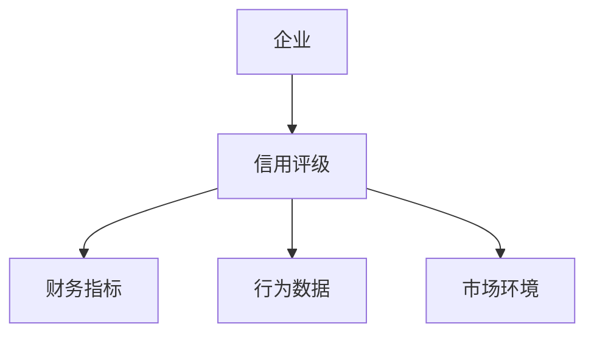
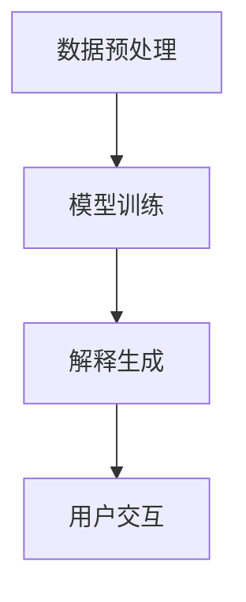
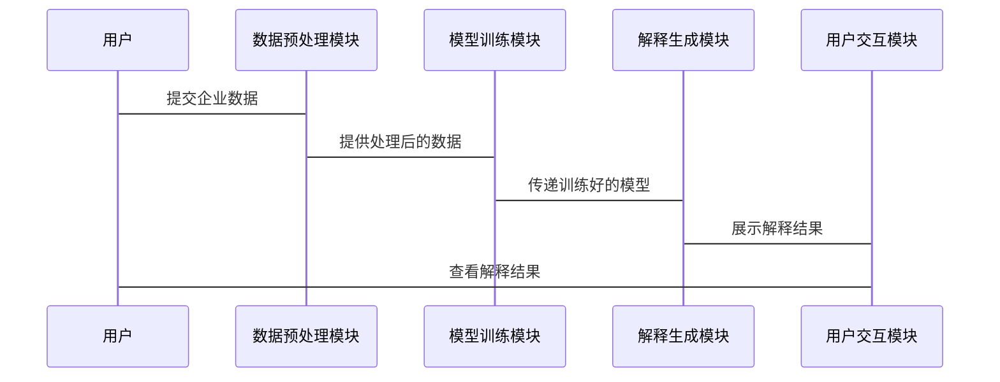

                 


# 《AI驱动的企业信用评级模型解释系统》

---

## 关键词：
企业信用评级、AI驱动、模型解释、可解释性AI（XAI）、机器学习、金融风险管理

---

## 摘要：
本文深入探讨了AI驱动的企业信用评级模型解释系统的核心原理与实现方法。通过结合企业信用评级的关键要素，分析了如何利用可解释性AI技术（XAI）提升模型的透明性和可信度。文章详细讲解了模型解释算法的原理、系统架构设计以及实际项目实现，为企业信用评级领域的技术实践提供了理论支持和实践指导。

---

# 第1章: 企业信用评级与AI驱动解释系统的背景介绍

## 1.1 企业信用评级的重要性

### 1.1.1 信用评级的定义与作用
企业信用评级是通过对企业的财务状况、经营能力、市场环境等多方面因素进行综合评估，确定其信用风险等级的过程。信用评级结果直接影响企业的融资成本、投资决策以及合作伙伴的选择。在金融风险管理中，信用评级是评估企业信用风险的核心工具之一。

### 1.1.2 传统信用评级的局限性
传统的信用评级方法主要依赖于人工分析和经验判断，存在以下问题：
- **主观性**：评级结果受到主观因素的影响较大，缺乏客观性和一致性。
- **效率低下**：人工分析耗时长，难以应对海量数据和复杂场景。
- **可解释性不足**：复杂的模型难以向用户解释评级结果的依据，导致信任度下降。

### 1.1.3 AI技术在信用评级中的应用潜力
AI技术的应用为信用评级带来了新的可能性：
- **数据处理能力**：AI可以快速处理大量非结构化数据，如社交媒体信息、新闻数据等。
- **模型复杂性**：通过深度学习等技术，构建更复杂的信用评级模型，提高准确性。
- **实时性**：AI可以实现信用评级的实时更新，适应市场变化。

---

## 1.2 AI驱动的模型解释性需求

### 1.2.1 模型解释性的重要性
模型解释性是信用评级系统中不可或缺的环节。只有能够清晰解释评级结果的原因，才能让用户信任模型的决策，并在实际业务中进行调整和优化。

### 1.2.2 企业信用评级中的解释性挑战
- **复杂模型的解释性**：如深度学习模型通常难以解释其决策过程。
- **多因素影响**：企业的信用评级受财务、市场、经营等多方面因素影响，解释难度大。
- **用户需求多样化**：不同用户（如银行、投资者）对解释的需求不同。

### 1.2.3 AI驱动解释系统的必要性
通过AI技术，可以实现模型的自动化解释，将复杂的数学运算转化为用户可理解的形式。这不仅提高了系统的透明度，还增强了用户的信任感。

---

## 1.3 本章小结
本章从企业信用评级的重要性和AI技术的应用潜力入手，分析了传统评级方法的局限性，并提出了AI驱动模型解释系统的需求。通过AI技术，可以有效解决传统评级方法的效率和解释性问题。

---

# 第2章: 企业信用评级模型解释的核心概念与联系

## 2.1 信用评级模型的构成

### 2.1.1 企业财务指标分析
财务指标是信用评级的重要依据，包括：
- **盈利能力**：如净利润率、ROE（净资产收益率）。
- **偿债能力**：如资产负债率、流动比率。
- **运营能力**：如存货周转率、应收账款周转率。

### 2.1.2 企业行为数据特征
行为数据反映了企业的经营状况和市场表现，包括：
- **市场表现**：股价波动、成交量。
- **管理决策**：高管变更、重大投资决策。
- **信用历史**：逾期记录、违约历史。

### 2.1.3 市场环境因素
市场环境对企业的信用评级有重要影响，包括：
- **宏观经济**：GDP增长率、通货膨胀率。
- **行业周期**：行业景气度、竞争格局。
- **政策环境**：政府政策、法律法规变化。

---

## 2.2 模型解释性与可解释性AI（XAI）

### 2.2.1 XAI的基本概念
可解释性AI（XAI）是指AI系统能够以人类可理解的方式解释其决策过程。XAI的目标是提高模型的透明度和可信度，尤其是在金融、医疗等高风险领域。

### 2.2.2 企业信用评级中的解释性挑战
- **模型复杂性**：复杂的模型（如深度学习模型）通常缺乏可解释性。
- **多因素影响**：企业的信用评级涉及多个复杂因素，解释难度大。
- **用户需求多样性**：不同用户对解释的需求不同，需要灵活的解释方式。

### 2.2.3 XAI的核心技术与方法
- **特征重要性分析**：通过权重或贡献度来解释模型决策。
- **SHAP值**：基于Shapley值的局部可解释性方法。
- **LIME方法**：通过局部线性近似实现模型解释。

---

## 2.3 核心概念的ER实体关系图



---

## 2.4 本章小结
本章分析了企业信用评级模型的核心构成，并介绍了可解释性AI（XAI）的基本概念和方法。通过ER实体关系图，展示了企业信用评级的多维度影响因素。

---

# 第3章: AI驱动的信用评级模型解释算法原理

## 3.1 特征重要性分析

### 3.1.1 特征重要性的定义
特征重要性是指在模型中各个特征对预测结果的影响程度。特征重要性分析可以帮助用户理解哪些因素对信用评级影响最大。

### 3.1.2 基于树模型的特征重要性
树模型（如随机森林、梯度提升树）通过特征分裂的重要性来计算特征重要性。特征重要性可以通过以下公式计算：
$$ importance = \sum_{i=1}^{n} (split\_improvement_i \times split\_count_i) $$

### 3.1.3 基于线性模型的特征权重
线性模型（如线性回归、逻辑回归）的特征权重可以直接反映特征的重要性。例如，在线性回归模型中：
$$ y = \beta_0 + \beta_1x_1 + \beta_2x_2 + ... + \beta_nx_n $$

---

## 3.2 SHAP值与LIME方法

### 3.2.1 SHAP值的理论基础
SHAP（SHapley Additive exPlanations）是一种基于Shapley值的解释方法。Shapley值是博弈论中的概念，用于分配合作博弈中的收益。在模型解释中，SHAP值用于衡量每个特征对单个样本预测值的贡献。

### 3.2.2 LIME方法的解释原理
LIME（Local Interpretable Model-agnostic Explanations）是一种通过局部线性近似实现模型解释的方法。LIME的核心思想是，对于一个复杂的模型，可以在局部范围内用一个简单的模型（如线性回归）来近似，并解释其预测结果。

### 3.2.3 SHAP与LIME的对比分析
- **SHAP**：全局解释能力更强，但计算复杂。
- **LIME**：局部解释能力更强，计算简单，但可能忽略全局信息。

---

## 3.3 模型解释性算法的数学基础

### 3.3.1 线性回归模型公式
$$ y = \beta_0 + \beta_1x_1 + \beta_2x_2 + ... + \beta_nx_n $$

### 3.3.2 树模型特征重要性计算
$$ importance = \sum_{i=1}^{n} (split\_improvement_i \times split\_count_i) $$

---

## 3.4 本章小结
本章详细介绍了特征重要性分析、SHAP值和LIME方法的原理和应用。通过数学公式和方法对比，帮助读者理解不同解释方法的优缺点。

---

# 第4章: 企业信用评级解释系统的系统架构与设计

## 4.1 系统功能模块划分

### 4.1.1 数据预处理模块
数据预处理是信用评级系统的基础，包括数据清洗、特征工程、数据标准化等。

### 4.1.2 模型训练模块
模型训练模块负责构建信用评级模型，包括选择算法、训练模型、优化参数等。

### 4.1.3 解释生成模块
解释生成模块基于模型解释算法（如SHAP、LIME）生成可解释的评级结果。

### 4.1.4 用户交互模块
用户交互模块提供友好的用户界面，展示解释结果，并支持用户查询和分析。

---

## 4.2 系统架构设计



---

## 4.3 系统接口设计

### 4.3.1 数据接口
- 数据输入接口：接收企业数据。
- 数据输出接口：输出处理后的数据。

### 4.3.2 模型接口
- 模型训练接口：训练信用评级模型。
- 模型预测接口：进行信用评级预测。

### 4.3.3 解释接口
- 解释生成接口：生成模型解释结果。
- 解释展示接口：展示解释结果。

---

## 4.4 系统交互流程



---

## 4.5 本章小结
本章从系统架构的角度，详细设计了企业信用评级解释系统的功能模块、接口和交互流程。通过mermaid图展示了系统的整体架构和工作流程。

---

# 第5章: 项目实战与系统实现

## 5.1 项目介绍
本项目旨在构建一个基于AI的企业信用评级模型解释系统。通过实际案例，展示如何利用Python和机器学习技术实现模型解释。

---

## 5.2 环境安装与配置

### 5.2.1 Python环境
- 安装Python 3.8及以上版本。
- 安装必要的库：numpy、pandas、scikit-learn、xgboost、shap。

### 5.2.2 数据集获取
从公开数据集获取企业信用评级数据，包括财务指标、行为数据和市场环境等特征。

---

## 5.3 系统核心实现

### 5.3.1 数据预处理
```python
import pandas as pd
import numpy as np

# 数据加载
data = pd.read_csv('enterprise_credit.csv')

# 数据清洗
data.dropna(inplace=True)

# 特征工程
from sklearn.preprocessing import StandardScaler
scaler = StandardScaler()
data_scaled = scaler.fit_transform(data)
```

### 5.3.2 模型训练
```python
from sklearn.ensemble import RandomForestClassifier
from xgboost import XGBClassifier

# 模型训练
model = XGBClassifier()
model.fit(data_scaled, target)
```

### 5.3.3 模型解释
```python
import shap

# SHAP值计算
explainer = shap.TreeExplainer(model)
shap_values = explainer.shap_values(data_scaled)

# 解释结果展示
shap.summary_plot(shap_values, data_scaled, target_names=target.columns)
```

---

## 5.4 实际案例分析
以某企业为例，展示如何通过系统实现信用评级，并解释评级结果的原因。

---

## 5.5 项目小结
通过项目实战，展示了AI驱动的企业信用评级模型解释系统的实现过程。从数据预处理到模型训练，再到解释生成，完整地展示了系统的各个环节。

---

# 第6章: 总结与展望

## 6.1 本章总结
本文详细探讨了AI驱动的企业信用评级模型解释系统的核心原理与实现方法。通过结合企业信用评级的关键要素，分析了如何利用可解释性AI技术（XAI）提升模型的透明性和可信度。

## 6.2 未来研究方向
- **更复杂的模型解释**：研究如何解释更复杂的模型（如神经网络）。
- **动态解释系统**：开发能够实时更新解释结果的系统。
- **多模态数据融合**：结合文本、图像等多种数据源进行信用评级。

## 6.3 注意事项
在实际应用中，需要注意数据隐私、模型鲁棒性等问题，确保系统的安全性和可靠性。

## 6.4 拓展阅读
推荐相关领域的书籍和论文，帮助读者深入了解可解释性AI和信用评级模型的研究进展。

---

# 作者：AI天才研究院 & 禅与计算机程序设计艺术

---

**本文由AI天才研究院（AI Genius Institute）撰写，转载请注明出处。**

