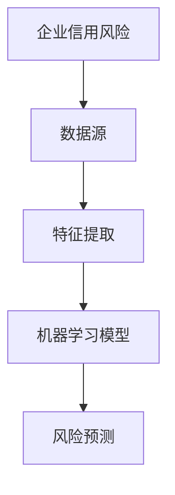
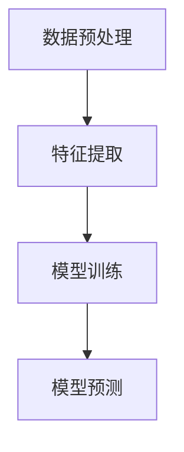
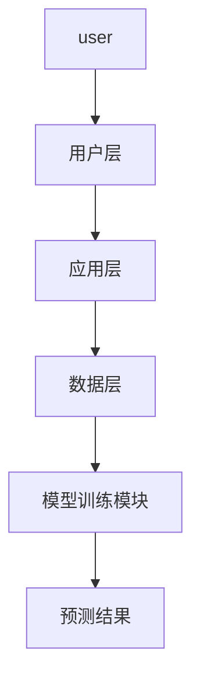
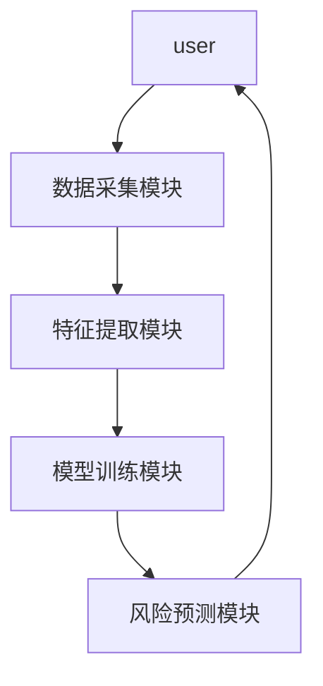

                 

# AI驱动的企业信用风险传导分析

> 关键词：企业信用风险，AI驱动，信用风险传导，机器学习，深度学习，系统架构设计

> 摘要：本文深入探讨了AI技术在企业信用风险传导分析中的应用，从理论基础到算法实现，再到系统设计与项目实战，全面解析了如何利用AI技术提升信用风险的分析与预测能力。通过结合机器学习、深度学习等技术手段，本文为企业信用风险的智能化分析提供了新的思路与方法。

---

# 第1章: 企业信用风险的基本概念与AI的应用背景

## 1.1 企业信用风险的定义与特征

### 1.1.1 企业信用风险的定义
企业信用风险是指企业在经营过程中，由于外部环境、内部管理或市场波动等因素的影响，导致其无法按时履行债务或履行债务的可能性增加，从而给债权人或相关利益方带来损失的风险。

### 1.1.2 企业信用风险的核心特征
- **不确定性**：信用风险的大小受多种不确定因素影响，如经济周期、企业经营状况等。
- **传染性**：信用风险可能通过供应链、金融市场等渠道传导至其他企业或机构。
- **动态性**：信用风险会随着时间和市场环境的变化而变化。

### 1.1.3 企业信用风险的分类与层次结构
企业信用风险可以分为以下几类：
- **行业风险**：由于行业整体状况不佳导致的信用风险。
- **企业个体风险**：由于企业自身的经营状况或管理问题导致的信用风险。
- **系统性风险**：由于宏观经济波动或金融市场整体波动导致的信用风险。

---

## 1.2 AI技术在信用风险分析中的作用

### 1.2.1 AI技术的基本概念与优势
人工智能（AI）技术通过模拟人类的思维方式，能够处理大量复杂的数据，并从中提取有价值的信息。AI技术在信用风险分析中的优势包括：
- **数据处理能力**：AI能够处理结构化和非结构化的海量数据。
- **预测能力**：基于机器学习的AI模型可以预测企业的信用风险。
- **实时性**：AI能够实时监控企业的信用状况，及时发现潜在风险。

### 1.2.2 AI在信用风险分析中的独特价值
- **精准预测**：AI可以通过历史数据和实时数据，构建预测模型，精准预测企业的信用风险。
- **动态监控**：AI能够实时监控企业的经营状况，及时调整信用风险评估结果。
- **自动化决策**：AI可以通过自动化的方式，帮助企业做出更高效的信用风险管理决策。

### 1.2.3 企业信用风险分析的AI驱动趋势
随着AI技术的不断发展，企业信用风险分析正在从传统的统计分析向智能化、自动化方向转变。AI技术的应用使得信用风险分析更加精准、高效，并能够应对复杂的市场环境。

---

## 1.3 本章小结

本章介绍了企业信用风险的基本概念、特征以及AI技术在信用风险分析中的作用。通过AI技术的应用，企业可以更精准地预测和管理信用风险，从而降低潜在的损失。

---

# 第2章: AI驱动信用风险传导的核心概念与理论基础

## 2.1 信用风险传导的定义与机制

### 2.1.1 信用风险传导的定义
信用风险传导是指信用风险从一个企业或机构传递到另一个企业或机构的过程。这种传导可能通过供应链、金融市场或其他渠道进行。

### 2.1.2 信用风险传导的主要路径
- **供应链传导**：上游企业发生信用风险，可能影响下游企业的经营状况。
- **金融市场传导**：企业的信用风险可能通过债券市场、股票市场等金融工具传导到其他投资者。
- **关联企业传导**：企业之间的关联关系可能导致信用风险的传导。

### 2.1.3 信用风险传导的关键影响因素
- **企业规模**：大规模企业通常具有更强的抗风险能力。
- **企业治理结构**：良好的治理结构可以降低信用风险。
- **外部环境**：经济波动、政策变化等因素会影响信用风险的传导。

---

## 2.2 AI驱动信用风险传导的核心概念

### 2.2.1 数据驱动的信用风险分析
AI技术通过处理海量数据，能够发现传统方法难以察觉的信用风险信号。

### 2.2.2 智能模型在信用风险传导中的应用
- **机器学习模型**：用于预测企业的信用风险。
- **图嵌入模型**：用于分析企业之间的关联关系。

### 2.2.3 信用风险传导的动态特征与AI的结合
AI技术能够实时监控企业的经营状况，动态调整信用风险评估结果。

---

## 2.3 核心概念对比与ER实体关系图

### 2.3.1 核心概念对比表格

| 对比维度 | 传统信用风险分析 | AI驱动信用风险分析 |
|----------|------------------|----------------------|
| 数据来源 | 结构化数据为主    | 结构化+非结构化数据 |
| 分析方法 | 统计分析为主      | 机器学习+深度学习   |
| 预测能力 | 精度较低          | 精度较高            |

### 2.3.2 ER实体关系图（使用Mermaid流程图）

---

## 2.4 本章小结

本章详细介绍了信用风险传导的定义、机制以及AI驱动信用风险传导的核心概念。通过对比传统方法与AI驱动方法的差异，进一步强调了AI技术在信用风险分析中的优势。

---

# 第3章: AI驱动信用风险传导的算法原理与实现

## 3.1 基于机器学习的信用风险传导模型

### 3.1.1 机器学习在信用风险分析中的应用
机器学习通过训练数据，构建分类或回归模型，预测企业的信用风险。

### 3.1.2 常见的信用风险传导算法
- **逻辑回归（Logistic Regression）**：用于分类问题，预测企业信用风险等级。
- **支持向量机（SVM）**：用于分类问题，具有较高的准确率。
- **随机森林（Random Forest）**：用于分类和回归问题，具有较强的鲁棒性。

### 3.1.3 算法的优缺点对比

| 算法名称 | 优点                           | 缺点                           |
|----------|--------------------------------|--------------------------------|
| 逻辑回归 | 简单易用，解释性强             | 对非线性关系的处理能力有限     |
| SVM      | 准确率高，适合小样本数据       | 对高维数据的处理能力较差       |
| 随机森林 | 鲁棒性高，适合高维数据         | 计算复杂度较高                 |

---

## 3.2 基于深度学习的信用风险传导模型

### 3.2.1 深度学习的基本原理
深度学习通过多层神经网络，自动提取数据的特征，适用于复杂的信用风险分析任务。

### 3.2.2 基于神经网络的信用风险传导模型
- **卷积神经网络（CNN）**：用于处理结构化数据，如时间序列数据。
- **循环神经网络（RNN）**：用于处理序列数据，如企业经营历史数据。

### 3.2.3 深度学习模型的训练与优化
- **训练数据预处理**：包括数据清洗、特征提取等。
- **模型训练**：使用训练数据训练模型，调整模型参数。
- **模型优化**：通过交叉验证、超参数调整等方法优化模型性能。

---

## 3.3 算法实现与数学模型

### 3.3.1 算法流程图（使用Mermaid）

### 3.3.2 数学模型与公式（使用LaTeX）

#### 逻辑回归模型
$$ P(y=1|x) = \frac{1}{1 + e^{-\beta x}} $$

#### 支持向量机模型
$$ \text{目标函数} = \sum_{i=1}^n \xi_i + \frac{1}{2} \sum_{i=1}^n \alpha_i^2 $$
$$ \text{约束条件} = y_i (\omega \cdot x_i + b) \geq 1 - \xi_i $$
$$ \xi_i \geq 0 $$

---

## 3.4 本章小结

本章详细介绍了基于机器学习和深度学习的信用风险传导模型，包括算法原理、实现步骤以及数学模型。通过对比不同算法的优缺点，帮助读者选择适合的模型进行信用风险分析。

---

# 第4章: 企业信用风险传导的系统分析与架构设计

## 4.1 系统分析与设计概述

### 4.1.1 系统目标与范围
系统目标：构建一个基于AI的信用风险传导分析系统，实现对企业信用风险的实时监控和预测。
系统范围：包括数据采集、特征提取、模型训练、风险预测等功能。

### 4.1.2 系统功能模块划分
- **数据采集模块**：采集企业经营数据、财务数据等。
- **特征提取模块**：提取企业的信用风险相关特征。
- **模型训练模块**：训练信用风险预测模型。
- **风险预测模块**：基于模型预测企业的信用风险。

### 4.1.3 系统架构设计
系统采用分层架构，包括数据层、应用层和用户层。

---

## 4.2 系统架构设计图（使用Mermaid）

---

## 4.3 系统交互设计

### 4.3.1 系统交互流程图（使用Mermaid）

### 4.3.2 用户角色与权限管理
- **管理员**：负责系统的配置和管理。
- **普通用户**：负责数据的采集和查询。

### 4.3.3 系统数据流分析
系统数据流包括数据输入、数据处理、数据存储和数据输出四个环节。

---

## 4.4 本章小结

本章详细介绍了信用风险传导分析系统的架构设计与交互设计，通过系统架构图和交互流程图，帮助读者更好地理解系统的实现过程。

---

# 第5章: 项目实战——AI驱动信用风险传导分析系统开发

## 5.1 项目环境与工具安装

### 5.1.1 开发环境搭建
- **操作系统**：建议使用Linux或Windows系统。
- **开发工具**：推荐使用PyCharm或VS Code。
- **AI框架**：推荐使用TensorFlow或PyTorch。

### 5.1.2 数据集获取与预处理
- 数据来源：可以从公开数据集或企业内部数据中获取。
- 数据预处理：包括数据清洗、特征提取等。

### 5.1.3 开发工具安装与配置
- **Python**：安装Python 3.8及以上版本。
- **AI框架**：安装TensorFlow或PyTorch。

---

## 5.2 系统核心功能实现

### 5.2.1 数据清洗与特征提取
- **数据清洗**：去除缺失值、异常值等。
- **特征提取**：从企业经营数据中提取信用风险相关特征。

### 5.2.2 模型训练与优化
- **模型训练**：基于训练数据训练信用风险预测模型。
- **模型优化**：通过调整超参数优化模型性能。

### 5.2.3 系统部署与测试
- **系统部署**：将模型部署到服务器上，提供API接口。
- **系统测试**：测试系统的性能和准确性。

---

## 5.3 本章小结

本章通过项目实战，详细介绍了AI驱动信用风险传导分析系统的开发过程，包括环境搭建、数据处理、模型训练与部署等步骤。通过实际案例分析，帮助读者更好地理解系统的实现过程。

---

# 第6章: 总结与展望

## 6.1 总结
本文深入探讨了AI技术在企业信用风险传导分析中的应用，从理论基础到算法实现，再到系统设计与项目实战，全面解析了如何利用AI技术提升信用风险的分析与预测能力。

## 6.2 注意事项
- 数据隐私问题：在处理企业数据时，需要注意数据隐私保护。
- 模型解释性：在实际应用中，模型的解释性非常重要。

## 6.3 未来展望
随着AI技术的不断发展，企业信用风险分析将更加智能化、自动化。未来的研究方向包括更复杂的模型、更高效的算法以及更广泛的应用场景。

---

# 作者：AI天才研究院/AI Genius Institute & 禅与计算机程序设计艺术 /Zen And The Art of Computer Programming

---

以上是《AI驱动的企业信用风险传导分析》的完整目录大纲和文章内容，希望对您有所帮助！

