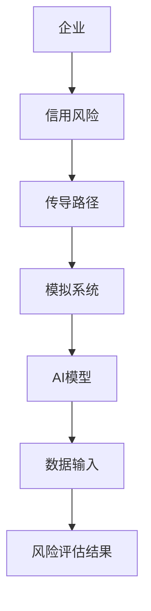
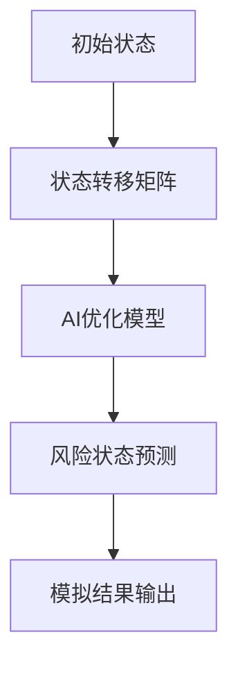
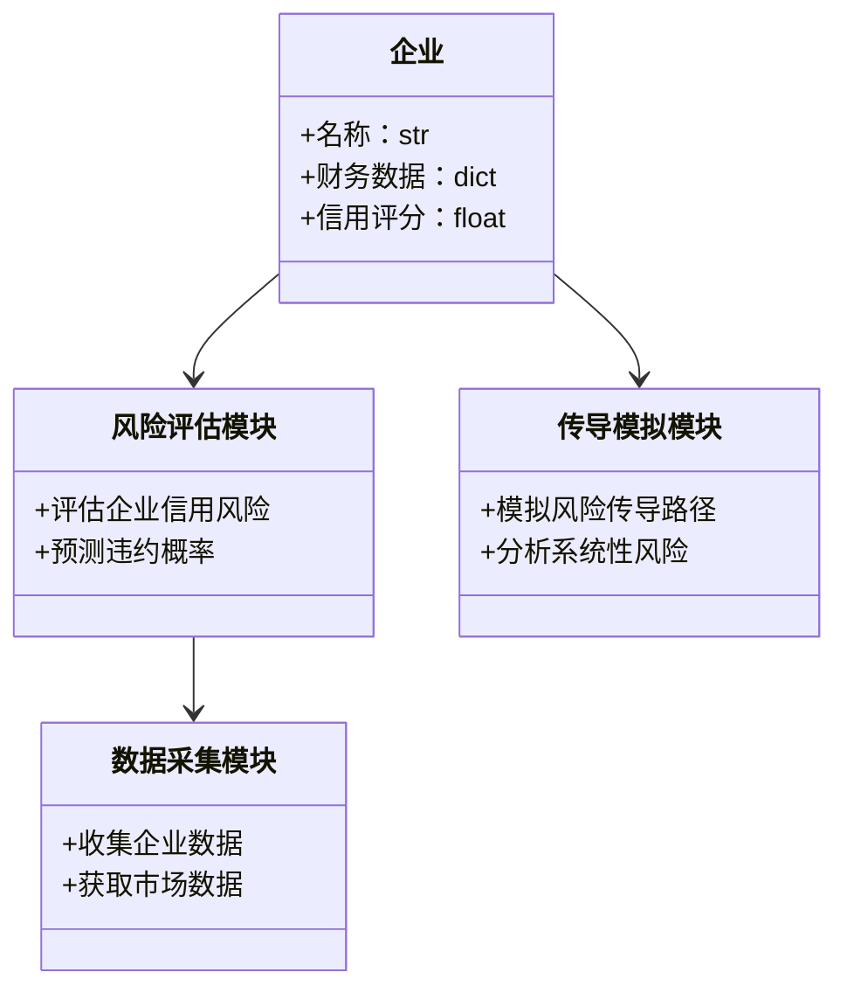
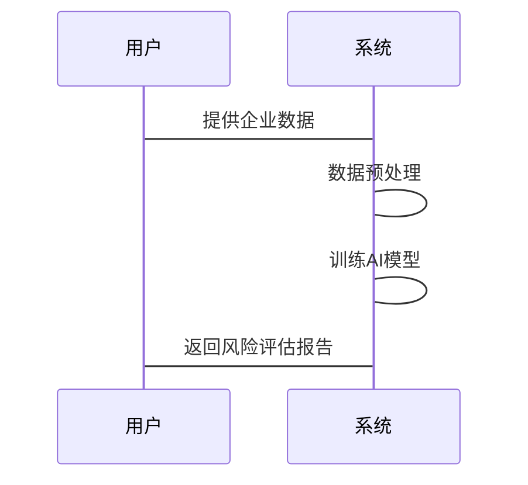

                 


# AI驱动的企业信用风险传导模拟系统

## 关键词：AI，信用风险，传导模拟，系统架构，Python，数学模型

## 摘要：  
本文系统地探讨了AI驱动的企业信用风险传导模拟系统的构建与应用。通过分析信用风险传导的基本原理、AI技术的优势以及系统架构的设计，提出了基于马尔可夫链和贝叶斯网络的混合模型，结合实时数据流处理，实现对企业信用风险的精准预测与模拟。文章还详细介绍了系统的实现过程，包括环境搭建、核心算法实现、数据处理与案例分析，为实际应用提供了参考。

---

## 第一部分: 企业信用风险传导模拟的背景与意义

### 第1章: 企业信用风险的定义与特征

#### 1.1 企业信用风险的基本概念
- 信用风险是指由于企业或个人无法履行其偿债义务，导致债权人或投资者遭受损失的风险。
- 企业信用风险的核心在于企业的财务状况、经营能力和市场环境的变化。

#### 1.2 信用风险的主要特征
- **可测量性**：通过财务指标（如负债率、流动比率）量化企业的偿债能力。
- **可传导性**：信用风险可能从一家企业传导到上下游企业，甚至影响整个产业链。
- **动态性**：受市场波动、政策变化和企业经营状况的影响。

#### 1.3 信用风险传导的机制与路径
- **直接传导**：企业自身财务状况恶化，直接导致信用风险。
- **间接传导**：通过供应链或金融市场传导至其他企业。
- **系统性风险**：信用风险可能引发连锁反应，影响整个金融系统。

### 第2章: AI技术在信用风险领域的应用前景

#### 2.1 AI技术在金融领域的应用现状
- **自然语言处理（NLP）**：分析企业财报和新闻，提取财务风险信号。
- **机器学习（ML）**：构建信用评分模型，预测企业违约概率。
- **时间序列分析**：预测企业财务状况的未来走势。

#### 2.2 信用风险评估中的AI技术优势
- **数据处理能力**：AI能够处理海量非结构化数据（如新闻、社交媒体数据）。
- **实时性**：AI模型可以实时更新，捕捉市场变化。
- **可解释性**：通过模型解释工具，分析信用风险的关键驱动因素。

#### 2.3 信用风险传导模拟的AI驱动趋势
- **从单点预测到系统模拟**：AI技术可以帮助构建复杂的信用风险传导网络。
- **实时监控与干预**：通过实时数据分析，提前预警信用风险。

---

## 第二部分: 企业信用风险传导模拟的核心概念与联系

### 第3章: 核心概念原理

#### 3.1 信用风险传导的基本原理
- 信用风险传导是一个复杂的动态过程，涉及多个因素的相互作用。
- 企业之间的信用风险传导可能通过供应链、金融市场或行业竞争等方式实现。

#### 3.2 AI驱动的模拟机制
- **数据驱动**：AI模型基于企业内外部数据，构建风险传导模型。
- **动态更新**：AI系统能够实时更新模型参数，适应市场变化。
- **情景模拟**：通过AI模拟不同情景下的信用风险传导路径。

#### 3.3 系统的核心要素与功能模块
- **数据采集模块**：收集企业财务数据、市场数据和新闻数据。
- **风险评估模块**：利用AI算法评估企业信用风险。
- **传导模拟模块**：模拟信用风险在系统中的传导过程。
- **结果分析模块**：分析模拟结果，提出风险 mitigation 策略。

### 第4章: 核心概念属性对比表

| 概念       | 属性1       | 属性2       | 属性3       |
|------------|-------------|-------------|-------------|
| 信用风险   | 客观性       | 可测量性     | 可模拟性     |
| AI驱动     | 数据依赖性   | 模型可解释性 | 实时性       |

### 第5章: 实体关系图（ER图）



---

## 第三部分: AI驱动信用风险传导模拟的算法原理

### 第6章: 基于马尔可夫链的信用风险传导模型

#### 6.1 马尔可夫链的基本原理
- **定义**：一种描述系统状态转移的数学模型。
- **性质**：无后见性，即未来状态仅依赖于当前状态。
- **状态转移矩阵**：表示从一个状态转移到另一个状态的概率。

#### 6.2 基于AI的马尔可夫链优化算法
- **算法流程图**



- **算法实现代码**

```python
import numpy as np

def markov_chain_simulation(initial_state, transition_matrix, steps):
    current_state = initial_state
    states = [current_state]
    for _ in range(steps):
        next_state = np.dot(current_state, transition_matrix)
        states.append(next_state)
    return states

# 示例
initial_state = np.array([0.3, 0.7])
transition_matrix = np.array([[0.6, 0.4], [0.3, 0.7]])
steps = 5

result = markov_chain_simulation(initial_state, transition_matrix, steps)
print(result)
```

---

### 第7章: 基于贝叶斯网络的风险传导模拟

#### 7.1 贝叶斯网络的基本原理
- **定义**：一种有向无环图（DAG），表示变量之间的概率关系。
- **优势**：能够处理不确定性，适合复杂系统的模拟。

#### 7.2 贝叶斯网络的构建与训练
- **训练数据**：企业信用数据、市场数据。
- **模型构建**：定义变量之间的概率关系。
- **推断**：利用观测数据更新变量概率。

#### 7.3 贝叶斯网络的实现代码

```python
from sklearn.naive_bayes import GaussianNB

# 示例数据
X = [[18, 0], [26, 0], [22, 1], [28, 1]]
y = [0, 0, 1, 1]

# 训练模型
model = GaussianNB()
model.fit(X, y)

# 推断
new_data = [[25, 0]]
print(model.predict(new_data))
```

---

## 第四部分: 系统分析与架构设计方案

### 第8章: 系统功能设计

#### 8.1 领域模型（类图）



#### 8.2 系统架构设计


#### 8.3 系统接口设计
- **输入接口**：数据采集模块接收企业数据。
- **输出接口**：模拟结果输出模块提供风险评估报告。

#### 8.4 系统交互设计（序列图）



---

## 第五部分: 项目实战

### 第9章: 环境安装与核心实现

#### 9.1 环境安装
- Python 3.8+
- NumPy、Scikit-learn、Gensim

#### 9.2 核心代码实现
- **数据预处理**

```python
import pandas as pd
data = pd.read_csv('企业数据.csv')
data_preprocessed = data.dropna()
```

- **模型训练**

```python
from sklearn.ensemble import RandomForestClassifier
model = RandomForestClassifier()
model.fit(X_train, y_train)
```

### 第10章: 案例分析

#### 10.1 数据分析
- 使用企业财务数据和市场数据进行分析。

#### 10.2 模型评估
- 通过混淆矩阵和ROC曲线评估模型性能。

#### 10.3 案例总结
- 提供实际案例的分析结果和经验教训。

---

## 第六部分: 总结与展望

### 第11章: 最佳实践 tips

#### 11.1 数据质量的重要性
- 数据的完整性和准确性直接影响模型的性能。

#### 11.2 模型可解释性
- 选择可解释的模型有助于风险管理和决策制定。

#### 11.3 实时监控
- 实时监控企业信用状况，及时发现潜在风险。

### 第12章: 小结与展望

#### 12.1 小结
- AI驱动的企业信用风险传导模拟系统能够有效帮助企业识别和管理信用风险。

#### 12.2 未来展望
- 结合区块链技术，构建更加安全的信用风险管理系统。

---

## 作者：AI天才研究院/AI Genius Institute & 禅与计算机程序设计艺术 /Zen And The Art of Computer Programming

