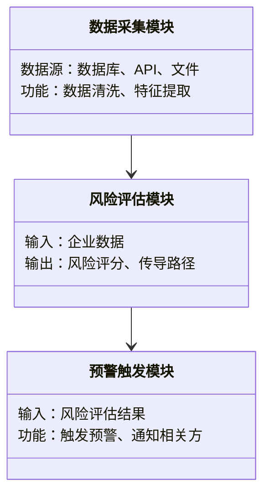

                 


---

# AI驱动的企业信用风险传导路径识别与预警系统

> **关键词**: 人工智能, 信用风险, 风险传导路径, 预警系统, 企业风险管理

> **摘要**:  
> 本文探讨了利用人工智能技术识别和预警企业信用风险传导路径的方法。通过分析信用风险的基本概念、AI技术在信用风险管理中的应用、系统架构设计以及实际项目案例，本文详细阐述了如何构建一个高效的信用风险预警系统。结合机器学习、深度学习和自然语言处理技术，本文提出了基于AI的信用风险传导路径识别模型，并通过系统架构设计和项目实战展示了其实际应用价值。最终，本文总结了该系统的应用价值，并展望了未来的发展方向。

---

## 第1章: 企业信用风险的基本概念

### 1.1 信用风险的定义与特征

信用风险是指由于债务人或交易对手方无法履行其合约义务，导致债权人或相关方遭受损失的可能性。在企业层面，信用风险主要体现在企业间的债务关系、供应链上下游企业之间的依赖关系以及企业与金融机构之间的借贷关系等方面。

#### 信用风险的主要特征
1. **隐蔽性**：信用风险通常在企业经营状况恶化时才会显现，具有一定的滞后性。
2. **传导性**：信用风险会通过企业间的关联关系进行传导，影响整个供应链或金融市场的稳定性。
3. **复杂性**：信用风险的产生往往与企业的财务状况、市场环境、政策变化等多重因素相关，具有高度的复杂性。

### 1.2 AI在信用风险领域的应用背景

传统信用风险管理方法主要依赖于财务指标分析和专家经验，存在以下局限性：
1. **数据维度有限**：传统方法主要依赖于财务数据，难以捕捉非结构化数据（如文本、图像）中的潜在风险信号。
2. **风险传导路径难以识别**：传统方法难以识别企业间的复杂关联关系，导致风险传导路径不清晰。
3. **人工干预过多**：传统方法需要大量人工分析，效率低下且容易出错。

AI技术的应用为信用风险管理带来了新的可能性：
1. **多源数据处理能力**：AI能够处理结构化数据（如财务数据）和非结构化数据（如新闻、社交媒体信息），提供更全面的风险评估。
2. **自动化分析能力**：AI能够自动化地分析大量数据，识别潜在风险信号，提高风险管理效率。
3. **复杂关系识别能力**：通过图论和深度学习技术，AI能够识别企业间的复杂关联关系，清晰地描绘信用风险传导路径。

### 1.3 信用风险传导路径识别的重要性

信用风险传导路径是指信用风险从一家企业向其他企业或金融市场传播的路径。识别信用风险传导路径具有重要意义：
1. **提前预警风险**：通过识别风险传导路径，可以在风险发生前采取预防措施，减少潜在损失。
2. **优化风险管理策略**：清晰的风险传导路径有助于制定更有针对性的风险管理策略，例如针对关键节点企业进行重点监控。
3. **提高风险管理效率**：通过识别风险传导路径，可以集中资源关注高风险区域，降低整体风险管理成本。

---

## 第2章: AI驱动的信用风险预警系统概述

### 2.1 信用风险预警系统的目标

信用风险预警系统的目标是通过实时监测企业经营状况和市场环境变化，识别潜在信用风险，并提前发出预警信号。具体目标包括：
1. **实时监测**：系统能够实时采集和分析企业相关数据，及时发现潜在风险。
2. **风险识别**：通过AI算法，识别出具有较高信用风险的企业或行业。
3. **风险预警**：根据风险程度，向相关方发出预警信号，并提供应对建议。

### 2.2 信用风险预警系统的构成

信用风险预警系统主要由以下模块构成：
1. **数据采集模块**：负责采集企业相关的结构化数据（如财务数据）和非结构化数据（如新闻、社交媒体信息）。
2. **风险评估模块**：通过机器学习模型，对企业信用风险进行评估，并识别风险传导路径。
3. **预警触发模块**：根据风险评估结果，向相关方发出预警信号。

### 2.3 AI在信用风险预警系统中的作用

AI技术在信用风险预警系统中的作用主要体现在以下几个方面：
1. **数据处理与特征提取**：通过自然语言处理技术，提取文本数据中的有用信息；通过特征工程，构建适合模型的特征向量。
2. **模型训练与风险预测**：利用机器学习和深度学习算法，训练信用风险预测模型，并预测企业信用风险。
3. **预警结果的可视化**：通过数据可视化技术，将风险评估结果以直观的方式展示给用户，便于理解和决策。

---

## 第3章: 机器学习与深度学习在信用风险中的应用

### 3.1 机器学习的基本概念

机器学习是一种通过数据训练模型，使其能够从数据中学习规律并进行预测的技术。机器学习主要分为监督学习、无监督学习和强化学习三种类型。

#### 机器学习在信用风险中的应用
1. **信用评分**：通过监督学习算法（如逻辑回归、随机森林），对企业进行信用评分，评估其违约风险。
2. **风险分类**：通过分类算法（如支持向量机、神经网络），将企业分为高风险和低风险两类。

### 3.2 深度学习的基本概念

深度学习是一种基于人工神经网络的机器学习技术，能够通过多层非线性变换，从数据中学习高层次的特征表示。

#### 深度学习在信用风险中的应用
1. **复杂关系建模**：通过图神经网络，建模企业间的复杂关联关系，识别信用风险传导路径。
2. **文本分析**：通过循环神经网络（RNN）或Transformer模型，分析企业新闻、财报等文本数据，提取潜在风险信号。

### 3.3 机器学习与深度学习的对比分析

| **对比维度** | **机器学习** | **深度学习** |
|--------------|--------------|--------------|
| **数据需求** | 数据量较小，依赖特征工程 | 数据量较大，自动学习特征 |
| **计算复杂度** | 计算复杂度较低 | 计算复杂度较高 |
| **模型表达能力** | 模型表达能力有限，适合线性关系 | 模型表达能力强，适合复杂非线性关系 |

---

## 第4章: 自然语言处理与信用风险分析

### 4.1 自然语言处理的基本概念

自然语言处理（NLP）是研究人机交互中自然语言理解与生成的理论和技术，广泛应用于文本分类、信息提取、机器翻译等领域。

#### NLP在信用风险中的应用
1. **文本信息提取**：通过NLP技术，从企业新闻、财报等文本数据中提取关键信息，如财务数据、管理层变动等。
2. **情感分析**：分析市场对企业的看法，评估企业声誉风险。

### 4.2 文本挖掘与信用风险分析

文本挖掘是通过对文本数据进行处理和分析，提取有用信息的过程。在信用风险分析中，文本挖掘的主要应用包括：
1. **舆情分析**：分析社交媒体、新闻媒体对企业的影响，评估企业声誉风险。
2. **风险信号提取**：通过关键词提取和实体识别技术，识别文本中的潜在风险信号。

---

## 第5章: 系统架构设计与实现

### 5.1 系统功能设计

信用风险预警系统的主要功能包括：
1. **数据采集**：采集企业相关的结构化数据和非结构化数据。
2. **风险评估**：通过AI算法，评估企业信用风险，并识别风险传导路径。
3. **预警触发**：根据风险评估结果，向相关方发出预警信号。

#### 领域模型类图


### 5.2 系统架构设计

#### 系统架构图


### 5.3 系统接口设计

系统主要接口包括：
1. **数据接口**：与企业数据库、API接口对接，获取企业数据。
2. **预警接口**：根据风险评估结果，触发预警通知。

### 5.4 系统交互流程

#### 交互流程图
```mermaid
sequenceDiagram
    participant 用户
    participant 系统
    participant 数据源
    participant AI模型
    用户 -> 系统：提交企业名单
    系统 -> 数据源：获取企业数据
    数据源 -> 系统：返回企业数据
    系统 -> AI模型：训练风险评估模型
    AI模型 -> 系统：返回风险评估结果
    系统 -> 用户：显示风险报告
```

---

## 第6章: 项目实战与案例分析

### 6.1 环境搭建

#### 项目环境
- **开发工具**：Python 3.8+
- **框架库**：TensorFlow、Keras、Scikit-learn、NLTK
- **数据存储**：MySQL或MongoDB

### 6.2 核心代码实现

#### 数据处理代码
```python
import pandas as pd
import numpy as np

# 数据加载
df = pd.read_csv('enterprise_data.csv')

# 数据清洗
df.dropna(inplace=True)
df = df[~df['financial_status'].isnull()]
```

#### 风险评估模型训练代码
```python
from sklearn.model_selection import train_test_split
from sklearn.linear_model import LogisticRegression

# 数据分割
X_train, X_test, y_train, y_test = train_test_split(df.drop('default_flag', axis=1), df['default_flag'], test_size=0.2)

# 模型训练
model = LogisticRegression()
model.fit(X_train, y_train)

# 模型预测
y_pred = model.predict(X_test)
```

#### 风险传导路径识别代码
```python
import networkx as nx

# 构建企业关联图
G = nx.Graph()
G.add_nodes_from(list(df['enterprise_id']))
for i in range(len(df)):
    for j in range(i+1, len(df)):
        if df.iloc[i]['supplies'] == df.iloc[j]['supplier']:
            G.add_edge(df.iloc[i]['enterprise_id'], df.iloc[j]['enterprise_id'])

# 查找风险传导路径
def find_transmission_paths(G, source, target):
    paths = []
    for path in nx.all_simple_paths(G, source, target):
        paths.append(path)
    return paths

# 示例路径查找
paths = find_transmission_paths(G, 'enterprise_1', 'enterprise_2')
print(paths)
```

### 6.3 实际案例分析

#### 案例背景
假设我们有两家相互依赖的企业，A和B。企业A的主要供应商是企业B，而企业B的主要客户是企业A。如果企业B的财务状况恶化，可能会影响企业A的经营。

#### 模型训练与预测
通过历史数据训练模型，预测企业B的违约概率为80%，企业A的违约概率为60%。

#### 风险传导路径
根据模型识别，企业B的违约风险会通过供应链传导至企业A，导致企业A的违约概率增加。

---

## 第7章: 总结与展望

### 7.1 系统应用价值

AI驱动的信用风险预警系统具有以下应用价值：
1. **提高风险管理效率**：通过自动化分析，减少人工干预，提高风险管理效率。
2. **降低企业损失**：通过提前预警，减少企业因信用风险导致的损失。
3. **优化风险管理策略**：通过清晰的风险传导路径识别，制定更有针对性的风险管理策略。

### 7.2 未来发展方向

1. **模型优化**：进一步优化AI模型，提高信用风险预测的准确性。
2. **多模态数据融合**：结合图像数据、视频数据等多种数据源，提高风险评估的全面性。
3. **实时监控**：开发实时监控系统，实现信用风险的实时预警。

---

## 作者：AI天才研究院/AI Genius Institute & 禅与计算机程序设计艺术 /Zen And The Art of Computer Programming

---

**附注**：  
本文遵循开源协议发布，欢迎关注我们的官方账号，获取更多关于人工智能、计算机编程和科技趋势的深度洞见与内容。  
[了解更多](https://your-link.com)

