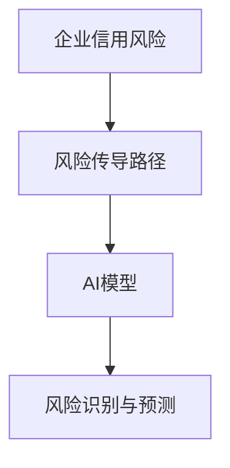
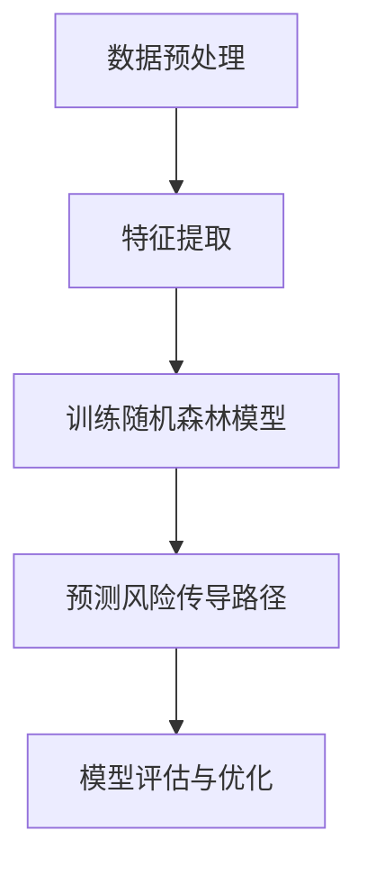
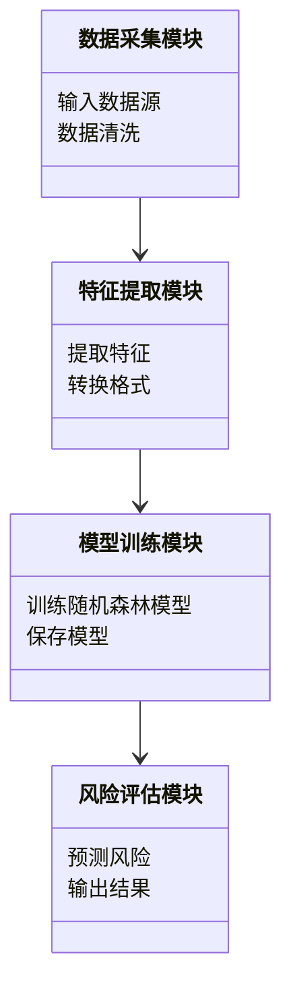
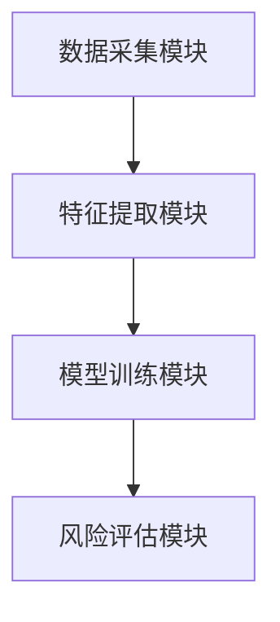

                 


# AI驱动的企业信用风险传导路径识别系统

> 关键词：AI驱动、企业信用风险、风险传导路径、机器学习、系统架构、项目实战

> 摘要：本文详细探讨了基于人工智能的企业信用风险传导路径识别系统的设计与实现。从问题背景出发，分析了传统方法的局限性，提出了一种结合机器学习算法的风险识别方案，并通过系统架构设计和项目实战验证了该方案的有效性。

---

## 第1章：企业信用风险传导路径识别的背景与挑战

### 1.1 企业信用风险的定义与重要性

#### 1.1.1 企业信用风险的定义
企业信用风险是指企业在经营过程中，由于外部环境或内部管理因素的变化，导致其无法履行债务或履行能力下降而给相关利益方带来损失的可能性。信用风险是企业经营中的核心风险之一，直接影响企业的生存与发展。

#### 1.1.2 信用风险在企业经营中的重要性
信用风险不仅影响企业的财务健康，还可能导致供应链中断、合作伙伴信任度下降等问题。在现代经济体系中，企业信用风险的管理能力是衡量企业综合实力的重要指标。

#### 1.1.3 信用风险传导的定义与特点
信用风险传导是指信用风险从一个企业或行业向其他企业或行业扩散的过程。其特点是具有传染性、不对称性和不确定性。

---

### 1.2 传统信用风险识别的局限性

#### 1.2.1 传统信用风险识别方法的不足
传统方法主要依赖财务报表分析和专家经验，存在主观性强、数据维度有限、计算复杂度高等问题。此外，传统方法难以捕捉非结构化数据中的潜在风险信号。

#### 1.2.2 数据获取与处理的挑战
传统方法依赖于有限的财务数据，而现代企业运营中产生的海量非结构化数据（如社交媒体、供应链信息）未能被有效利用。数据的多样性和复杂性增加了风险识别的难度。

#### 1.2.3 传统模型在风险传导路径识别中的局限性
传统统计模型（如线性回归）在处理高维数据和非线性关系时表现不佳，难以识别复杂的传导路径。

---

### 1.3 AI驱动的风险识别的优势

#### 1.3.1 AI技术在信用风险识别中的应用潜力
人工智能技术（如机器学习、自然语言处理）能够从海量数据中提取特征，发现潜在风险信号，提高风险识别的准确性和效率。

#### 1.3.2 数据驱动与模型驱动的优势结合
AI技术能够结合结构化数据和非结构化数据，构建多层次、多维度的风险评估模型，从而更全面地识别风险传导路径。

#### 1.3.3 实时监控与动态调整的可能性
AI技术支持实时数据处理和动态模型更新，能够快速响应市场变化，实现对信用风险的实时监控和动态调整。

---

## 第2章：AI驱动的风险传导路径识别的核心概念

### 2.1 核心概念的定义与属性

#### 2.1.1 企业信用风险的核心要素
| 要素 | 定义 | 属性 |
|------|------|------|
| 财务状况 | 企业的财务健康状况 | 资产负债率、利润率、现金流 |
| 供应链风险 | 供应链中的潜在风险 | 供应商稳定性、物流效率 |
| 市场风险 | 市场波动带来的风险 | 行业周期、政策变化 |
| 管理风险 | 高管决策带来的风险 | 高管团队稳定性、战略清晰度 |

#### 2.1.2 风险传导路径的构成要素
| 要素 | 定义 | 示例 |
|------|------|------|
| 起始点 | 风险的来源 | 供应链中断 |
| 中间路径 | 风险传导的媒介 | 供应商违约影响下游企业 |
| 终点 | 风险的影响范围 | 整个行业或特定企业 |

#### 2.1.3 AI模型在风险识别中的角色
AI模型通过学习历史数据，识别潜在的信用风险模式，并预测未来风险传导路径。

---

### 2.2 核心概念之间的关系

#### 2.2.1 企业信用风险与风险传导路径的关系
企业信用风险是风险传导路径的起点，而风险传导路径则描述了风险如何在企业间扩散。

#### 2.2.2 风险传导路径与AI模型的关联
AI模型通过分析风险传导路径，识别潜在的风险信号，并预测风险的扩散范围和速度。

#### 2.2.3 Mermaid图：核心概念关系图



---

## 第3章：AI驱动的风险传导路径识别的算法原理

### 3.1 基于机器学习的风险识别算法

#### 3.1.1 机器学习算法的选择
常用的算法包括随机森林、支持向量机（SVM）、神经网络等。本文采用随机森林算法，因其对特征工程的依赖较低，适合处理高维数据。

#### 3.1.2 算法原理的数学模型
随机森林算法通过构建多个决策树，并对结果进行投票或平均，提高模型的准确性和鲁棒性。

#### 3.1.3 算法流程的Mermaid图



#### 3.1.4 代码实现示例

```python
import pandas as pd
from sklearn.ensemble import RandomForestClassifier
from sklearn.model_selection import train_test_split
from sklearn.metrics import accuracy_score

# 数据加载与预处理
data = pd.read_csv('credit_risk.csv')
X = data.drop('target', axis=1)
y = data['target']

# 数据分割
X_train, X_test, y_train, y_test = train_test_split(X, y, test_size=0.2, random_state=42)

# 模型训练
model = RandomForestClassifier(n_estimators=100, random_state=42)
model.fit(X_train, y_train)

# 模型预测
y_pred = model.predict(X_test)
print("Accuracy:", accuracy_score(y_test, y_pred))
```

#### 3.1.5 算法优势与局限性
优势：随机森林算法具有较强的抗过拟合能力，适合处理高维数据。局限性：模型解释性较差，难以深入理解风险传导的具体路径。

---

## 第4章：系统分析与架构设计

### 4.1 问题场景介绍

#### 4.1.1 企业信用风险传导路径识别系统的目标
系统旨在通过AI技术，识别企业信用风险的传导路径，帮助企业提前预警和应对潜在风险。

#### 4.1.2 系统功能需求
- 数据采集与处理
- 风险评估与预测
- 风险传导路径分析
- 实时监控与预警

---

### 4.2 系统架构设计

#### 4.2.1 领域模型设计
Mermaid类图展示了系统的主要组件及其关系。



#### 4.2.2 系统架构设计
系统采用微服务架构，分为数据采集、特征提取、模型训练和风险评估四个模块。



#### 4.2.3 接口与交互设计
系统通过API接口实现模块之间的数据交互。

---

## 第5章：项目实战

### 5.1 环境安装与配置

#### 5.1.1 Python环境安装
安装Python 3.8以上版本，并安装以下库：
- pandas
- scikit-learn
- mermaid
- matplotlib

#### 5.1.2 数据集准备
准备企业信用数据集，包括企业财务数据、供应链信息、市场数据等。

---

### 5.2 核心功能实现

#### 5.2.1 数据采集与预处理
编写代码实现数据清洗和特征提取。

```python
import pandas as pd

# 数据加载
data = pd.read_csv('credit_risk.csv')

# 数据清洗
data = data.dropna()
data = pd.get_dummies(data)
```

#### 5.2.2 模型训练与预测
使用随机森林模型训练并预测风险。

```python
from sklearn.ensemble import RandomForestClassifier

# 模型训练
model = RandomForestClassifier()
model.fit(X_train, y_train)

# 模型预测
y_pred = model.predict(X_test)
```

---

### 5.3 代码解读与分析

#### 5.3.1 数据预处理代码解读
```python
data = pd.read_csv('credit_risk.csv')
data = data.dropna()
data = pd.get_dummies(data)
```
代码功能：加载数据，去除缺失值，将分类变量转换为虚拟变量。

#### 5.3.2 模型训练代码解读
```python
model = RandomForestClassifier()
model.fit(X_train, y_train)
```
代码功能：构建随机森林模型并进行训练。

---

### 5.4 实际案例分析

#### 5.4.1 案例背景
某制造企业因供应链中断导致原材料短缺，影响了多个下游企业的生产。

#### 5.4.2 数据分析与预测
通过模型预测，识别出风险传导路径为：供应链中断→原材料短缺→生产停滞→收入下降→信用评级下降。

---

## 第6章：总结与展望

### 6.1 系统特点与优势

#### 6.1.1 系统特点
- 数据驱动与模型驱动结合
- 实时监控与动态调整
- 高度可扩展性

#### 6.1.2 系统优势
- 提高风险识别的准确性和效率
- 降低企业信用风险的传染性

---

### 6.2 改进建议与未来展望

#### 6.2.1 系统优化方向
- 引入更复杂的模型（如深度学习模型）
- 提升数据采集的实时性
- 增强模型的可解释性

#### 6.2.2 未来展望
随着AI技术的不断发展，企业信用风险传导路径识别系统将更加智能化和精准化，为企业风险管理提供更有力的支持。

---

## 结语

本文详细探讨了AI驱动的企业信用风险传导路径识别系统的设计与实现。通过结合机器学习算法和系统架构设计，提出了一种高效的风险识别方案，并通过项目实战验证了该方案的有效性。未来，随着技术的进步，该系统将为企业信用风险管理提供更强大的支持。

---

## 作者

作者：AI天才研究院/AI Genius Institute & 禅与计算机程序设计艺术/Zen And The Art of Computer Programming

