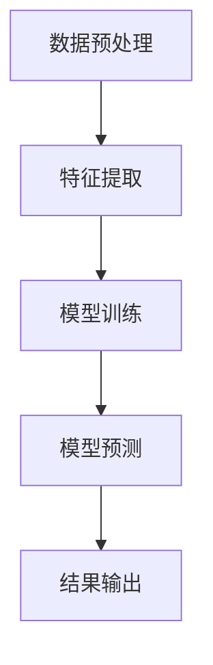
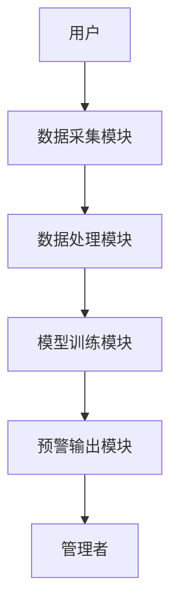
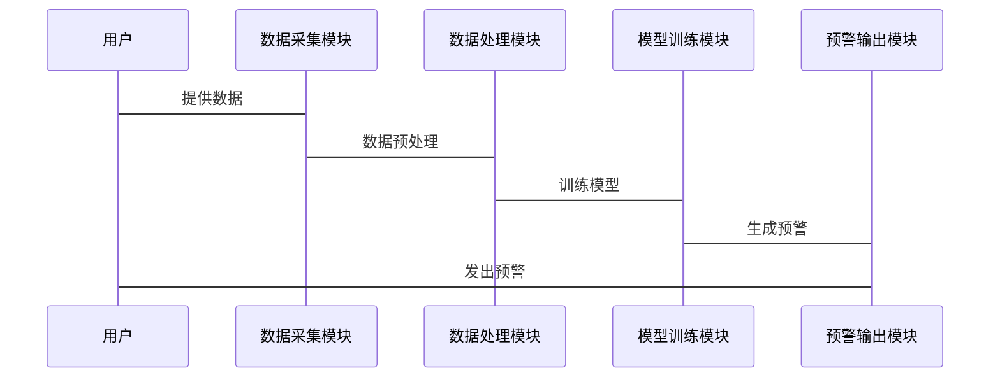

                 


# AI驱动的企业信用风险早期预警系统

## 关键词：
- 人工智能、信用风险、早期预警、机器学习、金融系统

## 摘要：
本文深入探讨了利用人工智能技术构建企业信用风险早期预警系统的方法。通过结合传统金融分析与现代AI算法，提出了一套高效、准确的预警机制，帮助企业提前识别和规避信用风险。文章从系统背景、核心概念、算法原理、系统设计到项目实战，全面解析了构建该系统的关键步骤，为金融从业者和IT技术人员提供了实用的指导和参考。

---

# 第1章: 企业信用风险早期预警系统背景

## 1.1 信用风险的定义与重要性

### 1.1.1 信用风险的基本概念
信用风险是指企业或个人在信用交易中未能履行其债务责任，导致债权人遭受损失的风险。在企业层面，信用风险主要体现在企业未能按时偿还贷款、违约支付账款等情况。

### 1.1.2 信用风险对企业的影响
信用风险不仅影响企业的财务健康，还可能导致供应链中断、合作伙伴关系破裂，甚至引发企业信用评级下降，进而影响融资成本和市场信心。

### 1.1.3 早期预警的重要性
早期预警系统能够通过实时监控和分析企业的经营数据，及时识别潜在的信用风险，为企业管理者提供决策支持，从而将风险损失降到最低。

## 1.2 AI在信用风险预警中的应用背景

### 1.2.1 AI技术的发展与应用
人工智能技术近年来取得了显著进展，尤其在数据处理、模式识别和预测分析方面表现突出。AI技术能够处理海量数据，发现传统方法难以察觉的潜在风险。

### 1.2.2 传统信用风险评估的局限性
传统的信用风险评估方法依赖于财务报表分析和人工判断，存在主观性强、效率低、覆盖面窄等问题，难以应对复杂多变的市场环境。

### 1.2.3 AI驱动信用风险预警的优势
AI技术能够快速处理多源异构数据，利用机器学习算法挖掘潜在风险信号，实现对信用风险的实时监控和精准预警。

## 1.3 本书的核心目标与内容框架

### 1.3.1 本书的核心目标
本书旨在探讨如何利用人工智能技术构建企业信用风险早期预警系统，通过理论分析和实践案例，为企业信用风险管理提供新的思路和方法。

### 1.3.2 本书的主要内容框架
- 章节1：介绍信用风险的基本概念和早期预警的重要性。
- 章节2：讲解信用风险预警系统的核心概念和组成部分。
- 章节3：分析常用的AI算法及其在信用风险预警中的应用。
- 章节4：设计信用风险预警系统的整体架构。
- 章节5：通过实际案例展示系统开发过程。
- 章节6：总结经验，提出最佳实践建议。

### 1.3.3 本书的读者群体
本书适合金融行业的从业者、企业风险管理相关人员、IT技术人员以及对信用风险管理和人工智能技术感兴趣的读者。

---

# 第2章: 企业信用风险早期预警系统的核心概念

## 2.1 信用风险预警系统的定义与特点

### 2.1.1 系统的定义
信用风险预警系统是一种利用大数据和人工智能技术，对企业经营数据进行实时监控和分析，提前识别潜在信用风险的系统。

### 2.1.2 系统的核心特点
- **实时性**：能够实时采集和处理企业经营数据。
- **准确性**：通过机器学习算法提高风险识别的准确性。
- **可扩展性**：支持多企业、多维度的数据分析。

### 2.1.3 系统的边界与外延
系统的边界包括数据来源（企业财务数据、市场数据等）、处理流程（数据清洗、特征提取、模型训练）和输出结果（预警信号、风险等级）。外延则涉及系统的应用范围和用户群体。

## 2.2 核心概念与联系

### 2.2.1 信用风险预警的核心要素
- 数据来源：企业财务报表、市场动态、行业趋势。
- 风险指标：如企业偿债能力、盈利能力、运营能力等。
- 预警信号：如现金流异常、应收账款增加、负债率上升。

### 2.2.2 系统模块之间的关系
- 数据采集模块：负责收集企业相关信息。
- 数据处理模块：对数据进行清洗和预处理。
- 模型训练模块：利用机器学习算法构建风险预测模型。
- 预警输出模块：生成风险预警信号并通知相关人员。

### 2.2.3 ER实体关系图

```mermaid
erDiagram
    actor 企业
    actor 数据源
    actor 预警系统
    actor 管理者
    企业 --> 数据源: 提供数据
    数据源 --> 预警系统: 数据处理
    预警系统 --> 管理者: 发出预警
```

---

# 第3章: AI驱动信用风险预警系统的算法原理

## 3.1 常见的信用风险评估算法

### 3.1.1 逻辑回归模型
逻辑回归是一种常用的分类算法，适用于二分类问题。在信用风险评估中，可以用来预测企业违约的概率。

### 3.1.2 支持向量机
支持向量机（SVM）是一种监督学习算法，适用于高维数据的分类问题。在信用风险评估中，可以用来区分违约企业和非违约企业。

### 3.1.3 随机森林
随机森林是一种基于决策树的集成学习算法，具有高准确性和抗过拟合能力。在信用风险评估中，可以用来识别重要的风险特征。

### 3.1.4 神经网络
神经网络是一种仿生学算法，能够处理复杂的非线性关系。在信用风险评估中，可以用来建模复杂的市场动态和企业行为。

## 3.2 基于机器学习的信用风险预警算法

### 3.2.1 算法原理
以逻辑回归为例，其核心思想是通过logit函数将输入特征映射到0-1区间，表示企业违约的概率。

### 3.2.2 算法流程图



## 3.3 算法实现的数学模型

### 3.3.1 逻辑回归模型
$$ P(y=1|x) = \frac{1}{1 + e^{-\beta x}} $$

### 3.3.2 随机森林模型
随机森林通过构建多棵决策树，并行投票的方式进行分类或回归。

### 3.3.3 神经网络模型
神经网络由输入层、隐藏层和输出层组成，通过反向传播算法进行参数优化。

## 3.4 算法实现的Python代码示例

### 3.4.1 数据预处理
```python
import pandas as pd
from sklearn.preprocessing import StandardScaler

# 读取数据
data = pd.read_csv('credit_risk.csv')

# 分离特征和标签
X = data.drop('default', axis=1)
y = data['default']

# 标准化处理
scaler = StandardScaler()
X_scaled = scaler.fit_transform(X)
```

### 3.4.2 模型训练
```python
from sklearn.linear_model import LogisticRegression
from sklearn.metrics import accuracy_score

# 训练模型
model = LogisticRegression()
model.fit(X_scaled, y)

# 预测结果
y_pred = model.predict(X_scaled)
print('准确率:', accuracy_score(y, y_pred))
```

---

# 第4章: 系统分析与架构设计

## 4.1 项目背景与需求分析

### 4.1.1 项目背景
随着企业数量的增加和市场环境的复杂化，传统的信用风险管理方法已无法满足需求，亟需引入智能化的解决方案。

### 4.1.2 项目目标
构建一个基于AI的企业信用风险早期预警系统，实现对企业信用风险的实时监控和精准预警。

## 4.2 系统功能设计

### 4.2.1 数据采集模块
- 从企业财务报表、市场数据等多源数据中采集相关信息。
- 使用数据清洗技术处理缺失值和异常值。

### 4.2.2 数据处理模块
- 对数据进行标准化和特征提取。
- 利用机器学习算法构建风险预测模型。

### 4.2.3 预警输出模块
- 根据模型预测结果生成风险预警信号。
- 通过可视化界面向管理者展示预警信息。

## 4.3 系统架构设计

### 4.3.1 系统架构图



### 4.3.2 系统接口设计
- 数据接口：与企业数据源对接，获取实时数据。
- 预警接口：向管理者发送预警信号。

### 4.3.3 系统交互流程



---

# 第5章: 项目实战

## 5.1 环境安装与配置

### 5.1.1 安装Python环境
使用Anaconda安装Python 3.8及以上版本。

### 5.1.2 安装相关库
安装pandas、scikit-learn、matplotlib等库。

## 5.2 系统核心实现

### 5.2.1 数据预处理
```python
import pandas as pd
from sklearn.model_selection import train_test_split

# 读取数据
data = pd.read_csv('credit_risk.csv')

# 分离特征和标签
X = data.drop('default', axis=1)
y = data['default']

# 划分训练集和测试集
X_train, X_test, y_train, y_test = train_test_split(X, y, test_size=0.2)
```

### 5.2.2 模型训练与优化
```python
from sklearn.ensemble import RandomForestClassifier
from sklearn.metrics import classification_report

# 训练模型
model = RandomForestClassifier()
model.fit(X_train, y_train)

# 模型预测
y_pred = model.predict(X_test)
print(classification_report(y_test, y_pred))
```

## 5.3 案例分析与解读

### 5.3.1 案例背景
某制造企业由于原材料价格上涨导致成本增加，现金流出现紧张，存在较高的违约风险。

### 5.3.2 数据分析
通过模型预测，该企业的违约概率为75%，属于高风险类别。

## 5.4 项目总结与优化

### 5.4.1 项目总结
通过本项目，我们成功构建了一个基于AI的企业信用风险预警系统，能够准确识别潜在风险，为企业管理者提供决策支持。

### 5.4.2 优化方向
进一步优化算法性能，引入实时数据流处理，提升系统的实时性和准确性。

---

# 第6章: 最佳实践与总结

## 6.1 本章小结
通过本书的学习，读者能够掌握构建企业信用风险早期预警系统的核心方法，了解AI技术在信用风险管理中的应用。

## 6.2 注意事项
在实际应用中，需注意数据隐私保护和模型的可解释性问题，确保系统的合规性和透明性。

## 6.3 拓展阅读
推荐阅读《机器学习实战》和《金融风险管理》等书籍，深入学习AI技术在金融领域的应用。

---

# 作者信息

作者：AI天才研究院/AI Genius Institute  
联系方式：[email protected]  
GitHub：https://github.com/ai-genius-institute  
地址：北京市海淀区中关村街道

