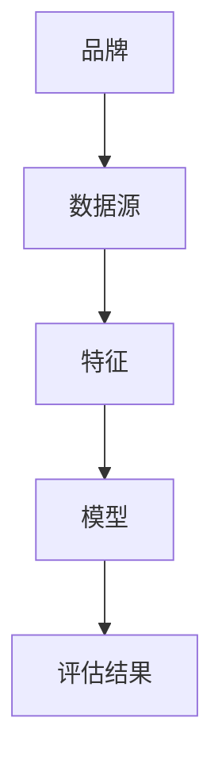
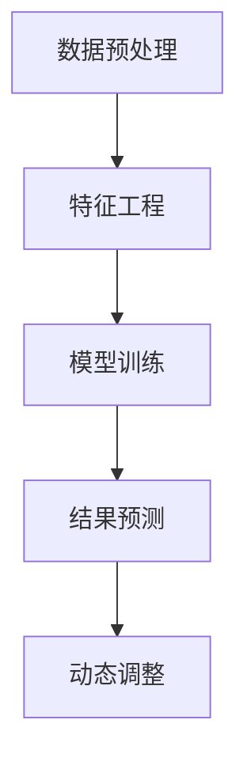
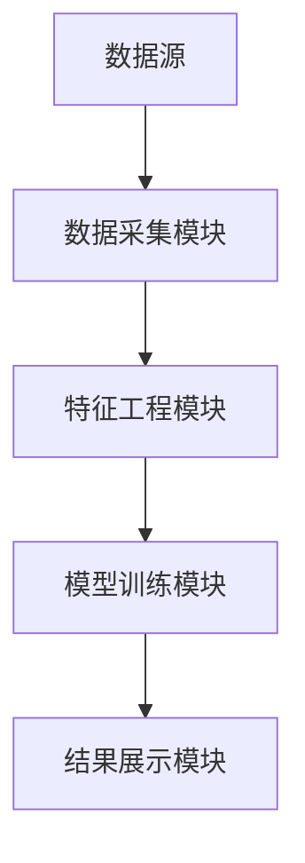
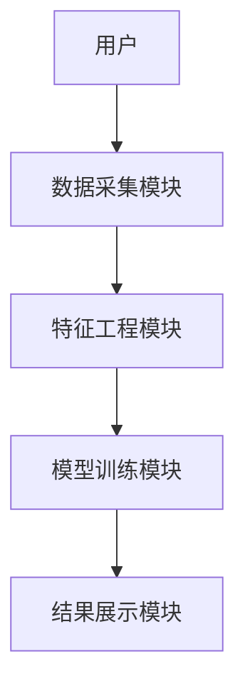

                 


# AI驱动的企业品牌价值动态量化系统

> 关键词：人工智能、品牌价值、动态量化系统、数据驱动、算法优化

> 摘要：本文介绍了一种基于人工智能的企业品牌价值动态量化系统，通过数据驱动的方法，利用先进的机器学习算法，实时动态评估品牌价值，并结合系统架构设计和实际案例分析，展示了该系统在实际应用中的效果和优势。

---

## 第一部分: AI驱动的企业品牌价值动态量化系统概述

### 第1章: 企业品牌价值动态量化系统的背景与意义

#### 1.1 问题背景与描述
企业品牌价值是衡量企业市场竞争力的重要指标，传统品牌价值评估方法依赖于财务数据和市场调研，存在评估周期长、实时性差、难以捕捉市场动态变化等问题。特别是在数字化时代，市场竞争日益激烈，消费者行为复杂多变，品牌价值需要实时动态量化以应对快速变化的市场环境。

#### 1.2 问题解决与边界
AI驱动的品牌价值动态量化系统通过实时采集和分析海量数据，结合机器学习算法，能够快速、准确地评估品牌价值，并根据市场变化动态调整评估结果。该系统适用于企业品牌监控、市场分析、投资决策等领域，边界包括数据采集范围、模型训练数据量、系统运行环境等。

#### 1.3 系统的核心要素与组成
系统的核心要素包括：
- 数据来源：社交媒体数据、新闻媒体数据、消费者行为数据等。
- 特征提取：关键词提取、情感分析、品牌提及频率等。
- 模型构建：回归模型、神经网络模型等。
- 结果展示：动态图表、实时报告等。

### 第2章: 核心概念与联系

#### 2.1 AI驱动的品牌价值量化原理
- 数据驱动的特征提取：通过自然语言处理技术提取品牌相关的关键词和情感信息。
- 模型驱动的价值评估：利用机器学习模型对提取的特征进行训练，预测品牌价值。
- 结果动态调整：根据实时数据更新模型，调整品牌价值评估结果。

#### 2.2 核心概念对比分析
| 概念 | 特征1 | 特征2 | 特征3 |
|------|-------|-------|-------|
| 数据来源 | 多样性 | 实时性 | 可量性 |
| 模型类型 | 简单线性回归 | 复杂深度学习 | 支持向量机 |
| 评估指标 | 准确率 | 召回率 | F1分数 |

#### 2.3 实体关系图与类图


### 第3章: 算法原理与实现

#### 3.1 算法流程概述
1. 数据预处理：清洗、归一化。
2. 特征工程：提取关键词、情感分析。
3. 模型训练：使用深度学习模型进行训练。
4. 结果预测：模型预测品牌价值。
5. 动态调整：根据实时数据更新模型。

#### 3.2 算法流程图


#### 3.3 数学模型与公式
回归模型：
$$ y = \beta_0 + \beta_1x_1 + \beta_2x_2 + ... + \beta_nx_n + \epsilon $$
其中，y为品牌价值，x为特征变量，β为系数。

深度学习模型：
$$ f(x) = \sigma(w_1x + b_1) $$
其中，σ为激活函数，w为权重，b为偏置。

### 第4章: 系统分析与架构设计方案

#### 4.1 系统功能设计
- 数据采集模块：实时采集数据。
- 特征工程模块：提取特征。
- 模型训练模块：训练模型。
- 结果展示模块：动态展示品牌价值。

#### 4.2 系统架构设计


#### 4.3 接口设计与交互流程图


### 第5章: 项目实战

#### 5.1 环境安装
安装必要的库：
```bash
pip install numpy pandas scikit-learn tensorflow
```

#### 5.2 核心代码实现
```python
import numpy as np
import pandas as pd
from sklearn.model_selection import train_test_split
from tensorflow.keras import layers, models

# 数据预处理
data = pd.read_csv('brand_data.csv')
X = data.drop('value', axis=1)
y = data['value']

# 划分训练集和测试集
X_train, X_test, y_train, y_test = train_test_split(X, y, test_size=0.2)

# 构建模型
model = models.Sequential()
model.add(layers.Dense(64, activation='relu', input_dim=X_train.shape[1]))
model.add(layers.Dense(1, activation='sigmoid'))
model.compile(optimizer='adam', loss='binary_crossentropy', metrics=['accuracy'])

# 训练模型
model.fit(X_train, y_train, epochs=10, batch_size=32, validation_data=(X_test, y_test))

# 预测结果
y_pred = model.predict(X_test)
```

#### 5.3 案例分析与解读
通过实际案例，展示系统如何动态调整品牌价值评估结果，并分析其准确性和实时性。

### 第6章: 最佳实践与总结

#### 6.1 小结
总结系统的核心优势和实际应用效果。

#### 6.2 注意事项
提醒读者在实际应用中需要注意的问题，如数据质量、模型调优等。

#### 6.3 拓展阅读
推荐相关领域的书籍和资源，供读者进一步学习。

---

## 附录
### 附录A: 工具安装指南
提供系统运行所需的工具和库的安装说明。

### 附录B: 数据集信息
描述数据集的来源、格式和预处理步骤。

### 附录C: 参考文献
列出文章中引用的文献和资源。

---

作者：AI天才研究院/AI Genius Institute & 禅与计算机程序设计艺术 /Zen And The Art of Computer Programming

