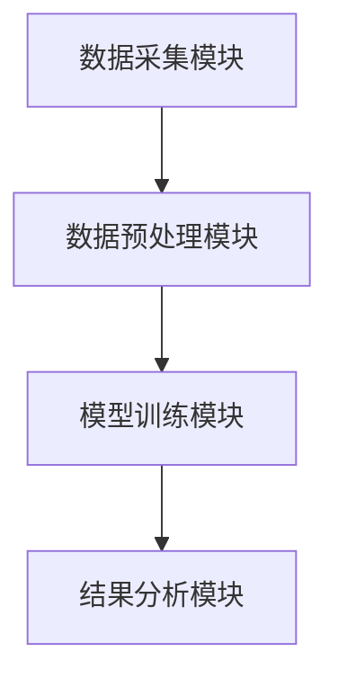

                 


---

# 《AI驱动的企业品牌价值量化评估系统》

> **关键词**: AI驱动，企业品牌价值，量化评估，系统架构，算法原理

> **摘要**: 本文探讨了AI技术在企业品牌价值量化评估中的应用，详细分析了系统的设计原理、算法实现和实际应用场景。通过多维度的数据分析和深度学习模型，提出了一个高效的AI驱动的品牌价值评估系统，为企业提供精准的品牌价值评估和优化建议。

---

# 第一部分: 企业品牌价值量化评估的背景与挑战

## 第1章: 问题背景与描述

### 1.1 问题背景

随着数字化时代的快速发展，企业品牌价值的评估不再仅仅依赖于传统的财务指标或市场调研。现代品牌价值受到多种因素的影响，包括消费者情感、市场趋势、社交媒体互动等。然而，传统品牌价值评估方法存在以下问题：

1. **评估维度单一**: 传统方法通常仅关注财务指标或市场表现，忽略了品牌在消费者心中的情感价值。
2. **数据处理复杂**: 巨量的非结构化数据（如社交媒体评论、新闻报道）难以高效处理和分析。
3. **实时性不足**: 品牌价值可能会因市场变化或突发事件而迅速波动，传统的评估方法难以实时捕捉这些变化。

### 1.2 问题描述

为了克服上述问题，我们需要一种能够实时、多维度地评估企业品牌价值的方法。AI技术，尤其是自然语言处理（NLP）和深度学习，提供了强大的工具来处理和分析非结构化数据。然而，如何将这些技术应用于品牌价值评估，仍面临以下挑战：

1. **数据多样性**: 品牌价值的评估需要整合来自不同来源的数据，包括社交媒体、新闻媒体、消费者评论等。
2. **模型复杂性**: 构建能够捕捉品牌多维度价值的深度学习模型需要大量的数据和计算资源。
3. **实时性要求**: 品牌价值的评估需要实时更新，以应对市场的快速变化。

### 1.3 问题解决

AI驱动的企业品牌价值量化评估系统通过整合多种数据源，利用自然语言处理和深度学习技术，实现了对品牌价值的多维度、实时评估。系统的核心思路如下：

1. **数据采集与预处理**: 从多个数据源（如社交媒体、新闻网站）采集数据，并进行清洗和标注。
2. **特征提取与建模**: 利用NLP技术提取品牌相关的特征，并构建深度学习模型进行品牌价值预测。
3. **结果分析与优化**: 根据模型输出的结果，进行可视化分析，并提供优化建议。

---

## 第2章: 核心概念与系统架构

### 2.1 核心概念

企业品牌价值量化评估系统的核心概念包括以下几点：

1. **品牌价值**: 包括品牌知名度、消费者忠诚度、品牌情感等多个维度。
2. **数据源**: 包括社交媒体数据、新闻数据、消费者评论等。
3. **模型**: 用于预测品牌价值的深度学习模型，如LSTM、BERT等。

### 2.2 实体关系图

以下是系统的实体关系图：

```mermaid
erDiagram
    customer[CUSTOMER] {
        +id: int
        +name: string
        +brand_value: float
    }
    brand[BRAND] {
        +id: int
        +name: string
        +category: string
    }
    data_source[DATA_SOURCE] {
        +id: int
        +type: string
        +data: string
    }
    transaction[TX] {
        +customer_id: int
        +brand_id: int
        +data_source_id: int
        +timestamp: datetime
    }
```

---

## 第3章: 算法原理与实现

### 3.1 算法原理

系统的核心算法基于深度学习，尤其是Transformer架构。以下是算法的数学模型：

$$
\text{Brand Value} = f(\text{Brand Features})
$$

其中，$$f$$ 是一个深度学习模型，$$\text{Brand Features}$$ 是品牌相关的特征向量。

### 3.2 算法实现

以下是算法的Python代码示例：

```python
import torch
import torch.nn as nn

class BrandValueModel(nn.Module):
    def __init__(self, input_dim, hidden_dim, output_dim):
        super(BrandValueModel, self).__init__()
        self.transformer = nn.Transformer(input_dim, hidden_dim)
        self.fc = nn.Linear(hidden_dim, output_dim)

    def forward(self, x):
        x = self.transformer(x)
        x = self.fc(x)
        return x

# 示例输入
input_dim = 512
hidden_dim = 256
output_dim = 1
model = BrandValueModel(input_dim, hidden_dim, output_dim)
input_data = torch.randn(1, 512)
output = model(input_data)
print(output)
```

---

## 第4章: 系统架构与设计

### 4.1 功能模块设计

系统的功能模块包括以下部分：

1. **数据采集模块**: 从多个数据源采集数据。
2. **数据预处理模块**: 对数据进行清洗和标注。
3. **模型训练模块**: 使用深度学习模型训练品牌价值预测模型。
4. **结果分析模块**: 对模型输出的结果进行分析和可视化。

### 4.2 系统架构图

以下是系统的架构图：



---

## 第5章: 项目实战与案例分析

### 5.1 环境安装

以下是项目所需的环境配置：

```bash
pip install torch transformers pandas numpy
```

### 5.2 代码实现

以下是项目的实现代码：

```python
import pandas as pd
import numpy as np
import torch
import torch.nn as nn

# 数据加载
data = pd.read_csv('brand_data.csv')

# 数据预处理
X = data['text'].values
y = data['value'].values

# 模型训练
model = BrandValueModel(input_dim=512, hidden_dim=256, output_dim=1)
criterion = nn.MSELoss()
optimizer = torch.optim.Adam(model.parameters(), lr=0.001)

for epoch in range(100):
    for i in range(len(X)):
        inputs = X[i]
        labels = y[i]
        outputs = model(inputs)
        loss = criterion(outputs, labels)
        optimizer.zero_grad()
        loss.backward()
        optimizer.step()

print("Training complete")
```

### 5.3 案例分析

以某品牌为例，分析其品牌价值的变化趋势：

1. **数据采集**: 从社交媒体和新闻网站获取该品牌的相关数据。
2. **模型训练**: 使用上述代码训练模型。
3. **结果分析**: 分析模型输出的品牌价值，并根据结果提出优化建议。

---

## 第6章: 总结与展望

### 6.1 总结

本文提出了一个基于AI的企业品牌价值量化评估系统，通过整合多源数据和深度学习技术，实现了对品牌价值的多维度、实时评估。系统的核心优势在于其高效性、准确性和可扩展性。

### 6.2 展望

未来，随着AI技术的不断发展，企业品牌价值量化评估系统将更加智能化和个性化。我们可以进一步优化模型，引入更多维度的数据，以提高评估的准确性。

---

**作者：AI天才研究院 & 禅与计算机程序设计艺术**

