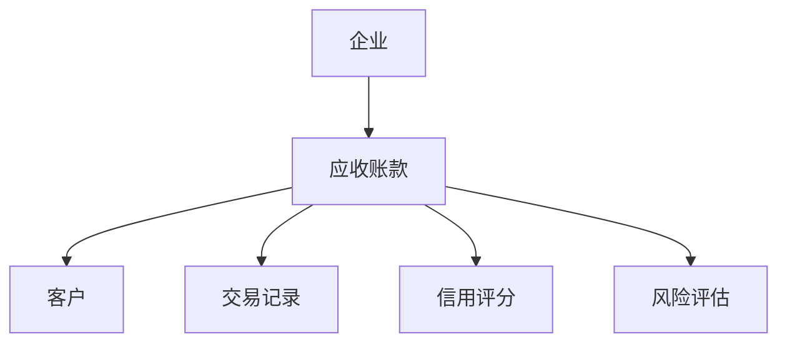
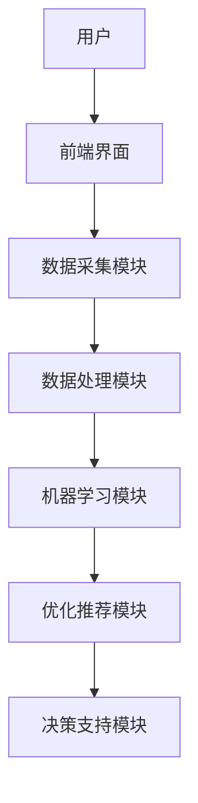
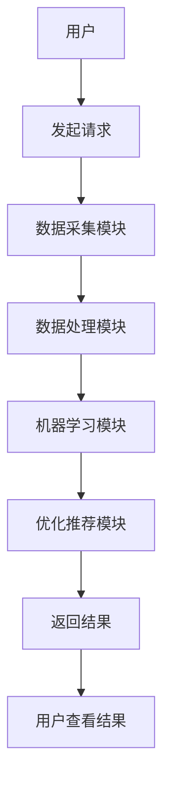

                 


# AI驱动的企业应收账款组合优化管理系统

> 关键词：企业应收账款、组合优化、人工智能、机器学习、财务管理系统、智能决策支持

> 摘要：本文系统地探讨了如何利用人工智能技术优化企业的应收账款组合管理。从问题背景到核心概念，从算法原理到系统架构设计，再到项目实战和总结，本文详细阐述了AI在企业应收账款优化中的应用，为企业的财务管理提供了新的思路和解决方案。

## 第一部分：背景介绍

### # 第1章：问题背景

#### 1.1 企业应收账款管理的核心问题

在企业的日常运营中，应收账款管理是财务管理工作的重要组成部分。企业通过赊销方式获得销售机会的同时，也面临着应收账款回收的风险。如何在众多客户中选择最优的应收账款组合，以实现企业资金的高效运转和风险控制，是一个复杂的优化问题。

#### 1.2 问题描述

传统的应收账款管理主要依赖于人工经验判断，这种方式存在效率低、主观性强、风险高的问题。随着企业规模的扩大和业务复杂度的增加，传统的管理方式已经无法满足现代企业的需求。企业需要一种更加科学、高效、智能化的管理方法来优化应收账款组合，提升资金周转效率，降低坏账风险。

#### 1.3 AI技术在财务管理中的应用潜力

人工智能（AI）技术在财务管理中的应用潜力巨大。通过机器学习、深度学习等技术，企业可以利用历史数据和实时数据，建立预测模型，实现智能化的决策支持。AI不仅可以提高应收账款管理的效率，还可以通过数据分析发现潜在风险，为企业提供个性化的优化建议。

### # 第2章：核心概念与联系

#### 2.1 AI驱动的应收账款优化原理

AI驱动的应收账款优化管理通过机器学习算法，对客户的信用风险、还款能力等进行预测和评估，从而实现应收账款组合的优化。通过分析客户的交易记录、财务状况、市场环境等因素，AI系统能够提供更加精准的优化方案。

#### 2.2 核心概念原理

1. **数据预处理与特征提取**  
   数据预处理是AI优化的基础，主要包括数据清洗、数据转换和特征提取。通过特征提取，可以从原始数据中提取出与应收账款优化相关的特征，例如客户的信用评分、交易金额、还款历史等。

2. **模型训练与优化算法**  
   在模型训练阶段，使用机器学习算法（如随机森林、支持向量机等）对特征数据进行训练，建立信用风险预测模型。优化算法（如遗传算法、模拟退火等）用于在多个优化方案中选择最优解。

3. **结果解释与反馈机制**  
   模型的输出结果需要进行解释和反馈，以便企业能够理解AI的建议并进行调整。反馈机制可以进一步优化模型，提升预测的准确性。

#### 2.3 概念属性特征对比表

| **概念**         | **特征**                     | **适用场景**                          |
|------------------|------------------------------|---------------------------------------|
| 机器学习算法     | 数据驱动、高准确性            | 预测客户信用风险                     |
| 深度学习算法     | 多层网络结构、复杂模式识别    | 图像识别、自然语言处理               |
| 强化学习算法     | 奖励机制、实时决策            | 自动化交易、游戏AI                   |
| 群智计算         | 分布式计算、群体智慧           | 大规模数据处理、分布式系统           |

#### 2.4 ER实体关系图



## 第三部分：算法原理讲解

### # 第3章：算法选择与实现

#### 3.1 算法流程

1. **数据预处理**  
   对原始数据进行清洗，处理缺失值、异常值等，确保数据的完整性和准确性。

2. **特征提取**  
   从清洗后的数据中提取与应收账款优化相关的特征，例如客户的历史交易数据、信用评分、还款记录等。

3. **模型训练**  
   使用机器学习算法（如随机森林）对特征数据进行训练，建立信用风险预测模型。

4. **结果优化**  
   通过优化算法对多个应收账款组合方案进行优化，选择最优的组合。

#### 3.2 算法实现的步骤

1. **数据输入**  
   从数据库中读取客户的交易记录、信用评分等数据。

2. **数据清洗**  
   处理缺失值、重复值和异常值，确保数据质量。

3. **特征提取**  
   从数据中提取关键特征，例如交易金额、还款频率、信用评分等。

4. **模型训练**  
   使用随机森林算法对特征数据进行训练，建立信用风险预测模型。

5. **模型优化**  
   使用遗传算法对多个优化方案进行优化，选择最优的应收账款组合。

#### 3.3 算法优化的策略

1. **参数调整**  
   调整随机森林的超参数（如树的数量、树的深度等），提升模型的预测准确率。

2. **集成学习**  
   使用集成学习方法（如投票法、堆叠法）进一步提升模型的性能。

3. **实时更新**  
   定期更新模型，引入新的数据，保持模型的准确性。

### # 第4章：数学模型与公式

#### 4.1 损失函数

在机器学习中，损失函数用于衡量模型预测值与真实值之间的差异。常用的损失函数包括均方误差（MSE）和交叉熵损失。

1. **均方误差（MSE）**  
   $$\text{MSE} = \frac{1}{n}\sum_{i=1}^{n}(y_i - \hat{y}_i)^2$$

2. **交叉熵损失**  
   $$\text{Cross Entropy} = -\frac{1}{n}\sum_{i=1}^{n}y_i\log(\hat{y}_i) + (1-y_i)\log(1-\hat{y}_i)$$

#### 4.2 优化算法

遗传算法是一种模拟生物进化过程的优化算法，主要包括选择、交叉和变异三个步骤。

1. **选择**  
   根据适应度函数选择优秀的个体。

2. **交叉**  
   将两个个体的基因进行交叉，生成新的个体。

3. **变异**  
   对新个体的基因进行随机变异，增加遗传多样性。

### # 第5章：系统架构设计

#### 5.1 系统功能设计

1. **数据采集**  
   从数据库中读取客户的交易记录、信用评分等数据。

2. **风险评估**  
   使用机器学习模型评估客户的信用风险。

3. **优化推荐**  
   根据优化算法推荐最优的应收账款组合。

4. **决策支持**  
   提供可视化的决策支持，帮助企业管理者做出决策。

#### 5.2 系统架构设计



#### 5.3 系统接口设计

1. **数据接口**  
   提供API接口，方便与其他系统（如ERP系统）进行数据交互。

2. **用户接口**  
   提供友好的用户界面，方便用户进行操作和查询。

#### 5.4 系统交互流程图



### # 第6章：项目实战

#### 6.1 环境安装

1. **安装Python**  
   下载并安装Python 3.8或更高版本。

2. **安装机器学习库**  
   使用pip安装scikit-learn、xgboost等机器学习库。

3. **安装数据处理工具**  
   安装pandas、numpy等数据处理工具。

#### 6.2 核心代码实现

1. **数据预处理**  
   ```python
   import pandas as pd
   import numpy as np

   # 读取数据
   data = pd.read_csv('customer_data.csv')

   # 数据清洗
   data = data.dropna()
   data = data[~data['credit_score'].isnull()]
   ```

2. **特征提取**  
   ```python
   # 提取特征
   features = data[['transaction_amount', 'payment_history', 'credit_score']]
   target = data['default_probability']
   ```

3. **模型训练**  
   ```python
   from sklearn.ensemble import RandomForestClassifier

   model = RandomForestClassifier(n_estimators=100, max_depth=4)
   model.fit(features, target)
   ```

4. **模型优化**  
   ```python
   from sklearn.model_selection import GridSearchCV

   param_grid = {'n_estimators': [50, 100, 150], 'max_depth': [2, 4, 6]}
   grid_search = GridSearchCV(model, param_grid, cv=5)
   grid_search.fit(features, target)
   ```

5. **结果优化**  
   ```python
   from sklearn.metrics import accuracy_score

   best_model = grid_search.best_estimator_
   best_accuracy = accuracy_score(best_model.predict(features), target)
   ```

#### 6.3 案例分析

以一个中型制造企业的应收账款管理为例，我们首先从数据库中读取客户的交易记录、信用评分等数据。通过数据预处理和特征提取，建立客户信用风险预测模型。通过随机森林算法训练模型，并使用遗传算法对多个优化方案进行优化，选择最优的应收账款组合。

### # 第7章：总结与扩展

#### 7.1 总结

通过AI技术优化企业的应收账款组合管理，可以提高企业的资金周转效率，降低坏账风险。本文详细阐述了AI驱动的应收账款优化管理系统的核心概念、算法原理、系统架构设计和项目实战，为企业提供了科学的优化方案。

#### 7.2 注意事项

在实际应用中，企业需要根据自身的业务特点和数据情况，选择合适的算法和优化策略。同时，还需要注意数据隐私和安全问题，确保系统的稳定性和可靠性。

#### 7.3 拓展阅读

1. **《机器学习实战》**  
   作者：周志华  
   内容简介：本书详细介绍了机器学习的基本概念、算法和应用，适合读者深入学习机器学习技术。

2. **《深度学习》**  
   作者：Ian Goodfellow  
   内容简介：本书系统地介绍了深度学习的基本原理、算法和应用，是深度学习领域的经典之作。

3. **《强化学习》**  
   作者：Richard S. Sutton, Andrew G. Barto  
   内容简介：本书详细介绍了强化学习的基本概念、算法和应用，适合读者深入学习强化学习技术。

#### 7.4 作者信息

作者：AI天才研究院/AI Genius Institute & 禅与计算机程序设计艺术 /Zen And The Art of Computer Programming

---

本文通过系统地介绍AI驱动的企业应收账款组合优化管理系统的背景、核心概念、算法原理、系统架构设计和项目实战，为企业的财务管理提供了新的思路和解决方案。通过本文的指导，读者可以更好地理解和应用AI技术，优化企业的应收账款管理，提升企业的竞争力。

