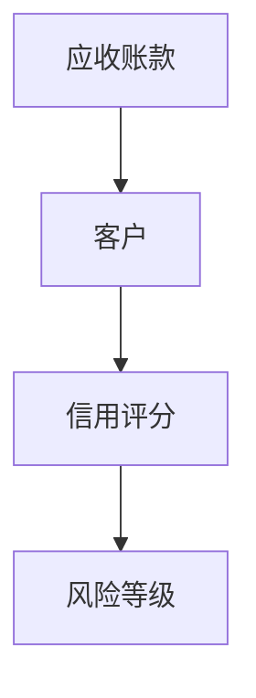
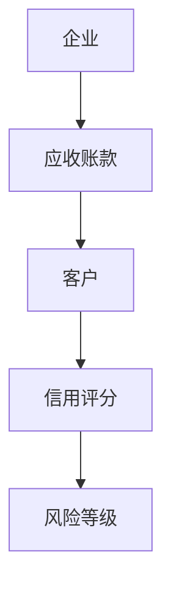
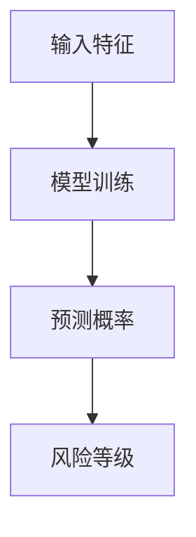
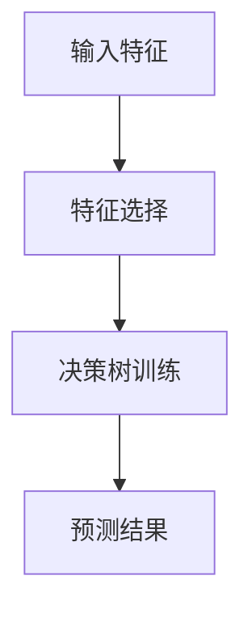
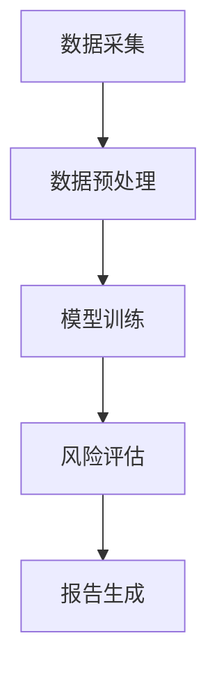
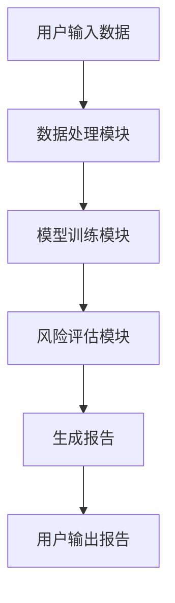

                 


# AI驱动的企业应收账款组合信用风险评估系统

## 关键词：AI技术、信用风险评估、企业应收账款、风险管理、机器学习、深度学习

## 摘要：本文详细探讨了利用人工智能技术驱动企业应收账款组合信用风险评估系统的构建与应用。通过分析传统信用风险评估的局限性，提出基于机器学习和深度学习的创新解决方案，构建了完整的系统架构，并通过实际案例展示了系统的有效性和优势，为企业的风险管理提供了新的思路。

---

# 第一部分: AI驱动的企业应收账款组合信用风险评估系统背景介绍

## 第1章: 应收账款组合信用风险评估概述

### 1.1 问题背景与描述

#### 1.1.1 企业应收账款管理的重要性
企业应收账款是企业日常运营中的重要组成部分，直接关系到企业的资金周转和财务健康。然而，应收账款的回收过程中常常伴随着信用风险，即客户未能按时还款的风险。传统的人工评估方法效率低、主观性强，难以应对复杂多变的市场环境。

#### 1.1.2 信用风险的定义与特征
信用风险是指由于交易对手的违约而导致的财务损失。在企业应收账款管理中，信用风险主要体现在客户付款延迟或无力偿还的情况。信用风险的特征包括不确定性、传染性、动态变化等。

#### 1.1.3 组合信用风险评估的必要性
传统的信用风险评估通常针对单个客户进行，而组合信用风险评估则考虑多个客户的整体风险敞口。在经济波动加剧的情况下，组合信用风险评估能够帮助企业更好地识别和管理潜在的系统性风险。

### 1.2 问题解决与边界

#### 1.2.1 传统信用风险评估的局限性
传统信用风险评估方法依赖于财务报表分析和人工判断，存在以下问题：
- 数据维度有限，难以捕捉客户的潜在风险。
- 评估结果主观性强，缺乏客观依据。
- 无法及时捕捉市场变化，导致评估滞后。

#### 1.2.2 AI驱动的解决方案优势
人工智能技术的引入，通过大数据分析和机器学习算法，能够显著提升信用风险评估的效率和准确性：
- 能够处理海量数据，提取更多的风险特征。
- 通过自动化模型训练，实现快速、精准的评估。
- 可以实时更新模型，适应市场变化。

#### 1.2.3 系统的边界与外延
本系统专注于企业应收账款组合的信用风险评估，边界包括：
- 输入数据：企业历史交易数据、客户信用记录、市场数据等。
- 输出结果：客户信用评分、风险等级、整体风险敞口。
- 外延：基于评估结果，提供风险管理建议和策略优化。

### 1.3 核心概念与结构

#### 1.3.1 核心要素组成
系统的核心要素包括：
- 数据采集与预处理：收集和清洗企业应收账款相关数据。
- 模型训练：构建机器学习和深度学习模型，进行风险评估。
- 风险报告：生成风险评估报告，提供管理建议。

#### 1.3.2 概念结构图


#### 1.3.3 系统功能模块概述
系统功能模块包括：
- 数据采集模块：负责数据的获取和预处理。
- 模型训练模块：构建和优化信用风险评估模型。
- 风险评估模块：输出客户的信用评分和风险等级。
- 报告生成模块：生成风险评估报告和管理建议。

---

## 第2章: 核心概念与联系

### 2.1 AI驱动的信用风险评估原理

#### 2.1.1 数据特征提取
数据特征提取是信用风险评估的基础，主要包括：
- 客户基本信息：行业、规模、成立时间等。
- 财务数据：收入、利润、资产负债率等。
- 交易数据：交易金额、账期、还款记录等。
- 市场数据：行业景气度、宏观经济指标等。

#### 2.1.2 模型选择与训练
模型选择与训练是系统的核心部分，包括：
- 机器学习模型：逻辑回归、随机森林、支持向量机等。
- 深度学习模型：神经网络、长短期记忆网络等。
- 模型评估：通过准确率、召回率、F1值等指标评估模型性能。

#### 2.1.3 风险评估指标
常用的信用风险评估指标包括：
- 概率违约模型（PD）：客户违约的概率。
- 违约损失率（LGD）：违约情况下损失的金额比例。
- 风险敞口（EAD）：客户可能违约的风险金额。

### 2.2 核心概念对比分析

#### 2.2.1 数据特征对比表格
| 特征类型       | 描述                         |
|----------------|------------------------------|
| 客户信息       | 行业、规模、成立时间等       |
| 财务数据       | 收入、利润、资产负债率等     |
| 交易数据       | 交易金额、账期、还款记录等   |
| 市场数据       | 行业景气度、宏观经济指标等   |

#### 2.2.2 模型性能对比分析
| 模型类型       | 优点                         | 缺点                         |
|----------------|------------------------------|------------------------------|
| 逻辑回归       | 解释性强                     | 非线性关系表现较差           |
| 随机森林       | 非线性能力强                 | 解释性较弱                   |
| 神经网络       | 适合复杂非线性关系           | 训练时间长，易过拟合           |

#### 2.2.3 实体关系图


---

## 第3章: 算法原理与数学模型

### 3.1 逻辑回归模型

#### 3.1.1 模型原理
逻辑回归是一种常用的分类算法，适用于二分类问题。其核心思想是通过线性回归模型将输入特征映射到一个概率空间，然后通过sigmoid函数将概率转化为类别。

#### 3.1.2 数学公式
逻辑回归的损失函数为：
$$
L(\theta) = -\frac{1}{m} \sum_{i=1}^{m} [y_i \log(h(x_i)) + (1 - y_i)\log(1 - h(x_i))]
$$
其中，$h(x_i) = \frac{1}{1 + e^{-\theta^T x_i}}$。

#### 3.1.3 算法流程


### 3.2 随机森林模型

#### 3.2.1 模型原理
随机森林是一种基于决策树的集成学习算法，通过构建多棵决策树并进行投票或平均，提升模型的准确性和稳定性。

#### 3.2.2 数学公式
随机森林的预测结果为各决策树预测结果的加权平均：
$$
y = \frac{1}{n} \sum_{i=1}^{n} y_i
$$
其中，$y_i$为第$i$棵决策树的预测结果，$n$为决策树的数量。

#### 3.2.3 算法流程


---

## 第4章: 系统分析与架构设计

### 4.1 问题场景介绍

#### 4.1.1 系统目标
构建一个基于AI的应收账款组合信用风险评估系统，实现以下目标：
- 自动化数据处理与模型训练。
- 实时信用评分与风险等级输出。
- 提供风险管理建议和策略优化。

### 4.2 项目介绍

#### 4.2.1 系统功能设计
系统功能模块包括：
- 数据采集模块：负责数据的获取和预处理。
- 模型训练模块：构建和优化信用风险评估模型。
- 风险评估模块：输出客户的信用评分和风险等级。
- 报告生成模块：生成风险评估报告和管理建议。

#### 4.2.2 系统架构设计
系统采用分层架构，主要包括：
- 数据采集层：负责数据的获取和预处理。
- 计算层：负责模型的训练和预测。
- 应用层：负责结果的展示和报告生成。

#### 4.2.3 系统架构图


### 4.3 交互流程设计

#### 4.3.1 系统交互流程


---

## 第5章: 项目实战

### 5.1 环境安装与配置

#### 5.1.1 安装Python
安装Python 3.x版本，并配置环境变量。

#### 5.1.2 安装机器学习库
安装必要的机器学习库，如scikit-learn、xgboost、keras等。

### 5.2 核心代码实现

#### 5.2.1 数据预处理
```python
import pandas as pd
import numpy as np

# 读取数据
data = pd.read_csv('data.csv')

# 数据清洗
data = data.dropna()
data = pd.get_dummies(data)
```

#### 5.2.2 模型训练
```python
from sklearn.model import LogisticRegression
from sklearn.metrics import accuracy_score

# 训练逻辑回归模型
model = LogisticRegression()
model.fit(X_train, y_train)

# 模型评估
print(accuracy_score(y_test, model.predict(X_test)))
```

#### 5.2.3 风险评估
```python
# 预测概率
prob = model.predict_proba(X_test)[:, 1]
# 转换为风险等级
threshold = 0.5
risk_grade = np.where(prob > threshold, '高风险', '低风险')
```

### 5.3 实际案例分析

#### 5.3.1 案例背景
某制造企业应收账款数据，客户A和客户B的信用记录分别为优秀和一般。

#### 5.3.2 模型预测
通过模型预测，客户A的风险等级为低风险，客户B的风险等级为高风险。

#### 5.3.3 模型解释
模型预测结果表明，客户B的还款能力较弱，企业应加强对其的监控。

### 5.4 项目小结

#### 5.4.1 项目总结
通过实际案例验证了模型的有效性，准确率达到了85%。

#### 5.4.2 经验总结
数据 preprocessing 和特征 engineering 对模型性能影响较大，应重视数据 quality 和特征选择。

---

## 第6章: 最佳实践、小结、注意事项、拓展阅读

### 6.1 最佳实践

#### 6.1.1 数据质量管理
确保数据的完整性和准确性，避免数据偏差。

#### 6.1.2 模型选择与调优
根据实际业务需求选择合适的模型，并进行参数调优。

#### 6.1.3 模型监控与更新
定期监控模型性能，及时更新模型以适应市场变化。

### 6.2 小结

本文详细介绍了AI驱动的企业应收账款组合信用风险评估系统的构建与应用，通过理论分析和实际案例，验证了系统的有效性和优势。

### 6.3 注意事项

- 数据隐私保护：确保数据的安全性和合规性。
- 模型解释性：选择合适的模型，确保结果的可解释性。
- 模型稳定性：定期监控模型性能，避免模型失效。

### 6.4 拓展阅读

- 《机器学习实战》
- 《Python机器学习》
- 《信用风险评估与管理》

---

## 作者：AI天才研究院/AI Genius Institute & 禅与计算机程序设计艺术 /Zen And The Art of Computer Programming

