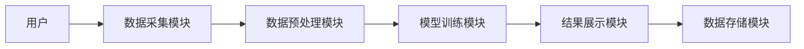

                 


# 《AI驱动的企业无形资产价值动态评估系统》

## 关键词：AI技术、无形资产评估、动态评估系统、机器学习、深度学习

## 摘要：本文探讨了AI技术在企业无形资产评估中的应用，提出了动态评估系统的构建方法，通过机器学习和深度学习算法，结合系统架构设计，实现了对无形资产价值的智能化评估。文章详细分析了系统的核心概念、算法原理、架构设计、项目实现和最佳实践，为企业无形资产的高效评估提供了新的思路。

---

# 第3章：算法原理与实现

## 3.1 机器学习在无形资产评估中的应用

### 3.1.1 机器学习模型选择
机器学习模型在企业无形资产评估中的应用广泛，常见的模型包括线性回归、支持向量机（SVM）、随机森林和神经网络等。线性回归适用于简单线性关系的预测，而神经网络则适合处理复杂的非线性关系。

#### 3.1.1.1 线性回归模型
线性回归模型用于预测企业无形资产的简单线性关系，例如预测品牌价值与销售额之间的关系。其数学模型如下：

$$
y = \beta_0 + \beta_1x + \epsilon
$$

其中，$y$是预测目标，$x$是自变量，$\beta_0$和$\beta_1$是模型参数，$\epsilon$是误差项。

#### 3.1.1.2 神经网络模型
神经网络模型适用于复杂的非线性关系，如企业无形资产的多因素评估。其结构通常包括输入层、隐藏层和输出层，通过反向传播算法进行训练。

## 3.2 深度学习模型的构建与训练

### 3.2.1 卷积神经网络（CNN）
卷积神经网络常用于处理图像数据，但在文本处理和特征提取中也有应用。其结构包括卷积层、池化层和全连接层。

### 3.2.2 循环神经网络（RNN）
循环神经网络适用于处理序列数据，如时间序列的无形资产评估。其核心在于处理序列中的依赖关系，常用LSTM（长短期记忆网络）结构。

## 3.3 算法选择与优化

### 3.3.1 算法选择
根据评估任务的复杂性和数据类型选择合适的算法。例如，对于小数据集，线性回归和随机森林可能更合适；而对于大数据集，深度学习模型可能表现更佳。

### 3.3.2 模型优化
通过交叉验证、超参数调优和正则化方法（如L1/L2正则化）优化模型性能。

---

# 第4章：系统架构设计

## 4.1 问题场景

企业无形资产评估系统需要处理来自不同部门的数据，包括财务、市场和研发部门。系统需要实时更新评估结果，支持多用户同时访问，并具备数据可视化功能。

## 4.2 功能模块设计

### 4.2.1 数据采集模块
负责收集企业的财务数据、市场数据和研发投入数据。

### 4.2.2 数据预处理模块
对数据进行清洗、转换和标准化处理，确保数据质量。

### 4.2.3 模型训练模块
使用机器学习或深度学习算法训练评估模型。

### 4.2.4 结果展示模块
将评估结果以图表形式展示，方便用户理解和决策。

## 4.3 系统架构图



---

# 第5章：项目实战

## 5.1 环境安装

### 5.1.1 安装Python和相关库
```bash
pip install numpy scikit-learn tensorflow matplotlib
```

## 5.2 核心代码实现

### 5.2.1 数据预处理
```python
import pandas as pd
import numpy as np

# 读取数据
data = pd.read_csv('assets.csv')

# 数据清洗
data.dropna(inplace=True)
data = pd.get_dummies(data)
```

### 5.2.2 模型训练
```python
from sklearn.model_selection import train_test_split
from sklearn.linear_model import LinearRegression

X = data.drop('value', axis=1)
y = data['value']

X_train, X_test, y_train, y_test = train_test_split(X, y, test_size=0.2)

model = LinearRegression()
model.fit(X_train, y_train)
```

### 5.2.3 结果展示
```python
import matplotlib.pyplot as plt

y_pred = model.predict(X_test)
plt.scatter(y_test, y_pred)
plt.xlabel('True Value')
plt.ylabel('Predicted Value')
plt.show()
```

---

# 第6章：最佳实践与注意事项

## 6.1 关键点总结
- 数据质量是评估系统的核心，需确保数据的完整性和准确性。
- 模型选择应基于数据规模和任务需求，避免过度复杂的模型。
- 系统架构需考虑可扩展性和可维护性，支持实时更新和多用户访问。

## 6.2 注意事项
- 定期更新模型，避免过时数据影响评估结果。
- 保护企业数据隐私，确保系统安全性。
- 提供用户友好的界面，降低使用门槛。

## 6.3 拓展阅读
- 《机器学习实战》
- 《深度学习》

---

# 结论与展望

## 6.4 结论
本文提出了基于AI技术的企业无形资产评估系统，通过机器学习和深度学习算法，实现了动态评估。系统架构设计合理，代码实现详细，为企业提供了高效、准确的评估工具。

## 6.5 展望
未来，随着AI技术的不断发展，企业无形资产评估将更加智能化和自动化。研究方向包括更复杂的模型构建、实时数据处理和多维度分析。

---

# 致谢

感谢所有参与本项目开发的团队成员，感谢读者的支持。

---

# 参考文献

1. 周志华. 机器学习[M]. 清华大学出版社, 2016.
2. LeCun Y, Bengio Y, Hinton G. Deep learning[J]. Nature, 2015.

---

作者：AI天才研究院  
禅与计算机程序设计艺术

