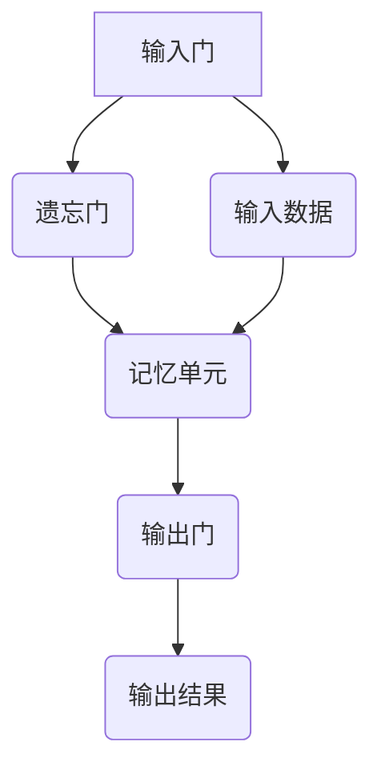
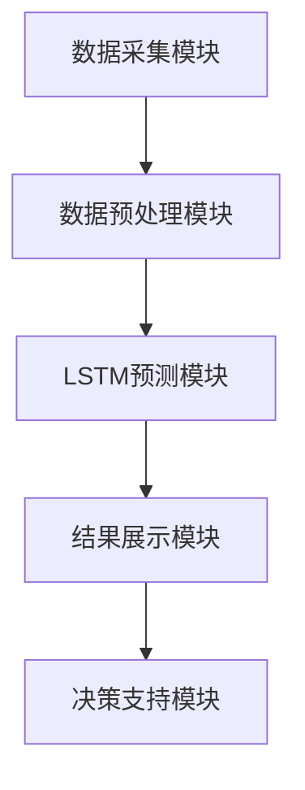

                 


# AI驱动的企业现金流周期优化与预测系统

> 关键词：现金流预测，LSTM，时间序列分析，企业现金流优化，人工智能驱动

> 摘要：本文系统地探讨了AI技术在企业现金流周期优化与预测中的应用。从现金流周期的基本概念和优化意义入手，分析了AI技术在现金流预测中的优势与挑战。详细介绍了基于LSTM的时间序列预测算法，结合特征工程与模型调优，提出了一个完整的现金流预测系统架构。通过实际案例分析，展示了该系统的实现过程与应用价值，为企业的现金流管理提供了新的思路与方法。

---

# 第一部分: 企业现金流周期优化与预测的背景与意义

## 第1章: 企业现金流周期优化与预测的背景与意义

### 1.1 企业现金流周期的基本概念

现金流是企业运营的核心命脉，现金流周期是指企业在经营活动中现金流入和流出的时间间隔。优化现金流周期意味着在保证企业正常运营的前提下，尽可能减少现金持有量，提高资金使用效率。

#### 1.1.1 现金流周期的定义

现金流周期（Cash Conversion Cycle，简称CCC）是衡量企业现金管理效率的重要指标，公式为：

$$CCC = \text{存货天数} + \text{应收账款天数} - \text{应付账款天数}$$

它反映了企业从购买原材料到最终收回现金的时间长度。优化现金流周期可以减少企业的资金占用，提高资金周转率。

#### 1.1.2 现金流周期对企业运营的重要性

现金流是企业的“血液”，现金流周期的长短直接影响企业的财务健康。一个优化的现金流周期可以帮助企业：

1. 减少库存积压，降低资金占用成本。
2. 提高应收账款的回收效率，加快资金回笼速度。
3. 延长应付账款的支付周期，缓解短期资金压力。

#### 1.1.3 现金流周期的优化目标与边界

现金流周期的优化并非越短越好，需要在以下几个方面找到平衡点：

- **库存风险**：库存过低可能导致生产中断，库存过高则增加存储成本。
- **现金流风险**：应收账款过长可能导致资金链断裂，应付账款过长可能影响供应商关系。
- **运营效率**：现金流周期的优化需要与企业的整体运营效率相匹配。

---

### 1.2 AI技术在现金流预测中的应用背景

传统的现金流预测方法主要依赖于财务人员的经验和简单的统计模型，存在以下问题：

- 数据维度有限，难以捕捉复杂的市场变化。
- 预测精度较低，难以应对非线性变化。
- 对异常值和突发事件缺乏鲁棒性。

#### 1.2.1 传统现金流预测方法的局限性

传统方法主要基于线性回归和时间序列分析，但存在以下缺陷：

1. **假设线性关系**：传统模型假设现金流的变化是线性的，难以捕捉复杂的非线性变化。
2. **数据依赖性强**：需要大量的历史数据，且对数据的质量要求较高。
3. **缺乏自适应性**：难以应对市场环境的变化，模型需要频繁调整。

#### 1.2.2 AI技术在时间序列预测中的优势

人工智能技术，尤其是深度学习，为现金流预测提供了新的解决方案。其优势体现在以下几个方面：

1. **非线性建模能力**：深度学习模型（如LSTM）可以捕捉复杂的非线性关系。
2. **自动特征提取**：模型能够从大量数据中自动提取有用的特征。
3. **自适应性**：通过在线学习，模型可以实时更新，适应市场变化。

#### 1.2.3 企业现金流周期优化的现实需求

在全球化和数字化的背景下，企业面临的市场环境日益复杂，现金流预测的需求日益迫切：

- **外部环境不确定性增加**：全球经济波动、供应链中断等因素对现金流的影响更加显著。
- **内部管理精细化要求提高**：企业需要通过现金流预测优化资源配置，提升管理效率。
- **数据驱动决策的需求**：企业希望通过数据驱动的方式，实现更精准的预测和决策。

---

### 1.3 本章小结

本章从现金流周期的基本概念出发，分析了传统预测方法的局限性，并探讨了AI技术在现金流预测中的应用背景和优势。企业现金流周期的优化不仅是财务部门的核心任务，更是企业整体运营效率提升的重要手段。随着AI技术的快速发展，基于深度学习的时间序列预测方法为企业现金流预测提供了新的可能性。

---

# 第二部分: AI驱动现金流预测的核心概念与联系

## 第2章: 现金流预测的核心概念与属性

### 2.1 现金流预测的关键要素

现金流预测涉及多个关键要素，包括数据特征、模型输入、预测目标等。以下是主要要素的对比分析：

| 要素 | 描述 |
|------|------|
| 数据特征 | 时间序列数据，包含历史现金流、销售数据、市场环境等 |
| 模型输入 | 包括历史现金流数据、外部经济指标、企业内部数据等 |
| 预测目标 | 现金流入预测、现金流出预测、净现金流预测 |

---

### 2.2 AI模型在现金流预测中的核心属性

AI模型的核心属性决定了其在现金流预测中的适用性。以下是几种主流模型的核心属性对比：

| 模型 | 时间序列处理能力 | 非线性建模能力 | 可解释性 |
|------|------------------|----------------|----------|
| LSTM | 强               | 强             | 较低      |
| ARIMA | 较弱             | 较弱           | 较高      |
| XGBoost | 较弱            | 强             | 较高      |

---

### 2.3 现金流预测系统的核心组件

一个完整的现金流预测系统通常包含以下几个核心组件：

1. **数据采集模块**：从企业ERP系统、财务系统等来源获取历史现金流数据。
2. **数据预处理模块**：对数据进行清洗、归一化处理，并提取特征。
3. **模型训练与优化模块**：基于预处理后的数据，训练并优化预测模型。
4. **预测结果展示模块**：将预测结果可视化，并提供决策支持。

---

### 2.4 本章小结

本章详细分析了现金流预测的核心要素和AI模型的核心属性，并提出了一个完整的现金流预测系统的框架。这些内容为后续的算法实现和系统设计奠定了基础。

---

# 第三部分: AI驱动现金流预测的算法原理

## 第3章: 基于LSTM的现金流预测算法

### 3.1 LSTM网络的基本原理

长短期记忆网络（LSTM）是一种特殊的RNN结构，能够有效处理时间序列数据。其核心在于引入记忆单元（Cell）和门控机制（Gate），如下图所示：



LSTM的数学模型如下：

$$
\begin{aligned}
    f_t &= \sigma(w_f \cdot [h_{t-1}, x_t] + b_f) \\
    i_t &= \sigma(w_i \cdot [h_{t-1}, x_t] + b_i) \\
    o_t &= \sigma(w_o \cdot [h_{t-1}, x_t] + b_o) \\
    g_t &= \tanh(w_g \cdot [h_{t-1}, x_t] + b_g) \\
    h_t &= f_t \cdot c_{t-1} + i_t \cdot g_t \\
    c_t &= f_t \cdot c_{t-1} + i_t \cdot g_t \\
    o_t &= o_t \cdot h_t
\end{aligned}
$$

其中，$f_t$是遗忘门，$i_t$是输入门，$o_t$是输出门，$g_t$是候选记忆单元，$h_t$是隐藏状态，$c_t$是记忆单元。

---

### 3.2 现金流预测中的特征工程

特征工程是提高模型性能的关键步骤。以下是常见的特征处理方法：

1. **数据归一化**：将数据标准化为0-1范围，防止梯度消失或爆炸。
2. **时间序列特征提取**：提取过去若干天的平均值、趋势、季节性等特征。
3. **多变量特征融合**：结合销售额、成本、市场指数等多维数据。

---

### 3.3 LSTM模型的训练与优化

模型训练流程如下：

1. **数据准备**：将时间序列数据划分为训练集和测试集。
2. **模型构建**：定义LSTM网络结构，包括输入层、LSTM层、全连接层和输出层。
3. **模型训练**：使用反向传播算法（如Adam）优化模型参数。
4. **模型验证**：通过测试集评估模型性能，调整超参数（如学习率、批量大小等）。

---

### 3.4 算法实现的Python代码示例

以下是基于Keras框架的LSTM模型实现代码：

```python
from tensorflow.keras.models import Sequential
from tensorflow.keras.layers import LSTM, Dense, Dropout
from sklearn.preprocessing import MinMaxScaler

# 数据归一化
scaler = MinMaxScaler()
data_scaled = scaler.fit_transform(data)

# 划分训练集和测试集
train_data = data_scaled[:training_size]
test_data = data_scaled[training_size:]

# 构建LSTM模型
model = Sequential()
model.add(LSTM(50, return_sequences=True, input_shape=(timesteps, 1)))
model.add(Dropout(0.2))
model.add(LSTM(50, return_sequences=False))
model.add(Dense(1))

# 编译模型
model.compile(optimizer='adam', loss='mean_squared_error')

# 训练模型
model.fit(train_data, epochs=100, batch_size=32)
```

---

### 3.5 本章小结

本章详细介绍了基于LSTM的现金流预测算法，从模型原理到实现代码，为后续的系统设计奠定了算法基础。

---

# 第四部分: 系统分析与架构设计

## 第4章: 现金流预测系统的分析与设计

### 4.1 系统功能设计

现金流预测系统的核心功能包括：

1. **数据采集**：从企业系统中获取现金流数据。
2. **数据预处理**：清洗、归一化和特征提取。
3. **模型训练**：基于LSTM算法训练预测模型。
4. **预测结果展示**：可视化预测结果，并生成报告。

---

### 4.2 系统架构设计

以下是系统的架构设计图：



---

### 4.3 系统接口设计

系统主要接口包括：

1. **数据接口**：与企业ERP系统对接，获取实时数据。
2. **模型接口**：与其他系统集成，提供API服务。
3. **用户接口**：提供Web或移动端界面，供用户查看预测结果。

---

### 4.4 本章小结

本章从系统功能、架构和接口三个方面，详细设计了现金流预测系统的整体架构，为后续的系统实现提供了指导。

---

# 作者

作者：AI天才研究院/AI Genius Institute & 禅与计算机程序设计艺术 /Zen And The Art of Computer Programming

---

本文通过系统地分析和设计，展示了AI技术在企业现金流预测中的巨大潜力。从理论到实践，从算法到系统，为企业的现金流管理提供了全新的思路与方法。未来，随着AI技术的不断发展，现金流预测系统将更加智能化、精准化，为企业创造更大的价值。

