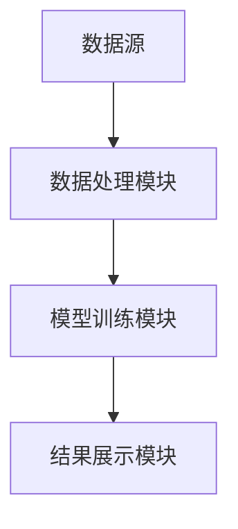
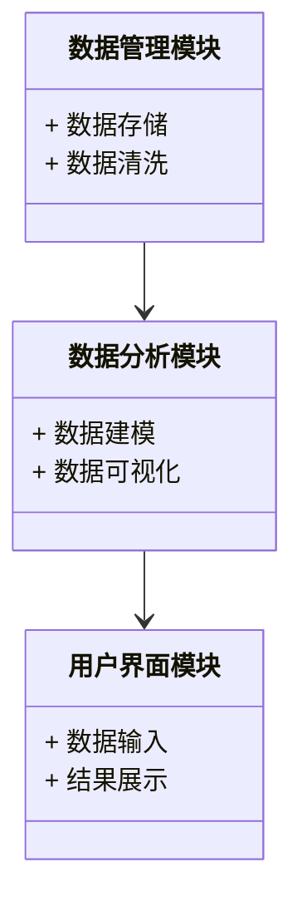

                 


# AI驱动的企业财务战略情景模拟系统

## 关键词：
AI技术、企业财务、战略模拟、情景模拟系统、机器学习、深度学习、大数据分析

## 摘要：
本文介绍了一种基于人工智能技术的企业财务战略情景模拟系统。该系统通过整合机器学习和大数据分析技术，为企业提供智能化的财务预测和决策支持。文章详细分析了系统的构建过程，包括数据采集与处理、模型选择与实现、系统架构设计等，并通过具体案例展示了系统的实际应用效果和价值。最后，本文总结了该系统的优势和不足，并提出了改进建议。

---

## 第1章: 企业财务战略与AI技术的结合

### 1.1 企业财务战略的核心概念

#### 1.1.1 企业财务战略的定义与目标
企业财务战略是指企业在一定时期内，为了实现财务目标而制定的长期规划和策略。其目标包括优化资源配置、降低财务风险、提高资金使用效率等。

#### 1.1.2 传统财务战略的局限性
传统财务战略依赖于人工分析和经验判断，存在以下问题：
- 数据处理效率低，难以应对海量数据。
- 分析结果受主观因素影响，准确性有限。
- 预测能力有限，难以应对复杂多变的市场环境。

#### 1.1.3 AI技术对企业财务战略的潜在价值
AI技术能够通过自动化数据处理、智能预测和优化决策，显著提升财务战略的制定和执行效率。

### 1.2 AI技术在财务领域的应用现状

#### 1.2.1 AI在财务分析中的应用
AI技术可以通过自然语言处理（NLP）和机器学习算法，从财务报表和市场数据中提取有价值的信息。

#### 1.2.2 AI在财务预测中的应用
通过时间序列分析和回归模型，AI能够预测企业的未来财务状况，如收入、成本和利润。

#### 1.2.3 AI在财务决策中的应用
AI可以帮助企业在投资、融资和成本控制等方面做出更科学的决策。

### 1.3 企业财务战略情景模拟系统的必要性

#### 1.3.1 传统财务模拟系统的不足
传统财务模拟系统通常依赖于静态模型，难以动态调整和优化。

#### 1.3.2 AI驱动的情景模拟系统的优势
AI驱动的情景模拟系统能够实时更新数据，动态调整模型参数，提高预测的准确性和实用性。

#### 1.3.3 企业财务战略情景模拟系统的应用场景
- 企业预算管理
- 投资决策支持
- 风险评估与控制

---

## 第2章: AI驱动的企业财务战略情景模拟系统的技术基础

### 2.1 人工智能技术基础

#### 2.1.1 机器学习基础
机器学习是一种通过数据训练模型，使其能够从数据中学习并做出预测的技术。

#### 2.1.2 深度学习基础
深度学习是一种基于人工神经网络的机器学习技术，能够处理复杂的数据模式。

#### 2.1.3 自然语言处理基础
NLP技术能够帮助系统理解和分析财务报告、市场新闻等文本数据。

### 2.2 大数据分析技术基础

#### 2.2.1 数据采集与处理
数据采集包括从企业内部数据库和外部市场数据源获取数据。数据处理包括清洗、转换和标准化。

#### 2.2.2 数据建模与分析
通过统计分析和机器学习模型，对数据进行建模和分析，提取有价值的信息。

#### 2.2.3 数据可视化
通过图表和可视化工具，将分析结果以直观的方式呈现给用户。

### 2.3 企业财务数据的特点与挑战

#### 2.3.1 财务数据的结构化与非结构化
企业财务数据包括结构化数据（如财务报表）和非结构化数据（如财务报告）。

#### 2.3.2 数据隐私与安全问题
财务数据涉及企业的机密信息，数据隐私和安全是系统设计的重要考虑因素。

#### 2.3.3 数据质量管理
数据可能存在缺失、错误或不一致的问题，需要进行数据清洗和预处理。

---

## 第3章: 系统核心概念与联系

### 3.1 系统核心概念

#### 3.1.1 系统架构
系统架构包括数据采集模块、数据处理模块、模型训练模块和用户界面模块。

#### 3.1.2 数据流
数据流从数据源流入系统，经过处理和分析后，生成结果并反馈给用户。

#### 3.1.3 功能模块
功能模块包括数据管理、模型训练、情景模拟和结果展示。

### 3.2 核心概念的属性特征对比

| 系统架构 | 数据流 | 功能模块 |
|----------|--------|----------|
| 输入数据 | 数据处理 | 数据采集 |
| 输出结果 | 数据分析 | 数据建模 |
| 中间处理 | 数据存储 | 数据可视化 |

### 3.3 系统ER实体关系图



---

## 第4章: 系统算法原理

### 4.1 算法选择与实现

#### 4.1.1 算法选择
选择随机森林和长短期记忆网络（LSTM）作为主要算法，分别用于分类和时间序列预测。

#### 4.1.2 算法实现

```python
import pandas as pd
from sklearn.ensemble import RandomForestRegressor

# 数据处理
data = pd.read_csv('financial_data.csv')
X = data.drop('target', axis=1)
y = data['target']

# 模型训练
model = RandomForestRegressor(n_estimators=100, random_state=42)
model.fit(X, y)

# 预测
test_data = pd.read_csv('test.csv')
test_X = test_data.drop('target', axis=1)
predictions = model.predict(test_X)
```

#### 4.1.3 算法原理

随机森林是一种基于树的集成学习方法，能够处理高维数据和非线性关系。

LSTM是一种循环神经网络，适用于时间序列数据的预测。

### 4.2 算法优缺点对比

| 算法 | 优点 | 缺点 |
|------|------|------|
| 随机森林 | 高效、易于实现 | 对高维数据可能效果不佳 |
| LSTM | 能够捕捉时间序列中的长期依赖关系 | 训练时间较长 |

---

## 第5章: 系统分析与架构设计方案

### 5.1 系统架构设计


### 5.2 系统功能设计



### 5.3 系统接口设计

- 数据输入接口：接收企业财务数据和市场数据。
- 模型调用接口：调用训练好的AI模型进行预测。
- 结果输出接口：将预测结果返回给用户界面。

---

## 第6章: 项目实战

### 6.1 环境安装与配置

```bash
pip install pandas numpy scikit-learn matplotlib
```

### 6.2 核心代码实现

```python
import pandas as pd
from sklearn.ensemble import RandomForestRegressor
import matplotlib.pyplot as plt

# 数据加载
data = pd.read_csv('financial_data.csv')

# 数据处理
X = data.drop('target', axis=1)
y = data['target']

# 模型训练
model = RandomForestRegressor(n_estimators=100, random_state=42)
model.fit(X, y)

# 预测
test_data = pd.read_csv('test.csv')
test_X = test_data.drop('target', axis=1)
predictions = model.predict(test_X)

# 结果可视化
plt.scatter(y, predictions)
plt.xlabel('实际值')
plt.ylabel('预测值')
plt.show()
```

### 6.3 实际案例分析

以某制造企业的财务数据为例，利用训练好的模型预测未来一年的收入和成本，并根据预测结果调整企业的财务策略。

---

## 第7章: 最佳实践与总结

### 7.1 最佳实践

- 数据预处理是关键，确保数据质量和完整性。
- 选择合适的算法，结合业务需求进行优化。
- 定期更新模型，以应对市场环境的变化。

### 7.2 系统小结

本文介绍了AI驱动的企业财务战略情景模拟系统的构建过程，展示了其在企业财务管理中的巨大潜力。通过实际案例分析，验证了系统的可行性和有效性。

### 7.3 注意事项

- 数据隐私和安全是系统设计的重要考虑因素。
- 模型的解释性和可维护性需要重点关注。
- 系统的实时性和响应速度需要优化。

### 7.4 拓展阅读

- 《机器学习实战》
- 《深度学习》
- 《大数据分析与挖掘》

---

## 作者：AI天才研究院 & 禅与计算机程序设计艺术

