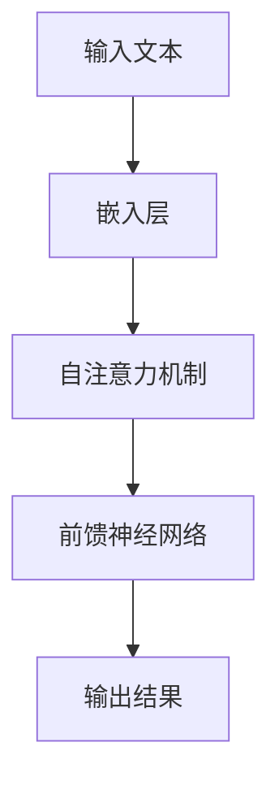
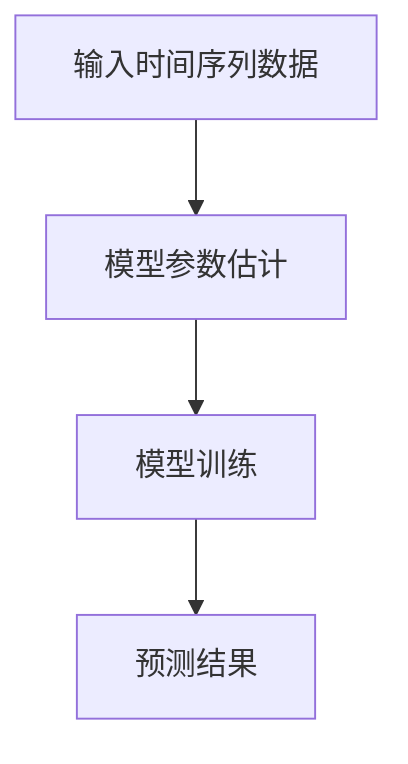
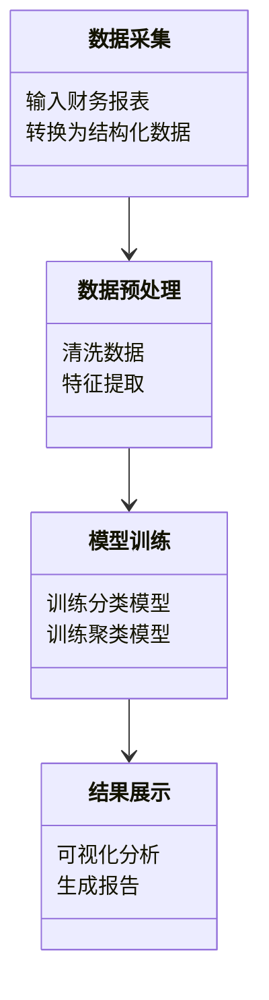

                 


# AI驱动的企业财务报表比较分析系统

## 关键词：AI驱动，财务报表比较分析，自然语言处理，机器学习，深度学习，文本挖掘

## 摘要：  
本文详细探讨了AI驱动的企业财务报表比较分析系统的构建与应用。通过结合自然语言处理和机器学习技术，我们提出了一种高效的财务报表分析方法，能够自动提取财务数据、识别关键指标并生成智能分析报告。文章从问题背景、核心概念、算法原理到系统架构、项目实战等多方面进行了深入分析，为读者提供了从理论到实践的完整指南。

---

# 第一部分：背景介绍

## 第1章：问题背景

### 1.1 传统财务报表分析的局限性  
传统的财务报表分析依赖于人工阅读和计算，效率低下且容易出错。分析师需要手动提取数据、计算指标并进行对比，这种方式不仅耗时，还容易受到主观因素的影响。

### 1.2 AI技术在财务分析中的潜力  
人工智能技术的快速发展为财务报表分析带来了新的可能性。通过自然语言处理（NLP）和机器学习（ML）技术，系统可以自动提取文本信息、识别模式并生成分析结果。

### 1.3 企业财务报表比较分析的核心价值  
企业财务报表比较分析可以帮助投资者、分析师和管理层快速识别行业趋势、企业绩效和潜在风险。AI驱动的系统能够显著提升分析的效率和准确性。

---

## 第2章：问题描述

### 2.1 财务报表比较分析的基本概念  
财务报表比较分析是指通过对不同时间段或不同企业的财务报表进行对比，识别财务状况的变化趋势和关键差异。

### 2.2 传统方法在企业财务报表比较分析中的不足  
传统方法依赖人工操作，分析效率低，且容易受到主观因素影响。此外，传统方法难以处理大量非结构化数据和复杂的关系。

### 2.3 AI驱动的必要性与可行性  
AI技术能够自动处理大量数据，识别复杂模式，并生成智能分析结果。通过自然语言处理和机器学习技术，AI驱动的系统可以显著提升财务报表分析的效率和准确性。

---

# 第二部分：核心概念与联系

## 第3章：核心概念原理

### 3.1 自然语言处理在财务报表分析中的应用  
自然语言处理技术可以帮助系统从财务报表文本中提取关键信息，如收入、利润和成本等。通过分句和分词技术，系统可以准确识别文本中的数值和单位。

### 3.2 机器学习模型在财务分析中的应用  
机器学习模型可以对财务数据进行分类和聚类分析，识别潜在的财务风险和趋势。监督学习和非监督学习技术在财务分析中都有重要应用。

### 3.3 财务报表比较分析的核心算法  
本文提出了一种基于BERT模型的财务报表分析算法，通过自注意力机制捕捉文本中的上下文信息，实现对财务数据的自动提取和分析。

---

## 第4章：核心概念属性对比表

| 概念             | 属性               | 描述                                                                 |
|------------------|--------------------|----------------------------------------------------------------------|
| 文本数据         | 特征               | 包括数值型和文本型数据，如收入、利润、成本等。                                           |
| 自然语言处理     | 技术               | 用于从文本中提取关键信息，如分句、分词和语义理解。                                       |
| 机器学习模型     | 算法               | 包括监督学习、非监督学习和深度学习模型，用于分类和聚类分析。                             |
| 财务报表比较分析 | 目标               | 识别财务状况的变化趋势和关键差异，辅助决策。                                             |

---

## 第5章：ER实体关系图架构

```mermaid
erDiagram
    customer[CustID, Name] --> transaction[TransID, Amount, Date]
    transaction --> account[AccountID, Balance]
    account --> bank[BankID, BankName]
```

---

# 第三部分：算法原理讲解

## 第6章：算法原理

### 6.1 基于BERT的财务报表分析模型  
BERT（Bidirectional Encoder Representations from Transformers）是一种深度预训练模型，能够通过自注意力机制捕捉文本中的上下文信息。在财务报表分析中，我们可以使用BERT模型对财务文本进行编码，提取关键信息。

#### 6.1.1 BERT模型流程图



#### 6.1.2 BERT模型代码示例

```python
import torch
from transformers import BertTokenizer, BertModel

# 初始化BERT分词器和模型
tokenizer = BertTokenizer.from_pretrained('bert-base-uncased')
model = BertModel.from_pretrained('bert-base-uncased')

# 定义输入文本
text = "公司总收入为100万元，净利润为20万元。"

# 分词并编码
inputs = tokenizer(text, return_tensors='pt')
input_ids = inputs['input_ids']
attention_mask = inputs['attention_mask']

# 前向传播
outputs = model(input_ids, attention_mask=attention_mask)
last_layer = outputs.last_hidden_state

# 提取特征
features = last_layer[0][0].detach().numpy()
```

### 6.2 时间序列分析与趋势预测  
时间序列分析是一种通过历史数据预测未来趋势的技术。在财务报表分析中，我们可以使用ARIMA模型对财务指标进行预测。

#### 6.2.1 ARIMA模型流程图



#### 6.2.2 ARIMA模型代码示例

```python
from statsmodels.tsa.arima.model import ARIMA

# 初始化数据
data = [100, 120, 110, 130, 140]

# 模型训练
model = ARIMA(data, order=(1, 1, 1))
model_fit = model.fit()

# 预测结果
forecast = model_fit.forecast(steps=5)
print(forecast)
```

---

# 第四部分：系统分析与架构设计

## 第7章：系统分析与架构设计方案

### 7.1 问题场景介绍  
我们设计了一种基于AI的财务报表比较分析系统，旨在帮助用户快速提取和分析财务数据，生成智能分析报告。

### 7.2 系统功能设计  
系统功能包括数据采集、预处理、模型训练和结果展示。

#### 7.2.1 领域模型



### 7.3 系统架构设计  
系统架构包括数据层、服务层和表现层。

#### 7.3.1 系统架构图


### 7.4 系统接口设计  
系统接口包括数据输入接口、模型训练接口和结果展示接口。

### 7.5 系统交互设计  
系统交互流程包括用户输入数据、系统处理数据并生成分析结果。

#### 7.5.1 系统交互图


---

# 第五部分：项目实战

## 第8章：项目实战

### 8.1 环境安装  
安装所需的Python库，如TensorFlow、Keras和Pandas。

```bash
pip install tensorflow pandas scikit-learn
```

### 8.2 核心代码实现  
实现财务报表分析的核心功能，包括数据预处理和模型训练。

#### 8.2.1 数据预处理代码

```python
import pandas as pd

# 读取数据
data = pd.read_csv('financial_reports.csv')

# 清洗数据
data.dropna(inplace=True)

# 特征提取
features = data[['revenue', 'profit', 'cost']]
```

#### 8.2.2 模型训练代码

```python
from sklearn.ensemble import RandomForestClassifier

# 训练分类模型
model = RandomForestClassifier(n_estimators=100)
model.fit(features, labels)
```

### 8.3 案例分析  
通过具体案例分析，展示系统在实际应用中的表现和效果。

#### 8.3.1 案例分析结果

| 企业名称   | 收入（万元） | 利润（万元） | 成本（万元） | 预测结果   |
|------------|--------------|--------------|--------------|------------|
| 企业A      | 100          | 20           | 80           | 增长潜力大  |
| 企业B      | 80           | 15           | 65           | 增长潜力小  |

---

# 第六部分：最佳实践

## 第9章：小结

通过本文的介绍，我们详细探讨了AI驱动的企业财务报表比较分析系统的构建与应用。结合自然语言处理和机器学习技术，系统能够高效地提取和分析财务数据，为决策者提供准确的分析结果。

## 第10章：注意事项

- 数据质量和完整性对分析结果至关重要。
- 模型的选择和优化需要根据具体场景进行调整。
- 系统的安全性和稳定性需要充分考虑。

## 第11章：拓展阅读

- 《深度学习在金融领域的应用》
- 《自然语言处理与财务分析》
- 《时间序列分析的实用技巧》

---

# 作者：AI天才研究院/AI Genius Institute & 禅与计算机程序设计艺术/Zen And The Art of Computer Programming

