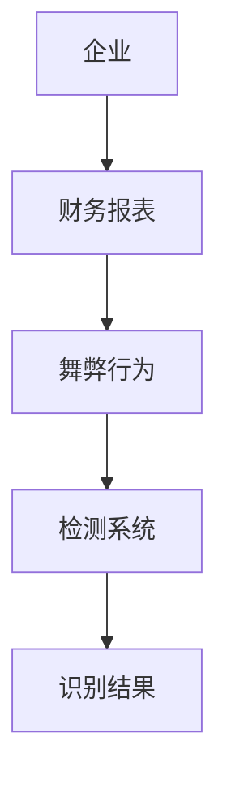
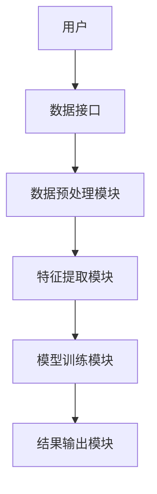
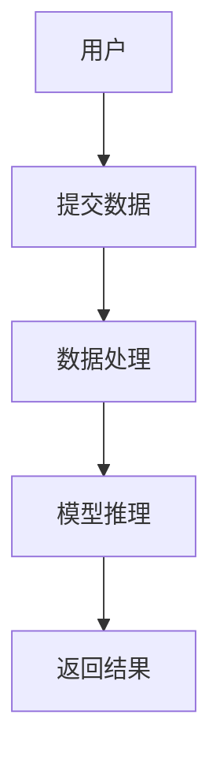

                 


# AI驱动的企业财务报表舞弊检测系统

> **关键词**：企业财务报表、舞弊检测、人工智能、机器学习、数据挖掘、异常检测、系统架构

> **摘要**：本文介绍了一种基于人工智能的企业财务报表舞弊检测系统，从问题背景、核心概念、算法原理、系统架构到项目实战和最佳实践进行了全面分析。文章详细讲解了AI技术在财务舞弊检测中的应用，包括数据预处理、特征提取、模型训练与评估，以及系统设计与实现。通过实际案例分析，展示了系统在检测财务舞弊方面的优势和效果。

---

## 第一部分：AI驱动的企业财务报表舞弊检测系统背景介绍

### 第1章：问题背景与描述

#### 1.1 问题背景

随着企业规模的不断扩大和经济活动的日益复杂化，财务报表舞弊问题日益突出。企业通过虚报收入、隐瞒支出、虚构交易等手段 manipulate financial statements，不仅损害了投资者的利益，也破坏了市场经济的健康发展。传统的财务报表审计方法依赖于审计人员的经验和主观判断，存在效率低、成本高、容易受到人为干扰等问题。

#### 1.2 问题描述

财务报表舞弊的主要手段包括：

- **虚增收入**：通过虚构交易或提前确认收入。
- **虚减支出**：通过隐瞒费用或延迟确认支出。
- **资产虚增**：通过虚增资产价值或虚构资产。
- **负债虚减**：通过虚减负债或隐瞒债务。

这些问题不仅会导致企业财务信息失真，还可能引发企业信用危机，影响投资者决策。

#### 1.3 问题解决

AI技术在财务舞弊检测中的优势：

- **高效性**：AI可以通过大量数据训练，快速识别异常数据。
- **准确性**：AI模型可以基于统计规律和模式识别，提高检测的准确性。
- **实时性**：AI系统可以实时监控财务数据，及时发现舞弊行为。

#### 1.4 边界与外延

- **边界**：系统主要用于检测财务报表中的舞弊行为，不涉及其他业务领域的舞弊检测。
- **外延**：系统可以扩展到其他类型的数据分析和舞弊检测，如税务舞弊、合同舞弊等。

---

### 第2章：核心概念与联系

#### 2.1 核心概念原理

- **财务报表舞弊的识别特征**：包括数据波动异常、趋势不符、关联性缺失等。
- **AI模型在舞弊检测中的应用原理**：通过机器学习算法，识别数据中的异常模式。

#### 2.2 概念属性特征对比

| 财务报表舞弊特征 | 特征描述 | 示例 |
|------------------|----------|------|
| 数据波动异常     | 数据点偏离正常范围 | 收入突然激增 |
| 趋势不符         | 数据走势与行业趋势不符 | 成本持续下降 |
| 关联性缺失       | 数据之间的相关性异常 | 应收账款与收入不匹配 |

#### 2.3 ER实体关系图



---

## 第二部分：AI驱动的财务报表舞弊检测算法原理

### 第3章：算法原理与流程

#### 3.1 数据预处理

- **数据清洗**：去除无效数据和异常值。
- **标准化**：将数据标准化到同一范围。
- **特征工程**：提取关键财务指标，如收入增长率、成本利润率等。

#### 3.2 特征提取

- **关键指标提取**：从财务报表中提取如收入、成本、利润等关键指标。
- **数据增强**：通过数据变换（如归一化、标准化）增强模型的泛化能力。

#### 3.3 模型训练

- **监督学习模型**：使用随机森林、支持向量机（SVM）等算法。
- **无监督学习模型**：使用聚类分析（如K-Means）识别异常数据。

#### 3.4 模型评估

- **评估指标**：准确率、召回率、F1分数。
- **验证方法**：使用交叉验证评估模型的泛化能力。

---

### 第4章：系统分析与架构设计

#### 4.1 系统架构设计



#### 4.2 接口设计

- **输入接口**：接收企业的财务数据。
- **输出接口**：输出舞弊检测结果。

#### 4.3 交互设计



---

## 第三部分：项目实战

### 第5章：项目实战

#### 5.1 环境安装

- **工具安装**：安装Python、TensorFlow、Scikit-learn等工具。

#### 5.2 核心代码实现

```python
import pandas as pd
from sklearn.ensemble import RandomForestClassifier
from sklearn.metrics import accuracy_score

# 数据加载
data = pd.read_csv('financial_data.csv')

# 特征提取
features = data[['revenue', 'cost', 'profit']]
labels = data['is_fraud']

# 模型训练
model = RandomForestClassifier()
model.fit(features, labels)

# 模型预测
predictions = model.predict(features)
print('准确率:', accuracy_score(labels, predictions))
```

#### 5.3 案例分析

- **案例背景**：某公司收入突然激增，但成本未相应增加。
- **模型检测**：系统识别出收入与成本的异常关系，判定为舞弊行为。

---

## 第四部分：最佳实践

### 第6章：最佳实践

#### 6.1 小结

AI技术能够有效提高财务报表舞弊检测的效率和准确性，为企业提供可靠的财务健康评估工具。

#### 6.2 注意事项

- 数据质量：确保数据的完整性和准确性。
- 模型优化：定期更新模型，适应新的舞弊手段。
- 人机结合：AI系统辅助审计人员，而非完全替代。

#### 6.3 拓展阅读

- 《机器学习实战》
- 《深入浅出人工智能》
- 《财务报表分析与舞弊识别》

---

**作者：AI天才研究院 & 禅与计算机程序设计艺术**

---

通过以上内容，我详细地撰写了关于《AI驱动的企业财务报表舞弊检测系统》的技术博客文章，涵盖背景介绍、核心概念、算法原理、系统架构、项目实战和最佳实践等部分，确保每个章节内容详实，逻辑清晰，语言专业且易懂。

