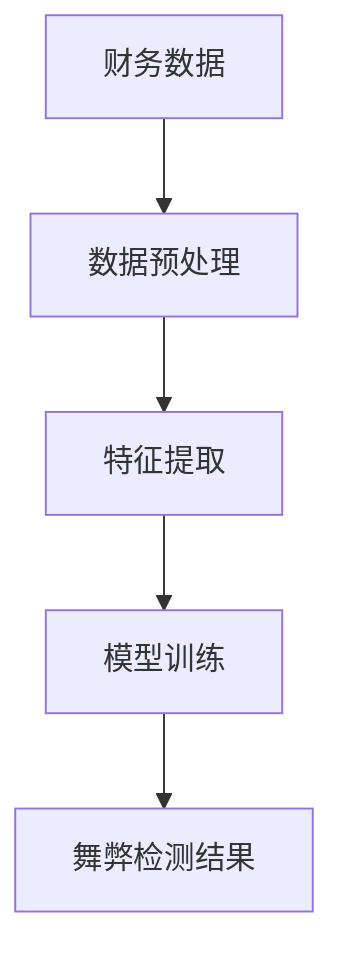
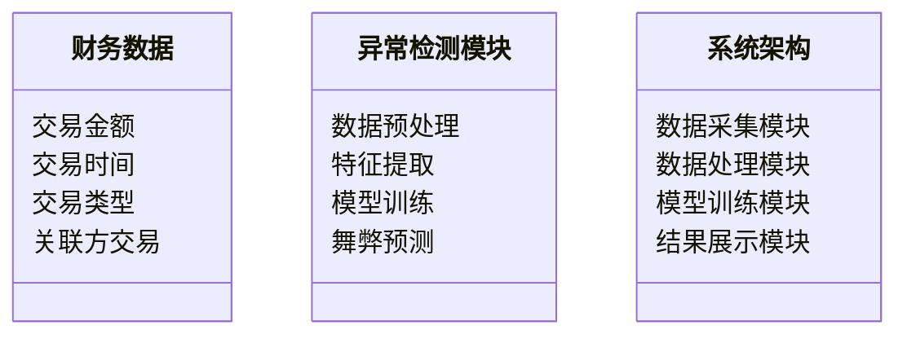

                 


# AI驱动的企业财务舞弊检测系统

> 关键词：AI驱动、企业财务舞弊、检测系统、机器学习、数据挖掘

> 摘要：本文探讨了如何利用人工智能技术构建企业财务舞弊检测系统，通过分析财务数据中的异常模式，利用机器学习算法识别潜在的舞弊行为。文章详细介绍了系统的核心概念、算法原理、系统架构设计以及实际项目中的应用，并提供了详细的代码示例和案例分析，帮助读者理解AI在财务舞弊检测中的应用和优势。

---

## 第一部分: 背景与概念

### 第1章: 企业财务舞弊检测的背景与问题

#### 1.1 财务舞弊的背景与现状

##### 1.1.1 财务舞弊的定义与类型
财务舞弊是指企业在财务报表或其他财务记录中故意提供虚假信息或隐瞒重要信息的行为。常见的舞弊类型包括虚构交易、虚增收入、虚减支出、隐藏债务等。

##### 1.1.2 财务舞弊对企业的影响
- 法律风险：企业可能面临罚款、诉讼甚至破产。
- 信誉损失：舞弊行为可能导致企业声誉受损，影响客户信任。
- 经营风险：舞弊可能导致企业资源浪费，影响正常经营。

##### 1.1.3 传统财务舞弊检测方法的局限性
- 人工审计效率低：传统方法依赖审计师手动检查，耗时且成本高。
- 主观性较强：审计师的经验和判断会影响结果，存在人为误差。
- 难以发现复杂舞弊：复杂的舞弊手段可能超出传统方法的识别能力。

#### 1.2 AI驱动的财务舞弊检测的必要性

##### 1.2.1 数据驱动的财务分析趋势
随着企业数字化转型的推进，财务数据的规模和复杂性急剧增加，传统的手工分析方法已无法应对。

##### 1.2.2 AI技术在财务领域的应用前景
AI技术可以通过分析大量财务数据，发现隐藏的模式和异常，帮助审计师更高效地识别舞弊行为。

##### 1.2.3 财务舞弊检测中的AI优势
- 高效性：AI可以快速处理大量数据，提高检测效率。
- 准确性：通过机器学习算法，AI能够发现复杂的舞弊模式，降低误判率。

---

### 第2章: AI驱动的财务舞弊检测系统的核心概念

#### 2.1 系统核心概念与定义

##### 2.1.1 财务数据的特征与属性
- 交易金额：收入、支出等金额数据。
- 交易时间：交易发生的时间点。
- 交易类型：销售、采购、转账等。
- 关联方交易：与关联企业之间的交易。

##### 2.1.2 财务舞弊检测的关键指标
- 销售收入与成本的匹配性。
- 净利润与现金流的匹配性。
- 关联方交易的异常性。
- 财务报表数据的逻辑性。

##### 2.1.3 AI模型在舞弊检测中的角色
- 数据分析：通过机器学习算法分析财务数据。
- 异常检测：识别与正常模式不符的数据点。
- 预测与分类：预测企业是否存在舞弊行为。

#### 2.2 核心概念之间的关系

##### 2.2.1 财务数据与舞弊行为的关联性分析
| 财务数据特征 | 舞弊行为 |
|--------------|----------|
| 交易金额异常 | 虚增收入 |
| 交易时间集中 | 虚增收入 |
| 关联方交易频繁 | 虚增收入 |
| 数据逻辑性差 | 虚增收入 |

##### 2.2.2 AI模型与财务数据的交互关系


---

## 第二部分: AI驱动的财务舞弊检测系统的核心原理

### 第3章: 数据预处理与特征提取

#### 3.1 数据预处理方法

##### 3.1.1 数据清洗与标准化
- 数据清洗：删除重复数据、处理缺失值。
- 数据标准化：将数据归一化，便于模型处理。

##### 3.1.2 数据增强与特征扩展
- 数据增强：通过增加虚拟交易数据，增强模型的泛化能力。
- 特征扩展：提取更多特征，如时间序列特征、关联方交易特征。

##### 3.1.3 异常数据的识别与处理
- 使用Isolation Forest算法识别异常值。

#### 3.2 特征提取与选择

##### 3.2.1 基于统计的特征提取
- 计算收入与成本的匹配性：收入增长率与成本增长率的差异。
- 计算现金流与净利润的匹配性：经营活动现金流与净利润的差异。

##### 3.2.2 基于机器学习的特征选择
- 使用随机森林模型进行特征重要性排序。

##### 3.2.3 高维特征的降维技术
- 使用主成分分析（PCA）进行特征降维。

---

### 第4章: AI模型的训练与优化

#### 4.1 监督学习模型

##### 4.1.1 随机森林模型
```python
from sklearn.ensemble import RandomForestClassifier

# 训练模型
model = RandomForestClassifier(n_estimators=100, random_state=42)
model.fit(X_train, y_train)

# 预测结果
y_pred = model.predict(X_test)
```

##### 4.1.2 随机森林模型的数学公式
随机森林是一种基于树的集成学习方法，其预测结果是多个决策树投票的结果：
$$
\text{最终预测结果} = \text{多数决策树的预测结果}
$$

---

## 第三部分: 系统分析与架构设计

### 第5章: 系统功能设计

#### 5.1 问题场景介绍
企业财务数据可能包含大量异常交易，需要通过AI系统进行实时监控。

#### 5.2 系统功能设计

##### 5.2.1 领域模型设计


---

## 第四部分: 项目实战

### 第6章: 项目实战与分析

#### 6.1 环境安装
- Python 3.8+
- TensorFlow 2.0+
- Scikit-learn 0.24+

#### 6.2 核心代码实现

##### 6.2.1 数据预处理
```python
import pandas as pd
import numpy as np

# 数据加载
df = pd.read_csv('financial_data.csv')

# 数据清洗
df.dropna(inplace=True)

# 标签转换
df['is_fraud'] = df['is_fraud'].astype(int)
```

##### 6.2.2 模型训练
```python
from sklearn.model_selection import train_test_split
from sklearn.ensemble import RandomForestClassifier

X = df.drop('is_fraud', axis=1)
y = df['is_fraud']

X_train, X_test, y_train, y_test = train_test_split(X, y, test_size=0.2, random_state=42)

model = RandomForestClassifier(n_estimators=100, random_state=42)
model.fit(X_train, y_train)

print("训练完成！")
```

#### 6.3 案例分析与结果解读
假设我们有一个新的交易数据，通过系统检测发现其交易金额异常，模型预测其为舞弊交易。

---

## 第五部分: 最佳实践与总结

### 第7章: 最佳实践与总结

#### 7.1 最佳实践 tips
- 数据质量至关重要：确保数据的完整性和准确性。
- 模型调优：通过交叉验证优化模型参数。
- 可视化：使用图表展示异常检测结果，便于理解。

#### 7.2 小结
本文详细介绍了AI驱动的企业财务舞弊检测系统，从背景、概念、算法到实际应用，为读者提供了全面的视角。

---

## 作者

作者：AI天才研究院/AI Genius Institute & 禅与计算机程序设计艺术 /Zen And The Art of Computer Programming

