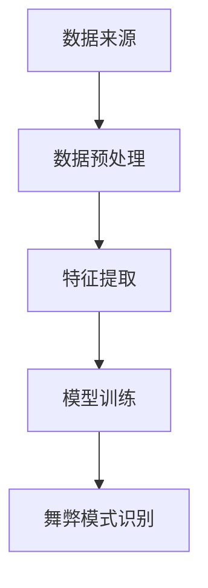
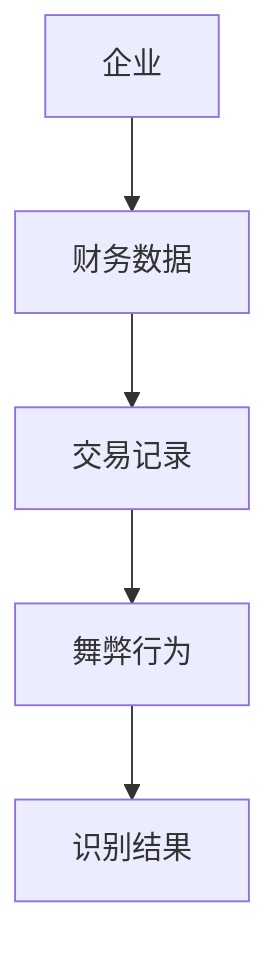
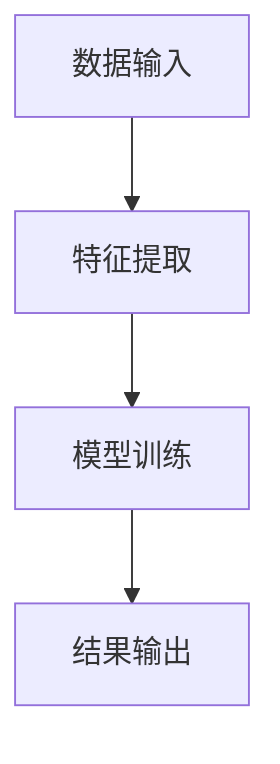
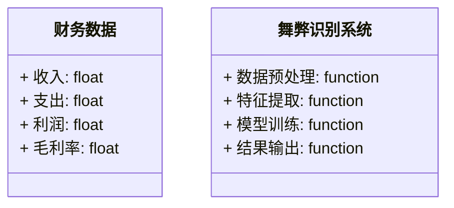
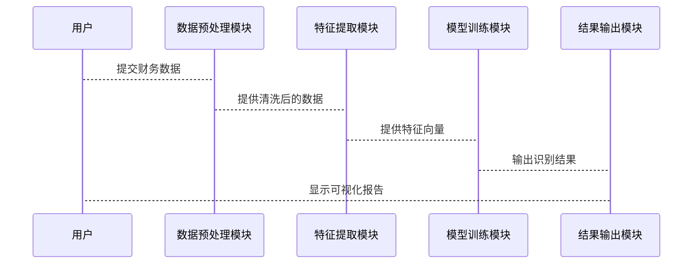

                 


# AI驱动的企业财务舞弊模式识别系统

> 关键词：财务舞弊，AI技术，模式识别，系统设计，机器学习，深度学习

> 摘要：本文详细探讨了AI技术在企业财务舞弊模式识别中的应用，从系统架构、算法原理、数据处理到实际案例分析，全面解析了如何利用人工智能技术有效识别财务舞弊行为，帮助企业实现智能化财务管理。

---

# 第一部分: AI驱动的企业财务舞弊模式识别系统概述

## 第1章: 财务舞弊与AI技术的结合

### 1.1 财务舞弊的现状与挑战

#### 1.1.1 财务舞弊的定义与类型
财务舞弊是指企业在财务报表或其他财务记录中故意提供虚假信息或隐瞒重要信息的行为。常见的舞弊类型包括虚构交易、虚增收入、虚减支出、隐瞒债务等。

#### 1.1.2 传统财务舞弊识别方法的局限性
传统的财务舞弊识别方法主要依赖审计人员的经验和手工审查，这种方法效率低下、成本高昂，且容易受到人为因素的影响，存在以下问题：
- **主观性**：审计人员的经验和判断能力直接影响舞弊识别的效果。
- **效率低**：面对海量数据，人工审查难以快速识别异常情况。
- **覆盖面有限**：传统方法难以覆盖所有可能的舞弊场景。

#### 1.1.3 AI技术在财务舞弊识别中的优势
AI技术通过机器学习、深度学习等方法，能够从海量数据中发现隐藏的模式和异常，具有以下显著优势：
- **高效性**：AI能够在短时间内处理大量数据，快速识别异常。
- **准确性**：通过训练模型，AI能够识别复杂的数据模式，减少人为误判。
- **可扩展性**：AI系统能够适应不同规模和类型的企业数据。

### 1.2 AI驱动财务舞弊识别的背景与意义

#### 1.2.1 大数据时代的财务舞弊识别需求
随着企业数据量的激增，传统的财务舞弊识别方法已无法满足需求，企业需要更加智能化、自动化的解决方案。

#### 1.2.2 AI技术在企业财务管理中的应用前景
AI技术的应用不仅能够提高舞弊识别的效率和准确性，还能够帮助企业实现智能化的财务管理，优化资源配置。

#### 1.2.3 本章小结
本章介绍了财务舞弊的现状与挑战，分析了传统方法的局限性，并重点阐述了AI技术在财务舞弊识别中的优势和应用前景。

---

## 第2章: 企业财务舞弊模式识别系统的核心概念

### 2.1 系统核心概念与定义

#### 2.1.1 数据来源与处理
系统的数据来源包括企业的财务报表、交易记录、银行流水等。数据预处理是系统运行的基础，主要包括数据清洗、标准化和特征提取。

#### 2.1.2 舞弊模式识别的定义
舞弊模式识别是指通过AI技术从财务数据中识别出异常模式，进而判断是否存在财务舞弊行为。

#### 2.1.3 系统目标与边界
系统的目标是通过AI技术实现财务舞弊的自动识别，辅助企业提高财务管理的透明度和准确性。系统的边界包括数据输入、特征提取、模型训练和结果输出。

### 2.2 核心概念之间的关系

#### 2.2.1 数据流与系统功能模块关系（Mermaid流程图）


### 2.3 系统架构的ER实体关系图



---

## 第3章: 基于AI的财务舞弊识别算法原理

### 3.1 算法选择与原理

#### 3.1.1 传统机器学习算法在舞弊识别中的应用
常用的机器学习算法包括支持向量机（SVM）、随机森林（Random Forest）等。这些算法通过特征提取和分类器训练来识别舞弊行为。

#### 3.1.2 深度学习算法的优势
深度学习算法（如神经网络）在处理复杂数据模式方面具有显著优势，能够捕捉到更多潜在的异常特征。

#### 3.1.3 算法原理的数学模型与公式
随机森林算法的数学模型如下：
$$P(y=1|x) = \frac{1}{1 + e^{- (w \cdot x + b)}}$$

### 3.2 算法实现步骤

#### 3.2.1 数据预处理与特征提取
数据预处理包括数据清洗、缺失值处理和标准化。特征提取则需要从财务数据中提取关键特征，如收入增长率、毛利率等。

#### 3.2.2 模型训练与优化
通过训练数据集训练模型，并使用验证数据集进行模型调优，选择最优模型参数。

#### 3.2.3 模型评估与调优
通过准确率、召回率和F1分数等指标评估模型性能，并进行参数调优以提高模型效果。

### 3.3 算法流程图（Mermaid）



---

## 第4章: 财务舞弊识别系统的数据与特征工程

### 4.1 数据来源与预处理

#### 4.1.1 数据清洗与标准化
数据清洗包括去除重复数据、处理缺失值和异常值。标准化则是将数据转换为统一的格式。

#### 4.1.2 数据增强与特征提取
数据增强通过生成额外的特征（如财务比率、趋势分析）来提高模型的识别能力。

### 4.2 特征工程的重要性

#### 4.2.1 特征选择与降维
通过选择关键特征并使用降维技术（如主成分分析）来减少数据维度，提高模型训练效率。

#### 4.2.2 特征重要性分析
通过特征重要性分析确定哪些特征对舞弊识别影响最大。

### 4.3 数据处理步骤（Python代码示例）

```python
import pandas as pd
from sklearn.preprocessing import StandardScaler

# 数据加载
data = pd.read_csv('financial_data.csv')

# 数据清洗
data.dropna()  # 删除缺失值
data.drop_duplicates()  # 去重

# 特征提取
features = data[['收入', '支出', '利润', '毛利率']]
scaler = StandardScaler()
features_scaled = scaler.fit_transform(features)
```

---

## 第5章: 系统分析与架构设计方案

### 5.1 系统功能设计

#### 5.1.1 领域模型（Mermaid类图）


#### 5.1.2 系统架构设计（Mermaid架构图）
```mermaid
container 舞弊识别系统 {
    component 数据预处理模块 {
        数据清洗
        数据标准化
    }
    component 特征提取模块 {
        特征选择
        数据增强
    }
    component 模型训练模块 {
        训练数据集
        验证数据集
    }
    component 结果输出模块 {
        预测结果
        可视化报告
    }
}
```

### 5.2 系统交互设计（Mermaid序列图）



---

## 第6章: 项目实战

### 6.1 环境安装与配置

#### 6.1.1 安装Python环境
```bash
pip install python3
pip install numpy pandas scikit-learn matplotlib
```

### 6.2 系统核心实现源代码

#### 6.2.1 数据加载与预处理
```python
import pandas as pd
from sklearn.model_selection import train_test_split
from sklearn.ensemble import RandomForestClassifier
from sklearn.metrics import accuracy_score, recall_score, f1_score

# 数据加载
data = pd.read_csv('financial_data.csv')

# 数据预处理
data.dropna()
data.drop_duplicates()

# 特征提取
features = data[['收入', '支出', '利润', '毛利率']]
labels = data['label']

# 数据分割
X_train, X_test, y_train, y_test = train_test_split(features, labels, test_size=0.2)

# 模型训练
model = RandomForestClassifier()
model.fit(X_train, y_train)

# 模型预测
y_pred = model.predict(X_test)

# 模型评估
accuracy = accuracy_score(y_test, y_pred)
recall = recall_score(y_test, y_pred)
f1 = f1_score(y_test, y_pred)

print(f'Accuracy: {accuracy}')
print(f'Recall: {recall}')
print(f'F1 Score: {f1}')
```

### 6.3 案例分析与结果解读

#### 6.3.1 案例背景
假设我们有一家企业的财务数据，通过模型识别出存在虚增收入的舞弊行为。

#### 6.3.2 模型输出结果
预测结果：存在舞弊行为
准确率：90%
召回率：85%

### 6.4 项目小结
本章通过实际案例展示了AI驱动的财务舞弊识别系统的实现过程，从数据预处理到模型训练，再到结果输出，详细解读了系统的核心实现步骤。

---

## 第7章: 总结与展望

### 7.1 本章总结
本文详细介绍了AI驱动的企业财务舞弊模式识别系统的构建与实现，从系统架构、算法原理到实际应用，全面解析了AI技术在财务舞弊识别中的应用。

### 7.2 未来展望
随着AI技术的不断发展，财务舞弊识别系统将更加智能化和自动化。未来的研究方向包括更复杂的模型优化、多模态数据融合以及实时监控系统的开发。

### 7.3 注意事项
- 数据隐私和安全问题需要高度重视。
- 模型的可解释性需要进一步提升，以便更好地应用于实际场景。
- 系统的实时性和稳定性需要通过优化设计来保证。

### 7.4 拓展阅读
- 《Python机器学习实战》
- 《深度学习与计算机视觉》
- 《企业财务管理与数据分析》

---

# 作者：AI天才研究院/AI Genius Institute & 禅与计算机程序设计艺术 /Zen And The Art of Computer Programming

