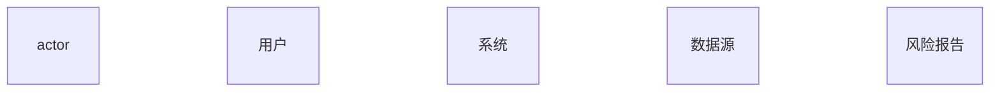
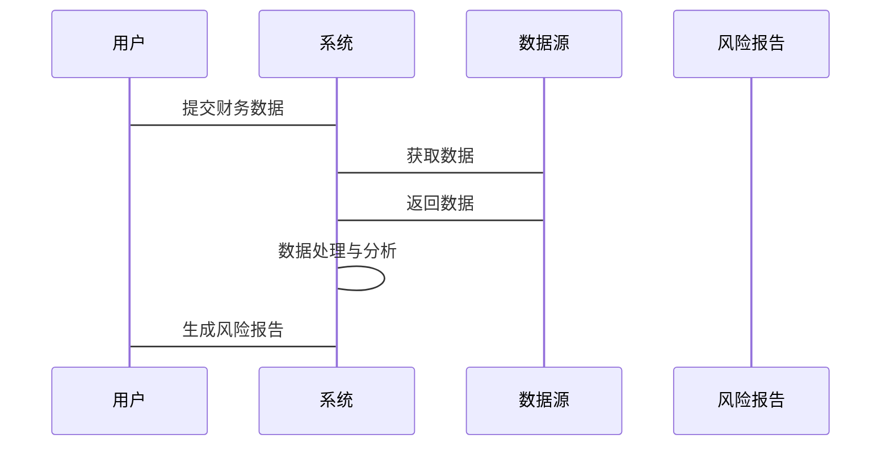

                 


# AI驱动的企业财务舞弊风险传导路径识别系统

> 关键词：AI技术、财务舞弊、风险传导路径、系统设计、企业风险管理

> 摘要：本文探讨了利用人工智能技术识别企业财务舞弊风险传导路径的系统设计与实现。通过分析财务数据，结合AI算法，构建风险传导路径模型，实现对财务舞弊风险的早期预警与精准识别。文章详细阐述了系统的设计思路、算法原理、系统架构，并通过实际案例分析展示了系统的应用价值。

---

## 第一部分: 背景介绍

### 第1章: 企业财务舞弊风险识别的背景与挑战

#### 1.1 问题背景
- 企业财务舞弊的现状与趋势
- 财务舞弊对企业及利益相关者的影响
- 传统财务舞弊识别方法的局限性

#### 1.2 问题描述
- 财务舞弊风险传导路径的定义
- 舞弊风险传导路径的关键要素
- 舞弊风险传导路径的复杂性与动态性

#### 1.3 问题解决
- 引入AI技术的必要性
- AI在财务舞弊风险识别中的优势
- 系统化识别舞弊风险传导路径的目标

#### 1.4 边界与外延
- 系统边界与功能范围
- 舞弊风险传导路径识别的适用场景
- 系统与外部环境的交互

#### 1.5 概念结构与核心要素
- 核心概念的层次结构
- 舞弊风险传导路径的关键要素
- 系统功能模块与核心要素的对应关系

### 第2章: AI驱动的财务舞弊风险识别系统概述

#### 2.1 核心概念与联系
- AI技术在财务舞弊识别中的应用原理
- 财务数据与舞弊风险传导路径的关系
- 舞弊风险传导路径识别的系统架构

#### 2.2 核心概念对比
- 不同AI技术在舞弊识别中的应用对比
- 舞弊风险传导路径与传统风险评估方法的对比
- 系统功能模块与核心要素的对比分析

#### 2.3 ER实体关系图


---

## 第二部分: 核心概念与联系

### 第3章: AI技术在财务舞弊识别中的应用原理

#### 3.1 AI技术的核心原理
- 机器学习算法（如监督学习、无监督学习）
- 深度学习模型（如神经网络、LSTM）
- 自然语言处理（NLP）在财务文本分析中的应用

#### 3.2 财务数据与舞弊风险的关系
- 财务数据的特征提取与分析
- 舞弊风险传导路径的数学模型
- 数据预处理与特征工程

#### 3.3 系统功能模块与核心要素的对应关系
- 数据采集模块
- 数据处理模块
- 风险识别模块
- 风险报告模块

---

## 第三部分: 算法原理讲解

### 第4章: 基于机器学习的舞弊风险识别算法

#### 4.1 算法选择与优化
- 选择合适的机器学习算法（如随机森林、支持向量机）
- 算法调优与参数优化
- 模型评估与验证

#### 4.2 算法流程图


#### 4.3 Python实现代码
```python
import pandas as pd
from sklearn.ensemble import RandomForestClassifier
from sklearn.metrics import accuracy_score

# 数据加载与预处理
data = pd.read_csv('financial_data.csv')
X = data.drop('fraud_label', axis=1)
y = data['fraud_label']

# 特征工程
# （假设已完成特征提取与处理）

# 模型训练
model = RandomForestClassifier()
model.fit(X_train, y_train)

# 模型评估
y_pred = model.predict(X_test)
print("准确率:", accuracy_score(y_test, y_pred))
```

#### 4.4 数学模型与公式
- 随机森林模型的数学表达
- 逻辑回归模型的损失函数
- 神经网络模型的激活函数

---

## 第四部分: 系统分析与架构设计

### 第5章: 问题场景与系统功能设计

#### 5.1 问题场景介绍
- 财务舞弊风险传导路径的典型场景
- 系统需要解决的具体问题
- 系统功能需求的详细描述

#### 5.2 系统功能设计
- 数据采集模块
- 数据处理模块
- 风险识别模块
- 风险报告模块

#### 5.3 系统架构设计


#### 5.4 系统接口设计
- API接口定义
- 数据输入与输出接口
- 系统调用接口

#### 5.5 系统交互流程图


---

## 第五部分: 项目实战

### 第6章: 项目实施与代码实现

#### 6.1 环境安装与配置
- 安装Python与相关库（如scikit-learn、pandas）
- 安装IDE与开发工具

#### 6.2 系统核心代码实现
```python
import pandas as pd
from sklearn.ensemble import RandomForestClassifier
from sklearn.metrics import accuracy_score

# 数据加载与预处理
data = pd.read_csv('financial_data.csv')
X = data.drop('fraud_label', axis=1)
y = data['fraud_label']

# 特征工程
# （假设已完成特征提取与处理）

# 模型训练
model = RandomForestClassifier()
model.fit(X_train, y_train)

# 模型评估
y_pred = model.predict(X_test)
print("准确率:", accuracy_score(y_test, y_pred))
```

#### 6.3 代码应用解读与分析
- 代码的功能模块划分
- 代码的运行流程
- 代码的可扩展性与优化空间

#### 6.4 实际案例分析
- 真实案例的背景介绍
- 系统如何识别舞弊风险
- 风险报告的生成与解读

#### 6.5 项目小结
- 项目实施的关键点
- 系统的实际应用价值
- 系统的局限性与改进方向

---

## 第六部分: 最佳实践与总结

### 第7章: 最佳实践与系统优化

#### 7.1 最佳实践
- 数据清洗与特征工程的注意事项
- 算法选择与优化的技巧
- 系统部署与维护的建议

#### 7.2 小结
- 系统设计的核心要点
- 项目实施的关键步骤
- 系统应用的前景与挑战

#### 7.3 注意事项
- 数据隐私与安全问题
- 系统的可解释性与透明性
- 算法的鲁棒性与稳定性

#### 7.4 拓展阅读
- 推荐的书籍与文献
- 相关领域的研究进展
- 未来的研究方向

---

## 作者：AI天才研究院 & 禅与计算机程序设计艺术

