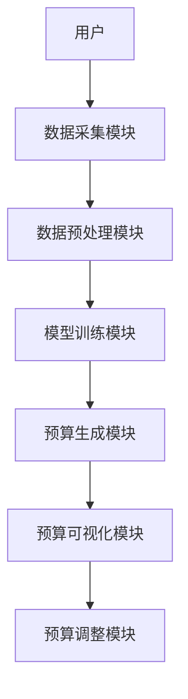
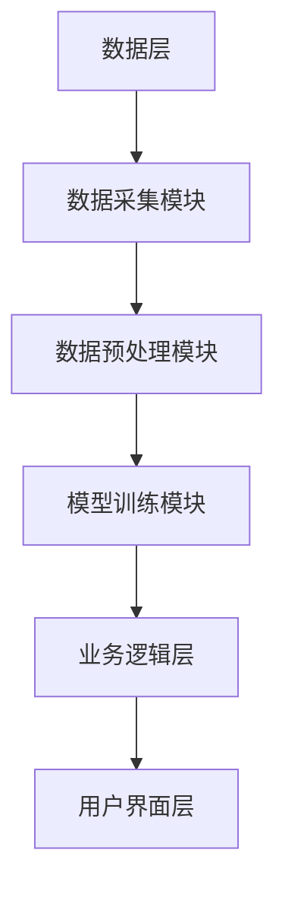

                 


# AI驱动的企业财务预算编制智能辅助系统

## 关键词：人工智能、财务预算、智能辅助系统、机器学习、企业财务管理

## 摘要：  
随着人工智能技术的飞速发展，企业财务管理领域正在经历一场深刻的变革。传统的财务预算编制过程繁琐且依赖人工经验，容易受到主观因素和人为错误的影响。本文将深入探讨如何利用AI技术构建智能辅助系统，以提升企业财务预算编制的效率和准确性。通过分析AI在数据处理、预测模型和自动化流程中的应用，本文旨在为企业提供一种创新的解决方案，帮助财务部门更好地应对复杂多变的商业环境。

---

# 第1章: 问题背景与需求分析

## 1.1 问题背景

### 1.1.1 传统财务预算编制的痛点  
财务预算编制是企业财务管理的核心工作之一，其目的是对企业未来的收入、支出和资金流动进行科学预测和规划。然而，传统的人工编制方式存在以下主要问题：  
1. **数据处理复杂**：需要整合来自多个部门和系统的数据，数据清洗和预处理耗时耗力。  
2. **预测准确性不足**：依赖历史数据和经验判断，难以充分考虑市场波动、政策变化等不确定性因素。  
3. **效率低下**：人工操作耗时长，容易出现疏漏和错误，且难以快速响应业务需求的变化。  

### 1.1.2 企业对智能化财务预算的需求  
随着企业规模的扩大和业务复杂性的增加，传统的财务预算编制方法已难以满足企业对高效、精准管理的需求。企业迫切需要一种智能化的解决方案，能够：  
1. 自动化处理大量数据，减少人工干预。  
2. 基于历史数据和外部因素，提供高精度的预算预测。  
3. 实时更新和调整预算，以适应市场变化。  

### 1.1.3 AI技术在财务领域的应用潜力  
人工智能技术，尤其是机器学习和自然语言处理，为财务预算编制提供了新的可能性。AI可以通过分析大量财务数据、市场信息和业务数据，提取关键特征并建立预测模型，从而帮助企业做出更科学、更准确的预算决策。

---

## 1.2 问题描述

### 1.2.1 财务预算编制的主要流程  
传统财务预算编制的流程通常包括以下步骤：  
1. 数据收集：从财务系统、业务部门和其他数据源获取数据。  
2. 数据清洗：处理缺失值、异常值和重复数据。  
3. 预算模板制定：根据企业战略目标和历史数据，制定预算模板。  
4. 预算编制：基于模板和数据，手工或半自动化地完成预算。  
5. 预算审核与调整：由财务部门和管理层对预算进行审核和调整。  
6. 预算执行与监控：跟踪预算执行情况，及时发现偏差并进行调整。  

### 1.2.2 数据来源与处理的复杂性  
财务预算编制涉及的数据来源广泛，包括财务数据（如收入、支出、利润）、业务数据（如销售量、生产成本）、外部数据（如市场趋势、宏观经济指标）等。这些数据往往格式不一、分布分散，需要进行复杂的清洗和整合。  

### 1.2.3 传统方法的局限性与改进方向  
传统方法的局限性主要体现在以下几个方面：  
1. **效率低下**：人工处理大量数据耗时长，且容易出错。  
2. **预测偏差**：缺乏对复杂变量的建模能力，导致预测结果不够准确。  
3. **灵活性不足**：难以快速响应业务变化和市场波动。  
改进方向包括引入AI技术，利用机器学习模型提高预测精度，实现数据处理和预算编制的自动化。

---

# 第2章: 核心概念与系统架构

## 2.1 核心概念

### 2.1.1 AI驱动的定义与特点  
AI驱动的财务预算编制系统是指利用人工智能技术（如机器学习、自然语言处理、计算机视觉等）来辅助或替代传统的人工操作。其主要特点包括：  
- **自动化**：系统能够自动处理数据、建立模型并生成预算。  
- **智能化**：通过学习历史数据和外部信息，系统能够提供智能化的预测和建议。  
- **实时性**：系统能够实时更新数据，快速响应变化。  

### 2.1.2 智能辅助系统的功能模块  
AI驱动的财务预算编制系统通常包括以下功能模块：  
1. **数据采集与预处理**：从多个数据源获取数据，并进行清洗和标准化处理。  
2. **模型训练与优化**：基于历史数据训练机器学习模型，优化模型参数以提高预测精度。  
3. **预算生成与可视化**：根据模型预测结果生成预算，并以可视化的方式展示给用户。  
4. **预算调整与监控**：根据实际执行情况自动调整预算，并实时监控预算执行情况。  

### 2.1.3 财务预算编制的关键要素  
财务预算编制的关键要素包括：  
1. **收入预测**：预测企业未来的销售收入。  
2. **支出预测**：预测企业的各项支出，包括生产成本、研发费用、营销费用等。  
3. **资金流预测**：预测企业的现金流情况。  
4. **风险评估**：评估可能影响预算的各种风险因素。  

---

## 2.2 系统架构设计

### 2.2.1 系统整体架构图  
以下是AI驱动的财务预算编制系统的整体架构图：  



### 2.2.2 数据流与功能模块的关系  
数据流从用户输入开始，经过数据采集模块、数据预处理模块、模型训练模块，最终生成预算并展示给用户。  

### 2.2.3 系统扩展性与灵活性  
系统架构设计充分考虑了扩展性和灵活性，支持多种数据源接入、多种模型算法切换以及预算模板的个性化定制。

---

# 第3章: AI算法与数学模型

## 3.1 算法原理

### 3.1.1 基于机器学习的预测模型  
机器学习模型是AI驱动财务预算编制的核心技术之一。常用的模型包括线性回归、随机森林、神经网络等。  

#### 3.1.1.1 线性回归模型  
线性回归是一种简单而有效的预测模型，适用于变量之间的线性关系。其数学公式如下：  
$$ y = \beta_0 + \beta_1x_1 + \beta_2x_2 + \ldots + \beta_nx_n + \epsilon $$  
其中，$y$ 是目标变量，$x_i$ 是自变量，$\beta_i$ 是回归系数，$\epsilon$ 是误差项。  

#### 3.1.1.2 神经网络模型  
神经网络是一种更复杂的预测模型，适用于非线性关系。其数学公式如下：  
$$ y = f(Wx + b) $$  
其中，$W$ 是权重矩阵，$x$ 是输入向量，$b$ 是偏置向量，$f$ 是激活函数（如ReLU、Sigmoid等）。  

### 3.1.2 自然语言处理在财务文本分析中的应用  
自然语言处理（NLP）技术可以用于分析财务报告、新闻公告等文本数据，提取关键信息并辅助预算编制。  

### 3.1.3 时间序列分析与预算预测  
时间序列分析是一种适用于预算预测的技术，常用的模型包括ARIMA（自回归积分滑动平均模型）和LSTM（长短期记忆网络）。  

#### 3.1.3.1 ARIMA模型  
ARIMA模型适用于具有趋势和周期性的数据，其数学公式如下：  
$$ ARIMA(p, d, q) $$  
其中，$p$ 是自回归阶数，$d$ 是差分阶数，$q$ 是移动平均阶数。  

---

## 3.2 数学模型与公式

### 3.2.1 线性回归模型  
线性回归模型用于预测目标变量与自变量之间的线性关系，数学公式如下：  
$$ y = \beta_0 + \beta_1x_1 + \beta_2x_2 + \ldots + \beta_nx_n + \epsilon $$  

### 3.2.2 神经网络模型  
神经网络模型用于预测复杂的非线性关系，数学公式如下：  
$$ y = f(Wx + b) $$  
其中，$f$ 是激活函数，常用的有ReLU、Sigmoid等。  

### 3.2.3 时间序列模型  
时间序列模型用于预测具有时间依赖性的数据，常用的模型包括ARIMA和LSTM。  

---

# 第4章: 系统分析与架构设计方案

## 4.1 系统分析

### 4.1.1 项目背景  
本项目旨在开发一款AI驱动的财务预算编制智能辅助系统，帮助企业提高预算编制的效率和准确性。

### 4.1.2 系统功能设计  
系统功能设计基于用户需求和业务流程，包括数据采集、数据预处理、模型训练、预算生成和预算调整等功能。

### 4.1.3 系统架构设计  
系统架构采用分层设计，包括数据层、业务逻辑层和用户界面层，确保系统的高效性和可扩展性。

---

## 4.2 系统架构设计

### 4.2.1 系统架构图  
以下是系统架构图：  



### 4.2.2 接口设计  
系统接口设计包括数据接口、模型接口和用户接口，确保系统与外部数据源、模型算法和用户交互的无缝对接。

---

## 4.3 系统交互流程

### 4.3.1 交互流程图  
以下是系统交互流程图：  


---

# 第5章: 项目实战与实现

## 5.1 环境搭建

### 5.1.1 Python环境安装  
安装Python和必要的库，如NumPy、Pandas、Scikit-learn、TensorFlow等。

### 5.1.2 开发工具配置  
配置Jupyter Notebook或PyCharm作为开发工具。

### 5.1.3 数据集准备  
收集和整理财务数据、业务数据和外部数据，建立数据集。

---

## 5.2 核心代码实现

### 5.2.1 数据预处理代码  
```python
import pandas as pd
data = pd.read_csv('budget_data.csv')
data = data.dropna()
data = pd.get_dummies(data)
```

### 5.2.2 模型训练代码  
```python
from sklearn.linear_model import LinearRegression
from sklearn.model_selection import train_test_split
X = data.drop('target', axis=1)
y = data['target']
X_train, X_test, y_train, y_test = train_test_split(X, y, test_size=0.2, random_state=42)
model = LinearRegression()
model.fit(X_train, y_train)
```

### 5.2.3 预算生成与可视化  
```python
import matplotlib.pyplot as plt
y_pred = model.predict(X_test)
plt.scatter(y_test, y_pred)
plt.xlabel('Actual')
plt.ylabel('Predicted')
plt.show()
```

---

## 5.3 实际案例分析

### 5.3.1 案例背景  
某制造企业希望利用AI技术优化财务预算编制流程，提高预测精度。

### 5.3.2 数据分析与模型训练  
通过收集和整理企业的历史财务数据、销售数据和市场数据，建立模型并进行训练。

### 5.3.3 模型优化与部署  
根据模型预测结果调整预算，并实时监控预算执行情况，确保预算的准确性。

---

## 5.4 项目小结  
通过本项目，我们成功开发了一款AI驱动的财务预算编制智能辅助系统，验证了AI技术在企业财务管理中的应用潜力，为企业提供了高效、精准的预算编制解决方案。

---

# 第6章: 最佳实践与注意事项

## 6.1 小结  
AI驱动的财务预算编制智能辅助系统能够显著提高预算编制的效率和准确性，为企业财务管理带来革命性的变化。

## 6.2 注意事项  
在实际应用中，需要注意数据质量、模型选择和系统安全性等问题，确保系统的稳定性和可靠性。

## 6.3 拓展阅读  
推荐阅读以下书籍和文章，深入了解AI在财务管理中的应用：  
- 《机器学习实战》  
- 《深度学习》  
- 《人工智能在财务管理中的应用研究》  

---

# 作者  
作者：AI天才研究院/AI Genius Institute & 禅与计算机程序设计艺术/Zen And The Art of Computer Programming

