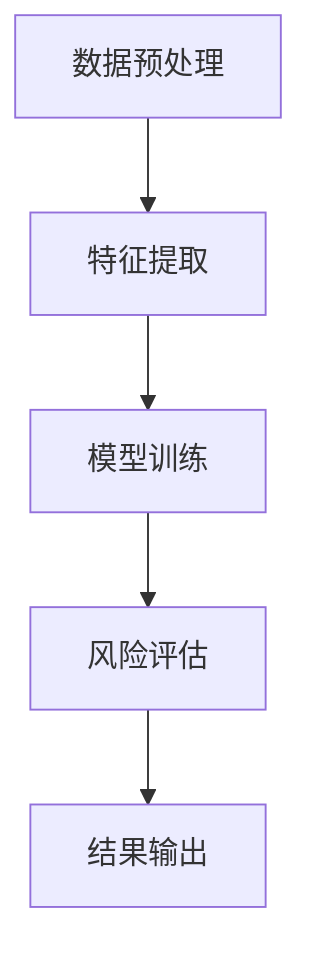
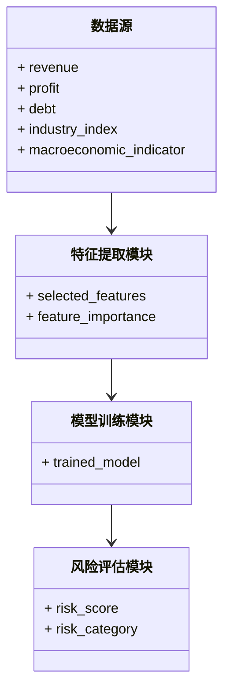
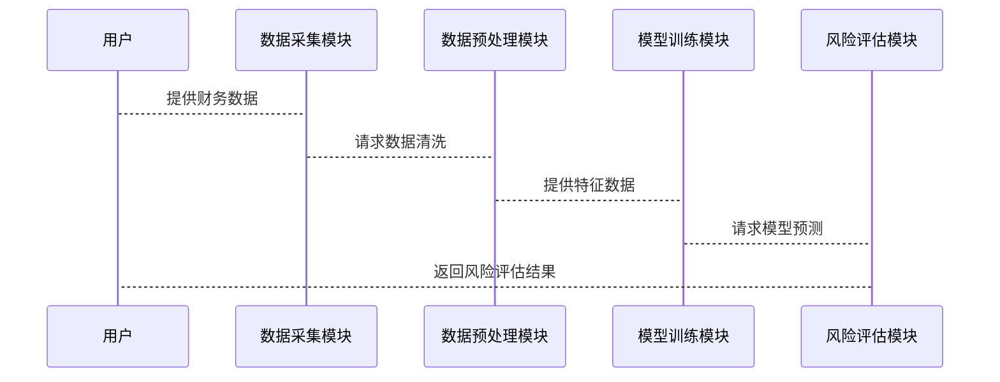

                 


# AI驱动的企业财务风险量化评估系统

> 关键词：AI, 财务风险, 量化评估, 机器学习, 系统架构

> 摘要：本文详细探讨了AI技术在企业财务风险量化评估中的应用，从系统设计、算法原理到项目实战，全面解析了如何利用人工智能技术提升企业财务风险管理的效率和准确性。

---

## 第一部分: AI驱动的企业财务风险量化评估系统概述

### 第1章: 背景介绍

#### 1.1 问题背景与描述

##### 1.1.1 企业财务风险的定义与重要性
企业财务风险是指企业在经营过程中由于内外部因素的变化，导致无法按时履行债务或其他财务损失的可能性。这些风险可能来自市场波动、经济 downturn、管理决策失误或外部经济环境变化。财务风险的管理对企业生存和可持续发展至关重要。

##### 1.1.2 传统财务风险管理的局限性
传统的财务风险管理方法依赖于人工分析和经验判断，存在以下问题：
- 数据量有限：传统方法通常依赖于少量的历史数据，难以捕捉复杂的市场动态。
- 主观性较高：分析结果受分析师主观判断影响较大。
- 反应速度慢：面对突发的市场变化，传统方法难以快速调整策略。

##### 1.1.3 AI技术在财务风险管理中的应用潜力
人工智能技术，特别是机器学习和深度学习，能够处理海量数据，识别复杂模式，并实时提供预测和决策支持。AI技术可以显著提升财务风险管理的效率和准确性。

#### 1.2 问题解决与边界

##### 1.2.1 AI驱动的财务风险量化评估目标
- 实现实时的财务风险监控。
- 提供基于数据驱动的量化评估结果。
- 支持企业制定智能化的财务风险管理策略。

##### 1.2.2 系统的边界与外延
- 系统边界：仅关注财务相关数据，不涉及企业非财务信息。
- 系统外延：可以与其他企业管理系统（如ERP）集成，提供更全面的风险管理解决方案。

##### 1.2.3 核心要素与组成结构
- 数据采集模块：从企业内外部数据源获取相关信息。
- 风险评估模型：基于机器学习算法构建的预测模型。
- 结果可视化模块：将评估结果以直观形式展示给用户。

---

### 第2章: 核心概念与联系

#### 2.1 核心概念原理

##### 2.1.1 数据特征与风险因子
- 数据特征：包括企业财务数据（收入、利润、负债等）、市场数据（行业指数、宏观经济指标等）和非结构化数据（新闻、社交媒体信息）。
- 风险因子：通过特征工程提取的关键风险指标，如企业流动性风险、偿债能力等。

##### 2.1.2 模型特征与评估指标
- 模型特征：包括特征重要性、模型复杂度、预测精度等。
- 评估指标：如准确率、召回率、F1分数等。

##### 2.1.3 系统特征与功能模块
- 系统特征：实时性、准确性、可解释性。
- 功能模块：数据采集、特征提取、模型训练、风险评估、结果输出。

#### 2.2 数据特征对比表

| 数据类型 | 数据来源 | 数据处理方法 |
|----------|----------|--------------|
| 结构化数据 | 企业财务报表 | 数据清洗、标准化 |
| 非结构化数据 | 新闻、社交媒体 | 自然语言处理、情感分析 |
| 市场数据 | 行业指数、宏观经济指标 | 数据聚合、时间序列分析 |

#### 2.3 ER实体关系图
```mermaid
er
  actor: 用户
  model: 风险评估模型
  data: 数据源
  result: 评估结果
  actor --> data: 提供
  actor --> model: 调用
  model --> result: 输出
```

---

## 第3章: 算法原理讲解

### 3.1 算法流程图


### 3.2 算法实现代码

#### 3.2.1 数据预处理
```python
import pandas as pd
from sklearn.preprocessing import StandardScaler

# 加载数据
data = pd.read_csv('financial_data.csv')

# 删除缺失值
data.dropna(inplace=True)

# 标准化处理
scaler = StandardScaler()
scaled_data = scaler.fit_transform(data[['revenue', 'profit', 'debt']])
```

#### 3.2.2 特征提取
```python
from sklearn.feature_selection import SelectFromModel
from sklearn.ensemble import RandomForestClassifier

# 构建特征选择模型
selector = SelectFromModel(RandomForestClassifier(n_estimators=100, random_state=42))
selector.fit(scaled_data, target)

# 提取重要特征
selected_features = data.columns[selector.get_support()]
```

#### 3.2.3 模型训练
```python
from sklearn.model_selection import train_test_split
from sklearn.metrics import accuracy_score

# 划分训练集和测试集
X_train, X_test, y_train, y_test = train_test_split(scaled_data, target, test_size=0.2, random_state=42)

# 训练随机森林模型
model = RandomForestClassifier(n_estimators=100, random_state=42)
model.fit(X_train, y_train)

# 模型评估
y_pred = model.predict(X_test)
print("Accuracy:", accuracy_score(y_test, y_pred))
```

#### 3.2.4 数学模型与公式
- 随机森林算法基于决策树构建，其数学模型如下：
  $$
  y = \text{sign} \left( \sum_{i=1}^{n} \text{weight}_i \cdot f_i(x) \right)
  $$
  其中，$f_i(x)$是第$i$棵决策树的预测结果，$\text{weight}_i$是权重。

---

## 第4章: 系统分析与架构设计

### 4.1 问题场景介绍
企业财务风险量化评估系统需要处理大量的财务数据，实时监控企业的财务状况，并为管理层提供决策支持。

### 4.2 系统功能设计

#### 4.2.1 领域模型类图


### 4.3 系统架构设计

#### 4.3.1 系统架构图
```mermaid
container 容器 {
    组件 数据采集模块
    组件 数据预处理模块
    组件 模型训练模块
    组件 风险评估模块
    组件 结果可视化模块
}
```

#### 4.3.2 接口设计
- 数据输入接口：接收企业财务数据和市场数据。
- 模型调用接口：提供API供其他系统调用风险评估结果。

### 4.4 系统交互流程图


---

## 第5章: 项目实战

### 5.1 环境安装
```bash
pip install pandas scikit-learn mermaid4jupyter jupyterlab
```

### 5.2 核心实现代码

#### 5.2.1 数据预处理
```python
import pandas as pd
from sklearn.preprocessing import StandardScaler

data = pd.read_csv('financial_data.csv')
data.dropna(inplace=True)
scaler = StandardScaler()
scaled_data = scaler.fit_transform(data[['revenue', 'profit', 'debt']])
```

#### 5.2.2 模型训练与评估
```python
from sklearn.ensemble import RandomForestClassifier
from sklearn.model_selection import train_test_split
from sklearn.metrics import accuracy_score

X_train, X_test, y_train, y_test = train_test_split(scaled_data, target, test_size=0.2, random_state=42)
model = RandomForestClassifier(n_estimators=100, random_state=42)
model.fit(X_train, y_train)
y_pred = model.predict(X_test)
print("Accuracy:", accuracy_score(y_test, y_pred))
```

#### 5.2.3 结果可视化
```python
import matplotlib.pyplot as plt
importances = model.feature_importances_
indices = np.argsort(importances)[::-1]

plt.title('Feature Importances')
plt.xticks(range(len(importances)), data.columns[indices])
plt.show()
```

### 5.3 实际案例分析
以某制造企业为例，分析其财务风险。通过模型预测，发现其短期偿债能力较弱，建议企业优化现金流管理。

---

## 第6章: 最佳实践与小结

### 6.1 最佳实践

#### 6.1.1 数据质量的重要性
确保数据的完整性和准确性，特别是在处理非结构化数据时，需要进行充分的清洗和预处理。

#### 6.1.2 模型更新与维护
定期更新模型，避免过时数据导致的预测偏差。

#### 6.1.3 可解释性与可操作性
模型的可解释性对于企业的实际应用至关重要，确保管理层能够理解并采取相应的措施。

### 6.2 小结

通过本文的详细讲解，我们可以看到AI技术在企业财务风险量化评估中的巨大潜力。从数据采集到模型训练，再到结果可视化，AI技术能够显著提升风险管理的效率和准确性。

### 6.3 注意事项

- 数据隐私与安全：在处理企业财务数据时，必须严格遵守相关法律法规，保护数据隐私。
- 模型的泛化能力：避免过拟合，确保模型在不同场景下的泛化能力。
- 实时性与响应速度：在实时监控场景下，需要优化系统的响应速度。

### 6.4 拓展阅读

- 《机器学习实战》
- 《深度学习》
- 《企业风险管理》

---

## 作者：AI天才研究院/AI Genius Institute & 禅与计算机程序设计艺术 /Zen And The Art of Computer Programming

---

**注意：** 以上内容仅为示例，实际撰写时需要根据具体情况进行调整和补充。

