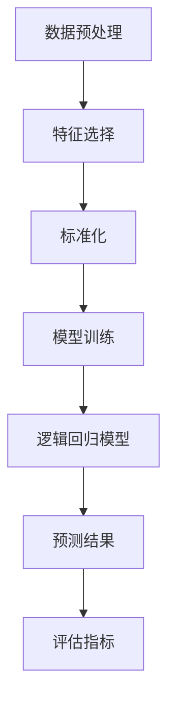
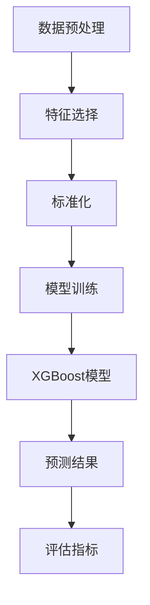
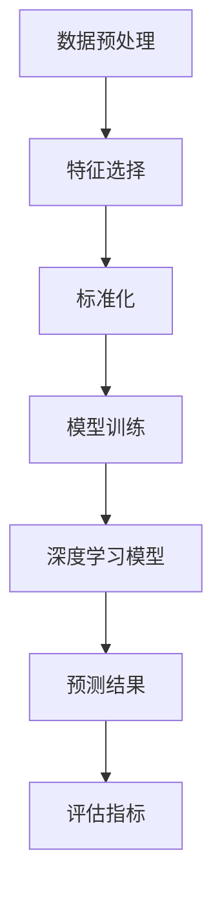
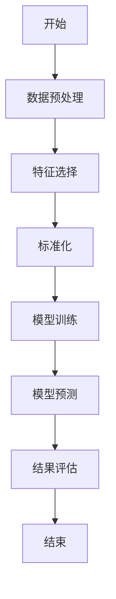
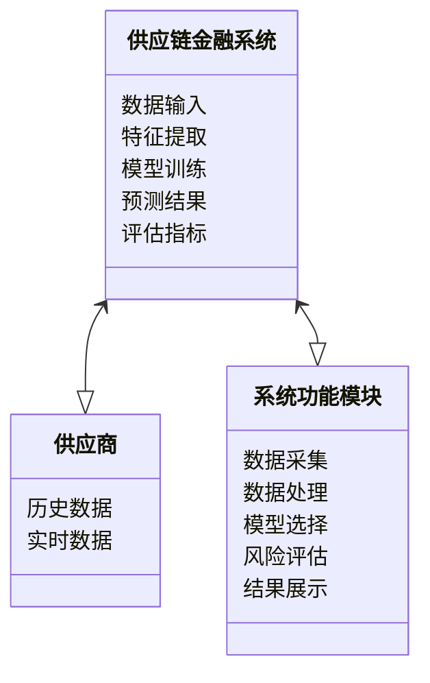
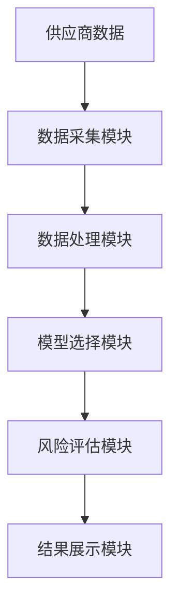
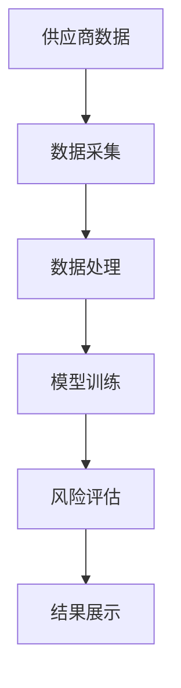
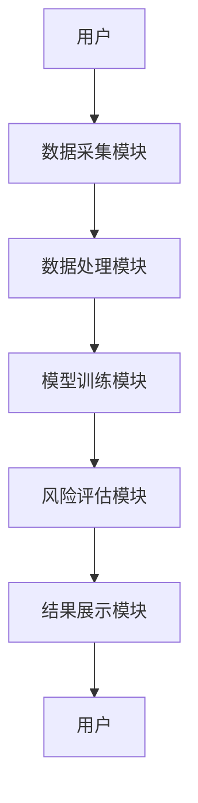

                 


```markdown
# AI驱动的供应链金融信用风险评估

## 关键词：供应链金融、信用风险评估、人工智能、机器学习、风险管理

## 摘要：本文深入探讨了AI技术在供应链金融信用风险评估中的应用，从核心概念、算法原理到系统架构和项目实战，全面分析了如何利用AI技术提升信用风险评估的准确性和效率。文章结合实际案例，详细讲解了逻辑回归、XGBoost和深度学习模型的应用，并通过系统架构设计展示了AI驱动的信用风险评估系统的实现方案。

---

# 第三部分: AI驱动的信用风险评估算法原理

# 第3章: AI驱动的信用风险评估算法原理

## 3.1 算法原理概述

### 3.1.1 逻辑回归模型

逻辑回归是一种经典的分类算法，常用于信用风险评估中的违约概率预测。其核心思想是通过将线性回归的结果压缩到sigmoid函数的输出范围内，将不可见的信用风险概率转化为可解释的二分类问题。

#### 算法流程图



#### 数学模型与公式

逻辑回归的损失函数定义为：

$$ L(\theta) = -\sum_{i=1}^{n} [y_i \ln(p_i) + (1 - y_i) \ln(1 - p_i)] $$

其中，$p_i$ 是预测概率，$y_i$ 是真实标签。模型预测概率公式为：

$$ P(y=1|x) = \frac{e^{\beta_0 + \beta_1x_1 + \dots + \beta_kx_k}}{1 + e^{\beta_0 + \beta_1x_1 + \dots + \beta_kx_k}} $$

#### 示例分析

假设我们有一个简单的数据集，包含两个特征（如供应商历史违约率和交易金额），我们可以通过逻辑回归模型预测供应商的违约概率。训练完成后，模型可以输出一个概率值，帮助决策者判断信用风险。

### 3.1.2 XGBoost模型

XGBoost是一种基于树的集成算法，具有高准确性和强健性的特点，广泛应用于信用风险评估领域。

#### 算法流程图



#### 数学模型与公式

XGBoost的目标函数可以表示为：

$$ \text{目标函数} = \sum_{i=1}^{n} [ -y_i \ln(p_i) - (1 - y_i) \ln(1 - p_i) ] + \sum_{i=1}^{n} \lambda D \text{（正则化项）} $$

其中，$\lambda$ 是正则化参数，$D$ 是树的深度。

#### 示例分析

通过XGBoost模型，我们可以对供应商的历史交易数据进行建模，预测其信用风险。模型能够自动提取复杂特征，显著提高预测精度。

### 3.1.3 深度学习模型

深度学习模型（如LSTM）适用于处理时间序列数据，能够捕捉到传统模型难以发现的模式。

#### 算法流程图



#### 数学模型与公式

LSTM的长短期记忆单元定义为：

$$ f_t = \sigma(g_t + h_{t-1}) $$

其中，$\sigma$ 是sigmoid函数，$g_t$ 是输入门，$h_{t-1}$ 是前一时刻的隐藏状态。

#### 示例分析

利用LSTM模型对供应商的历史支付数据进行建模，可以预测未来的信用风险。

---

## 3.2 算法原理流程图

### 3.2.1 逻辑回归算法流程图



### 3.2.2 XGBoost算法流程图


### 3.2.3 深度学习模型流程图


---

## 3.3 数学模型与公式

### 3.3.1 逻辑回归模型公式

$$ P(y=1|x) = \frac{e^{\beta_0 + \beta_1x_1 + \dots + \beta_kx_k}}{1 + e^{\beta_0 + \beta_1x_1 + \dots + \beta_kx_k}} $$

### 3.3.2 XGBoost损失函数公式

$$ \text{损失函数} = \sum_{i=1}^{n} [ -y_i \ln(p_i) - (1 - y_i) \ln(1 - p_i) ] + \sum_{i=1}^{n} \lambda D \text{（正则化项）} $$

### 3.3.3 深度学习模型公式

$$ f_t = \sigma(g_t + h_{t-1}) $$

---

# 第四部分: 系统分析与架构设计方案

# 第4章: 系统分析与架构设计

## 4.1 问题场景介绍

供应链金融中的信用风险主要集中在供应商的信用评估和交易风险监控。传统方法依赖人工经验，存在效率低、准确性差的问题。AI技术的应用可以显著提升信用风险评估的效率和准确性。

## 4.2 系统功能设计

### 4.2.1 领域模型设计



### 4.2.2 系统架构设计



## 4.3 系统架构设计

### 4.3.1 系统架构图



## 4.4 系统接口设计

### 4.4.1 数据接口

- 数据输入接口：从供应商获取历史交易数据和实时数据。
- 数据输出接口：将预测结果返回给供应链金融系统。

### 4.4.2 模型接口

- 模型训练接口：接收特征数据，训练信用风险模型。
- 模型预测接口：输入新数据，返回预测结果。

## 4.5 系统交互设计

### 4.5.1 交互流程图



---

# 第五部分: 项目实战

# 第5章: 项目实战

## 5.1 环境安装

### 5.1.1 Python环境配置

安装必要的Python库：

```bash
pip install pandas numpy scikit-learn xgboost
```

## 5.2 系统核心实现源代码

### 5.2.1 数据预处理代码

```python
import pandas as pd
import numpy as np

# 加载数据
data = pd.read_csv('supplier_data.csv')

# 数据清洗
data.dropna(inplace=True)

# 标准化处理
from sklearn.preprocessing import StandardScaler
scaler = StandardScaler()
data_scaled = scaler.fit_transform(data)
```

### 5.2.2 模型训练代码

```python
from sklearn.linear_model import LogisticRegression
from xgboost import XGBClassifier

# 逻辑回归模型
lr_model = LogisticRegression()
lr_model.fit(X_train, y_train)

# XGBoost模型
xgb_model = XGBClassifier()
xgb_model.fit(X_train, y_train)
```

### 5.2.3 模型评估代码

```python
from sklearn.metrics import accuracy_score, precision_score, recall_score

# 评估逻辑回归模型
y_pred_lr = lr_model.predict(X_test)
print(f"逻辑回归准确率: {accuracy_score(y_test, y_pred_lr)}")
print(f"逻辑回归精确率: {precision_score(y_test, y_pred_lr)}")
print(f"逻辑回归召回率: {recall_score(y_test, y_pred_lr)}")

# 评估XGBoost模型
y_pred_xgb = xgb_model.predict(X_test)
print(f"XGBoost准确率: {accuracy_score(y_test, y_pred_xgb)}")
print(f"XGBoost精确率: {precision_score(y_test, y_pred_xgb)}")
print(f"XGBoost召回率: {recall_score(y_test, y_pred_xgb)}")
```

## 5.3 实际案例分析

假设我们有一个包含1000家供应商的数据集，我们可以通过上述代码训练逻辑回归和XGBoost模型，评估其信用风险。模型预测结果可以帮助决策者优化供应链金融策略。

---

# 第六部分: 最佳实践

# 第6章: 最佳实践

## 6.1 小结

本文详细探讨了AI技术在供应链金融信用风险评估中的应用，从核心概念到算法实现，再到系统设计，全面展示了如何利用AI技术提升信用风险评估的效率和准确性。

## 6.2 注意事项

- 数据质量是模型性能的关键，需确保数据的完整性和准确性。
- 模型选择需根据具体业务需求和数据特点进行调整。
- 模型部署需考虑系统的可扩展性和稳定性。

## 6.3 拓展阅读

- 《机器学习实战》
- 《供应链金融风险管理》
- 《深度学习在金融中的应用》

---

# 结语

AI技术正在深刻改变供应链金融领域的信用风险评估方式，通过本文的分析和实践，读者可以更好地理解并应用这些技术，为供应链金融的发展注入新的活力。

---

作者：AI天才研究院/AI Genius Institute & 禅与计算机程序设计艺术 /Zen And The Art of Computer Programming
```

