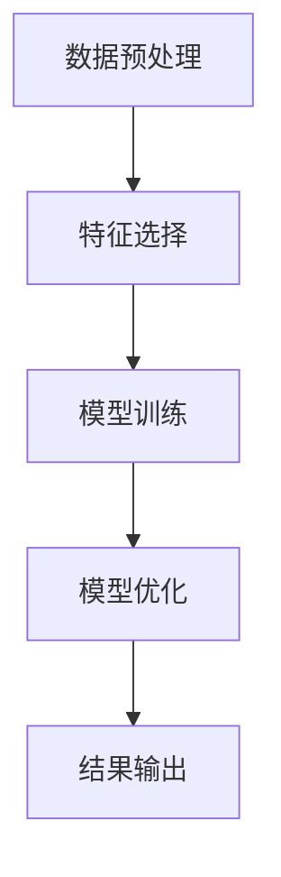
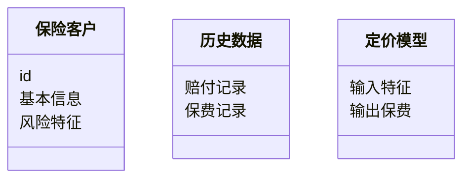
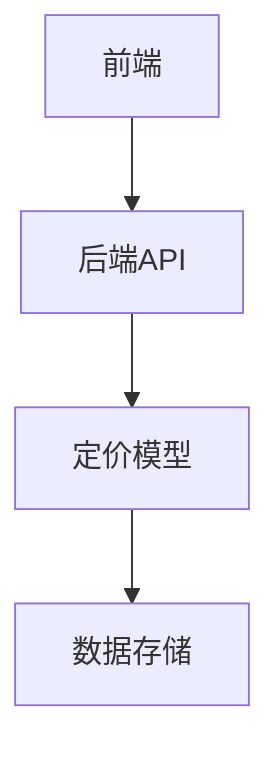
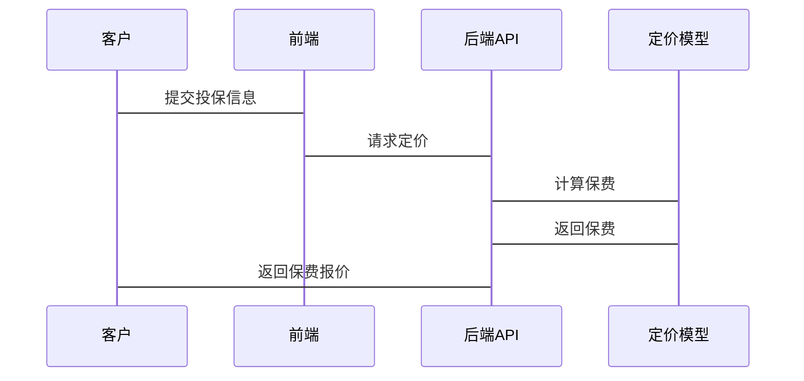

                 


# AI驱动的保险定价优化模型

> 关键词：保险定价，人工智能，机器学习，定价优化，风险管理，数据驱动

> 摘要：本文详细探讨了AI技术在保险定价中的应用，提出了基于机器学习的定价优化模型。通过分析传统定价方法的局限性，结合现代AI技术的优势，构建了一个高效、准确的保险定价优化模型。文章从背景介绍、核心概念、算法原理、系统架构、项目实战到最佳实践，全面阐述了该模型的设计与实现，为保险行业提供了新的定价思路和方法。

---

## 第一部分: AI驱动的保险定价优化模型背景介绍

### 第1章: 保险定价优化模型的背景与问题描述

#### 1.1 保险定价的基本概念

##### 1.1.1 保险定价的核心要素
保险定价是指保险公司根据客户的风险特征、市场需求和公司战略目标，确定保险产品的价格（保费）的过程。其核心要素包括：
- **风险因素**：如年龄、性别、职业、健康状况等。
- **市场需求**：包括客户对价格的敏感度和竞争对手的定价策略。
- **公司目标**：如市场份额、利润率等。

##### 1.1.2 保险定价的基本流程
1. 收集数据：包括客户信息、历史赔付数据、市场数据等。
2. 数据分析：提取关键特征，识别风险因素。
3. 建立模型：基于历史数据和市场规律，建立定价模型。
4. 模型优化：根据实际效果调整模型参数。
5. 定价策略制定：根据模型结果制定最终的定价策略。

##### 1.1.3 传统保险定价方法的局限性
- **数据依赖性**：传统定价方法主要依赖历史数据和经验判断，难以捕捉新兴风险因素。
- **主观性**：定价过程受人为因素影响较大，可能导致定价不准确。
- **效率低下**：传统方法需要大量人工分析，效率较低，难以应对市场变化。

#### 1.2 AI技术在保险定价中的应用背景

##### 1.2.1 AI技术的发展与保险行业的结合
随着AI技术的快速发展，尤其是机器学习和深度学习的成熟，保险公司开始尝试将AI技术应用于定价、理赔、风险管理等领域。AI技术能够处理海量数据，发现传统方法难以捕捉的规律。

##### 1.2.2 数据驱动的保险定价模式
现代保险定价模式逐渐从经验定价向数据驱动定价转变。通过收集和分析大量数据，利用AI技术建立数据驱动的定价模型，能够更准确地评估风险，制定合理的保费。

##### 1.2.3 保险定价优化的挑战与机遇
- **挑战**：数据质量、模型解释性、隐私保护等问题。
- **机遇**：通过AI技术提升定价效率和准确性，优化成本结构，提升客户体验。

#### 1.3 保险定价优化模型的目标与意义

##### 1.3.1 优化保险定价的核心目标
通过AI技术优化保险定价模型，实现以下目标：
1. 提高定价准确性。
2. 降低定价成本。
3. 提升客户满意度。
4. 增强市场竞争力。

##### 1.3.2 AI驱动定价优化的优势
- **数据处理能力**：能够处理海量数据，提取更多特征。
- **模型复杂度**：支持非线性关系，捕捉复杂的风险因素。
- **实时性**：能够快速响应市场变化，实时调整定价策略。

##### 1.3.3 保险定价优化对行业的影响
- **提升效率**：减少人工干预，提高定价效率。
- **降低成本**：通过自动化分析降低运营成本。
- **增强客户体验**：通过个性化定价提升客户满意度。

### 第2章: 保险定价优化模型的核心概念与联系

#### 2.1 定价优化模型的基本原理

##### 2.1.1 模型的输入与输出
- **输入**：客户信息（如年龄、性别、职业等）、历史赔付数据、市场数据（如竞争产品价格）。
- **输出**：优化后的保费价格。

##### 2.1.2 模型的优化目标
- **目标函数**：最大化利润或最小化风险。
- **约束条件**：满足监管要求、市场竞争力、客户接受度等。

##### 2.1.3 模型的约束条件
- **监管要求**：保费必须符合当地监管机构的规定。
- **市场竞争力**：保费不能过高，否则客户可能转向竞争对手。
- **客户接受度**：保费必须合理，客户愿意支付。

#### 2.2 保险定价优化模型的实体关系图

```mermaid
er
actor: 保险公司
actor: 保险客户
actor: 数据源
class: 保险产品
class: 客户特征
class: 历史数据
class: 定价模型
```

#### 2.3 模型的核心算法与流程



---

## 第三部分: AI驱动的保险定价优化模型算法原理

### 第3章: 定价优化模型的算法原理

#### 3.1 数据预处理与特征工程

##### 3.1.1 数据清洗与标准化
- 数据清洗：去除重复数据、处理缺失值、剔除异常值。
- 数据标准化：将不同量纲的特征进行标准化处理，使其具有可比性。

##### 3.1.2 特征选择与降维
- 特征选择：通过统计分析或机器学习方法，筛选出对定价影响较大的特征。
- 特征降维：使用主成分分析（PCA）等方法，降低特征维度，减少计算复杂度。

##### 3.1.3 数据增强与扩展
- 数据增强：通过生成虚拟数据（如合成客户特征）来增加数据量。
- 数据扩展：引入外部数据源（如天气数据、经济指标）丰富特征维度。

#### 3.2 模型训练与优化

##### 3.2.1 传统回归模型的应用
- 线性回归：用于预测保费与特征之间的线性关系。
- 非线性回归：如多项式回归，用于捕捉复杂的非线性关系。

##### 3.2.2 基于深度学习的定价模型
- 神经网络模型：使用深度神经网络（DNN）捕捉复杂的特征交互。
- 长短期记忆网络（LSTM）：用于处理时间序列数据，如历史赔付数据。

##### 3.2.3 超参数优化与模型调优
- 超参数优化：通过网格搜索、随机搜索或贝叶斯优化方法，寻找最优超参数组合。
- 模型调优：通过交叉验证评估模型性能，调整模型结构和参数。

#### 3.3 模型评估与验证

##### 3.3.1 评估指标的选择
- 均方误差（MSE）：衡量预测值与实际值的差异。
- R平方值（R²）：衡量模型解释变量的能力。
- 比较优势：将AI模型的性能与传统模型进行对比。

##### 3.3.2 交叉验证与模型泛化能力
- K折交叉验证：通过多次训练和验证，评估模型的泛化能力。
- 过拟合与欠拟合：通过调整模型复杂度，防止过拟合或欠拟合。

##### 3.3.3 模型的可解释性分析
- 可解释性：通过特征重要性分析，解释模型的定价决策依据。
- 可视化工具：如SHAP值分析，帮助理解模型的决策过程。

---

## 第四部分: AI驱动的保险定价优化模型系统架构

### 第4章: 定价优化模型的数学模型与公式

#### 4.1 损失率模型

##### 损失率模型的公式
$$ \text{损失率} = \frac{\text{总赔付金额}}{\text{总保费收入}} $$

##### 损失率模型的实现步骤
1. 计算总赔付金额。
2. 计算总保费收入。
3. 计算损失率。

#### 4.2 定价模型

##### 定价模型的公式
$$ \text{保费} = \text{基准保费} \times \prod_{i=1}^{n} (\text{风险因子}_i)^{w_i} $$
其中，$w_i$ 是风险因子 $i$ 的权重。

##### 定价模型的实现步骤
1. 确定基准保费。
2. 确定风险因子及其权重。
3. 计算最终保费。

#### 4.3 优化模型

##### 优化模型的公式
$$ \min \sum_{i=1}^{N} (\text{预测保费}_i - \text{实际保费}_i)^2 $$
约束条件：
$$ \text{预测保费}_i \geq \text{最低保费}_i $$
$$ \text{预测保费}_i \leq \text{最高保费}_i $$

##### 优化模型的实现步骤
1. 建立目标函数。
2. 确定约束条件。
3. 使用优化算法（如梯度下降）求解。

---

## 第五部分: AI驱动的保险定价优化模型项目实战

### 第5章: 系统分析与架构设计方案

#### 5.1 问题场景介绍
- 保险公司需要优化定价模型，以提高保费的准确性和竞争力。

#### 5.2 系统功能设计

##### 领域模型


##### 系统架构


#### 5.3 系统接口设计
- 前端接口：发送客户信息，获取保费报价。
- 后端接口：接收请求，调用定价模型，返回结果。

#### 5.4 系统交互流程图


---

## 第六部分: 最佳实践与总结

### 第6章: 项目实战总结

#### 6.1 最佳实践 tips
- 数据质量是模型性能的基础，需重视数据清洗和特征工程。
- 模型的可解释性是实际应用的关键，需通过SHAP值等工具进行分析。
- 定期更新模型，适应市场变化和客户需求。

#### 6.2 小结
本文通过AI技术构建了一个高效的保险定价优化模型，解决了传统定价方法的局限性，提升了定价的准确性和效率。

#### 6.3 注意事项
- 数据隐私和安全问题需高度重视。
- 模型的解释性和透明度是监管机构关注的重点。
- 模型上线前需进行充分的测试和验证。

#### 6.4 拓展阅读
- 《机器学习实战》
- 《深度学习导论》
- 《保险精算基础》

---

作者：AI天才研究院/AI Genius Institute & 禅与计算机程序设计艺术 /Zen And The Art of Computer Programming

