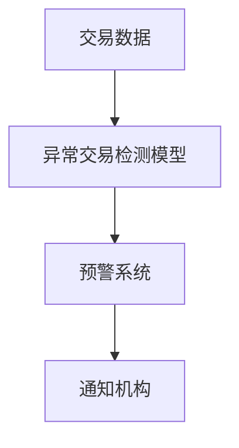
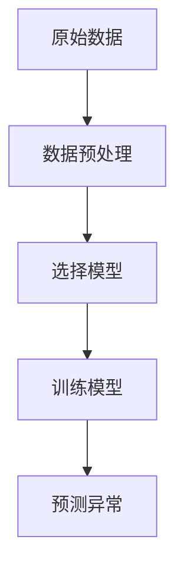
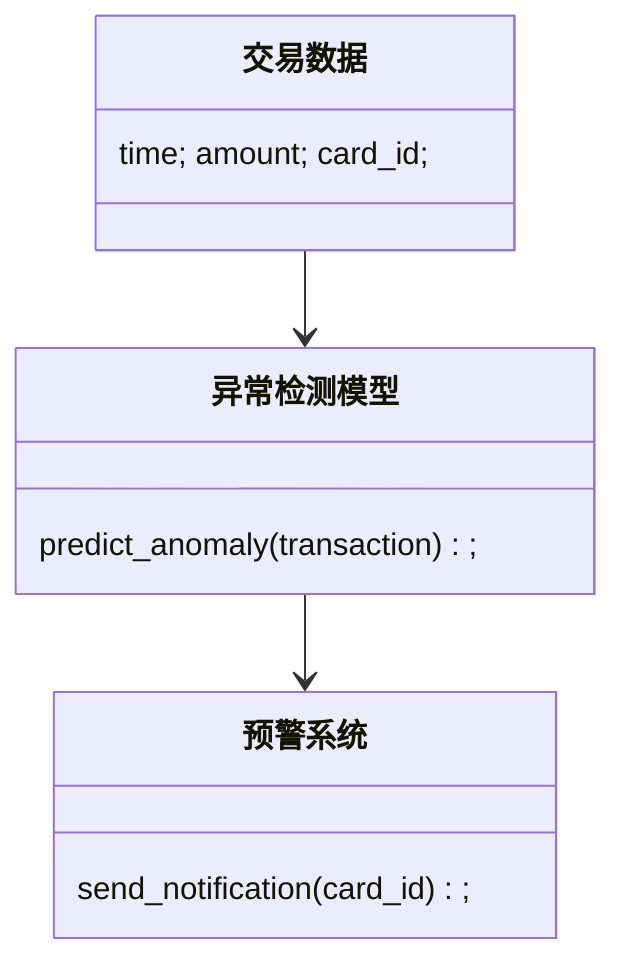
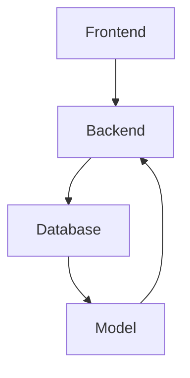

                 


# AI驱动的信用卡异常交易实时预警

> 关键词：AI驱动，信用卡异常交易，实时预警，机器学习，数据挖掘，实时处理

> 摘要：本文探讨了如何利用人工智能技术实现信用卡异常交易的实时预警。通过分析异常交易的特征、构建AI模型、设计实时处理系统，结合实际案例，展示了AI在金融安全中的强大应用能力。

---

# 第1章: 异常交易实时预警的背景与问题描述

## 1.1 信用卡交易风险的现状

近年来，随着信用卡的普及，交易量急剧增加，异常交易（如欺诈、盗刷等）也随之激增。传统的基于规则的异常检测方法逐渐暴露出效率低下、误报率高等问题。因此，引入AI技术，特别是机器学习和深度学习，成为提升交易安全性的必然选择。

## 1.2 AI技术在金融领域的应用趋势

AI技术在金融领域的应用日益广泛，尤其是在风险控制和欺诈检测方面。通过分析海量数据，AI能够快速识别异常模式，帮助金融机构实时做出决策。

## 1.3 实时预警系统的重要性

实时预警系统能够在交易发生时立即识别并通知相关机构，从而最大限度地减少损失。这对于保护用户和金融机构的财产安全至关重要。

---

# 第2章: 异常交易实时预警的核心概念

## 2.1 异常交易检测的定义与原理

异常交易检测旨在识别与正常交易模式不符的交易行为，通常通过分析交易数据的特征来实现。

### 核心概念对比表

| 概念       | 特性               |
|------------|--------------------|
| 正常交易   | 符合预定义模式       |
| 异常交易   | 违反预定义模式或统计规律 |

### 实体关系图



---

# 第3章: 异常交易实时预警的算法原理

## 3.1 基于时间序列的异常检测

### 时间序列分析流程



### 示例代码

```python
import numpy as np
from sklearn.ensemble import IsolationForest

# 数据预处理
X = np.array(data).reshape(-1, 1)
model = IsolationForest(n_estimators=100, contamination=0.05)
model.fit(X)
```

---

# 第4章: 系统架构设计

## 4.1 问题场景描述

系统需要实时处理大量交易数据，快速识别异常交易，并及时通知相关机构。

### 领域模型



### 系统架构图



---

# 第5章: 项目实战

## 5.1 环境安装

安装Python、TensorFlow、Flask等工具。

## 5.2 核心代码实现

```python
import pandas as pd
from sklearn.model_selection import train_test_split
from sklearn.ensemble import RandomForestClassifier

# 数据加载与预处理
data = pd.read_csv('transactions.csv')
X_train, X_test, y_train, y_test = train_test_split(data.drop('is_fraud', axis=1), data['is_fraud'])

# 模型训练
model = RandomForestClassifier()
model.fit(X_train, y_train)
```

## 5.3 实际案例分析

通过具体案例分析模型的预测结果，调整参数，优化模型性能。

---

# 第6章: 总结与展望

## 6.1 本章总结

本文详细介绍了AI驱动的信用卡异常交易实时预警系统，从背景到实现，全面探讨了其应用价值。

## 6.2 未来展望

未来，可以进一步优化模型，结合更多数据源，提升预警系统的准确性和效率。

---

作者：AI天才研究院/AI Genius Institute & 禅与计算机程序设计艺术 /Zen And The Art of Computer Programming

