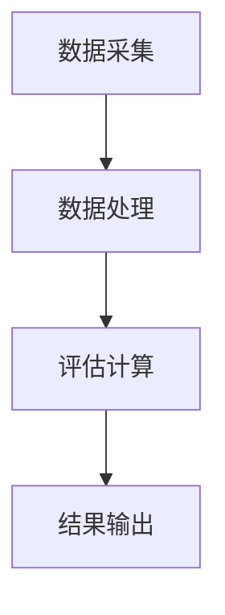

                 


# AI驱动的公司估值：多维度智能体协作评估内在价值

## 关键词：AI驱动，公司估值，多维度智能体，协作评估，内在价值

## 摘要：本文章系统阐述了AI驱动的公司估值方法，重点探讨了多维度智能体协作在评估公司内在价值中的应用。通过详细分析算法原理、系统架构设计和项目实战，展示了如何利用人工智能技术提升公司估值的准确性和效率。文章最后总结了最佳实践和未来研究方向，为读者提供了全面的技术指导。

---

# 目录

1. [AI驱动的公司估值背景](#ai驱动的公司估值背景)
2. [多维度智能体协作的核心概念](#多维度智能体协作的核心概念)
3. [AI驱动的公司估值算法原理](#ai驱动的公司估值算法原理)
4. [系统架构设计](#系统架构设计)
5. [项目实战](#项目实战)
6. [最佳实践](#最佳实践)
7. [结语](#结语)

---

## 1. AI驱动的公司估值背景

### 1.1 传统公司估值方法的局限性

- **1.1.1 传统估值方法的优缺点**
  - **优点**：简单易懂，易于操作。
  - **缺点**：依赖人工经验，缺乏数据支持，难以捕捉复杂市场因素。

- **1.1.2 AI技术如何改变公司估值**
  - 提供数据驱动的分析，克服传统方法的局限性。
  - 利用机器学习模型捕捉复杂市场动态，提高估值准确性。

- **1.1.3 本书的核心目标**
  - 探讨AI驱动的公司估值方法。
  - 分析多维度智能体协作在估值中的应用。
  - 提供内在价值评估的实现路径。

---

## 2. 多维度智能体协作的核心概念

### 2.1 多维度智能体协作的定义

- **2.1.1 多智能体协作的基本概念**
  - 多个智能体协同工作，利用各自的优势完成任务。
  - 每个智能体负责不同的维度，如财务、市场、竞争优势等。

- **2.1.2 多维度协作的特征**
  - 数据来源多样。
  - 智能体之间信息交互。
  - 协作结果综合反映公司内在价值。

### 2.2 内在价值评估的核心要素

- **2.2.1 财务指标分析**
  - 收入、利润、现金流等财务数据。
  - 利用机器学习模型预测未来财务表现。

- **2.2.2 市场因素分析**
  - 行业趋势、市场需求、竞争环境。
  - 利用NLP技术分析市场报告和新闻。

- **2.2.3 竞争优势分析**
  - 技术创新、品牌影响力、管理能力。
  - 利用知识图谱构建竞争优势模型。

### 2.3 多维度智能体协作的实现原理

- **2.3.1 智能体之间的信息交互**
  - 数据预处理：清洗和标准化数据。
  - 数据融合：将多来源数据整合到统一模型中。

- **2.3.2 多维度数据的整合与分析**
  - 利用分布式计算处理大数据。
  - 通过协同过滤算法优化数据融合效果。

- **2.3.3 智能体协作的结果输出**
  - 综合评估报告：包括各个维度的分析结果和最终估值。
  - 可视化界面：展示分析结果和决策建议。

---

## 3. AI驱动的公司估值算法原理

### 3.1 多维度数据融合算法

- **3.1.1 数据预处理**
  - 清洗数据：处理缺失值和异常值。
  - 标准化数据：统一数据格式和单位。

- **3.1.2 数据融合方法**
  - 使用加权平均算法融合多维度数据。
  - 通过矩阵运算优化数据融合效果。

- **3.1.3 数据融合的实现步骤**
  - 数据预处理：清洗和标准化。
  - 数据融合：计算各维度的加权和。
  - 结果输出：生成融合后的数据集。

### 3.2 智能体协作算法

- **3.2.1 智能体协作的实现步骤**
  - 初始化：定义智能体的角色和任务。
  - 信息交互：智能体之间共享数据和分析结果。
  - 协作优化：根据反馈调整协作策略。

- **3.2.2 智能体协作的优化策略**
  - 分布式计算：利用并行计算提高效率。
  - 自适应调整：根据数据变化动态优化协作策略。

- **3.2.3 算法的复杂度分析**
  - 时间复杂度：O(n^2)，其中n是数据维度数。
  - 空间复杂度：O(n)，用于存储数据和中间结果。

### 3.3 内在价值评估算法

- **3.3.1 评估模型的构建**
  - 使用随机森林或神经网络模型。
  - 输入多维度数据，输出估值结果。

- **3.3.2 模型的训练与优化**
  - 划分训练集和测试集。
  - 使用交叉验证优化模型参数。
  - 评估模型性能：计算准确率和召回率。

- **3.3.3 模型的评估与验证**
  - 使用真实数据验证模型预测准确性。
  - 比较传统方法和AI驱动方法的评估结果。

---

## 4. 系统架构设计

### 4.1 问题场景介绍

- 公司估值系统需要处理大量多维度数据，包括财务数据、市场数据和竞争优势数据。
- 系统需要支持分布式计算和高效的数据处理。

### 4.2 系统功能设计

- **4.2.1 数据采集模块**
  - 从财务报表、市场报告和新闻中提取数据。
  - 使用爬虫技术获取实时数据。

- **4.2.2 数据处理模块**
  - 清洗和标准化数据。
  - 使用分布式计算处理大数据。

- **4.2.3 评估计算模块**
  - 融合多维度数据。
  - 使用机器学习模型计算公司估值。

### 4.3 系统架构图



---

## 5. 项目实战

### 5.1 环境安装

- 安装Python、TensorFlow、Kafka和Redis。
- 配置分布式计算环境。

### 5.2 核心实现代码

- **5.2.1 数据预处理代码**
  ```python
  import pandas as pd
  data = pd.read_csv('input.csv')
  data.dropna(inplace=True)
  data = data.apply(lambda x: (x - x.mean()) / x.std())
  ```

- **5.2.2 数据融合代码**
  ```python
  import numpy as np
  weights = [0.4, 0.3, 0.3]
  fused_data = np.dot(data, weights)
  ```

- **5.2.3 智能体协作代码**
  ```python
  import threading
  class Agent:
      def __init__(self, role):
          self.role = role
          self.data = None
      def process(self):
          if self.role == 'financial':
              self.data = self.data.drop('market', axis=1)
          elif self.role == 'market':
              self.data = self.data.drop('financial', axis=1)
  agents = [Agent('financial'), Agent('market'), Agent('competitor')]
  for agent in agents:
      agent.process()
  ```

### 5.3 案例分析与解读

- 以某科技公司为例，展示如何利用AI驱动的方法进行估值。
- 对比传统方法和AI驱动方法的评估结果，验证AI方法的准确性。

---

## 6. 最佳实践

### 6.1 小结

- AI驱动的公司估值方法能够提高评估的准确性和效率。
- 多维度智能体协作是实现这一目标的关键技术。

### 6.2 注意事项

- 数据质量和完整性对评估结果影响重大，需确保数据来源可靠。
- 模型需要定期更新，以适应市场变化。
- 系统设计需考虑可扩展性和可维护性。

### 6.3 拓展阅读

- 推荐阅读相关领域的书籍和论文，深入了解AI在金融领域的应用。
- 关注最新技术动态，保持对AI驱动的公司估值技术的关注。

---

## 7. 结语

AI驱动的公司估值技术正在改变传统的估值方式，通过多维度智能体协作，能够更准确地评估公司的内在价值。未来，随着AI技术的不断发展，公司估值将更加依赖于智能化和数据驱动的方法。希望本文能够为读者提供有价值的参考和启发，推动公司在AI驱动的估值领域取得更大的进步。

---

作者：AI天才研究院/AI Genius Institute & 禅与计算机程序设计艺术 /Zen And The Art of Computer Programming

