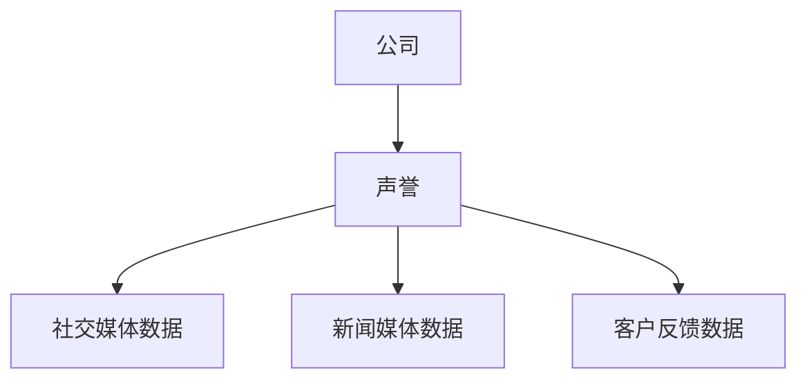
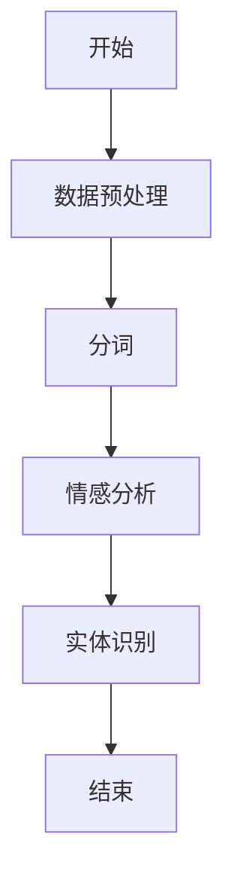

                 


# AI驱动的公司声誉分析：评估无形资产价值

> 关键词：公司声誉、人工智能、无形资产、数据挖掘、自然语言处理

> 摘要：本文探讨了AI在公司声誉分析中的应用，通过自然语言处理和机器学习技术，从多源数据中提取情感和关系，构建声誉评估模型，帮助企业量化无形资产价值。

---

## 第一部分: 公司声誉分析的背景与意义

### 第1章: 公司声誉分析的背景与意义

#### 1.1 无形资产与公司声誉的定义

- **无形资产**：指企业拥有或控制的没有实物形态的资源，如品牌价值、客户关系、商誉等。
- **公司声誉**：企业形象在市场中的认知度和信任度，反映企业在公众中的评价。

#### 1.2 声誉的重要性

- **品牌价值**：声誉直接影响品牌价值和市场地位。
- **客户信任**：良好的声誉能增强客户信任，降低交易成本。
- **风险管理**：声誉受损可能引发财务损失和危机。

#### 1.3 AI在声誉分析中的作用

- **数据处理能力**：AI能快速处理大量非结构化数据，提取关键信息。
- **情感分析**：通过NLP技术，AI能识别文本中的情感倾向，帮助企业了解公众情绪。
- **预测能力**：机器学习模型可以预测声誉变化趋势，辅助决策。

### 第2章: AI驱动声誉分析的核心概念与联系

#### 2.1 核心概念原理

- **声誉分析维度**：包括情感、关系、主题等方面。
- **AI技术作用**：自然语言处理和机器学习是主要技术手段。

#### 2.2 核心概念属性对比表

| **属性**       | **传统分析**       | **AI分析**         |
|----------------|--------------------|--------------------|
| 数据来源       | 有限，如财报       | 多源，如社交媒体、新闻 |
| 分析速度       | 缓慢               | 快速               |
| 分析深度       | 浅显               | 深入               |

#### 2.3 实体关系图（ER图）



---

## 第二部分: AI驱动声誉分析的技术原理

### 第3章: 自然语言处理（NLP）在声誉分析中的应用

#### 3.1 NLP技术简介

- **核心工具**：Python中的NLTK库、 SpaCy、TextBlob。
- **情感分析**：判断文本情感倾向，如正面、负面或中性。
- **实体识别**：识别文本中的公司名称、人物等。

#### 3.2 基于NLP的声誉分析算法



代码示例：

```python
from textblob import TextBlob
text = "The product is excellent!"
blob = TextBlob(text)
print(blob.sentiment.polarity)  # 输出：0.8
```

---

### 第4章: 基于机器学习的声誉评估模型

#### 4.1 机器学习在声誉分析中的应用

- **监督学习**：使用标注数据训练模型，如线性回归。
- **深度学习**：使用神经网络模型，如LSTM进行情感分析。

#### 4.2 声誉评估模型的数学框架

- **线性回归模型**：$$y = \beta_0 + \beta_1x_1 + \beta_2x_2 + ... + \beta_nx_n$$
- **神经网络模型**：使用多层感知机（MLP）进行非线性关系建模。

---

## 第三部分: 系统架构与实现

### 第5章: 系统架构设计

#### 5.1 系统功能设计

- **数据收集模块**：从社交媒体、新闻网站获取数据。
- **特征提取模块**：进行分词、情感分析、实体识别。
- **模型训练模块**：使用机器学习模型进行声誉预测。

#### 5.2 系统架构图


---

## 第四部分: 项目实战

### 第6章: 项目实战

#### 6.1 环境安装

- Python 3.8+
- 安装库：`pip install textblob numpy pandas`

#### 6.2 核心实现

```python
from textblob import TextBlob
import pandas as pd

def analyze_reputation(text):
    blob = TextBlob(text)
    sentiment = blob.sentiment.polarity
    return "正面" if sentiment > 0 else "负面"

data = pd.DataFrame({
    '文本': ["I love this product!", "Terrible service!"],
    '情感': [analyze_reputation(text) for text in data['文本']]
})
print(data)
```

---

## 第五部分: 总结与展望

### 第7章: 总结与展望

#### 7.1 小结

- AI技术在声誉分析中具有重要价值，通过NLP和机器学习实现高效分析。

#### 7.2 注意事项

- 数据隐私问题：处理用户数据时需遵守相关法律法规。
- 模型局限性：需要不断优化以提高准确性。

#### 7.3 拓展阅读

- 推荐书籍：《自然语言处理入门》、《机器学习实战》。

---

作者：AI天才研究院 & 禅与计算机程序设计艺术

---

通过以上结构，文章详细探讨了AI在公司声誉分析中的应用，从理论到实践，为读者提供了全面的指导。

