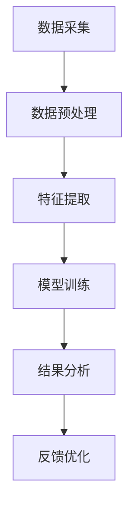
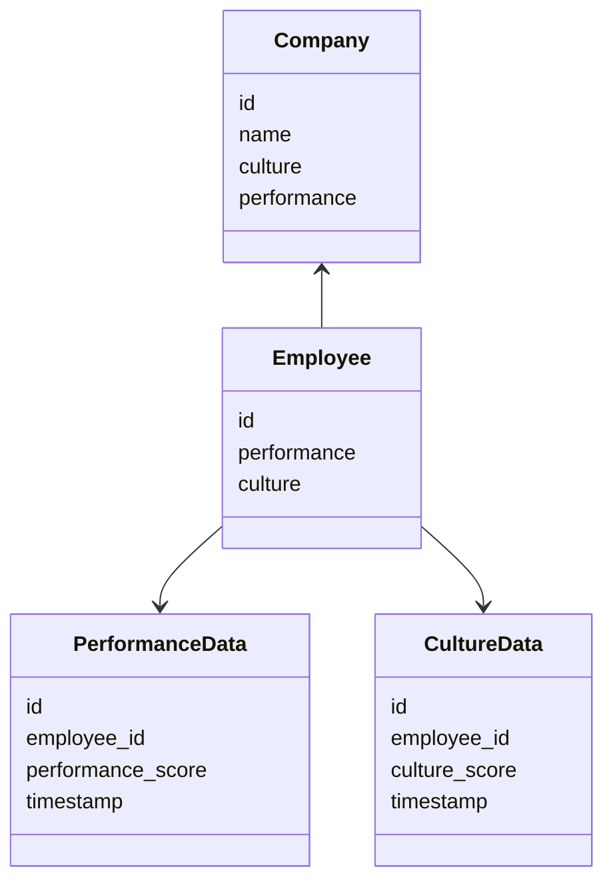

                 


# AI驱动的公司文化与绩效相关性分析：深入公司DNA

> 关键词：AI驱动，公司文化，绩效管理，相关性分析，企业DNA，机器学习

> 摘要：本文深入探讨了AI驱动的公司文化与绩效相关性分析的背景、核心概念、算法原理、系统架构、项目实战、最佳实践以及未来趋势。通过详细的理论分析和实际案例，本文揭示了AI技术如何帮助企业更好地理解和优化公司文化与绩效之间的关系，从而提升企业整体表现。

---

# 第一部分: AI驱动的公司文化与绩效相关性分析背景

# 第1章: AI驱动的公司文化与绩效相关性分析概述

## 1.1 问题背景与描述

### 1.1.1 公司文化与绩效的关系
公司文化是企业的灵魂，决定了企业的价值观、行为准则和员工的工作态度。绩效则是企业目标实现的具体体现，反映了企业在市场中的竞争力。两者密切相关，但传统上，企业难以量化文化对绩效的具体影响。

### 1.1.2 AI技术在企业管理中的应用
AI技术正在改变企业管理的方式。通过大数据分析、机器学习和自然语言处理，企业可以更精准地理解员工行为、团队协作和公司文化。

### 1.1.3 当前企业绩效管理的痛点
- 数据量大，难以提取有效信息
- 文化因素难以量化
- 绩效评估主观性强
- 员工反馈渠道不畅
- 传统方法难以预测和优化

### 1.1.4 AI驱动公司文化的潜力
AI技术可以通过数据挖掘、模式识别和预测分析，揭示文化对绩效的潜在影响，帮助企业制定更科学的管理策略。

## 1.2 问题解决与边界

### 1.2.1 AI驱动公司文化与绩效相关性分析的目标
- 分析公司文化与绩效之间的相关性
- 提供AI驱动的工具和方法
- 优化企业绩效管理

### 1.2.2 问题解决的边界与外延
- 专注于AI技术的应用，不涉及企业其他管理问题
- 适用于不同行业和规模的企业

### 1.2.3 核心概念与要素组成
- 核心概念：公司文化、绩效管理、AI技术
- 要素组成：数据采集、模型构建、结果分析

## 1.3 本章小结

- 公司文化与绩效密切相关，但传统方法难以量化
- AI技术为解决这一问题提供了新的思路
- 本文将从背景、核心概念、算法原理等多个方面展开分析

---

# 第二部分: 核心概念与联系

# 第2章: AI驱动的公司文化与绩效相关性分析的核心概念

## 2.1 核心概念原理

### 2.1.1 公司文化的定义与特征
- 定义：公司文化的是一种集体的价值观、信念和行为准则
- 特征：一致性、稳定性、渗透性、导向性

### 2.1.2 绩效管理的定义与方法
- 定义：绩效管理是通过设定目标、评估结果、反馈和改进的过程
- 方法：KPI、OKR、360度评估

### 2.1.3 AI技术在绩效分析中的应用
- 数据驱动：通过员工数据（如绩效、行为）进行分析
- 自动化：AI可以自动识别文化与绩效之间的关系

## 2.2 核心概念对比分析

### 2.2.1 公司文化与绩效的关系对比
| 维度 | 公司文化 | 绩效 |
|------|----------|------|
| 内容 | 价值观、行为准则 | 目标达成、效率 |
| 影响 | 员工态度、团队协作 | 企业目标实现 |
| 关系 | 文化影响绩效，绩效反馈优化文化 |

### 2.2.2 AI驱动与传统绩效管理的对比
| 维度 | 传统绩效管理 | AI驱动绩效管理 |
|------|--------------|------------|
| 数据采集 | 人工填写、问卷 | 数据挖掘、自动化采集 |
| 分析方式 | 定性分析为主 | 定量分析为主 |
| 决策支持 | 简单反馈 | 数据驱动优化 |

### 2.2.3 不同行业中的文化与绩效差异
- 高科技企业：创新文化对绩效影响显著
- 制造业：团队协作和效率对绩效影响大
- 服务业：客户满意度与企业文化密切相关

## 2.3 实体关系图

### 2.3.1 公司文化与绩效的ER图

```mermaid
erDiagram
    company {
        id
        name
        culture
        performance
    }
    employee {
        id
        performance
        culture
    }
    performance_data {
        id
        employee_id
        performance_score
        timestamp
    }
    culture_data {
        id
        employee_id
        culture_score
        timestamp
    }
```

### 2.3.2 AI驱动的绩效分析流程图



---

# 第三部分: 算法原理与数学模型

# 第3章: 数据分析与AI算法原理

## 3.1 数据分析流程

### 3.1.1 数据收集与预处理
- 数据来源：员工绩效数据、行为数据、文化问卷
- 数据清洗：处理缺失值、异常值
- 数据转换：标准化、归一化

### 3.1.2 数据特征提取
- 文化特征：员工满意度、团队协作度
- 绩效特征：KPI达成率、效率指标

## 3.2 AI算法原理

### 3.2.1 相关性分析算法
- 方法：皮尔逊相关系数、斯皮尔曼相关系数
- 应用：分析文化特征与绩效指标的相关性

### 3.2.2 机器学习模型
- 线性回归：预测绩效
- 支持向量机：分类文化类型
- 随机森林：特征重要性分析

### 3.2.3 深度学习模型
- 神经网络：复杂模式识别
- LSTM：时间序列分析

## 3.3 数学模型与公式

### 3.3.1 相关性计算公式
$$ r = \frac{\sum (x_i - \bar{x})(y_i - \bar{y})}{\sqrt{\sum (x_i - \bar{x})^2} \sqrt{\sum (y_i - \bar{y})^2}} $$

### 3.3.2 机器学习模型的数学表达
- 线性回归：
$$ y = \beta x + \epsilon $$

- 逻辑回归：
$$ P(y=1|x) = \frac{1}{1 + e^{-\beta x}} $$

## 3.4 代码实现

### 3.4.1 数据预处理代码

```python
import pandas as pd
import numpy as np

# 加载数据
data = pd.read_csv('performance_culture.csv')

# 数据清洗
data.dropna(inplace=True)
data = pd.get_dummies(data)
```

### 3.4.2 模型训练代码

```python
from sklearn.linear_model import LinearRegression

# 训练模型
model = LinearRegression()
model.fit(X_train, y_train)

# 预测
y_pred = model.predict(X_test)
```

---

# 第四部分: 系统分析与架构设计方案

# 第4章: 系统分析与架构设计

## 4.1 问题场景介绍

### 4.1.1 项目介绍
- 项目目标：分析公司文化与绩效相关性
- 项目范围：员工绩效数据、文化问卷数据

### 4.1.2 系统功能设计
- 数据采集模块：收集员工数据
- 数据分析模块：分析相关性
- 反馈优化模块：提供改进建议

## 4.2 系统架构设计

### 4.2.1 领域模型



### 4.2.2 系统架构图


---

# 第五部分: 项目实战

# 第5章: 项目实战

## 5.1 环境安装

### 5.1.1 工具安装
- Python 3.8+
- Pandas、Scikit-learn
- Mermaid、Plotly

## 5.2 系统核心实现源代码

### 5.2.1 数据预处理代码

```python
import pandas as pd
import numpy as np

# 加载数据
data = pd.read_csv('performance_culture.csv')

# 数据清洗
data.dropna(inplace=True)
data = pd.get_dummies(data)
```

### 5.2.2 模型训练代码

```python
from sklearn.linear_model import LinearRegression

# 训练模型
model = LinearRegression()
model.fit(X_train, y_train)

# 预测
y_pred = model.predict(X_test)
```

## 5.3 案例分析与解读

### 5.3.1 案例分析
- 数据来源：某高科技公司员工数据
- 分析结果：创新文化与绩效高度相关
- 优化建议：加强文化管理

## 5.4 项目小结

### 5.4.1 实战总结
- 数据预处理的重要性
- AI模型的选择与优化
- 结果分析与实际应用

---

# 第六部分: 最佳实践与小结

# 第6章: 最佳实践与小结

## 6.1 注意事项

### 6.1.1 数据质量
- 数据清洗的重要性
- 数据标注的准确性

### 6.1.2 模型选择
- 根据问题选择合适的模型
- 模型调优与验证

## 6.2 小结

### 6.2.1 核心概念总结
- 公司文化与绩效密切相关
- AI技术为分析提供新方法

### 6.2.2 未来趋势
- AI在企业管理中的广泛应用
- 数据驱动的决策将成为主流

---

# 第七部分: 附录

# 第7章: 附录

## 7.1 工具安装与配置

### 7.1.1 Python环境配置
- 安装Python 3.8+
- 安装必要的库：pip install pandas scikit-learn

### 7.1.2 数据集说明
- 数据格式：CSV
- 数据字段：员工ID、绩效评分、文化评分

## 7.2 参考文献

### 7.2.1 经典文献
- 《企业绩效管理》
- 《人工智能与企业管理》

### 7.2.2 在线资源
- [AI与企业管理](https://example.com)

---

# 结语

本文系统地分析了AI驱动的公司文化与绩效相关性分析的背景、核心概念、算法原理、系统架构、项目实战和最佳实践。通过理论与实践的结合，本文为企业的绩效管理优化提供了新的思路和方法。

---

# 作者

**作者：AI天才研究院/AI Genius Institute & 禅与计算机程序设计艺术 /Zen And The Art of Computer Programming**

---

以上是文章的完整目录和内容框架，您可以根据实际需要进行调整和扩展。

