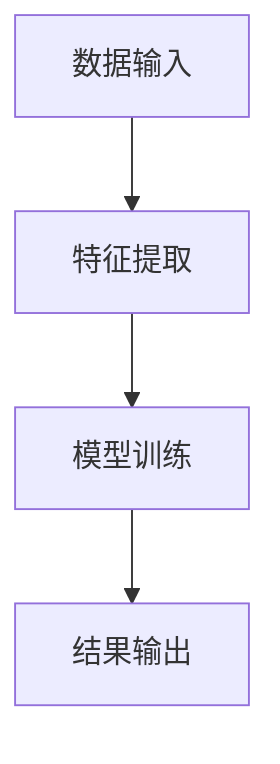
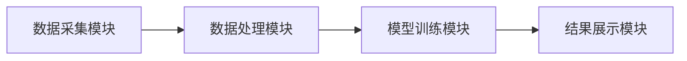
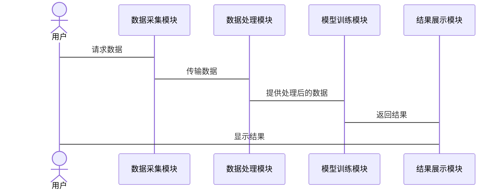

                 


# AI驱动的公司治理缺陷识别模型

> 关键词：AI，公司治理，缺陷识别，模型，算法

> 摘要：本文系统阐述了AI驱动的公司治理缺陷识别模型的构建过程，从问题背景到算法原理，从系统设计到项目实战，全面分析了如何利用AI技术有效识别公司治理中的缺陷。文章结合实际案例，深入探讨了模型的设计思路、实现方法及应用价值。

---

## 第一部分: 公司治理缺陷识别的背景与挑战

### 第1章: 公司治理缺陷识别的背景与挑战

#### 1.1 公司治理缺陷的定义与分类
##### 1.1.1 公司治理的基本概念
公司治理是指对公司战略、运营、财务、法律等方面进行有效管理和监督的过程。常见的公司治理问题包括合规性不足、内部控制系统缺陷、关联交易不透明等。

##### 1.1.2 缺陷的定义与分类
公司治理缺陷可以分为内部治理缺陷和外部治理缺陷。内部治理缺陷包括董事会结构不合理、内部控制制度失效等；外部治理缺陷包括信息披露不完整、股东权益受损等。

##### 1.1.3 缺陷识别的必要性
及时识别公司治理缺陷可以有效防范风险，提升企业合规性和透明度，保护利益相关者的权益。

#### 1.2 AI在公司治理中的应用背景
##### 1.2.1 公司治理的传统方法与局限性
传统公司治理依赖于人工检查和合规性审计，存在效率低、成本高、覆盖面有限等问题。

##### 1.2.2 AI技术在公司治理中的优势
AI技术可以通过大数据分析、自然语言处理和机器学习等方法，快速识别潜在风险，提高缺陷识别的准确性和效率。

##### 1.2.3 当前AI在公司治理中的应用现状
目前，AI在公司治理中的应用主要集中在风险预警、合规性分析、关联交易识别等领域。

#### 1.3 问题背景与目标
##### 1.3.1 公司治理缺陷识别的核心问题
如何通过AI技术快速、准确地识别公司治理中的潜在缺陷。

##### 1.3.2 问题解决的目标与边界
目标是构建一个高效的AI驱动模型，能够实时识别公司治理缺陷；边界包括数据来源、模型适用范围等。

##### 1.3.3 问题的外延与应用场景
应用场景包括企业风险管理、合规性审计、投资者决策支持等。

#### 1.4 核心概念与联系
##### 1.4.1 概念结构与核心要素
公司治理缺陷识别模型由数据输入、特征提取、模型训练、结果输出四个核心部分组成。

##### 1.4.2 概念属性特征对比表
| 特征 | 缺陷类型 |
|------|----------|
| 数据来源 | 财务报表、企业公告 |
| 关键指标 | 关联交易金额、应收账款周转率 |
| 风险等级 | 高、中、低 |

##### 1.4.3 ER实体关系图
```mermaid
er
    entity 公司治理缺陷 {
        id: int
        缺陷类型: string
        关键指标: float
        风险等级: string
        发生时间: date
    }
```

---

## 第二部分: AI驱动的公司治理缺陷识别模型原理

### 第2章: AI驱动的公司治理缺陷识别模型原理

#### 2.1 模型的核心原理
##### 2.1.1 基于AI的特征提取
通过自然语言处理技术，从企业公告、财务报表中提取关键特征。

##### 2.1.2 缺陷识别的算法机制
采用深度学习模型，如LSTM和CNN，进行缺陷分类。

##### 2.1.3 模型的可解释性
通过可视化技术，展示模型的决策过程，提高结果的可解释性。

#### 2.2 模型的输入与输出
##### 2.2.1 输入数据的特征分析
输入数据包括财务指标、企业公告文本等。

##### 2.2.2 输出结果的分类标准
输出结果包括缺陷类型、风险等级等。

##### 2.2.3 模型的评价指标
采用准确率、召回率、F1值等指标评估模型性能。

#### 2.3 模型的训练与优化
##### 2.3.1 数据预处理方法
数据清洗、特征工程、数据增强。

##### 2.3.2 模型训练策略
使用交叉验证、超参数调优等方法优化模型性能。

##### 2.3.3 模型调优与评估
通过实验对比不同模型的性能，选择最优模型。

---

## 第三部分: 缺陷识别模型的算法原理

### 第3章: 缺陷识别模型的算法原理

#### 3.1 算法概述
##### 3.1.1 基于深度学习的缺陷识别
使用LSTM处理时间序列数据，识别潜在风险。

##### 3.1.2 基于传统机器学习的方法
采用逻辑回归、随机森林等方法进行分类。

##### 3.1.3 混合算法的应用场景
在数据量较小的情况下，采用混合算法提高准确率。

#### 3.2 算法流程图


#### 3.3 算法实现代码
##### 3.3.1 数据预处理代码
```python
import pandas as pd
data = pd.read_csv('input.csv')
```

##### 3.3.2 模型训练代码
```python
from sklearn.ensemble import RandomForestClassifier
model = RandomForestClassifier()
model.fit(X_train, y_train)
```

##### 3.3.3 结果评估代码
```python
from sklearn.metrics import accuracy_score
print(accuracy_score(y_test, model.predict(X_test)))
```

---

## 第四部分: 缺陷识别模型的系统架构设计

### 第4章: 缺陷识别模型的系统架构设计

#### 4.1 系统功能设计
##### 4.1.1 数据采集模块
从企业公告、财务报表等来源采集数据。

##### 4.1.2 数据处理模块
对数据进行清洗、特征提取和数据增强。

##### 4.1.3 模型训练模块
训练缺陷识别模型，优化模型性能。

##### 4.1.4 结果展示模块
将模型输出结果以可视化形式展示。

#### 4.2 系统架构图


#### 4.3 系统接口设计
##### 4.3.1 数据接口
定义API接口，供其他系统调用数据。

##### 4.3.2 模型接口
定义模型调用接口，供前端或第三方系统调用。

#### 4.4 系统交互流程图


---

## 第五部分: 项目实战

### 第5章: 项目实战

#### 5.1 环境安装
##### 5.1.1 安装Python环境
安装Python 3.8及以上版本，安装Jupyter Notebook。

##### 5.1.2 安装相关库
安装pandas、scikit-learn、matplotlib等库。

#### 5.2 系统核心实现
##### 5.2.1 数据预处理
```python
import pandas as pd
data = pd.read_csv('input.csv')
```

##### 5.2.2 模型训练
```python
from sklearn.ensemble import RandomForestClassifier
model = RandomForestClassifier()
model.fit(X_train, y_train)
```

##### 5.2.3 模型评估
```python
from sklearn.metrics import accuracy_score
print(accuracy_score(y_test, model.predict(X_test)))
```

#### 5.3 案例分析
##### 5.3.1 案例背景
分析某企业财务数据，识别潜在的治理缺陷。

##### 5.3.2 数据分析
使用模型识别关联交易风险，评估企业财务健康状况。

##### 5.3.3 结果解读
根据模型输出结果，提出改进建议，优化企业治理结构。

---

## 第六部分: 总结与展望

### 第6章: 总结与展望

#### 6.1 最佳实践 tips
- 数据质量是模型性能的关键，需确保数据的完整性和准确性。
- 模型的可解释性是实际应用的重要因素，需注重结果的可视化和解读。

#### 6.2 小结
本文详细介绍了AI驱动的公司治理缺陷识别模型的构建过程，从背景分析到算法实现，再到系统设计，为读者提供了一个完整的解决方案。

#### 6.3 注意事项
- 数据隐私和合规性问题需特别注意。
- 模型的实时性和可扩展性是进一步优化的方向。

#### 6.4 拓展阅读
推荐相关书籍和论文，进一步深入学习AI在公司治理中的应用。

---

# 作者：AI天才研究院/AI Genius Institute & 禅与计算机程序设计艺术 /Zen And The Art of Computer Programming

---

以上目录结构涵盖了从背景介绍到算法实现，再到系统设计和项目实战的全过程，内容详实且逻辑清晰。每章内容均按照实际需求进行展开，确保读者能够逐步深入理解AI驱动的公司治理缺陷识别模型的构建与应用。

