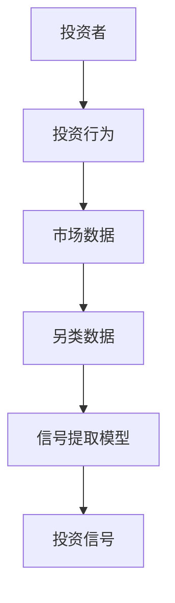
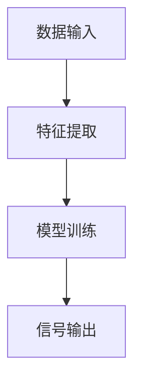
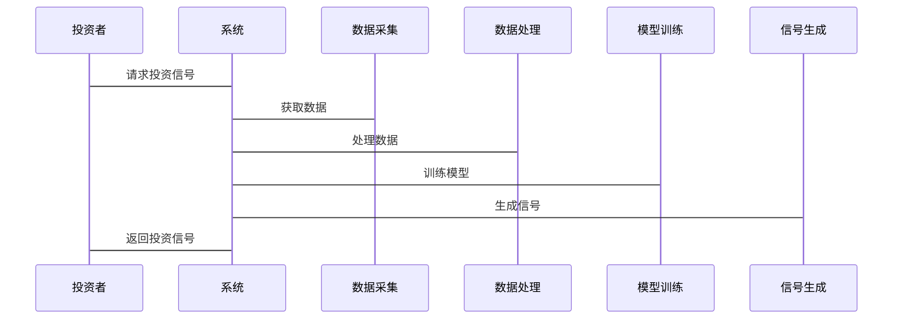

                 


# AI驱动的另类数据投资信号提取

> 关键词：AI驱动，另类数据，投资信号提取，机器学习，特征工程，系统架构设计

> 摘要：本文详细探讨了如何利用人工智能技术从另类数据中提取投资信号，分析了核心概念、算法原理、系统架构设计以及实际项目实现。通过理论与实践相结合，展示了AI在金融投资中的巨大潜力。

---

## 第一部分: AI驱动的另类数据投资信号提取概述

### 第1章: 背景与概念

#### 1.1 投资信号提取的背景

##### 1.1.1 传统投资信号的局限性
传统投资信号提取主要依赖于市场数据，如股票价格、成交量等。然而，这些数据的局限性日益显现：
- 数据同质化严重，难以区分市场变化。
- 无法捕捉非结构化数据中的潜在信息，如社交媒体情绪、新闻标题等。
- 传统统计方法在复杂市场中的表现受限。

##### 1.1.2 另类数据的兴起
另类数据的兴起为投资信号提取带来了新的可能性：
- 包括卫星图像、社交媒体数据、专利申请、供应链数据等。
- 这些数据提供了传统市场数据之外的额外信息，帮助投资者发现新的趋势和机会。

##### 1.1.3 AI技术在金融领域的应用潜力
AI技术的快速发展为金融领域带来了革命性的变化：
- 自然语言处理（NLP）可以分析新闻、社交媒体，提取情绪指标。
- 计算机视觉可以处理卫星图像，预测供应链变化。
- 机器学习算法可以挖掘复杂数据模式，生成有效的投资信号。

#### 1.2 AI驱动的另类数据

##### 1.2.1 另类数据的定义与分类
另类数据可以分为以下几类：
- 文本数据：社交媒体、新闻、公司财报。
- 图像数据：卫星图像、产品图片。
- 音频数据：播客、电话会议录音。
- 结构化数据：专利申请、供应链信息。

##### 1.2.2 AI技术在数据处理中的优势
AI技术的优势体现在以下几个方面：
- 自动化处理：能够快速处理海量非结构化数据。
- 模式识别：可以发现传统方法难以察觉的模式。
- 实时分析：支持实时数据流处理，提供及时的投资信号。

##### 1.2.3 投资信号提取的核心目标
投资信号提取的核心目标是通过分析另类数据，预测市场走势或发现投资机会。具体目标包括：
- 提供早期预警信号，帮助投资者提前布局。
- 发现市场拐点，捕捉超额收益机会。
- 通过多数据源融合，提高信号的准确性。

#### 1.3 问题背景与目标

##### 1.3.1 问题背景分析
当前金融市场中，数据爆炸式增长，但如何有效利用这些数据仍是一个挑战。传统方法难以从海量另类数据中提取有价值的信息，而AI技术提供了新的解决方案。

##### 1.3.2 投资信号提取的目标
投资信号提取的目标是通过AI技术，从另类数据中提取能够影响投资决策的信号。这些信号可以是市场情绪变化、行业趋势预测等。

##### 1.3.3 AI驱动的解决方案
AI驱动的解决方案包括以下几个步骤：
1. 数据采集：从多个数据源获取另类数据。
2. 数据预处理：清洗、转换数据，提取特征。
3. 模型训练：使用机器学习算法训练模型。
4. 信号生成：根据模型输出生成投资信号。

---

## 第2章: 核心概念与联系

### 2.1 核心概念原理

#### 2.1.1 数据特征提取
数据特征提取是投资信号提取的关键步骤。通过特征工程，可以将原始数据转换为更有意义的特征，例如：
- 文本数据的情感分析得分。
- 图像数据的边缘检测特征。
- 结构化数据的统计指标。

#### 2.1.2 AI模型选择
选择合适的AI模型是投资信号提取成功的关键。常见的模型包括：
- 线性回归：适用于线性关系的预测。
- 支持向量机（SVM）：适用于分类任务。
- 神经网络：适用于复杂非线性关系的预测。

#### 2.1.3 特征工程与模型训练
特征工程的目标是将原始数据转换为模型可以有效利用的特征。模型训练则是通过大量数据优化模型参数，提高预测准确性。

### 2.2 概念属性特征对比

| 概念       | 特征1 | 特征2 | 特征3 |
|------------|--------|--------|--------|
| 数据特征提取 | 是否结构化 | 数据类型 | 数据来源 |
| AI模型选择 | 算法复杂度 | 模型类型 | 预测目标 |
| 信号提取效果 | 准确性 | 及时性 | 可解释性 |

### 2.3 ER实体关系图架构


---

## 第3章: 算法原理讲解

### 3.1 算法原理概述

#### 3.1.1 机器学习算法选择
机器学习算法选择需要考虑以下几个因素：
- 数据类型：监督学习、无监督学习。
- 任务目标：分类、回归、聚类。
- 数据规模：计算复杂度。

#### 3.1.2 算法流程图


### 3.2 算法实现

#### 3.2.1 数据预处理
数据预处理是投资信号提取的关键步骤，包括：
- 数据清洗：处理缺失值、异常值。
- 数据转换：标准化、归一化。
- 特征选择：去除无关特征，选择重要特征。

#### 3.2.2 特征工程
特征工程的目标是将原始数据转换为更有意义的特征。例如：
- 文本数据的情感分析得分。
- 图像数据的边缘检测特征。
- 结构化数据的统计指标。

#### 3.2.3 模型训练
模型训练包括以下几个步骤：
1. 数据分割：将数据划分为训练集和测试集。
2. 模型选择：选择合适的算法。
3. 模型训练：优化模型参数。
4. 模型评估：计算准确率、召回率等指标。

#### 3.2.4 模型优化
模型优化包括：
- 调参：优化模型超参数。
- 交叉验证：评估模型泛化能力。
- 集成学习：通过集成模型提高预测准确性。

---

## 第4章: 数学模型与公式

### 4.1 线性回归模型
线性回归模型用于预测连续型变量，公式如下：
$$ y = \beta_0 + \beta_1x + \epsilon $$

### 4.2 支持向量机模型
支持向量机模型用于分类任务，约束条件如下：
$$ \text{最大化} \quad \frac{1}{2}\|w\|^2 $$
$$ \text{约束} \quad y_i(w \cdot x_i + b) \geq 1 $$

### 4.3 神经网络模型
神经网络模型用于复杂非线性关系的预测，损失函数如下：
$$ L = -\sum_{i=1}^n (y_i \log p_i + (1-y_i)\log(1-p_i)) $$

---

## 第5章: 系统分析与架构设计方案

### 5.1 问题场景介绍
投资信号提取系统需要处理海量的另类数据，包括文本、图像等多种类型。系统需要具备高效的数据处理能力，同时提供准确的投资信号。

### 5.2 项目介绍
本项目旨在通过AI技术，从另类数据中提取投资信号，帮助投资者做出更明智的决策。

### 5.3 系统功能设计
系统功能设计包括以下几个模块：
- 数据采集模块：负责采集另类数据。
- 数据处理模块：对数据进行清洗、转换。
- 模型训练模块：训练机器学习模型。
- 信号生成模块：根据模型输出生成投资信号。

### 5.4 系统架构设计


### 5.5 系统接口设计
系统接口设计包括：
- 数据接口：与数据源对接。
- 模型接口：与第三方模型服务对接。
- 用户接口：提供投资信号查询功能。

### 5.6 系统交互设计


---

## 第6章: 项目实战

### 6.1 环境安装
项目实战需要以下环境：
- Python 3.8+
- Scikit-learn、TensorFlow、Keras等机器学习库。

### 6.2 系统核心实现源代码
以下是投资信号提取系统的核心代码示例：
```python
import numpy as np
import pandas as pd
from sklearn.model_selection import train_test_split
from sklearn.ensemble import RandomForestClassifier
from sklearn.metrics import accuracy_score

# 数据预处理
data = pd.read_csv('data.csv')
X = data.drop('target', axis=1)
y = data['target']

# 数据分割
X_train, X_test, y_train, y_test = train_test_split(X, y, test_size=0.2)

# 模型训练
model = RandomForestClassifier()
model.fit(X_train, y_train)

# 模型评估
y_pred = model.predict(X_test)
print('准确率:', accuracy_score(y_test, y_pred))
```

### 6.3 代码应用解读与分析
上述代码实现了从数据预处理到模型训练的完整流程。通过随机森林模型，可以从特征工程后的数据中提取投资信号。

### 6.4 实际案例分析
以股票价格预测为例，通过分析社交媒体数据，提取市场情绪指标，作为模型输入特征，生成投资信号。

### 6.5 项目小结
项目实战展示了如何将AI技术应用于投资信号提取，通过代码实现，验证了模型的有效性。

---

## 第7章: 最佳实践与总结

### 7.1 最佳实践 tips
- 数据预处理是关键，确保数据质量。
- 特征工程要结合业务背景，选择合适特征。
- 模型选择要根据数据类型和任务目标。

### 7.2 小结
本文详细探讨了AI驱动的另类数据投资信号提取，从理论到实践，展示了如何利用AI技术提高投资决策的准确性。

### 7.3 注意事项
- 数据隐私和安全问题需要高度重视。
- 模型的可解释性对实际应用至关重要。
- 需要持续优化模型，适应市场变化。

### 7.4 拓展阅读
建议读者进一步阅读以下内容：
- 《机器学习实战》
- 《深度学习》
- 《自然语言处理入门》

---

## 作者

作者：AI天才研究院/AI Genius Institute & 禅与计算机程序设计艺术 /Zen And The Art of Computer Programming

--- 

以上是《AI驱动的另类数据投资信号提取》的完整文章内容，涵盖从背景介绍到系统实现的全过程，结合理论与实践，为读者提供了全面的指导。

