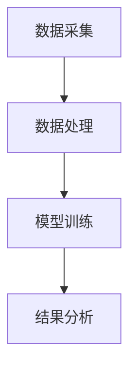
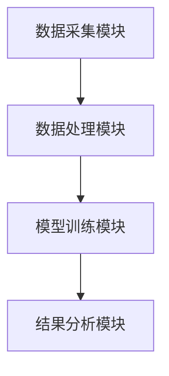

                 


# AI驱动的另类数据投资信号提取与验证

## 关键词：
- AI驱动
- 另类数据
- 投资信号
- 信号提取
- 验证

## 摘要：
本文探讨了利用人工智能技术从另类数据中提取和验证投资信号的方法。通过分析社交媒体、新闻、卫星图像等非传统数据源，结合自然语言处理、计算机视觉和时间序列分析等技术，构建高效的投资信号提取系统。文章详细介绍了技术原理、系统架构设计和实际案例，帮助读者掌握AI驱动的另类数据投资策略。

---

## 目录

### 第1章：背景与概念

#### 1.1 另类数据的定义与特点
- 数据来源：社交媒体、新闻、卫星图像、物联网数据
- 数据特点：实时性、多样性、非结构化、海量性

#### 1.2 AI在投资中的作用
- 数据处理：清洗、特征提取
- 情感分析：文本数据中的市场情绪
- 图像分析：零售店客流量预测

#### 1.3 投资信号的定义
- 信号提取：从数据中提取有价值的信息
- 信号验证：通过历史数据验证信号的有效性

### 第2章：技术原理与算法

#### 2.1 自然语言处理（NLP）在文本数据中的应用
- 情感分析：使用预训练模型如BERT进行情绪分类
- 主题建模：LDA分析新闻主题

#### 2.2 计算机视觉在图像数据中的应用
- 图像分割：识别停车场车辆数量
- 目标检测：监测零售店顾客数量

#### 2.3 时间序列分析
- LSTM模型：预测股价走势
- GARCH模型：评估市场波动

### 第3章：系统架构设计

#### 3.1 系统模块划分
- 数据采集模块：获取社交媒体、新闻、卫星图像
- 数据处理模块：清洗、转换、特征提取
- 模型训练模块：构建预测模型
- 结果分析模块：评估信号有效性

#### 3.2 系统架构图


### 第4章：项目实战

#### 4.1 环境配置
- 安装Python库：TensorFlow、Keras、Pandas、Scikit-learn
- 安装NLP库：NLTK、spaCy
- 安装图像处理库：OpenCV、TensorFlow

#### 4.2 数据处理代码示例
```python
import pandas as pd
from sklearn.feature_extraction.text import TfidfVectorizer

# 数据清洗
def clean_text(text):
    return text.lower().strip()

# 特征提取
vectorizer = TfidfVectorizer(max_features=100)
tfidf_matrix = vectorizer.fit_transform(corpus)
```

#### 4.3 情感分析模型
```python
import tensorflow as tf
from tensorflow.keras import layers

model = tf.keras.Sequential()
model.add(layers.Embedding(input_dim=10000, output_dim=50))
model.add(layers.LSTM(32))
model.add(layers.Dense(2, activation='softmax'))

model.compile(optimizer='adam', loss='sparse_categorical_crossentropy', metrics=['accuracy'])
```

#### 4.4 信号验证
- 回测策略：验证信号的准确性
- 风险管理：控制投资风险

### 第5章：系统分析与架构设计

#### 5.1 系统功能设计
- 数据采集：实时获取另类数据
- 数据处理：清洗、转换、特征提取
- 模型训练：构建预测模型
- 结果分析：评估信号有效性

#### 5.2 系统架构图


### 第6章：数学公式与算法原理

#### 6.1 情感分析模型
- 损失函数：交叉熵损失
$$ \text{Loss} = -\sum y_i \log p_i + (1 - y_i) \log (1 - p_i) $$
- 优化器：Adam优化器
$$ \theta := \theta - \eta \nabla_{\theta} \text{Loss} $$

#### 6.2 时间序列预测模型
- LSTM网络结构
$$ f_t = \text{LSTM}(x_t, f_{t-1}) $$
- 预测公式
$$ \hat{y}_t = \text{Dense}(f_t) $$

### 第7章：总结与展望

#### 7.1 总结
- AI技术在另类数据投资中的应用前景广阔
- 需要结合多种技术手段，提高信号提取的准确性和鲁棒性

#### 7.2 展望
- 更多数据源的整合：实时数据流处理
- 高效算法的优化：模型的可解释性与实时性

---

## 作者：AI天才研究院 & 禅与计算机程序设计艺术

