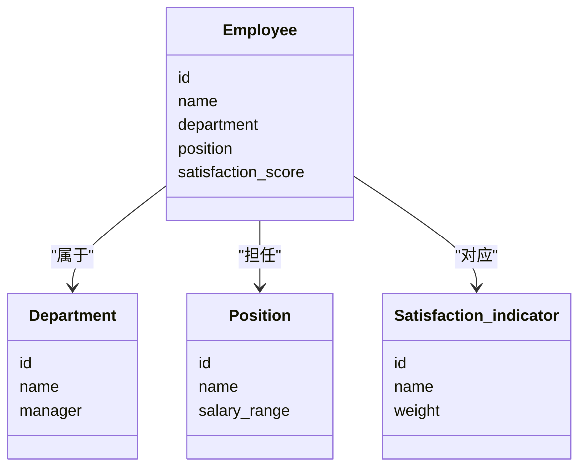
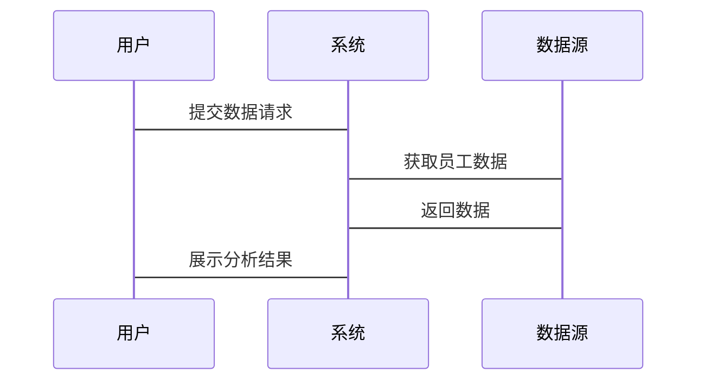

                 


# AI驱动的员工满意度分析：评估人力资本质量

**关键词**：员工满意度分析，AI技术，人力资本，数据挖掘，机器学习，系统架构设计

**摘要**：本文通过分析员工满意度的关键因素，探讨如何利用AI技术优化人力资本质量评估。从数据采集到模型构建，再到系统设计，详细讲解AI在员工满意度分析中的应用。结合实际案例，展示如何利用AI技术提升企业人力资源管理效率和员工满意度。

---

## 第一部分：背景介绍与核心概念

### 第1章：员工满意度分析的背景与意义

#### 1.1 员工满意度分析的定义与重要性
- 1.1.1 员工满意度的定义：员工满意度是指员工对工作环境、薪酬福利、职业发展等方面的心理感受和评价。
- 1.1.2 分析的意义：通过了解员工满意度，企业可以优化管理策略，提升员工积极性，降低流失率，进而提高整体绩效。
- 1.1.3 人力资本质量的内涵：人力资本不仅包括员工的技能和能力，还包括他们的工作态度和满意度。

#### 1.2 AI驱动的员工满意度分析的背景
- 1.2.1 传统员工满意度分析的局限性：传统方法依赖问卷调查，数据量有限，分析结果不够精准。
- 1.2.2 AI技术在人力资源管理中的应用趋势：AI技术能够快速处理大量数据，发现潜在规律，提供个性化解决方案。
- 1.2.3 员工满意度分析的数字化转型：通过数字化手段，企业可以实时监测员工情绪，及时调整管理策略。

#### 1.3 问题背景与目标
- 1.3.1 问题背景的描述：员工流失率高、工作效率低下、团队协作问题等都与员工满意度密切相关。
- 1.3.2 问题解决的必要性：通过AI分析员工满意度，企业可以提前发现潜在问题，采取预防措施。
- 1.3.3 目标与核心要素：目标是通过AI技术构建一个高效的员工满意度分析系统，核心要素包括数据采集、模型构建、结果分析等。

### 第2章：核心概念与联系

#### 2.1 核心概念的定义与属性
- 2.1.1 员工满意度分析的维度：工作满意度、薪酬满意度、领导满意度、同事满意度等。
- 2.1.2 数据特征与属性对比：包括数据的来源、类型、时间跨度等。
- 2.1.3 核心概念的ER实体关系图：通过实体关系图展示员工、部门、职位、满意度指标等之间的关系。

#### 2.2 核心概念的原理与联系
- 2.2.1 原理的简要说明：员工满意度分析通过数据挖掘和机器学习算法，从多维度数据中提取有用信息。
- 2.2.2 数据特征对比表格：展示不同数据特征的对比，如定量数据与定性数据的区别。
- 2.2.3 ER实体关系图的Mermaid流程图：
```mermaid
erDiagram
    employee {
        id
        name
        department
        position
        satisfaction_score
    }
    department {
        id
        name
        manager
    }
    position {
        id
        name
        salary_range
    }
    satisfaction_indicator {
        id
        name
        weight
    }
    employee o--N department : "属于"
    employee o--N position : "担任"
    employee o--N satisfaction_indicator : "对应"
```

---

## 第二部分：算法原理与数学模型

### 第3章：常用算法原理

#### 3.1 监督学习模型
- 3.1.1 决策树模型：通过特征分裂构建树状结构，用于分类或回归。
- 3.1.2 随机森林模型：通过集成多个决策树，提高模型的准确性和鲁棒性。
- 3.1.3 支持向量机模型：通过寻找最优超平面，实现数据的线性或非线性分类。

#### 3.2 无监督学习模型
- 3.2.1 K均值聚类：将员工分成若干类，分析不同类别的满意度特征。
- 3.2.2 DBSCAN算法：基于密度的聚类方法，发现高密度区域的员工群体。
- 3.2.3 层次聚类：通过层次结构的方式，将员工分成不同的满意度层次。

#### 3.3 深度学习模型
- 3.3.1 神经网络模型：通过多层神经网络，提取复杂的员工满意度特征。
- 3.3.2 长短期记忆网络：适用于时间序列数据，分析员工满意度的变化趋势。
- 3.3.3 图神经网络：通过图结构建模员工之间的关系，分析社交网络对满意度的影响。

### 第4章：数学模型与公式

#### 4.1 监督学习模型的数学基础
- 4.1.1 线性回归模型：
  $$ y = \beta_0 + \beta_1x + \epsilon $$
- 4.1.2 逻辑回归模型：
  $$ P(y=1|x) = \frac{1}{1 + e^{-\beta x}} $$
- 4.1.3 随机森林的集成学习原理：通过多棵决策树的投票或平均，提高模型的泛化能力。

#### 4.2 无监督学习模型的数学基础
- 4.2.1 K均值聚类的距离计算：
  $$ \text{距离}(x_i, x_j) = \sqrt{(x_i - x_j)^2} $$
- 4.2.2 DBSCAN算法的密度计算：
  $$ \text{密度} = \sum_{r} \text{在半径} r \text{内的点数} $$
- 4.2.3 层次聚类的相似性计算：
  $$ \text{相似性}(x_i, x_j) = \frac{x_i \cdot x_j}{\|x_i\| \|x_j\|} $$

---

## 第三部分：系统分析与架构设计

### 第5章：问题场景与项目介绍

#### 5.1 问题场景介绍
- 5.1.1 企业面临的员工满意度问题：员工流失率高、工作效率低下、团队协作问题等。
- 5.1.2 项目目标：构建一个基于AI的员工满意度分析系统，帮助企业管理者实时监测员工情绪，优化管理策略。

### 第6章：系统功能设计

#### 6.1 领域模型设计


#### 6.2 系统架构设计
```mermaid
containerDiagram
    container 数据采集层 {
        数据源1
        数据源2
        数据源3
    }
    container 数据处理层 {
        数据清洗
        数据转换
    }
    container 模型训练层 {
        训练数据
        模型训练
    }
    container 应用层 {
        系统接口
        用户界面
    }
```

#### 6.3 系统接口设计
- 6.3.1 数据接口：与企业HR系统对接，获取员工数据。
- 6.3.2 模型接口：与机器学习模型对接，获取满意度预测结果。
- 6.3.3 用户接口：提供可视化界面，展示员工满意度分析结果。

#### 6.4 系统交互设计


---

## 第四部分：项目实战与代码实现

### 第7章：环境安装与数据预处理

#### 7.1 环境安装
- 安装Python、Jupyter Notebook、Scikit-learn、XGBoost等工具。

#### 7.2 数据预处理
- 数据清洗：处理缺失值、异常值。
- 数据转换：将文本数据转换为数值数据，如使用词袋模型或TF-IDF。

### 第8章：系统核心实现

#### 8.1 代码实现
```python
import pandas as pd
from sklearn.model_selection import train_test_split
from sklearn.ensemble import RandomForestClassifier
from sklearn.metrics import accuracy_score

# 数据加载
df = pd.read_csv('employee_satisfaction.csv')

# 数据预处理
X = df.drop('satisfaction_score', axis=1)
y = df['satisfaction_score']

# 数据分割
X_train, X_test, y_train, y_test = train_test_split(X, y, test_size=0.2)

# 模型训练
model = RandomForestClassifier()
model.fit(X_train, y_train)

# 模型预测
y_pred = model.predict(X_test)

# 模型评估
print(accuracy_score(y_test, y_pred))
```

#### 8.2 代码解读
- 数据加载：从CSV文件中读取员工满意度数据。
- 数据预处理：删除目标变量，将数据分为训练集和测试集。
- 模型训练：使用随机森林分类器进行训练。
- 模型预测：对测试集进行预测，并计算准确率。

### 第9章：案例分析与结果解读

#### 9.1 案例分析
- 选择一个企业案例，展示如何通过AI技术分析员工满意度。

#### 9.2 结果解读
- 展示模型预测结果，分析不同因素对员工满意度的影响。

---

## 第五部分：总结与展望

### 第10章：最佳实践与小结

#### 10.1 最佳实践
- 数据质量的重要性：确保数据的完整性和准确性。
- 模型选择的策略：根据数据特征选择合适的算法。
- 结果解释的技巧：将复杂的模型结果转化为易于理解的可视化展示。

#### 10.2 小结
- AI技术在员工满意度分析中的优势：提高分析效率，发现潜在问题，提供个性化解决方案。
- 需要注意的问题：数据隐私保护、模型解释性、算法的可扩展性等。

### 第11章：注意事项与拓展阅读

#### 11.1 注意事项
- 数据隐私保护：确保员工数据的安全性。
- 模型的可解释性：避免黑箱模型，选择易于解释的算法。
- 算法的可扩展性：考虑数据量的增长，选择能够扩展的算法。

#### 11.2 拓展阅读
- 推荐相关书籍和论文，深入学习员工满意度分析和AI技术。

---

## 作者：AI天才研究院/AI Genius Institute & 禅与计算机程序设计艺术 /Zen And The Art of Computer Programming

