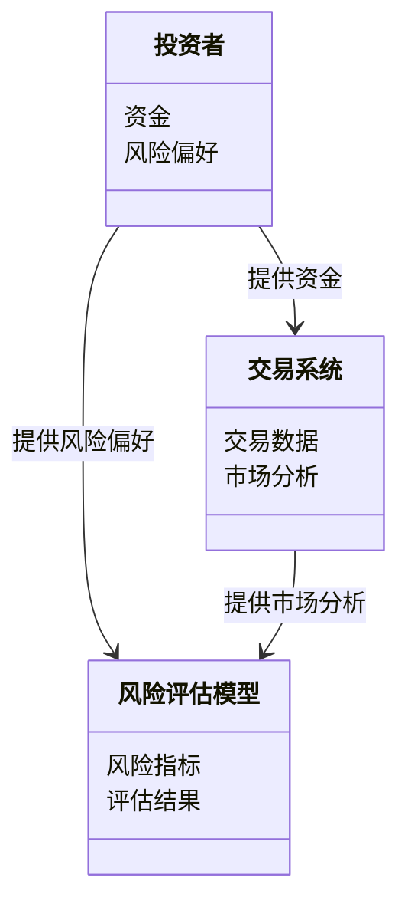
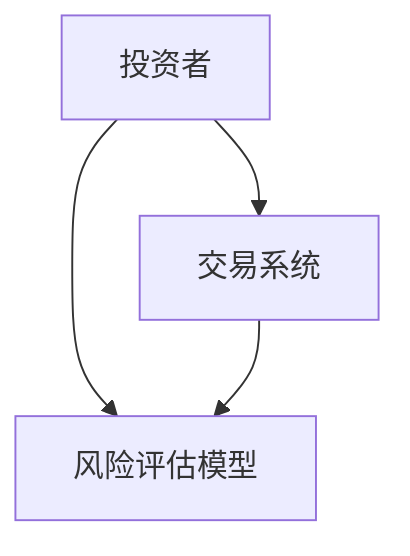

                 


# 第三部分: 多智能体协作算法的原理与实现

## # 第3章: 多智能体协作算法的原理与实现

### ## 3.1 多智能体协作算法的概述

#### ### 3.1.1 多智能体协作的基本概念

#### ### 3.1.2 协作的动机与挑战

#### ### 3.1.3 基于强化学习的协作算法

### ## 3.2 基于强化学习的协作算法

#### ### 3.2.1 强化学习的基本原理

#### ### 3.2.2 多智能体强化学习的挑战

#### ### 3.2.3 基于DQN的协作算法

### ## 3.3 多智能体协作算法的实现

#### ### 3.3.1 Q-learning算法实现

#### ### 3.3.2 DQN算法实现

#### ### 3.3.3 基于Python的多智能体协作算法代码示例

```
```python
import numpy as np
import gym
from gym import spaces
from gym.utils import seeding
import tensorflow as tf
from tensorflow import keras
from tensorflow.keras import layers

class MultiAgentDQN:
    def __init__(self, action_space, state_space):
        self.num_agents = 2  # 假设有两个智能体
        self.gamma = 0.99
        self.epsilon = 1.0
        self.epsilon_min = 0.01
        self.epsilon_decay = 0.995
        self.model = self.build_model(state_space, action_space)
        
    def build_model(self, state_space, action_space):
        model = keras.Sequential([
            layers.Dense(64, activation='relu', input_shape=state_space),
            layers.Dense(64, activation='relu'),
            layers.Dense(action_space, activation='linear')
        ])
        model.compile(optimizer=keras.optimizers.Adam(learning_rate=0.001), loss='mse')
        return model
    
    def act(self, state):
        if np.random.random() < self.epsilon:
            return np.random.randint(0, self.model.output_shape[-1])
        else:
            q = self.model.predict(state)
            return np.argmax(q[0])
    
    def remember(self, state, action, reward, next_state, done):
        # 假设只存储单个智能体的 experience replay
        pass  # 实际实现中需要处理多个智能体的 experience replay
    
    def replay(self, batch_size):
        # 假设从多个智能体的经验中采样
        pass  # 实际实现中需要具体处理多智能体的经验回放
    
    def decay_epsilon(self):
        self.epsilon = max(self.epsilon_min, self.epsilon * self.epsilon_decay)
```

### ## 3.4 基于强化学习的协作算法的数学模型

$$ Q(s, a) = r + \gamma \max_{a'} Q(s', a') $$

其中：
- $s$ 表示当前状态
- $a$ 表示当前动作
- $r$ 表示奖励
- $s'$ 表示下一个状态
- $\gamma$ 表示折扣因子

### ## 3.5 多智能体协作算法的应用场景

---

# 第四部分: 数学模型与公式推导

## # 第4章: 数学模型与公式推导

### ## 4.1 多智能体协作的数学模型

#### ### 4.1.1 收益函数

$$ \text{收益} = \sum_{i=1}^{n} r_i $$

其中：
- $n$ 表示智能体数量
- $r_i$ 表示第i个智能体的收益

#### ### 4.1.2 损失函数

$$ \text{损失} = \sum_{i=1}^{n} l_i $$

其中：
- $l_i$ 表示第i个智能体的损失

#### ### 4.1.3 协作目标函数

$$ \text{协作目标} = \max \sum_{i=1}^{n} (r_i - l_i) $$

### ## 4.2 多智能体协作的数学公式推导

#### ### 4.2.1 状态空间的表示

$$ s \in S $$

其中：
- $S$ 表示状态空间

#### ### 4.2.2 动作空间的表示

$$ a \in A $$

其中：
- $A$ 表示动作空间

#### ### 4.2.3 奖励函数的表示

$$ r: S \times A \rightarrow \mathbb{R} $$

其中：
- $r$ 是一个函数，从状态和动作映射到实数

### ## 4.3 多智能体协作的优化算法

#### ### 4.3.1 基于梯度的优化

$$ \theta_{t+1} = \theta_t + \alpha \nabla_{\theta} J(\theta) $$

其中：
- $\theta$ 表示模型参数
- $\alpha$ 表示学习率
- $J(\theta)$ 表示目标函数

---

# 第五部分: 系统分析与架构设计

## # 第5章: 系统分析与架构设计

### ## 5.1 问题场景介绍

#### ### 5.1.1 价值投资中的决策场景

#### ### 5.1.2 多智能体协作的必要性

### ## 5.2 系统功能设计

#### ### 5.2.1 领域模型设计



#### ### 5.2.2 系统架构设计



### ## 5.3 系统架构设计方案

#### ### 5.3.1 模块划分与交互

#### ### 5.3.2 系统接口设计

#### ### 5.3.3 系统交互设计

---

# 第六部分: 项目实战与案例分析

## # 第6章: 项目实战与案例分析

### ## 6.1 项目实战: 构建一个AI驱动的价值投资系统

#### ### 6.1.1 环境配置

#### ### 6.1.2 系统核心实现

#### ### 6.1.3 系统测试与优化

### ## 6.2 实际案例分析

#### ### 6.2.1 案例背景

#### ### 6.2.2 数据收集与预处理

#### ### 6.2.3 模型训练与评估

#### ### 6.2.4 案例分析与解读

---

# 第七部分: 最佳实践、小结与展望

## # 第7章: 最佳实践、小结与展望

### ## 7.1 最佳实践

#### ### 7.1.1 系统设计中的注意事项

#### ### 7.1.2 开发中的常见问题与解决方案

### ## 7.2 小结

#### ### 7.2.1 全文总结

#### ### 7.2.2 核心要点回顾

### ## 7.3 展望

#### ### 7.3.1 未来的研究方向

#### ### 7.3.2 技术发展的潜在影响

---

# 作者

作者：AI天才研究院/AI Genius Institute & 禅与计算机程序设计艺术 /Zen And The Art of Computer Programming

---

以上是《AI驱动的商业生态系统分析：价值投资中的多智能体应用》的技术博客文章目录大纲，接下来按照这个大纲逐步完成文章的撰写。

