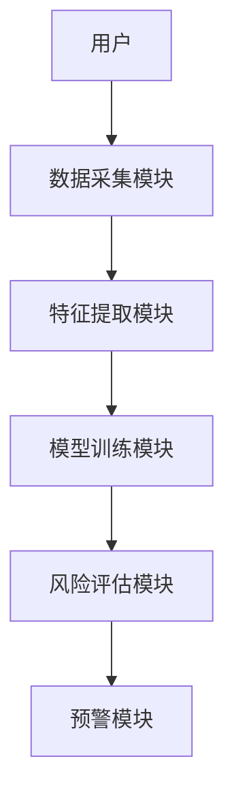

                 


# AI驱动的地缘政治风险分析：价值投资中的多智能体应用

## 关键词：AI技术，地缘政治风险，多智能体系统，价值投资，风险管理，系统架构

## 摘要：随着全球化的深入和国际竞争的加剧，地缘政治风险分析在价值投资中的重要性日益凸显。本文探讨如何利用AI技术，特别是多智能体系统，来提升地缘政治风险的预测和管理能力，为价值投资提供更精确的决策支持。通过分析核心概念、算法原理、系统架构以及实际案例，本文展示了AI在地缘政治风险管理中的巨大潜力。

---

## 第1章：背景与概述

### 1.1 地缘政治风险分析的背景与重要性

地缘政治风险分析是评估特定地区或国家面临的潜在政治、经济和社会风险的过程。随着全球化的深入，国际间的竞争和合作日益复杂，地缘政治风险对企业和投资者的影响也越来越大。例如，贸易摩擦、地区冲突和政策变化都可能对投资产生重大影响。因此，准确预测和评估这些风险对于价值投资至关重要。

### 1.2 AI技术在地缘政治分析中的作用

人工智能技术，尤其是自然语言处理和机器学习，能够从大量非结构化数据中提取有价值的信息。通过分析新闻、社交媒体、政府声明等数据，AI可以帮助投资者快速识别潜在的地缘政治风险，并提供实时的动态分析。

### 1.3 多智能体系统在价值投资中的应用

多智能体系统是一种由多个相互作用的智能体组成的系统，每个智能体都有自己的目标和决策机制。在价值投资中，多智能体系统可以模拟不同利益相关者的行为，如政府、企业、投资者等，从而预测市场动态和风险变化。

---

## 第2章：核心概念与理论基础

### 2.1 地缘政治风险分析的框架

地缘政治风险分析的框架通常包括以下几个核心要素：

1. **政治稳定性**：评估一个国家或地区的政治环境是否稳定，是否有政治动荡的风险。
2. **经济状况**：分析经济数据，如GDP增长率、通货膨胀率等，以判断经济风险。
3. **社会文化因素**：考虑社会文化差异对政治和经济的影响，如民族矛盾、宗教冲突等。
4. **国际关系**：分析国家间的外交关系、贸易政策和军事动态。

### 2.2 多智能体系统的协作机制

多智能体系统在地缘政治风险分析中的协作机制包括以下几个步骤：

1. **信息共享**：各智能体之间共享数据和信息，如新闻报道、政策变化等。
2. **任务分配**：根据各智能体的能力和目标，分配不同的任务。
3. **协作决策**：通过协商和协调，形成一致的决策方案。
4. **动态调整**：根据实时数据和反馈，动态调整决策策略。

### 2.3 AI驱动的地缘政治风险分析模型

AI驱动的地缘政治风险分析模型通常包括以下几个部分：

1. **数据采集**：从多个来源采集数据，如新闻、社交媒体、政府公告等。
2. **特征提取**：通过自然语言处理技术，提取关键特征，如关键词、情感倾向等。
3. **模型训练**：使用机器学习算法，训练风险预测模型。
4. **风险评估**：根据模型输出，评估地缘政治风险，并提供预警。

---

## 第3章：算法原理

### 3.1 博弈论模型在地缘政治分析中的应用

博弈论模型是一种分析决策者在冲突与合作中的行为模式的数学工具。在地缘政治分析中，博弈论模型可以用来模拟国家间的互动，预测可能的冲突和合作。

#### 3.1.1 博弈论的基本原理

博弈论中的基本概念包括：

- **玩家**：参与博弈的决策者，如国家、企业等。
- **策略**：玩家在博弈中的可能行动。
- **收益**：玩家在不同策略下的收益或损失。
- **纳什均衡**：一种稳定的博弈状态，其中每个玩家的策略都是最佳反应。

#### 3.1.2 博弈论模型在地缘政治分析中的应用

例如，可以使用博弈论模型来分析两个国家之间的贸易谈判。假设国家A和国家B在谈判中可以选择合作或对抗的策略。通过计算纳什均衡，可以预测最终的谈判结果。

##### 示例：贸易谈判中的博弈论分析

$$
\begin{cases}
\text{国家A选择合作} \\
\text{国家B选择合作} \\
\end{cases}
$$

最终结果可能是双赢，而如果选择对抗，则可能对双方造成损失。

### 3.2 情感分析算法

情感分析算法用于分析文本中的情感倾向，如积极、消极或中性。在地缘政治风险分析中，情感分析可以用来评估公众对某一政策或事件的态度。

#### 3.2.1 情感分析的实现步骤

1. **数据预处理**：清洗数据，去除停用词和标点符号。
2. **特征提取**：提取文本中的关键词和情感词汇。
3. **模型训练**：使用机器学习算法，如支持向量机（SVM）或长短期记忆网络（LSTM），训练情感分类模型。
4. **情感预测**：对新的文本进行情感分类。

##### 示例：情感分析在新闻报道中的应用

假设有一篇新闻报道提到“某国政策引发强烈反对”，情感分析算法可以识别出文本中的负面情绪，提示可能存在政治不稳定的风险。

---

## 第4章：系统架构设计

### 4.1 系统功能设计

AI驱动的地缘政治风险分析系统通常包括以下几个功能模块：

- **数据采集模块**：从新闻、社交媒体等来源采集数据。
- **特征提取模块**：使用NLP技术提取关键词和情感特征。
- **模型训练模块**：训练风险预测模型。
- **风险评估模块**：根据模型输出，评估风险等级。
- **预警模块**：当风险超过阈值时，触发预警。

### 4.2 系统架构设计

以下是系统的架构图：



### 4.3 接口设计

系统需要与外部数据源、数据库和用户界面进行交互。以下是接口设计：

- **数据接口**：与新闻API、社交媒体API对接。
- **用户接口**：提供一个用户友好的界面，供用户查询风险评估结果。
- **预警接口**：与企业的预警系统对接，触发警报。

---

## 第5章：项目实战

### 5.1 环境配置

在开始项目之前，需要配置开发环境。以下是所需的工具和库：

- **编程语言**：Python
- **库**：NLTK、scikit-learn、Flask
- **框架**：TensorFlow、Keras

### 5.2 核心代码实现

以下是情感分析模型的实现代码：

```python
from sklearn.feature_extraction.text import TfidfVectorizer
from sklearn.svm import SVC
from sklearn.pipeline import Pipeline

# 数据预处理
def preprocess(text):
    return text.lower().strip()

# 情感分析模型
model = Pipeline([
    ('tfidf', TfidfVectorizer()),
    ('svm', SVC())
])

# 训练模型
model.fit(X_train, y_train)
```

### 5.3 案例分析

假设我们有一个关于中东地区的地缘政治风险分析案例。通过模型预测，发现某国政策可能引发冲突的风险较高，投资者可以据此调整投资策略。

---

## 第6章：扩展与展望

### 6.1 研究前沿

当前的研究前沿包括：

- **深度学习在NLP中的应用**：如使用Transformer模型进行情感分析。
- **多模态数据融合**：结合文本、图像等多种数据源进行风险分析。

### 6.2 未来发展方向

未来的发展方向包括：

- **实时风险监控**：开发实时监控系统，提供即时预警。
- **多智能体协作优化**：优化多智能体系统的协作机制，提高预测精度。

### 6.3 注意事项

在实际应用中，需要注意以下几点：

- **数据隐私**：确保数据的合法性和隐私性。
- **模型可解释性**：提高模型的透明度，便于用户理解。
- **动态适应性**：模型需要能够实时更新，适应不断变化的环境。

---

## 作者：AI天才研究院 & 禅与计算机程序设计艺术

本文由AI天才研究院与禅与计算机程序设计艺术联合撰写，转载请注明出处。

