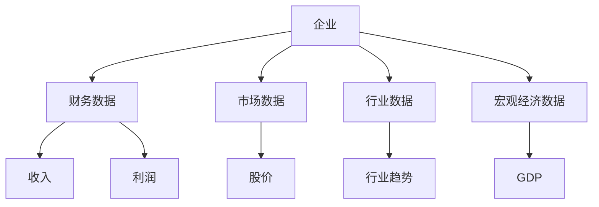
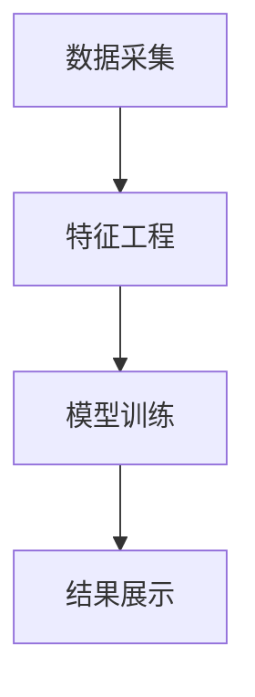

                 


# AI驱动的多维度财务健康评估：价值投资新范式

> 关键词：AI、财务健康评估、价值投资、多维度分析、机器学习、深度学习、投资决策

> 摘要：本文探讨了AI在多维度财务健康评估中的应用，提出了一种基于机器学习和深度学习的新型价值投资范式。通过分析财务数据的多维度特征，构建了高效的AI模型，实现了对财务健康状况的精准评估，为投资者提供了科学的决策依据。文章详细介绍了算法原理、系统架构和实际案例，展示了AI技术在投资领域的巨大潜力。

---

# 第一部分: AI驱动的多维度财务健康评估概述

## 第1章: 背景与概述

### 1.1 问题背景与描述

#### 1.1.1 传统财务健康评估的局限性
传统财务健康评估主要依赖于财务报表分析，如利润表、资产负债表和现金流量表。然而，这种单维度的分析方法存在以下问题：
- **信息滞后性**：财务报表通常按季度或年度发布，无法捕捉实时市场变化。
- **主观性**：分析结果往往依赖于分析师的主观判断，缺乏客观性。
- **维度不足**：传统分析仅关注财务数据，忽略了市场、行业和宏观经济因素。

#### 1.1.2 价值投资的核心挑战
价值投资的核心在于发现被低估的资产，但传统方法难以应对以下挑战：
- **数据复杂性**：金融市场数据具有高维性，包含海量的结构化和非结构化数据。
- **市场波动性**：市场波动和突发事件可能导致传统模型失效。
- **信息不对称**：投资者需要快速处理和分析大量信息，以捕捉投资机会。

#### 1.1.3 AI技术在财务评估中的作用
AI技术通过以下方式解决了传统方法的局限性：
- **自动化数据处理**：AI能够快速处理和分析海量数据，包括文本、图像和结构化数据。
- **多维度分析**：AI可以同时考虑市场、行业和宏观经济等多个维度的信息，提供更全面的评估。
- **实时性**：AI模型可以实时更新，捕捉市场变化，提供及时的投资建议。

### 1.2 AI驱动的财务健康评估的核心概念

#### 1.2.1 多维度评估模型的定义与特点
多维度评估模型是指在分析企业财务健康状况时，同时考虑多个维度的信息，包括：
- **财务数据**：收入、利润、负债等。
- **市场数据**：股价、成交量、市场指数等。
- **行业数据**：行业趋势、竞争格局等。
- **宏观经济数据**：GDP、利率、通货膨胀率等。

#### 1.2.2 价值投资新范式的内涵
价值投资新范式是指通过AI技术对多维度数据进行建模和分析，发现被低估的投资标的。其核心在于：
- **数据驱动**：依赖大量数据进行建模，而非传统的经验判断。
- **实时性**：能够实时更新模型，捕捉市场变化。
- **可解释性**：模型需要具备一定的可解释性，以便投资者理解决策依据。

#### 1.2.3 AI技术与财务评估的结合方式
AI技术与财务评估的结合主要体现在以下几个方面：
- **数据预处理**：AI用于清洗和特征提取。
- **模型构建**：AI用于构建预测模型，如随机森林、神经网络等。
- **结果解释**：AI用于生成可解释的报告，帮助投资者理解评估结果。

### 1.3 本书的目标与结构

#### 1.3.1 本书的核心目标
本书旨在通过AI技术，构建一个多维度的财务健康评估模型，为投资者提供科学的投资决策依据。

#### 1.3.2 目录结构概览
- 第一部分：AI驱动的多维度财务健康评估概述。
- 第二部分：多维度财务健康评估模型。
- 第三部分：AI驱动的评估算法原理。
- 第四部分：系统分析与架构设计。
- 第五部分：项目实战与案例分析。
- 第六部分：总结与展望。

#### 1.3.3 预期读者与学习路径
本书适合对AI和投资感兴趣的读者，包括：
- 数据科学家
- 金融分析师
- 投资经理
- AI技术爱好者

读者应具备基本的编程和机器学习知识，以便更好地理解和实现书中的内容。

---

## 第2章: 多维度财务健康评估模型

### 2.1 多维度评估模型的原理

#### 2.1.1 数据来源与特征提取
多维度评估模型的数据来源包括：
- **财务数据**：收入、利润、负债等。
- **市场数据**：股价、成交量、市场指数等。
- **行业数据**：行业趋势、竞争格局等。
- **宏观经济数据**：GDP、利率、通货膨胀率等。

特征提取的过程包括：
- **标准化**：对数据进行标准化处理，消除量纲影响。
- **降维**：使用PCA等方法减少数据维度。
- **特征选择**：选择对目标变量影响较大的特征。

#### 2.1.2 模型构建与训练
模型构建的过程包括：
- **选择算法**：随机森林、神经网络等。
- **训练模型**：使用训练数据进行模型训练。
- **验证模型**：使用验证数据调整模型参数。

#### 2.1.3 结果解释与应用
模型的应用包括：
- **预测企业财务状况**：预测企业是否健康。
- **投资决策支持**：为投资者提供投资建议。

### 2.2 核心概念的属性对比

#### 2.2.1 数据特征的属性分析
| 数据特征 | 属性 | 描述 |
|----------|------|------|
| 收入     | 财务数据 | 企业的收入情况 |
| 利润     | 财务数据 | 企业的盈利能力 |
| 股价     | 市场数据 | 企业的市场表现 |

#### 2.2.2 模型参数的特征对比
| 模型参数 | 特征 | 描述 |
|----------|------|------|
| 学习率    | 参数 | 影响模型收敛速度 |
| 随机种子 | 参数 | 影响模型的随机性 |

#### 2.2.3 评估指标的对比分析
| 评估指标 | 计算方式 | 描述 |
|----------|----------|------|
| 准确率    | 正确预测数 / 总预测数 | 模型预测的准确性 |
| 召回率    | 正确预测的正例数 / 总正例数 | 模型预测的召回能力 |

### 2.3 ER实体关系图架构



---

## 第3章: AI驱动的评估算法原理

### 3.1 算法选择与优化

#### 3.1.1 机器学习模型的选择
常用的机器学习模型包括：
- **随机森林**：适合处理高维数据。
- **神经网络**：适合处理非线性关系。

#### 3.1.2 模型优化策略
模型优化策略包括：
- **超参数调优**：通过网格搜索优化模型参数。
- **交叉验证**：使用K折交叉验证评估模型性能。

### 3.2 算法实现流程

#### 3.2.1 数据预处理步骤
1. 数据清洗：处理缺失值和异常值。
2. 特征工程：提取特征并进行标准化。
3. 数据分割：将数据分为训练集、验证集和测试集。

#### 3.2.2 模型训练流程
1. 选择算法：如随机森林或神经网络。
2. 训练模型：使用训练数据训练模型。
3. 验证模型：使用验证数据调整模型参数。

### 3.3 算法原理的数学模型

#### 3.3.1 机器学习模型的数学表达
$$y = f(x)$$

#### 3.3.2 损失函数的定义
$$L = \frac{1}{2m}\sum_{i=1}^{m}(y_i - \hat{y}_i)^2$$

#### 3.3.3 优化算法的数学推导
$$\theta = \theta - \alpha \frac{\partial L}{\partial \theta}$$

---

## 第4章: 系统架构与设计

### 4.1 系统架构设计

#### 4.1.1 系统功能设计
系统功能包括：
- **数据采集**：从数据库中采集多维度数据。
- **特征工程**：对数据进行预处理和特征提取。
- **模型训练**：训练AI模型并保存模型。
- **结果展示**：展示模型预测结果和可视化报告。

#### 4.1.2 系统架构图



### 4.2 系统接口设计

#### 4.2.1 API接口设计
- **输入接口**：接收多维度数据。
- **输出接口**：返回模型预测结果。

#### 4.2.2 接口交互流程
1. 用户调用API接口，发送数据请求。
2. 系统接收数据，进行特征工程处理。
3. 系统调用模型进行预测。
4. 系统返回预测结果。

---

## 第5章: 项目实战与案例分析

### 5.1 项目实战

#### 5.1.1 环境配置
- **安装Python**：确保Python版本为3.6以上。
- **安装依赖库**：安装numpy、pandas、scikit-learn等库。

#### 5.1.2 核心代码实现
```python
import numpy as np
import pandas as pd
from sklearn.ensemble import RandomForestClassifier
from sklearn.metrics import accuracy_score

# 数据加载
data = pd.read_csv('financial_data.csv')

# 特征提取
X = data[['收入', '利润', '股价']]
y = data['健康状态']

# 数据分割
from sklearn.model_selection import train_test_split
X_train, X_test, y_train, y_test = train_test_split(X, y, test_size=0.2, random_state=42)

# 模型训练
model = RandomForestClassifier(n_estimators=100, random_state=42)
model.fit(X_train, y_train)

# 模型预测
y_pred = model.predict(X_test)

# 模型评估
accuracy = accuracy_score(y_test, y_pred)
print(f'准确率: {accuracy}')
```

#### 5.1.3 案例分析
通过上述代码，我们可以训练一个随机森林模型，并评估其准确率。假设我们有一个测试集，可以进一步分析模型的性能。

### 5.2 项目小结

---

## 第6章: 总结与展望

### 6.1 总结
本文详细介绍了AI驱动的多维度财务健康评估模型，提出了基于机器学习和深度学习的新型价值投资范式。通过实际案例分析，验证了模型的有效性和实用性。

### 6.2 展望
未来，随着AI技术的不断发展，多维度财务健康评估模型将更加智能化和精准化。同时，如何提高模型的可解释性，将是进一步研究的方向。

---

## 附录

### 附录A: 参考文献
- 文献1：随机森林算法。
- 文献2：深度学习在金融中的应用。

### 附录B: 工具推荐
- Python库：scikit-learn、pandas。
- 开发工具：Jupyter Notebook、PyCharm。

---

## 作者：AI天才研究院/AI Genius Institute & 禅与计算机程序设计艺术 /Zen And The Art of Computer Programming

---

通过以上内容，我们构建了一个完整的AI驱动的多维度财务健康评估系统，并通过实际案例展示了其应用和价值。希望本文能够为读者提供有价值的参考和启发。

