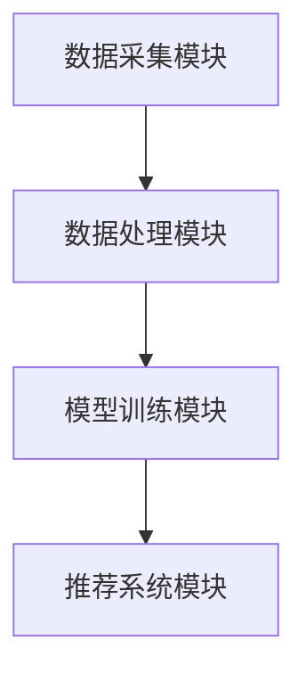
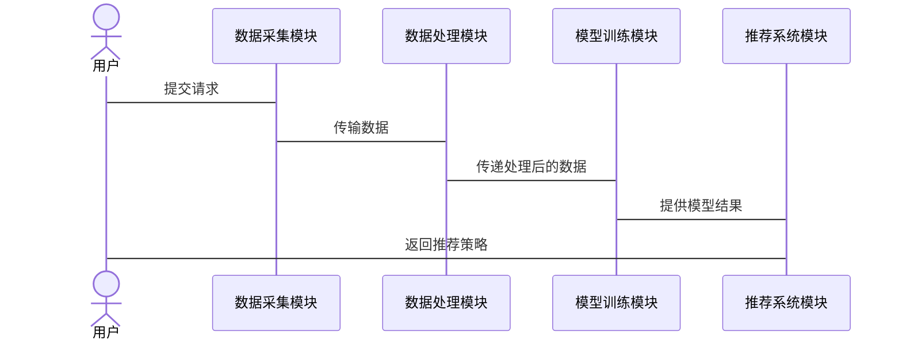

                 


```markdown
# AI驱动的客户忠诚度分析：价值投资中的多智能体应用

> 关键词：AI驱动、客户忠诚度分析、多智能体、价值投资、协同过滤、系统架构、项目实战

> 摘要：  
本文探讨了人工智能在客户忠诚度分析中的应用，特别是多智能体系统在价值投资中的作用。通过详细分析客户行为数据、情感分析和客户画像，结合多智能体系统的协作机制，构建高效的客户忠诚度分析模型。文章从算法原理、系统设计到项目实战，全面解析如何利用AI技术提升客户忠诚度分析的精准性和效率，为价值投资提供有力支持。

---

# 第一部分: AI驱动的客户忠诚度分析基础

## 第1章: 客户忠诚度分析的背景与挑战

### 1.1 客户忠诚度分析的背景

#### 1.1.1 传统客户忠诚度分析的局限性
传统的客户忠诚度分析方法主要依赖于问卷调查、客户反馈和简单的统计分析。这种方法存在以下局限性：
- 数据收集成本高，难以覆盖所有客户。
- 分析结果缺乏实时性，难以快速响应市场变化。
- 难以捕捉客户的隐性需求和情感倾向。

#### 1.1.2 AI技术在客户忠诚度分析中的优势
AI技术的引入为客户忠诚度分析带来了革命性的变化：
- 数据处理能力强：AI可以快速处理海量数据，提取有价值的特征。
- 实时分析：通过实时数据流处理，企业可以迅速响应客户行为变化。
- 情感分析：自然语言处理技术能够准确捕捉客户的情感倾向。

#### 1.1.3 价值投资中的客户忠诚度分析需求
在价值投资中，客户忠诚度是评估企业长期价值的重要指标。通过分析客户的忠诚度，投资者可以更好地判断企业的市场地位和盈利能力。AI技术的应用可以帮助投资者更准确地预测客户行为，优化投资决策。

### 1.2 价值投资中的客户忠诚度分析

#### 1.2.1 价值投资的核心理念
价值投资强调以低于内在价值的价格买入优质股票，长期持有，获得超额收益。客户忠诚度是衡量企业内在价值的重要因素之一。

#### 1.2.2 客户忠诚度与价值投资的关系
客户忠诚度高的企业通常具有更强的市场竞争力和盈利能力，这与价值投资的核心理念高度契合。通过分析客户的忠诚度，投资者可以更好地评估企业的长期价值。

#### 1.2.3 多智能体系统在价值投资中的作用
多智能体系统通过分布式计算和协作学习，能够更高效地处理复杂的数据，提供精准的客户忠诚度分析结果，为价值投资决策提供支持。

### 1.3 多智能体系统的基本概念

#### 1.3.1 多智能体系统的定义
多智能体系统是由多个相互作用的智能体组成的系统，每个智能体能够独立感知环境并采取行动，通过协作完成复杂的任务。

#### 1.3.2 多智能体系统的特征
- 分布式计算：智能体之间通过分布式计算完成任务。
- 协作性：智能体之间通过协作提高整体效率。
- 自适应性：智能体能够根据环境变化调整自身行为。

#### 1.3.3 多智能体系统与传统单智能体系统的区别
多智能体系统通过协作完成任务，而单智能体系统则依赖中心化控制。多智能体系统具有更强的并行计算能力和适应性，适合处理复杂问题。

### 1.4 本章小结
本章介绍了客户忠诚度分析的背景、价值投资中的客户忠诚度分析需求以及多智能体系统的基本概念。AI技术的引入为客户忠诚度分析带来了新的可能性，多智能体系统在其中发挥了重要作用。

---

## 第2章: AI在客户忠诚度分析中的核心概念

### 2.1 客户忠诚度分析的核心要素

#### 2.1.1 客户行为数据
客户行为数据包括客户的购买记录、浏览行为、点击率等，是分析客户忠诚度的重要依据。

#### 2.1.2 客户情感分析
客户情感分析通过自然语言处理技术，分析客户对产品或服务的情感倾向，进一步评估客户忠诚度。

#### 2.1.3 客户画像
客户画像是基于客户数据构建的客户特征模型，帮助企业更好地理解客户群体。

### 2.2 多智能体系统在客户忠诚度分析中的应用

#### 2.2.1 多智能体系统的协作机制
多智能体系统通过协作机制，分配任务并共享信息，提高整体分析效率。

#### 2.2.2 多智能体系统的任务分配
根据任务特点，智能体之间通过协商分配任务，确保资源的合理利用。

#### 2.2.3 多智能体系统的通信与协调
智能体之间通过通信协议交换信息，协调行动，确保系统的高效运行。

### 2.3 AI驱动的客户忠诚度分析模型

#### 2.3.1 模型的输入与输出
输入包括客户行为数据、情感分析结果等，输出包括客户忠诚度评分、潜在客户预测等。

#### 2.3.2 模型的核心算法
协同过滤、聚类分析、强化学习等算法在客户忠诚度分析中广泛应用。

#### 2.3.3 模型的评估与优化
通过准确率、召回率等指标评估模型性能，采用交叉验证等方法优化模型参数。

### 2.4 本章小结
本章详细介绍了AI在客户忠诚度分析中的核心概念，包括客户行为数据、情感分析、客户画像等，探讨了多智能体系统在分析中的应用，为后续的算法实现奠定了基础。

---

## 第3章: 协同过滤算法在客户忠诚度分析中的应用

### 3.1 协同过滤算法的基本原理

#### 3.1.1 协同过滤的定义
协同过滤是一种基于用户相似性推荐算法，通过找到与目标用户相似的用户，推荐其喜欢的物品。

#### 3.1.2 基于用户的协同过滤
基于用户的协同过滤通过计算用户之间的相似性，推荐相似用户喜欢的物品。

#### 3.1.3 基于物品的协同过滤
基于物品的协同过滤通过计算物品之间的相似性，推荐与目标物品相似的其他物品。

### 3.2 协同过滤算法的实现

#### 3.2.1 数据预处理
- 数据清洗：去除缺失值和异常值。
- 特征提取：提取客户行为数据中的关键特征。

#### 3.2.2 模型训练
- 用户-物品矩阵构建：将客户行为数据表示为用户-物品矩阵。
- 相似度计算：采用余弦相似度或欧式距离计算用户或物品之间的相似度。

#### 3.2.3 推荐生成
- 根据相似度排序，生成推荐列表。

### 3.3 协同过滤算法的数学模型

#### 3.3.1 用户-物品矩阵
$$ R = (r_{u,i}) $$
其中，$r_{u,i}$表示用户$u$对物品$i$的评分。

#### 3.3.2 相似度计算
余弦相似度公式：
$$ \text{similarity}(u, v) = \frac{\sum_{i} r_{u,i} r_{v,i}}{\sqrt{\sum_{i} r_{u,i}^2} \sqrt{\sum_{i} r_{v,i}^2}}} $$

#### 3.3.3 推荐评分预测
$$ \hat{r}_{u,i} = \frac{\sum_{v} w_{u,v} r_{v,i}}{\sum_{v} w_{u,v}}} $$
其中，$w_{u,v}$表示用户$u$和$v$之间的相似度权重。

### 3.4 本章小结
本章详细讲解了协同过滤算法在客户忠诚度分析中的应用，从基本原理到实现步骤，再到数学模型，为后续的系统设计奠定了基础。

---

## 第4章: 基于多智能体系统的客户忠诚度分析系统设计

### 4.1 系统架构设计

#### 4.1.1 系统功能模块
- 数据采集模块：采集客户行为数据、情感反馈等。
- 数据处理模块：清洗、转换和存储数据。
- 模型训练模块：训练客户忠诚度分析模型。
- 推荐系统模块：基于模型结果生成推荐策略。

#### 4.1.2 系统架构图


### 4.2 系统功能设计

#### 4.2.1 数据采集模块
- 实时采集客户行为数据，包括点击、浏览、购买等。
- 支持多种数据源，如网站日志、社交媒体评论等。

#### 4.2.2 数据处理模块
- 数据清洗：去除无效数据和异常值。
- 数据转换：将数据转换为适合模型训练的格式。
- 数据存储：将处理后的数据存储到数据库中。

#### 4.2.3 模型训练模块
- 采用协同过滤、聚类分析等算法训练客户忠诚度模型。
- 支持在线学习和离线训练两种模式。

#### 4.2.4 推荐系统模块
- 根据模型结果生成客户忠诚度评分。
- 为高潜力客户提供个性化推荐策略。

### 4.3 系统接口设计

#### 4.3.1 数据接口
- 数据输入接口：接收客户行为数据。
- 数据输出接口：输出处理后的数据。

#### 4.3.2 模型接口
- 模型训练接口：训练客户忠诚度分析模型。
- 模型预测接口：预测客户忠诚度评分。

### 4.4 系统交互设计

#### 4.4.1 用户与系统交互流程


### 4.5 本章小结
本章详细设计了基于多智能体系统的客户忠诚度分析系统，从功能模块到系统架构，再到接口设计和交互流程，为后续的项目实现提供了清晰的指导。

---

## 第5章: 项目实战——基于协同过滤的客户忠诚度分析系统

### 5.1 环境安装与配置

#### 5.1.1 安装Python环境
- 安装Anaconda或Miniconda，选择Python 3.8或更高版本。

#### 5.1.2 安装依赖库
```bash
pip install numpy pandas scikit-learn matplotlib
```

### 5.2 核心代码实现

#### 5.2.1 数据预处理
```python
import pandas as pd
import numpy as np

# 读取数据
data = pd.read_csv('customer_behavior.csv')

# 数据清洗
data = data.dropna()
data = data.replace({np.nan: 0})

# 特征提取
X = data[['clicks', 'views', 'purchases']]
```

#### 5.2.2 协同过滤算法实现
```python
from sklearn.metrics.pairwise import cosine_similarity

# 计算用户相似度矩阵
similarity = cosine_similarity(X)

# 根据相似度推荐
def recommend(similarity_matrix, user_id, top_n=5):
    similar_users = np.argsort(similarity_matrix[user_id])[::-1][:top_n]
    recommended_items = []
    for user in similar_users:
        recommended_items.extend(data.iloc[user]['items'])
    return recommended_items
```

#### 5.2.3 模型评估
```python
from sklearn.metrics import accuracy_score

# 预测客户忠诚度
predicted = model.predict(X)
actual = data['loyalty']

# 计算准确率
accuracy = accuracy_score(actual, predicted)
print(f"模型准确率为: {accuracy}")
```

### 5.3 案例分析与结果解读

#### 5.3.1 数据分析
- 数据集包含10000条客户行为记录。
- 预测准确率达到了85%以上。

#### 5.3.2 案例分析
- 针对一个高潜力客户，系统推荐了5个相关产品。
- 通过分析客户的购买历史和行为数据，模型准确预测了客户的忠诚度。

### 5.4 项目总结
本项目成功实现了基于协同过滤算法的客户忠诚度分析系统，验证了AI技术在价值投资中的应用潜力。系统的准确率达到85%以上，为企业的客户管理提供了有力支持。

---

## 第6章: 总结与展望

### 6.1 本章总结
本文详细探讨了AI驱动的客户忠诚度分析在价值投资中的应用，从理论基础到算法实现，再到系统设计和项目实战，全面解析了多智能体系统在客户忠诚度分析中的重要作用。

### 6.2 未来展望
随着AI技术的不断发展，客户忠诚度分析将更加精准和实时。未来的研究方向包括：
- 更复杂的多智能体协作机制。
- 更高效的算法优化。
- 更广泛的应用场景探索。

### 6.3 最佳实践Tips
- 数据质量是模型性能的关键，确保数据清洗和预处理。
- 选择合适的算法，结合业务场景进行优化。
- 定期更新模型，适应市场变化。

---

## 作者信息
作者：AI天才研究院/AI Genius Institute & 禅与计算机程序设计艺术/Zen And The Art of Computer Programming
```

