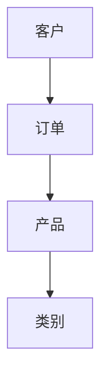
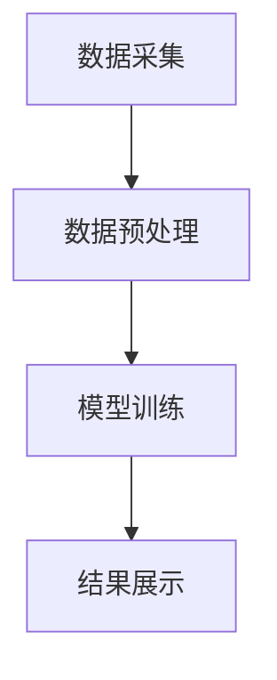

                 

# AI驱动的客户满意度分析：预测公司的长期成功

## 关键词：AI, 客户满意度, 预测, 机器学习, 数据分析, 企业成功

## 摘要：  
客户满意度是企业长期成功的关键指标之一。本文通过AI技术，详细探讨如何利用客户数据和机器学习算法进行客户满意度分析，预测企业未来的成功。从数据预处理到模型训练，再到系统架构设计，本文提供了一套完整的解决方案，并通过实际案例展示了如何将理论应用于实践。

---

# 第1章: AI驱动的客户满意度分析背景

## 1.1 客户满意度分析的背景

### 1.1.1 客户满意度分析的定义  
客户满意度是指客户对产品或服务的实际体验与期望值之间的差距。通过分析客户满意度数据，企业可以识别客户痛点，优化产品和服务，提升客户忠诚度。

### 1.1.2 客户满意度分析的重要性  
客户满意度是企业长期成功的关键指标之一。高客户满意度不仅能够提高客户忠诚度，还能降低客户流失率，为企业创造更大的价值。

### 1.1.3 AI技术在客户满意度分析中的作用  
AI技术可以通过自动化数据处理、特征提取和模型训练，快速分析大量客户数据，帮助企业高效预测客户满意度。

## 1.2 问题背景与问题描述

### 1.2.1 客户满意度分析的核心问题  
如何通过AI技术，从海量客户数据中提取有效特征，构建高效的客户满意度预测模型。

### 1.2.2 数据来源与数据特征  
客户数据可能来自多个渠道，包括客户反馈、购买记录、社交媒体评论等。数据特征包括文本、数值和类别特征。

### 1.2.3 问题解决的边界与外延  
客户满意度分析的核心问题包括数据预处理、特征提取、模型选择和评估。外延问题包括如何优化模型性能和如何将模型应用于实际业务。

## 1.3 核心概念与联系

### 1.3.1 客户满意度分析的核心要素  
客户满意度分析的核心要素包括客户数据、特征工程、模型训练和结果解读。

### 1.3.2 AI驱动的客户满意度分析原理  
通过机器学习算法，从客户数据中提取特征，构建预测模型，评估模型性能，并根据结果优化模型。

### 1.3.3 核心概念的属性特征对比表  
以下是核心概念的属性特征对比表：

| 概念         | 属性         | 特征描述                         |
|--------------|--------------|----------------------------------|
| 数据预处理   | 数据清洗     | 去除缺失值、异常值               |
|              | 数据标准化   | 标准化数值特征                   |
| 特征工程     | 文本特征提取 | 使用TF-IDF提取文本特征           |
|              | 数值特征标准化 | 对数值特征进行归一化处理         |
| 模型训练     | 分类模型选择 | 使用随机森林、SVM等分类模型       |
|              | 回归模型选择 | 使用线性回归、梯度下降模型         |
| 模型评估     | 评估指标     | 准确率、召回率、F1分数           |

### 1.3.4 ER实体关系图

## 1.4 本章小结  
本章介绍了客户满意度分析的背景、核心概念和AI技术的作用，为后续章节的分析奠定了基础。

---

# 第2章: AI驱动的客户满意度分析核心概念

## 2.1 数据预处理与特征工程

### 2.1.1 数据清洗方法  
数据清洗是数据预处理的重要步骤，包括去除缺失值、异常值和重复值。

### 2.1.2 文本特征提取  
文本特征提取是通过将文本数据转换为数值特征，常用方法包括TF-IDF和词嵌入。

### 2.1.3 数值特征标准化  
数值特征标准化是通过归一化或其他方法，将数值特征缩放到相同范围内。

## 2.2 模型训练与评估

### 2.2.1 分类模型选择  
分类模型包括随机森林、支持向量机（SVM）等，适用于客户满意度的分类问题。

### 2.2.2 回归模型选择  
回归模型包括线性回归、梯度下降等，适用于客户满意度的回归问题。

### 2.2.3 模型评估指标  
模型评估指标包括准确率、召回率、F1分数等。

## 2.3 核心概念的联系与对比

### 2.3.1 核心概念的联系  
数据预处理、特征工程、模型训练和模型评估是AI驱动的客户满意度分析的核心步骤，相互关联，共同作用于模型性能的提升。

### 2.3.2 核心概念的对比  
以下是核心概念的对比表格：

| 概念         | 属性         | 特征描述                         |
|--------------|--------------|----------------------------------|
| 数据预处理   | 数据清洗     | 去除缺失值、异常值               |
|              | 数据标准化   | 标准化数值特征                   |
| 特征工程     | 文本特征提取 | 使用TF-IDF提取文本特征           |
|              | 数值特征标准化 | 对数值特征进行归一化处理         |
| 模型训练     | 分类模型选择 | 使用随机森林、SVM等分类模型       |
|              | 回归模型选择 | 使用线性回归、梯度下降模型         |
| 模型评估     | 评估指标     | 准确率、召回率、F1分数           |

## 2.4 本章小结  
本章详细介绍了AI驱动的客户满意度分析的核心概念，包括数据预处理、特征工程、模型训练和模型评估，为后续章节的分析提供了理论基础。

---

# 第3章: AI驱动的客户满意度分析算法原理

## 3.1 线性回归

### 3.1.1 线性回归原理  
线性回归是一种简单的回归模型，适用于预测客户满意度的数值。

### 3.1.2 线性回归数学模型  
线性回归的数学模型如下：

$$ y = \beta_0 + \beta_1x + \epsilon $$

其中，$y$ 是目标变量（客户满意度），$x$ 是特征变量，$\beta_0$ 和 $\beta_1$ 是回归系数，$\epsilon$ 是误差项。

### 3.1.3 线性回归损失函数  
线性回归的损失函数是均方误差（MSE）：

$$ \text{MSE} = \frac{1}{n}\sum_{i=1}^{n}(y_i - \hat{y}_i)^2 $$

### 3.1.4 线性回归优化方法  
线性回归可以通过最小二乘法优化，也可以通过梯度下降优化。

## 3.2 随机森林

### 3.2.1 随机森林原理  
随机森林是一种基于决策树的集成学习算法，适用于分类和回归问题。

### 3.2.2 随机森林数学模型  
随机森林的数学模型如下：

$$ y = \sum_{i=1}^{n} \text{Tree}_i(x) $$

其中，$\text{Tree}_i$ 是第i棵决策树，$x$ 是输入特征。

### 3.2.3 随机森林优化方法  
随机森林的优化方法包括增加树的数量、调整树的深度和调整特征选择策略。

## 3.3 深度学习模型

### 3.3.1 深度学习模型原理  
深度学习模型包括神经网络、卷积神经网络（CNN）和循环神经网络（RNN）等，适用于复杂的客户满意度预测问题。

### 3.3.2 深度学习模型数学公式  
深度学习模型的数学公式较为复杂，通常涉及多个层的神经网络和激活函数。

## 3.4 本章小结  
本章详细介绍了AI驱动的客户满意度分析的算法原理，包括线性回归、随机森林和深度学习模型，为后续章节的系统设计和项目实战提供了理论支持。

---

# 第4章: AI驱动的客户满意度分析系统设计

## 4.1 系统功能设计

### 4.1.1 数据采集模块  
数据采集模块负责从多个渠道采集客户数据，包括客户反馈、购买记录和社交媒体评论。

### 4.1.2 数据预处理模块  
数据预处理模块负责清洗数据、提取特征和标准化特征。

### 4.1.3 模型训练模块  
模型训练模块负责选择合适的算法，训练客户满意度预测模型。

### 4.1.4 结果展示模块  
结果展示模块负责将模型预测结果可视化，帮助企业优化产品和服务。

## 4.2 系统架构设计

### 4.2.1 系统架构图  
以下是系统架构图：

### 4.2.2 系统交互流程  
系统交互流程包括数据采集、数据预处理、模型训练和结果展示四个步骤。

## 4.3 本章小结  
本章详细介绍了AI驱动的客户满意度分析系统的功能设计和架构设计，为后续章节的项目实战提供了系统支持。

---

# 第5章: AI驱动的客户满意度分析项目实战

## 5.1 项目背景

### 5.1.1 项目目标  
本项目旨在通过AI技术，预测客户的满意度，帮助企业优化产品和服务。

### 5.1.2 数据来源  
数据来源包括航空公司客户的满意度数据，包括客户反馈、购买记录和社交媒体评论。

## 5.2 项目实施

### 5.2.1 数据预处理  
使用Python的pandas库清洗数据，包括去除缺失值和异常值。

### 5.2.2 特征工程  
使用TF-IDF提取文本特征，对数值特征进行标准化处理。

### 5.2.3 模型训练  
使用随机森林算法训练客户满意度预测模型。

### 5.2.4 模型评估  
使用准确率、召回率和F1分数评估模型性能。

## 5.3 项目小结  
本章通过实际案例展示了如何将AI技术应用于客户满意度分析，为企业的长期成功提供了有力支持。

---

# 第6章: 总结与展望

## 6.1 总结  
本文详细介绍了AI驱动的客户满意度分析的核心概念、算法原理和系统设计，展示了如何通过AI技术预测客户的满意度，帮助企业优化产品和服务。

## 6.2 展望  
未来，随着AI技术的不断发展，客户满意度分析将更加智能化和个性化。企业可以通过实时数据分析和动态模型优化，进一步提升客户满意度和企业成功。

---

# 附录

## 附录A: 常用Python库

- NumPy: 数据处理
- pandas: 数据分析
- scikit-learn: 机器学习算法
- matplotlib: 数据可视化

## 附录B: 工具推荐

- Jupyter Notebook: 数据分析和可视化工具
- TensorFlow: 深度学习框架
- PyTorch: 深度学习框架

---

# 作者：AI天才研究院/AI Genius Institute & 禅与计算机程序设计艺术 /Zen And The Art of Computer Programming

