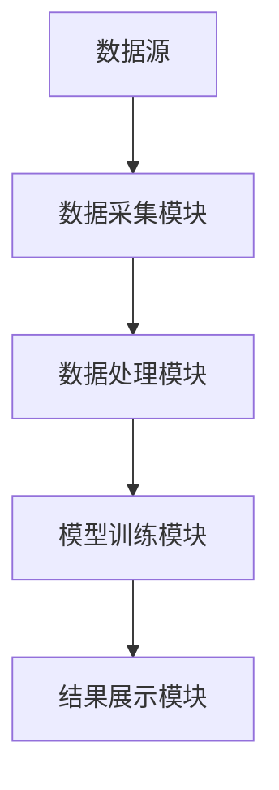
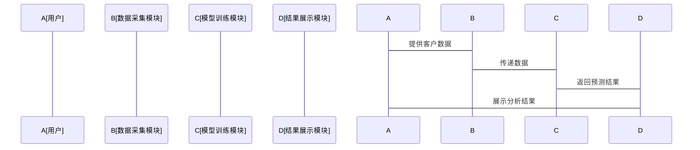

                 


# AI驱动的客户粘性分析：评估公司的长期收入质量

**关键词**：客户粘性，AI分析，长期收入，客户行为，机器学习，客户画像，客户生命周期

**摘要**：  
本文深入探讨了如何利用人工智能技术分析客户粘性，评估公司的长期收入质量。通过结合客户行为分析、机器学习算法和客户生命周期模型，我们展示了如何利用AI技术预测客户流失、提升客户价值，并制定有效的客户保留策略。文章从理论基础到实际应用，详细介绍了AI驱动的客户粘性分析方法，为企业的长期收入管理提供了实用的指导。

---

## 第一部分: AI驱动的客户粘性分析背景与概念

### 第1章: 客户粘性分析概述

#### 1.1 客户粘性的概念与定义
- **1.1.1 什么是客户粘性**  
客户粘性（Customer Retention）是指客户对企业产品或服务的持续使用意愿。高粘性的客户会频繁使用产品或服务，并在出现问题时更倾向于尝试解决问题而不是转向竞争对手。

- **1.1.2 客户粘性的核心要素**  
  - 产品依赖性：客户对产品功能的依赖程度。
  - 情感纽带：客户对品牌的情感忠诚度。
  - 成本转移障碍：客户转换成本（时间、经济、学习成本）。

- **1.1.3 客户粘性与客户忠诚度的区别**  
客户忠诚度关注客户对品牌的偏好，而客户粘性关注客户实际行为的持续性。

#### 1.2 问题背景与分析的重要性
- **1.2.1 长期收入质量的定义**  
长期收入质量指的是公司从现有客户中获得的持续收入能力，依赖于客户的长期留存和高活跃度。

- **1.2.2 客户流失对企业的影响**  
  - 直接收入损失：流失客户的收入不再贡献。
  - 获取新客户的成本：新客户获取成本远高于保留现有客户的成本。
  - 品牌声誉影响：流失客户可能对品牌产生负面影响。

- **1.2.3 提升客户粘性的商业价值**  
  - 提高收入稳定性。
  - 降低客户获取成本。
  - 增强品牌忠诚度和市场竞争力。

#### 1.3 AI在客户粘性分析中的作用
- **1.3.1 数据驱动的客户行为分析**  
AI能够处理海量数据，识别客户行为模式，发现潜在的流失风险。

- **1.3.2 AI技术如何提升客户粘性预测**  
通过机器学习模型，AI可以精准预测客户流失风险，并提供个性化保留策略。

- **1.3.3 从传统方法到AI驱动的转变**  
传统方法依赖经验判断，而AI驱动的方法基于数据和模型，更加客观和精准。

### 第2章: 客户粘性分析的核心概念

#### 2.1 客户生命周期模型
- **2.1.1 客户生命周期的阶段划分**  
  - 初期阶段：客户刚接触产品或服务。
  - 成熟阶段：客户开始频繁使用产品。
  - 衰退阶段：客户使用频率下降，可能流失。

- **2.1.2 各阶段的特征与行为模式**  
  - 初期阶段：客户可能还在探索产品功能，粘性较低。
  - 成熟阶段：客户依赖产品，粘性较高。
  - 衰退阶段：客户开始寻找替代方案，粘性下降。

- **2.1.3 生命周期模型在客户粘性分析中的应用**  
通过分析客户在生命周期中的位置，企业可以制定针对性的策略。

#### 2.2 客户行为分析的关键指标
- **2.2.1 客户留存率**  
客户留存率=（期初客户数 - 流失客户数）/期初客户数×100%。

- **2.2.2 客户活跃度**  
客户活跃度=（活跃客户数/总客户数）×100%。

- **2.2.3 客户生命周期价值（CLV）**  
CLV=客户平均收入×客户平均生命周期长度。

#### 2.3 数据驱动的客户画像
- **2.3.1 客户画像的构建方法**  
通过数据分析，识别客户的年龄、性别、地理位置、消费习惯等特征。

- **2.3.2 数据维度的选择与整合**  
  - 客户的基本信息。
  - 消费记录。
  - 行为数据（如登录频率、使用时长）。

- **2.3.3 画像在客户细分中的应用**  
根据客户画像，将客户分为不同群体，制定差异化策略。

---

## 第二部分: AI驱动的客户分析方法

### 第3章: 数据预处理与特征工程

#### 3.1 数据收集与预处理
- **3.1.1 数据来源与采集方法**  
  - CRM系统数据。
  - 用户行为日志。
  - 调查问卷数据。

- **3.1.2 数据清洗与特征提取**  
  - 删除重复数据。
  - 处理缺失值。
  - 标准化数据格式。

- **3.1.3 数据标注与格式化**  
将客户行为数据标注为流失或未流失。

#### 3.2 客户行为特征工程
- **3.2.1 时间序列特征提取**  
分析客户行为的时间模式，如登录间隔、使用频率。

- **3.2.2 行为模式识别**  
识别异常行为模式，如突然减少使用频率。

- **3.2.3 用户分群与聚类分析**  
使用聚类算法将客户分为不同群体，便于制定差异化策略。

### 第4章: 模型选择与训练

#### 4.1 常见的客户粘性预测模型
- **4.1.1 logistic回归模型**  
适用于二分类问题，预测客户流失概率。

- **4.1.2 随机森林与梯度提升树**  
适合处理高维数据，捕捉非线性关系。

- **4.1.3 神经网络模型**  
适用于复杂模式识别，但需要大量数据训练。

#### 4.2 模型训练与调优
- **4.2.1 数据划分与交叉验证**  
将数据划分为训练集、验证集和测试集，使用交叉验证评估模型性能。

- **4.2.2 模型调优与优化策略**  
调整超参数（如学习率、树深）以提高模型性能。

- **4.2.3 模型评估与优化**  
使用AUC-ROC曲线、F1分数等指标评估模型性能。

---

## 第三部分: 客户生命周期价值预测与分析

### 第5章: 客户生命周期价值预测

#### 5.1 时间序列预测模型
- **5.1.1 ARIMA模型**  
适用于预测客户未来的收入贡献。

- **5.1.2 LSTM模型**  
适合处理时间序列数据，捕捉长期依赖关系。

#### 5.2 客户流失预测模型
- **5.2.1 生存分析模型**  
分析客户生命周期，预测客户流失时间。

- **5.2.2 风险评分模型**  
基于客户特征和行为，评分客户流失风险。

#### 5.3 客户画像与行为分析
- **5.3.1 客户画像的深度分析**  
识别高流失风险客户的特征。

- **5.3.2 行为模式的深入挖掘**  
发现潜在的流失预警信号。

---

## 第四部分: 系统架构与实现

### 第6章: 系统架构设计

#### 6.1 系统功能设计
- **6.1.1 数据采集模块**  
从多种数据源获取客户数据。

- **6.1.2 数据处理模块**  
清洗、整合和特征提取。

- **6.1.3 模型训练模块**  
训练和优化预测模型。

- **6.1.4 结果展示模块**  
可视化客户粘性分析结果。

#### 6.2 系统架构图


#### 6.3 系统接口设计
- **6.3.1 数据接口**  
与CRM系统对接，获取客户数据。

- **6.3.2 模型接口**  
提供API接口，供其他系统调用预测结果。

#### 6.4 系统交互流程


---

## 第五部分: 项目实战

### 第7章: 项目实战

#### 7.1 环境安装
- 安装Python、机器学习库（如scikit-learn、xgboost）和数据处理库（如pandas、numpy）。

#### 7.2 核心代码实现
```python
import pandas as pd
from sklearn.model_selection import train_test_split
from sklearn.ensemble import RandomForestClassifier
from sklearn.metrics import accuracy_score

# 数据加载
df = pd.read_csv('customer_data.csv')
# 特征与标签分离
X = df.drop('churn', axis=1)
y = df['churn']
# 数据划分
X_train, X_test, y_train, y_test = train_test_split(X, y, test_size=0.2)
# 模型训练
model = RandomForestClassifier()
model.fit(X_train, y_train)
# 预测与评估
y_pred = model.predict(X_test)
print("准确率:", accuracy_score(y_test, y_pred))
```

#### 7.3 代码解读与分析
- **数据加载**：从CSV文件加载客户数据。
- **特征与标签分离**：将客户流失标签（churn）作为目标变量。
- **数据划分**：将数据划分为训练集和测试集。
- **模型训练**：使用随机森林模型训练客户流失预测模型。
- **预测与评估**：评估模型的准确率。

#### 7.4 实际案例分析
- 以某公司客户数据为例，展示如何通过代码实现客户粘性分析。

---

## 第六部分: 最佳实践与总结

### 第8章: 最佳实践

#### 8.1 最佳实践
- 定期更新模型，以适应客户行为变化。
- 结合客户画像和行为分析，制定个性化保留策略。
- 使用A/B测试，验证策略的有效性。

#### 8.2 小结
AI驱动的客户粘性分析能够帮助企业精准预测客户流失，优化客户管理策略，提升长期收入质量。

#### 8.3 注意事项
- 数据质量和完整性对模型性能影响重大。
- 模型解释性需要考虑业务场景的实际需求。
- 客户隐私保护必须符合相关法律法规。

#### 8.4 拓展阅读
- 《Data Driven Business Decisions》
- 《Customer Journey Mapping》
- 《Machine Learning for Business Analytics》

---

**作者：AI天才研究院/AI Genius Institute & 禅与计算机程序设计艺术 /Zen And The Art of Computer Programming**

