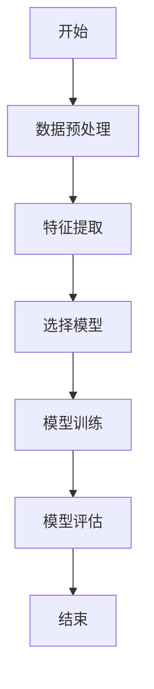
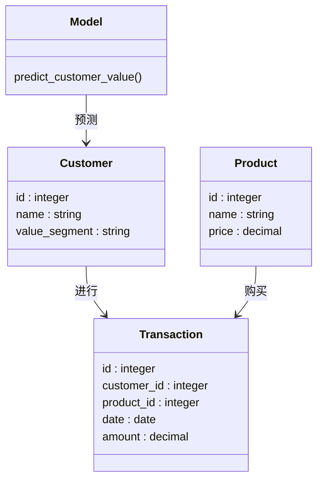
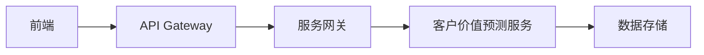
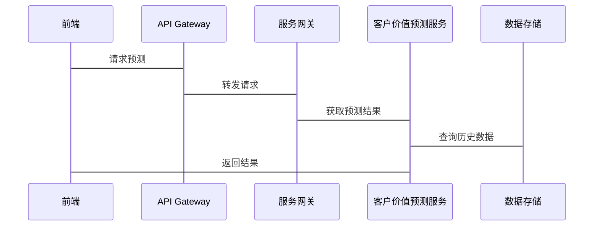

                 


# AI驱动的客户终身价值预测：评估公司的长期盈利能力

> 关键词：AI、客户价值、预测模型、长期盈利、数据挖掘、机器学习、客户关系管理

> 摘要：本文探讨了如何利用人工智能技术预测客户的终身价值，分析其对提升企业长期盈利能力的重要性。文章从背景、核心概念、算法原理、系统设计、实战案例等多个维度展开，详细阐述了AI驱动的客户价值预测方法，帮助企业更好地进行客户管理和战略规划。

---

# 第一部分: AI驱动的客户终身价值预测概述

# 第1章: 客户终身价值预测的背景与意义

## 1.1 客户终身价值的核心概念

### 1.1.1 什么是客户终身价值
客户终身价值（Customer Lifetime Value, CLV）是指一个客户在其生命周期内为企业带来的总收入减去相关成本的净现值。它是企业制定客户管理策略的重要依据。

$$CLV = \frac{Rev - Cost}{1 + r} + \frac{Rev - Cost}{(1 + r)^2} + \cdots + \frac{Rev - Cost}{(1 + r)^n}$$

其中，$r$ 是贴现率，$n$ 是客户生命周期长度，$Rev$ 是收入，$Cost$ 是成本。

### 1.1.2 客户终身价值的重要性
CLV 帮助企业识别高价值客户，优化资源配置，降低客户获取成本，提高客户满意度和忠诚度。

### 1.1.3 AI在客户价值预测中的作用
AI技术通过分析海量数据，发现隐含模式，预测客户行为，从而帮助企业更精准地制定客户策略。

---

## 1.2 客户价值预测的挑战与机遇

### 1.2.1 传统客户价值评估的局限性
传统方法依赖经验判断，缺乏数据支持，难以准确预测客户行为。

### 1.2.2 AI驱动预测的优势
AI通过机器学习、深度学习等技术，能够从多维度数据中提取特征，建立预测模型，提高准确性。

### 1.2.3 企业长期盈利能力的提升路径
通过AI驱动的CLV预测，企业可以实现客户分层管理，优化营销策略，降低客户流失率。

---

## 1.3 本章小结
本章介绍了客户终身价值的核心概念，分析了传统方法的局限性以及AI技术在预测中的优势，为后续内容奠定了基础。

---

# 第2章: 客户终身价值预测的核心概念与联系

## 2.1 核心概念原理

### 2.1.1 客户行为分析
通过分析客户的购买频率、购买金额、投诉记录等行为数据，识别客户的价值特征。

### 2.1.2 客户价值模型
构建CLV模型，包括客户保留率、收入贡献率、成本贴现率等关键参数。

### 2.1.3 预测算法选择
根据数据特征选择合适的算法，如线性回归、随机森林、神经网络等。

---

## 2.2 核心概念对比表格

| 模型类型 | 优点 | 缺点 |
|----------|------|------|
| 线性回归 | 简单易懂 | 无法捕捉非线性关系 |
| 随机森林 | 鲁棒性强 | 解释性较差 |
| 神经网络 | 高精度 | 计算复杂 |

---

## 2.3 ER实体关系图

```mermaid
erDiagram
    customer[客户] {
        id : integer
        name : string
        purchase_history : string
        value_segment : string
    }
    product[产品] {
        id : integer
        name : string
        price : decimal
    }
    transaction[交易] {
        id : integer
        customer_id : integer
        product_id : integer
        date : date
        amount : decimal
    }
    customer --> transaction : 进行
    product --> transaction : 购买
```

---

## 2.4 本章小结
本章通过对比分析和实体关系图，详细阐述了CLV预测的核心概念及其相互关系。

---

# 第3章: 客户终身价值预测的算法原理

## 3.1 算法原理概述

### 3.1.1 监督学习的基本原理
监督学习通过训练数据学习输入与输出之间的关系，常用算法包括线性回归、支持向量机等。

### 3.1.2 非监督学习的应用
非监督学习用于聚类分析，帮助发现客户群体的隐含结构。

### 3.1.3 深度学习的优势
深度学习通过多层神经网络提取高维特征，适用于复杂数据的预测任务。

---

## 3.2 算法流程图



---

## 3.3 算法实现代码

### 3.3.1 环境安装与配置
```bash
pip install numpy scikit-learn matplotlib
```

### 3.3.2 核心代码实现
```python
from sklearn.ensemble import RandomForestRegressor
import pandas as pd

# 加载数据
data = pd.read_csv('customer_data.csv')

# 特征工程
X = data[['age', 'income', 'purchase_frequency']]
y = data['value']

# 模型训练
model = RandomForestRegressor(n_estimators=100)
model.fit(X, y)

# 模型预测
predictions = model.predict(X)
```

### 3.3.3 代码解读与优化建议
1. 数据预处理：确保数据完整性，处理缺失值和异常值。
2. 特征工程：选择相关性高的特征，进行标准化或归一化处理。
3. 模型优化：调整超参数，使用交叉验证评估模型性能。

---

## 3.4 数学模型与公式解析

### 3.4.1 线性回归模型
$$y = \beta_0 + \beta_1x_1 + \beta_2x_2 + \cdots + \beta_nx_n + \epsilon$$

### 3.4.2 随机森林模型
随机森林通过集成多个决策树模型，提高预测准确性和鲁棒性。

### 3.4.3 神经网络模型
神经网络通过多层感知机（MLP）提取非线性特征，适用于复杂数据的预测。

---

## 3.5 举例说明

### 3.5.1 线性回归案例
假设我们有客户年龄、收入和购买频率三个特征，可以通过线性回归模型预测客户价值。

### 3.5.2 随机森林模型应用
通过随机森林模型，我们可以对客户进行分群，识别高价值客户。

### 3.5.3 神经网络模型案例
使用神经网络模型分析客户的深度行为特征，预测客户流失风险。

---

## 3.6 本章小结
本章详细讲解了CLV预测的算法原理，包括监督学习、非监督学习和深度学习的方法，并通过代码示例和数学公式进行了深入分析。

---

# 第4章: 系统分析与架构设计

## 4.1 问题场景介绍
企业需要构建一个客户价值预测系统，实现客户分层、精准营销和客户流失预警。

## 4.2 系统功能设计

### 4.2.1 领域模型mermaid类图


---

## 4.3 系统架构设计

### 4.3.1 系统架构mermaid图


---

## 4.4 系统接口设计

### 4.4.1 接口描述
- 输入：客户ID
- 输出：客户价值评分

### 4.4.2 接口调用示例
```python
import requests

response = requests.get('http://api/predict?customer_id=123')
print(response.json())
```

---

## 4.5 系统交互mermaid序列图



---

## 4.6 本章小结
本章通过系统分析和架构设计，展示了如何将CLV预测模型应用于企业系统中，实现客户价值的实时预测和管理。

---

# 第5章: 项目实战

## 5.1 环境安装与数据准备

### 5.1.1 环境安装
```bash
pip install numpy pandas scikit-learn
```

### 5.1.2 数据准备
```python
import pandas as pd

data = pd.read_csv('customer_data.csv')
print(data.head())
```

---

## 5.2 系统核心实现

### 5.2.1 特征工程
```python
from sklearn.preprocessing import StandardScaler

scaler = StandardScaler()
X_scaled = scaler.fit_transform(X)
```

### 5.2.2 模型实现
```python
from sklearn.ensemble import RandomForestRegressor

model = RandomForestRegressor(n_estimators=100)
model.fit(X_scaled, y)
```

---

## 5.3 代码应用解读与分析

### 5.3.1 代码解读
1. 数据加载：读取客户数据。
2. 特征工程：对特征进行标准化处理。
3. 模型训练：使用随机森林模型训练模型。
4. 模型预测：对测试数据进行预测。

### 5.3.2 模型评估
```python
from sklearn.metrics import mean_squared_error

print(mean_squared_error(y_test, predictions))
```

---

## 5.4 实际案例分析

### 5.4.1 数据分析
通过分析客户数据，识别高价值客户群体。

### 5.4.2 模型优化
调整模型参数，提高预测准确性。

### 5.4.3 结果解读
根据预测结果制定客户分层营销策略。

---

## 5.5 本章小结
本章通过实际案例展示了CLV预测的实现过程，从数据准备到模型训练，再到结果分析，帮助企业实现客户价值的精准预测。

---

# 第6章: 总结与展望

## 6.1 本章总结
本文详细探讨了AI驱动的客户终身价值预测方法，从算法原理到系统设计，再到实战应用，为企业提供了全面的解决方案。

## 6.2 未来展望
随着AI技术的不断发展，CLV预测将更加精准，帮助企业实现客户关系管理的智能化和个性化。

---

# 作者：AI天才研究院/AI Genius Institute & 禅与计算机程序设计艺术 /Zen And The Art of Computer Programming

---

这篇文章通过系统化的分析和深入的案例研究，全面阐述了AI驱动的客户终身价值预测方法，帮助企业提升长期盈利能力。希望本文能为企业在客户管理和营销策略制定中提供有价值的参考。

