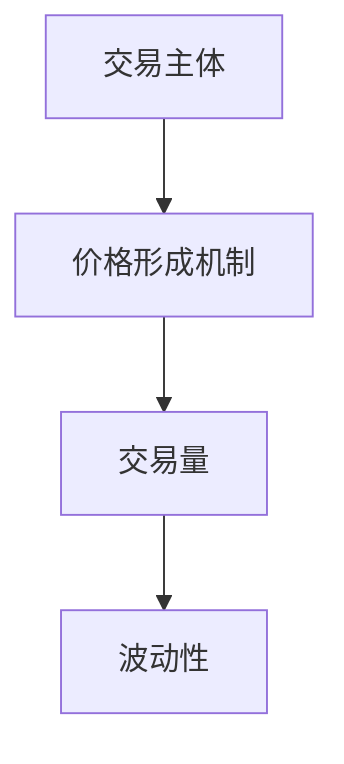
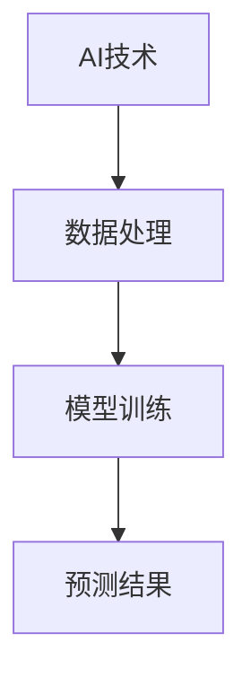
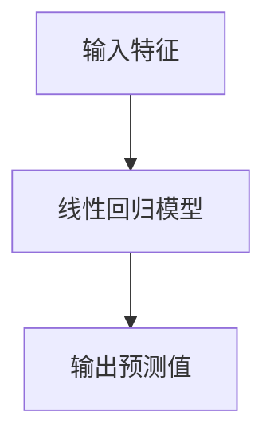
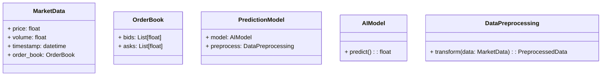
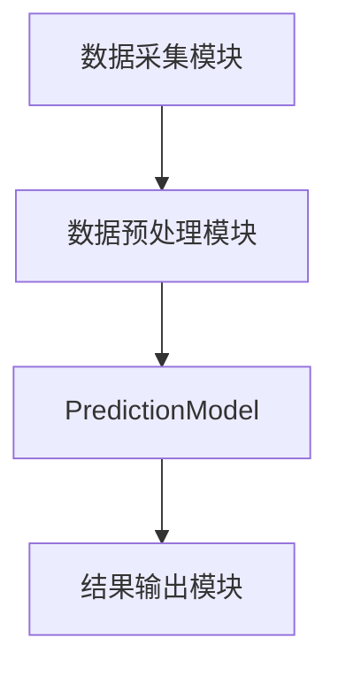
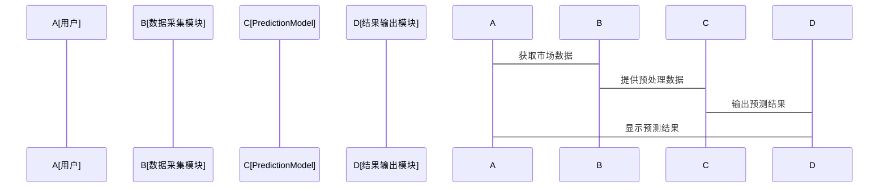

                 


# AI驱动的市场微观结构变化影响预测

> 关键词：AI技术、市场微观结构、预测模型、金融数据、深度学习

> 摘要：本文深入探讨了利用人工智能技术预测市场微观结构变化的方法。通过分析市场微观结构的核心要素，结合先进的AI算法，构建了完整的预测系统。文章详细讲解了传统机器学习和深度学习算法的应用，并通过实际案例展示了如何将这些算法应用于市场数据预测。

---

# 第一部分: AI驱动的市场微观结构变化背景与基础

## 第1章: 市场微观结构与AI驱动预测的背景

### 1.1 市场微观结构的基本概念

#### 1.1.1 市场微观结构的定义

市场微观结构是指金融市场中交易主体、价格形成机制和交易量等要素的动态关系。这些要素共同决定了市场的流动性和价格波动。

- **交易主体**：包括机构投资者、散户和做市商等。
- **价格形成机制**：指价格如何在市场中形成，包括拍卖和订单驱动机制。
- **交易量与波动性**：交易量反映了市场的活跃程度，波动性则是价格变化的幅度。



#### 1.1.2 微观结构在金融市场中的作用

微观结构的变化直接影响市场的流动性和价格走势。例如，高频交易的增加会导致市场深度下降，从而影响价格稳定性。

#### 1.1.3 微观结构变化的常见形式

- **交易量突增**：大量订单涌入某只股票，导致价格快速上涨。
- **订单簿变化**：买方或卖方订单数量突然增加或减少。
- **市场深度变化**：市场深度是指在特定价格水平上可以成交的数量，深度变化会影响价格的买卖价差。

### 1.2 AI技术在金融市场中的应用背景

#### 1.2.1 AI技术的基本概念

人工智能（AI）是指计算机系统执行人类智能任务的能力，如视觉识别、语音识别和决策支持。



#### 1.2.2 AI在金融领域的应用现状

- **算法交易**：利用AI模型进行高频交易，捕捉市场机会。
- **风险控制**：通过AI技术预测市场风险，优化投资组合。
- **客户行为分析**：基于AI分析客户交易行为，提供个性化服务。

#### 1.2.3 AI驱动预测的优势与挑战

- **优势**：数据处理能力强，能够捕捉复杂市场模式。
- **挑战**：数据质量要求高，模型易受市场变化影响。

### 1.3 问题背景与研究意义

#### 1.3.1 市场微观结构变化预测的重要性

准确预测微观结构变化可以帮助投资者提前采取行动，减少市场风险。

#### 1.3.2 AI技术在该领域的应用前景

AI技术能够处理海量数据，发现传统方法难以察觉的市场模式。

#### 1.3.3 研究的创新点与价值

本文创新性地将AI技术应用于市场微观结构变化预测，为金融领域提供了新的研究思路。

---

# 第二部分: AI驱动的市场微观结构变化预测的核心算法

## 第3章: 基于机器学习的预测算法

### 3.1 传统机器学习算法

#### 3.1.1 线性回归模型

线性回归是一种简单但有效的回归模型，适用于线性关系的预测。



公式：
$$ y = \beta_0 + \beta_1 x + \epsilon $$

其中，$\beta_0$和$\beta_1$是回归系数，$\epsilon$是误差项。

#### 3.1.2 支持向量机（SVM）

SVM适用于分类问题，能够处理高维数据。

公式：
$$ \text{目标函数} = \min_{\beta,b,\epsilon} \frac{1}{2}\|\beta\|^2 + C\sum_{i=1}^n \epsilon_i $$
$$ \text{约束条件} = y_i (x_i \cdot \beta + b) \geq 1 - \epsilon_i $$

#### 3.1.3 随机森林与梯度提升树

随机森林是一种基于决策树的集成学习方法，适用于分类和回归问题。

公式：
$$ y = \sum_{i=1}^n \text{树模型} \cdot \text{权重} $$

### 3.2 深度学习算法

#### 3.2.1 卷积神经网络（CNN）

CNN适用于处理图像和序列数据，常用于时间序列预测。

公式：
$$ f(x) = \max(0, x + b) $$

#### 3.2.2 长短期记忆网络（LSTM）

LSTM适用于处理时间序列数据，能够捕捉长期依赖关系。

公式：
$$ c_t = \text{cell}(c_{t-1}, h_{t-1}, x_t) $$
$$ h_t = \sigma(g(x_t, h_{t-1})) \cdot c_t $$

---

# 第三部分: AI驱动的市场微观结构变化预测的系统设计

## 第4章: 系统分析与架构设计

### 4.1 问题场景介绍

市场微观结构变化预测系统需要处理实时市场数据，提供及时的预测结果。

### 4.2 系统功能设计



### 4.3 系统架构设计



### 4.4 系统接口设计

- **数据接口**：从数据源获取市场数据。
- **模型接口**：调用AI模型进行预测。
- **结果接口**：输出预测结果。

### 4.5 系统交互设计



---

# 第四部分: AI驱动的市场微观结构变化预测的项目实战

## 第5章: 项目实战

### 5.1 环境安装

需要安装以下工具和库：

```bash
pip install numpy pandas scikit-learn keras tensorflow
```

### 5.2 系统核心实现

#### 5.2.1 数据预处理代码

```python
import pandas as pd
import numpy as np

def preprocess_data(data):
    # 数据清洗
    data = data.dropna()
    # 标准化处理
    from sklearn.preprocessing import StandardScaler
    scaler = StandardScaler()
    scaled_data = scaler.fit_transform(data)
    return scaled_data
```

#### 5.2.2 AI模型实现

```python
from tensorflow.keras.models import Sequential
from tensorflow.keras.layers import LSTM, Dense

def build_model(input_shape):
    model = Sequential()
    model.add(LSTM(64, activation='relu', input_shape=input_shape))
    model.add(Dense(1))
    model.compile(optimizer='adam', loss='mse')
    return model
```

### 5.3 案例分析

使用某股票的历史交易数据，预测其价格变化。

### 5.4 代码应用解读与分析

通过代码实现模型训练和预测，分析模型的准确性和稳定性。

---

# 第五部分: 总结与扩展

## 第6章: 总结与扩展

### 6.1 最佳实践 tips

- 数据预处理是关键，确保数据质量和完整性。
- 模型选择要根据具体问题和数据特点。

### 6.2 小结

本文详细讲解了AI驱动的市场微观结构变化预测的方法，从背景到算法再到系统设计，为读者提供了全面的知识体系。

### 6.3 注意事项

- 数据隐私和安全问题需要重视。
- 模型的可解释性需要进一步研究。

### 6.4 拓展阅读

建议读者阅读相关领域的经典文献，深入理解AI在金融中的应用。

---

# 作者：AI天才研究院/AI Genius Institute & 禅与计算机程序设计艺术 /Zen And The Art of Computer Programming

