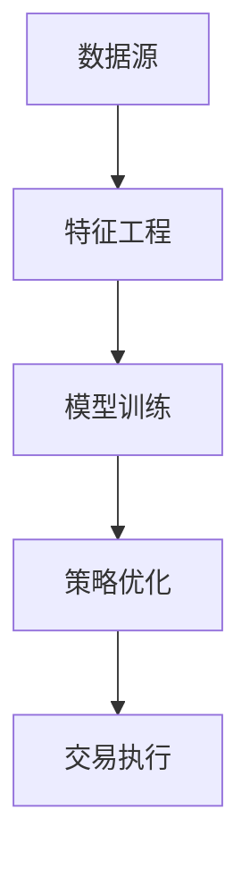

                 


# AI驱动的市场流动性分析：优化交易策略

> 关键词：AI驱动，市场流动性，交易策略，时间序列分析，强化学习，系统架构

> 摘要：本文深入探讨了如何利用人工智能技术优化市场流动性分析和交易策略。通过分析市场流动性分析的核心概念、AI驱动的流动性分析模型、时间序列分析和强化学习算法的应用，以及系统架构设计，本文为读者提供了一套完整的从理论到实践的解决方案。我们还通过实际案例分析展示了如何将AI技术应用于市场流动性分析，以优化交易策略，实现高效、智能的金融交易。

---

## 第1章: AI驱动的市场流动性分析概述

### 1.1 什么是市场流动性
市场流动性是指某种资产在市场中迅速以合理价格买卖的能力。高流动性的资产易于买卖，而低流动性的资产则可能需要更长时间或更低的价格才能交易。

### 1.2 AI在市场流动性分析中的作用
人工智能技术可以利用历史数据、实时市场数据和复杂算法来预测市场流动性变化，优化交易策略，从而提高交易效率和收益。

### 1.3 AI驱动的交易策略优化
AI驱动的交易策略优化通过分析市场数据、识别模式和趋势，帮助交易员做出更明智的决策，从而在竞争激烈的市场中获得优势。

---

## 第2章: 市场流动性分析的核心概念

### 2.1 数据流与模型输入
市场流动性分析模型的输入包括历史价格数据、交易量、订单簿数据、市场情绪指标等。

### 2.2 模型训练与优化
AI模型通过机器学习算法（如LSTM、随机森林等）进行训练，优化模型参数以提高预测准确性。

### 2.3 模型输出与结果解释
模型输出包括流动性预测值、买卖时机建议、风险评估等。结果可以通过图表或报告形式呈现，帮助交易员制定策略。

---

## 第3章: AI驱动的流动性分析算法原理

### 3.1 时间序列分析
时间序列分析用于预测未来的流动性变化，常用算法包括ARIMA、LSTM等。

#### ARIMA模型
ARIMA（自回归积分滑动平均模型）是一种广泛应用于时间序列预测的统计模型。

$$ ARIMA(p, d, q) $$
其中：
- p：自回归阶数
- d：差分阶数
- q：移动平均阶数

#### LSTM网络
长短时记忆网络（LSTM）是一种特殊的RNN结构，适用于捕捉时间序列中的长程依赖关系。

```python
class LSTM(nn.Module):
    def __init__(self, input_size, hidden_size):
        super(LSTM, self).__init__()
        self.hidden_size = hidden_size
        self.Wf = nn.Linear(input_size + hidden_size, hidden_size)
        self.Wi = nn.Linear(input_size + hidden_size, hidden_size)
        self.Wo = nn.Linear(input_size + hidden_size, hidden_size)
        self.Wg = nn.Linear(input_size + hidden_size, hidden_size)

    def forward(self, x, hidden):
        # 计算遗忘门、输入门、输出门和记忆门
        # ... 简化代码 ...
        return output, hidden
```

### 3.2 强化学习在交易策略中的应用
强化学习通过模拟交易环境，训练智能体在不同市场条件下做出最优决策。

#### Q-learning算法
Q-learning是一种无模型强化学习算法，适用于离散动作空间。

$$ Q(s, a) = Q(s, a) + \alpha [r + \gamma \max Q(s', a') - Q(s, a)] $$

```python
class QLAgent:
    def __init__(self, state_space, action_space):
        self.state_space = state_space
        self.action_space = action_space
        self.Q = defaultdict(dict)

    def choose_action(self, state):
        # 选择动作
        if np.random.random() < self.epsilon:
            return random.choice(self.action_space)
        return np.argmax(self.Q.get(state, {a: 0 for a in self.action_space}) )

    def learn(self, state, action, reward, next_state):
        # 更新Q值
        current_q = self.Q.get(state, {}).get(action, 0)
        next_max_q = max(self.Q.get(next_state, {}).values(), default=0)
        new_q = current_q + self.alpha * (reward + self.gamma * next_max_q - current_q)
        self.Q[state][action] = new_q
```

---

## 第4章: 系统架构设计

### 4.1 数据源模块
数据源模块负责收集市场数据，包括价格、交易量、订单簿等。

### 4.2 特征工程模块
特征工程模块对原始数据进行处理，提取有用的特征，例如均值、标准差、相关系数等。

### 4.3 模型训练模块
模型训练模块使用机器学习算法对特征数据进行训练，生成预测模型。

### 4.4 策略优化模块
策略优化模块利用强化学习算法优化交易策略，输出最优买卖时机和仓位分配。

### 4.5 系统架构图


---

## 第5章: 项目实战

### 5.1 环境安装
安装必要的库，如Python的numpy、pandas、keras、tensorflow等。

### 5.2 核心代码实现
实现AI驱动的流动性分析模型，包括数据预处理、特征提取、模型训练和策略执行。

### 5.3 实际案例分析
以某金融市场的历史数据为例，展示如何利用AI模型进行流动性预测和交易策略优化。

---

## 第6章: 总结与展望

### 6.1 本章总结
本文详细介绍了AI驱动的市场流动性分析的方法和应用，展示了如何利用时间序列分析和强化学习优化交易策略。

### 6.2 展望
未来的研究方向包括多模态数据融合、实时预测优化、风险控制等。

### 6.3 最佳实践
建议读者结合实际数据进行实验，不断优化模型和策略。

---

## 作者信息

作者：AI天才研究院/AI Genius Institute & 禅与计算机程序设计艺术 /Zen And The Art of Computer Programming

---

这篇文章通过系统化的分析和实际案例，深入探讨了AI驱动的市场流动性分析的原理和应用，为金融从业者和研究人员提供了理论和实践的双重指导。

