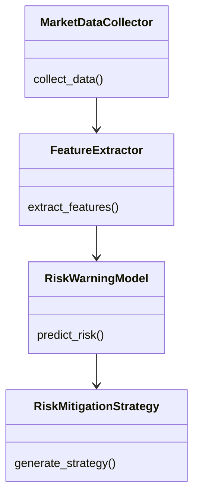

                 


# AI驱动的市场流动性风险预警与缓解策略

> 关键词：市场流动性风险、人工智能、风险预警、风险缓解、金融风险管理

> 摘要：本文详细探讨了如何利用人工智能技术来实现市场流动性风险的预警与缓解策略。通过分析流动性风险的定义、特征以及传统管理方法的局限性，本文提出了一种基于AI的创新解决方案，包括风险预警模型的构建、时间序列分析、机器学习算法的应用，以及系统的架构设计与项目实战案例。文章最后总结了AI驱动的流动性风险管理的优势，并展望了未来的发展方向。

---

## 第一部分: 市场流动性风险与AI技术概述

### 第1章: 市场流动性风险概述

#### 1.1 市场流动性风险的定义与特征

市场流动性风险是指在金融市场中，资产无法以合理价格迅速变现而导致的损失风险。其主要特征包括：

- **时间性**：流动性风险在特定时间窗口内表现明显。
- **波动性**：市场波动加剧时，流动性风险显著增加。
- **传染性**：流动性风险可能从一个资产或机构传染到整个市场。
- **复杂性**：受多种因素影响，如市场参与者的行为、宏观经济环境等。

#### 1.2 AI技术在金融风险管理中的应用

AI技术通过处理海量数据、识别复杂模式和实时预测，为金融风险管理提供了新的可能性。其在流动性风险管理中的优势包括：

- **数据处理能力**：AI能够快速处理多维度数据，发现传统方法难以察觉的规律。
- **模型复杂度**：AI模型可以捕捉非线性关系，提高预测准确性。
- **实时监控**：AI技术支持实时数据分析，实现流动性风险的动态监测。

### 第2章: AI驱动的流动性风险预警与缓解的背景

#### 2.1 传统流动性风险管理的局限性

传统流动性风险管理方法主要依赖历史数据分析和统计模型，存在以下问题：

- **滞后性**：传统方法通常基于历史数据，难以实时反映市场变化。
- **简化假设**：假设市场行为是理性的，忽略了复杂市场参与者的非理性行为。
- **模型局限**：传统模型难以处理高维数据和复杂场景。

#### 2.2 AI技术在流动性风险管理中的优势

AI技术通过深度学习和自然语言处理等技术，显著提升了流动性风险管理的能力：

- **数据驱动决策**：AI能够从非结构化数据中提取信息，提供更全面的市场洞察。
- **实时预测**：基于实时数据的AI模型能够快速识别潜在风险。
- **个性化策略**：AI可以根据不同机构的需求定制风险预警和缓解策略。

#### 2.3 当前市场环境下的流动性风险管理需求

在全球化和金融创新的背景下，市场波动加剧，机构投资者行为复杂化，传统方法已难以应对流动性风险的挑战。AI技术的应用成为解决这些问题的关键。

---

## 第二部分: AI驱动的流动性风险预警与缓解的核心概念

### 第3章: AI驱动的流动性风险预警模型

#### 3.1 流动性风险预警模型的构建

**数据采集与特征提取**  
- 数据来源：市场交易数据、新闻媒体、社交媒体、宏观经济指标。
- 特征提取：基于时间序列的特征（如波动率、交易量）和文本挖掘的特征（如情感分析）。

**模型选择与训练**  
- 常见模型：支持向量机（SVM）、随机森林（RF）、长短期记忆网络（LSTM）。
- 训练数据：历史市场数据和标签化的流动性风险事件。

**模型评估与优化**  
- 评估指标：准确率、召回率、F1分数。
- 优化方法：超参数调优、交叉验证。

#### 3.2 基于时间序列分析的流动性风险预测

**时间序列分析的基本概念**  
时间序列分析是一种通过历史数据预测未来趋势的方法，常用于金融时间序列数据的分析。

**常见的时间序列模型**  
- **ARIMA模型**：适用于线性时间序列数据，通过自相关性和偏自相关性进行建模。
- **LSTM模型**：适用于非线性时间序列数据，能够捕捉长期依赖关系。

**案例分析**  
使用LSTM模型预测某金融资产的流动性风险，通过训练数据生成预测结果，并与实际数据进行对比分析。

### 第4章: AI驱动的流动性风险缓解策略

#### 4.1 流动性风险缓解策略的分类

- **短期策略**：如调整资产组合、增加流动性资产。
- **中期策略**：如优化资产负债结构、加强市场沟通。
- **长期策略**：如制度创新、技术创新。

#### 4.2 基于机器学习的策略优化

**策略优化的基本原理**  
通过机器学习算法对多种策略进行组合优化，找到最优策略组合。

**实现案例**  
使用强化学习算法训练一个策略优化模型，模拟不同市场环境下策略的调整过程。

### 第5章: AI驱动的流动性风险管理系统的架构设计

#### 5.1 系统整体架构

**功能模块划分**  
- 数据采集模块：实时采集市场数据。
- 特征提取模块：提取流动性风险相关特征。
- 预警模块：基于AI模型进行风险预警。
- 缓解策略模块：根据预警结果生成缓解策略。

**数据流设计**  
- 数据输入：市场数据、新闻数据。
- 数据处理：特征提取、数据清洗。
- 数据输出：风险预警信号、缓解策略建议。

**系统架构图**  
使用Mermaid绘制系统架构图，展示各模块之间的交互关系。

---

## 第三部分: AI驱动的流动性风险预警与缓解的算法实现

### 第6章: 时间序列预测模型的实现

#### 6.1 基于ARIMA模型的实现

**ARIMA模型的数学公式**  
$$ ARIMA(p, d, q) $$  
其中，p为自回归阶数，d为差分阶数，q为移动平均阶数。

**Python代码实现**  
```python
from statsmodels.tsa.arima.model import ARIMA
import pandas as pd

# 加载数据
data = pd.read_csv('market_data.csv')

# 拆分训练集和测试集
train_data = data['value'][:80]
test_data = data['value'][80:]

# 模型训练
model = ARIMA(train_data, order=(5, 1, 0))
model_fit = model.fit()

# 预测
forecast = model_fit.forecast(len(test_data))
```

#### 6.2 基于LSTM模型的实现

**LSTM模型的结构**  
LSTM由输入门、遗忘门和输出门组成，适用于捕捉长期依赖关系。

**Python代码实现**  
```python
import numpy as np
from keras.models import Sequential
from keras.layers import LSTM, Dense

# 数据预处理
data = np.array(data).reshape(-1, 1)
train_data = data[:80]
test_data = data[80:]

# 模型构建
model = Sequential()
model.add(LSTM(50, input_shape=(1, 1)))
model.add(Dense(1))
model.compile(optimizer='adam', loss='mean_squared_error')

# 训练
model.fit(train_data, epochs=100, batch_size=1)

# 预测
forecast = model.predict(test_data)
```

---

## 第四部分: 系统架构与项目实战

### 第7章: 系统架构设计

#### 7.1 系统功能设计

**领域模型（Mermaid类图）**  


#### 7.2 系统架构设计

**系统架构图（Mermaid架构图）**  


---

## 第五部分: 总结与展望

### 第8章: 总结与展望

#### 8.1 总结

AI技术为市场流动性风险管理提供了全新的思路和工具，通过构建智能化的预警和缓解系统，能够显著提升流动性风险管理的效率和准确性。

#### 8.2 展望

未来，随着AI技术的不断发展，流动性风险管理将更加智能化和个性化。结合区块链、大数据等技术，有望实现更全面、更精准的流动性风险管理。

---

## 作者：AI天才研究院 & 禅与计算机程序设计艺术

---

通过以上结构化的内容，您可以逐步展开每章的详细内容，确保文章逻辑清晰、内容详实，并结合实际案例和代码实现，帮助读者深入理解AI在市场流动性风险管理中的应用。

