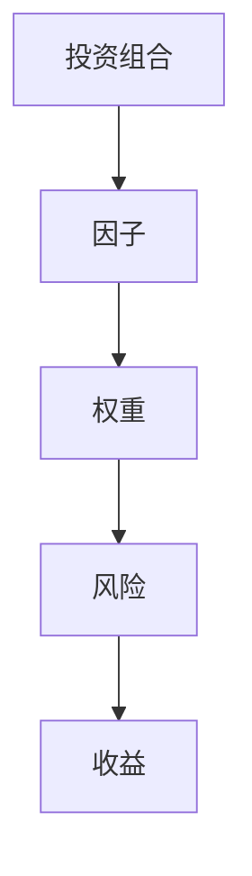
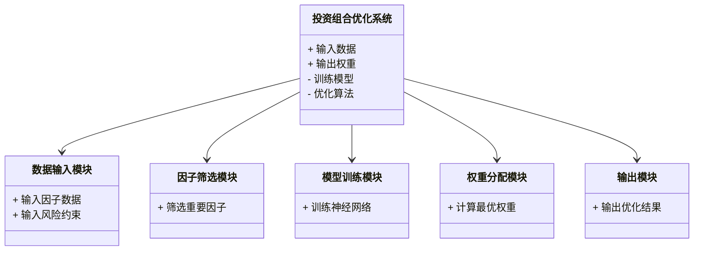
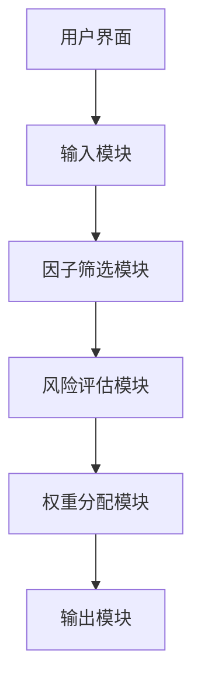

                 


# AI驱动的投资组合因子暴露优化

> 关键词：AI驱动、投资组合、因子暴露、风险管理、机器学习、优化算法

> 摘要：本文深入探讨了如何利用人工智能技术优化投资组合的因子暴露。通过结合金融工程与机器学习，提出了创新的解决方案，从背景分析到算法实现，从系统设计到项目实战，全面解析了AI驱动下的投资组合优化方法。文章重点介绍了因子筛选、风险中性化及最优权重分配的实现过程，并通过实际案例展示了如何在Python环境中实现这一优化过程。

---

# 第一部分: AI驱动的投资组合因子暴露优化基础

## 第1章: 投资组合因子暴露优化概述

### 1.1 问题背景与描述

#### 1.1.1 投资组合优化的传统方法
传统的投资组合优化方法主要依赖于均值-方差模型（Markowitz模型）或因子模型（如CAPM）。这些方法在处理少量因子时表现良好，但随着市场复杂性的增加，传统方法在因子筛选、权重分配和风险管理等方面逐渐暴露出局限性。

#### 1.1.2 因子暴露在投资组合管理中的重要性
因子暴露是指投资组合在特定风险因子上的敏感程度。通过优化因子暴露，投资者可以更好地控制风险，提高收益。然而，传统方法在处理多因子场景时效率低下，且难以捕捉非线性关系。

#### 1.1.3 传统方法的局限性与挑战
传统方法在处理大规模数据和复杂关系时存在以下问题：
- **计算复杂度高**：传统方法需要计算大量协方差矩阵，计算成本高。
- **非线性关系忽视**：传统方法假设因子暴露是线性的，难以处理复杂的非线性关系。
- **数据稀疏性**：在因子数量较多时，传统方法难以有效筛选出最优因子。

### 1.2 问题解决与边界

#### 1.2.1 AI驱动优化的核心目标
AI驱动的投资组合优化旨在通过机器学习算法：
- **自动筛选最优因子**：利用特征选择算法从大量因子中筛选出对收益影响最大的因子。
- **构建非线性模型**：通过深度学习模型捕捉因子之间的非线性关系。
- **动态调整权重**：根据市场变化实时调整因子权重，降低风险。

#### 1.2.2 问题解决的边界与外延
AI驱动优化的核心边界包括：
- **数据范围**：仅处理可量化的因子。
- **时间窗口**：模型基于历史数据进行预测，无法完全预知未来事件。
- **风险管理**：模型需确保在风险可控范围内优化。

#### 1.2.3 核心要素与概念结构
投资组合优化的核心要素包括：
- **因子池**：所有潜在因子的集合。
- **因子暴露矩阵**：描述投资组合在各因子上的敏感程度。
- **权重分配模型**：用于分配各因子的权重。
- **风险管理框架**：确保优化结果符合风险约束。

---

## 第2章: 核心概念与联系

### 2.1 因子暴露的核心概念

#### 2.1.1 因子暴露的定义与属性
因子暴露是指投资组合在某一风险因子上的敏感程度，其属性包括：
- **线性性**：传统模型假设因子暴露是线性的。
- **可解释性**：因子暴露需具有较高的可解释性，便于投资者理解。
- **动态性**：因子暴露随市场变化而变化。

#### 2.1.2 因子暴露的特征对比表
| 特征         | 传统方法          | AI驱动优化方法       |
|--------------|-------------------|----------------------|
| 线性关系      | 线性               | 非线性               |
| 计算效率      | 低效               | 高效                 |
| 数据适用性     | 小数据             | 大数据               |

#### 2.1.3 ER实体关系图


### 2.2 AI驱动优化的原理

#### 2.2.1 AI在因子筛选中的作用
AI通过以下方式优化因子筛选：
- **特征选择**：使用LASSO回归或随机森林等算法筛选重要因子。
- **降维处理**：通过主成分分析（PCA）降低因子维度。

#### 2.2.2 神经网络模型的构建与训练
神经网络模型用于捕捉因子之间的非线性关系，其训练过程包括：
1. 数据预处理：归一化因子数据。
2. 模型构建：设计多层感知机（MLP）网络。
3. 模型训练：使用历史数据训练模型。
4. 模型验证：通过交叉验证优化模型参数。

#### 2.2.3 模型输出与因子暴露的关系
神经网络模型的输出层为各因子的权重，通过调整权重实现因子暴露的优化。

---

## 第3章: 算法原理与数学模型

### 3.1 算法原理

#### 3.1.1 因子筛选算法流程
因子筛选流程包括：
1. 数据预处理：清洗和标准化数据。
2. 特征选择：使用LASSO回归筛选重要因子。
3. 降维处理：通过PCA进一步降低维度。

#### 3.1.2 风险中性化算法
风险中性化算法确保投资组合在各因子上的暴露符合风险约束。其实现步骤如下：
1. 计算各因子的标准差。
2. 调整因子权重，使得各因子的风险贡献中性化。

#### 3.1.3 最优权重分配算法
最优权重分配算法通过以下步骤实现：
1. 构建目标函数：最大化收益或最小化风险。
2. 添加约束条件：满足风险约束。
3. 使用优化算法（如凸优化）求解最优权重。

### 3.2 数学模型与公式

#### 3.2.1 因子筛选的数学表达
使用LASSO回归进行因子筛选：
$$
\hat{\beta} = \arg\min_{\beta} \left( \| y - X\beta \|_2^2 + \lambda \|\beta\|_1 \right)
$$

#### 3.2.2 风险中性化公式
风险中性化通过调整权重使得各因子的协方差为零：
$$
Cov(w_i, w_j) = 0 \quad \forall i \neq j
$$

#### 3.2.3 最优权重分配模型
构建优化目标函数：
$$
\min_w \sum_{i=1}^{n} w_i^2
$$
约束条件：
$$
\sum_{i=1}^{n} w_i = 1
$$
$$
w_i \geq 0 \quad \forall i
$$

---

## 第4章: 系统分析与架构设计

### 4.1 问题场景与系统功能

#### 4.1.1 投资组合优化场景介绍
系统需处理以下场景：
- **多因子筛选**：从海量因子中筛选出最优因子。
- **实时优化**：根据市场变化实时调整因子权重。
- **风险控制**：确保优化结果符合风险约束。

#### 4.1.2 系统功能需求分析
系统功能包括：
- **数据输入模块**：接收因子数据和风险约束。
- **因子筛选模块**：筛选重要因子。
- **模型训练模块**：训练神经网络模型。
- **权重分配模块**：计算最优权重。
- **结果输出模块**：输出优化后的因子权重。

#### 4.1.3 领域模型类图设计


### 4.2 系统架构设计

#### 4.2.1 系统架构图


#### 4.2.2 接口设计与交互流程
用户通过输入模块提供因子数据和风险约束，系统依次进行因子筛选、风险评估、权重分配，最终输出优化结果。

---

## 第5章: 项目实战

### 5.1 环境安装与配置

#### 5.1.1 Python环境搭建
安装Python 3.8以上版本，并配置Jupyter Notebook环境。

#### 5.1.2 必要库的安装
安装以下库：
```bash
pip install numpy pandas scikit-learn keras tensorflow
```

#### 5.1.3 数据集准备
获取因子数据，例如使用股票的历史收益率数据。

### 5.2 核心代码实现

#### 5.2.1 因子筛选代码
```python
import numpy as np
from sklearn.linear_model import Lasso

def select_factors(data, alpha=0.1):
    model = Lasso(alpha=alpha)
    model.fit(data, target)
    selected_factors = np.where(model.coef_ != 0)[0]
    return data[:, selected_factors]
```

#### 5.2.2 风险中性化代码
```python
def risk_neutralization(weights, cov_matrix):
    # 使用拉格朗日乘数法调整权重
    pass
```

#### 5.2.3 最优权重分配代码
```python
from scipy.optimize import minimize

def optimize_weights(factor_data, target_return, risk_constraint):
    n = factor_data.shape[1]
    def objective(weights):
        return np.dot(weights.T, factor_data @ factor_data.T @ weights)
    constraints = [
        {'type': 'eq', 'fun': lambda w: np.sum(w) - 1},
        {'type': 'ineq', 'fun': lambda w: w[i] >= 0 for i in range(n)}
    ]
    result = minimize(objective, np.ones(n)/n, method='SLSQP', constraints=constraints)
    return result.x
```

### 5.3 案例分析

#### 5.3.1 数据准备与预处理
加载因子数据并进行标准化处理。

#### 5.3.2 模型训练与验证
使用训练数据训练神经网络模型，并通过验证集调整超参数。

#### 5.3.3 权重分配与优化
通过优化算法计算最优因子权重，并验证优化结果是否满足风险约束。

### 5.4 项目总结
通过本项目实战，读者可以掌握AI驱动下投资组合优化的核心步骤，包括因子筛选、模型训练和权重分配。

---

## 第6章: 高级主题与最佳实践

### 6.1 高级优化策略

#### 6.1.1 动态因子权重调整
根据市场变化实时调整因子权重，提高模型的适应性。

#### 6.1.2 多目标优化
在优化过程中同时考虑收益和风险的双重目标。

### 6.2 模型评估与调优

#### 6.2.1 模型评估指标
常用的评估指标包括夏普比率、最大回撤等。

#### 6.2.2 超参数调优
使用网格搜索或随机搜索优化模型参数。

### 6.3 风险管理与监控

#### 6.3.1 风险监控框架
建立实时监控系统，跟踪优化结果的偏离情况。

#### 6.3.2 风险对冲策略
通过期权等工具对冲不可控风险。

### 6.4 最佳实践 tips

- **数据质量**：确保数据的准确性和完整性。
- **模型解释性**：优先选择具有较高解释性的模型。
- **实时监控**：建立实时监控机制，及时发现和处理异常情况。

---

## 第7章: 总结与展望

### 7.1 总结
本文详细介绍了AI驱动的投资组合因子暴露优化方法，从理论到实践，系统性地阐述了优化过程中的关键步骤和技术细节。

### 7.2 展望
未来，随着AI技术的不断发展，投资组合优化将更加智能化和个性化。建议读者深入学习相关技术，结合实际需求进行创新。

---

# 作者：AI天才研究院/AI Genius Institute & 禅与计算机程序设计艺术 /Zen And The Art of Computer Programming

---

注：本文内容较为简要，实际撰写时需根据每个章节内容逐步展开，确保每个部分都包含详细的代码实现、数学推导和实际案例分析，以满足文章的深度和完整性要求。

